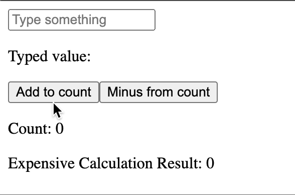
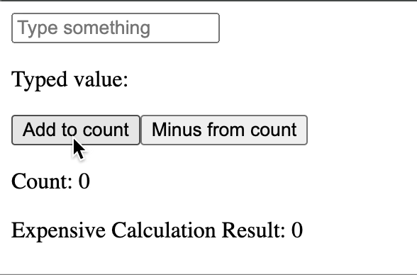
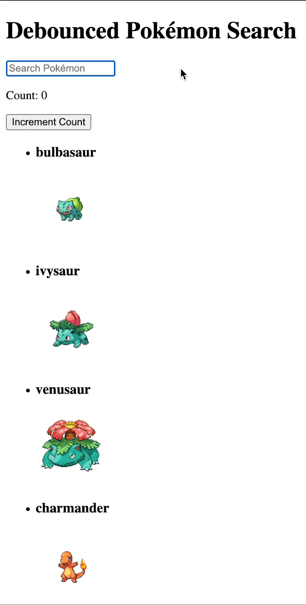
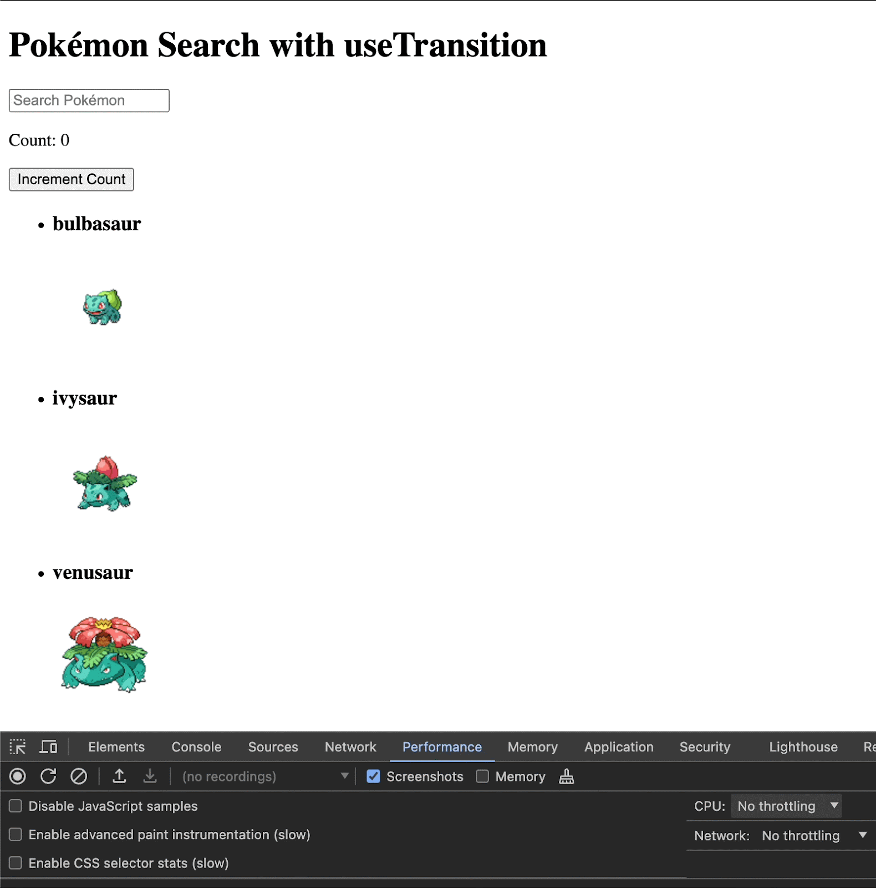

## Table of Contents

- [Introduction](#introduction)
- [How does React’s Virtual DOM work?](#how-does-reacts-virtual-dom-work)
- [React Performance Optimization Techniques](#11-react-performance-optimization-techniques)
  - [Measure React Performance](#measure-react-performance)
  - [Code Splitting and Lazy Loading](#code-splitting-and-lazy-loading)
  - [Implement React Server-Side Rendering (SSR)](#implement-react-server-side-rendering-ssr)
  - [Virtualize Lists](#virtualize-lists)
  - [Properly Use React's Keys Property When Rendering a List](#properly-use-reacts-keys-property-when-rendering-a-list)
  - [Memoization](#memoization)
    - [useMemo](#usememo)
  - [Implement Throttling and Debouncing](#implement-throttling-and-debouncing)
  - [useTransition Hook](#usetransition-hook)
- [Conclusion](#conclusion)

## Introduction

Optimizing performance in a React app isn’t just about being a good developer, it's important because less optimized pages make less money and rank lower on Google SEO. The internet is competitive. There are thousands of websites competing for everyone’s limited attention spans, and people hate to wait. People hate waiting so much that a report found that a site that loads in 1 second has a conversion rate 3x higher than a site that loads in 5 seconds. That’s a big difference. And around 2020, Google started using the core web vital metrics to factor in your Google ranking from a search result, meaning that less optimized sites rank lower on Google searches.

There are 3 main metrics used as part of core web vitals. There's Largest Contentful Paint (LCP), which rates how quickly the first main image or text is shown to the user; Interaction to Next Paint (INP), how responsive your website is to events such as scrolling, clicking, or inputting text; and Cumulative Layout Shift (CLS), which measures how much your website layout changes with different interactions.

So render time and performance matter, both for retaining customers and ranking on Google. But what can we do about it? There are lots of options for optimizing a web application, regardless of it being made with React. We can use a CDN, compress our images and lazy load them underneath the fold (lazy loading above the fold can hurt LCP), make our API calls as efficient as possible, remove unnecessary dependencies, and make sure we build our project in production mode in our bundler of choice. But what are things more specific to React that we can do?

In order to break down how to make our React code more efficient, let's first talk about how React works with the React Virtual DOM. 

## How does React’s Virtual DOM work?

The React Virtual DOM works by listening for state changes, comparing the DOM for any differences in its own virtual DOM, and then rendering any components that have had state changes, along with that component's children. Since it doesn't have to re-render the whole DOM, it makes rendering changes much faster. But there are lots of ways to accidentally write inefficient code in React, and there are lots of more advanced ways to write React that can massively optimize performance. Let’s walk through 11 different ways to optimize your React app.

## 11 React Performance Optimization Techniques

### Measure React Performance

React.profiler is a higher order component that can measure the performance of its child components, and the React DevTools allow you to see the React app’s performance directly inside your web browser.

It’s always good to know where your performance bottlenecks are when you want to start improving your application. You can do this programmatically by using the Profiler component. You give the Profiler component a callback in the `onRender` prop and can check render performance. For example, the following code would get render information on your whole React application:

```jsx
// src/index.js
import React, { Profiler } from 'react';
import ReactDOM from 'react-dom';
import App from './App';
import './index.css';

const onRenderCallback = (
    id, // the "id" prop of the Profiler tree that has just committed
    phase, // either "mount" (if the tree just mounted) or "update" (if it re-rendered)
    actualDuration, // time spent rendering the committed update
    baseDuration, // estimated time to render the entire subtree without memoization
    startTime, // when React began rendering this update
    commitTime, // when React committed this update
    interactions // the Set of interactions belonging to this update
) => {
  console.log('Profiler ID:', id);
  console.log('Phase:', phase);
  console.log('Actual Duration:', actualDuration);
  console.log('Base Duration:', baseDuration);
  console.log('Start Time:', startTime);
  console.log('Commit Time:', commitTime);
  console.log('Interactions:', interactions);
};

ReactDOM.render(
    <Profiler id="App" onRender={onRenderCallback}>
      <App />
    </Profiler>,
  document.getElementById('root')
);
```

You can also use the React Developer Tools in your web browser by installing the plugin from your browser’s extension marketplace - such as the Chrome Web Store - and opening your browser's developer tools. Two React tabs will be added to your developer console - components and profiler. The components tab can tell you details like props of rendered React components, and the profiler tab will allow you to record a rendering timeline of your React application. Simply click the record button and trigger a render, or click the refresh button to record all rendering times from a new page refresh. This can help you get a baseline of what components are rendering quickly and which ones could be causing performance bottlenecks. You can also check things like why a component is re-rendering and use some of the tips later in the article to correct it.


### Code splitting and lazy loading

Code splitting allows you to break your front-end react bundle into smaller chunks that can be downloaded together in parallel or at the time they are needed, and lazy loading allows you to load less important parts of an application later, improving application performance. These combined can help increase initial load times for an application, affecting our LCP metric.

By default, reactjs sends one .js file - usually bundled together by a bundler like webpack - which includes all of your react application and runs it in the client’s browser. This is fine if your app is small, but as your app grows in size, this becomes a bottleneck. Also, some pieces of your app are more important to load first. Getting the user the ProductSearch component on an e-commerce page is a much higher priority than getting them the admin page 99% of users will never see.

You can set up lazy loading in React using React.lazy and React.suspense. When using lazy and suspense, react will automatically code split the components that will be lazy loaded and grab them when they’re needed. This keeps the main bundle small and makes your initial render much quicker. But be sure to not lazy load anything above the fold, as that can actually drop your LCP score.

```typescript
// src/index.js
import ReactDOM from 'react-dom/client';
import React, { Suspense, lazy, useState } from 'react';
import './App.css';

// this component will be removed from the bundle and fetched when needed
const MyComponent = lazy(() => import('./MyComponent'));
// this component is also removed from the bundle and fetched when needed.
// This results in 3 separate .js files
const MyOtherComponent = lazy(() => import('./MyOtherComponent'));

const App = () => {

  return (
    <div className="App">
      <Suspense fallback={<div>Loading...</div>}>
<MyComponent />
<MyOtherComponent />
      </Suspense>
    </div>
  );
};

const root = ReactDOM.createRoot(document.getElementById('root'));
root.render(<App />);
```

### Implement React server-side rendering (SSR)

Server-side rendering is when the page is rendered on the server and then sent over to the client instead of sending a bundle that is rendered client-side. The client’s cpu is not usually a bottleneck for a react application, but bandwidth and latency between the client and server commonly are. By rendering server-side, we can grab all of the data we need from the database before rendering our page, which removes extra trips to the server and can speed up rendering.

[Nextjs](https://nextjs.org/), made by the same people who [made the Vercel deployment platform](https://supertokens.com/blog/how-to-deploy-supertokens-with-react-nodejs-express-on-vercel), is the most popular way to implement SSR in React, and it’s very simple to use. You can simply run

```bash
npx create-next-app@latest your-app-name
```


to generate a nextjs project. Everything will render server-side by default, with the option to render specific components client-side if necessary.

### Virtualize lists

List virtualization, also known as windowing, is when you only render the part of a list that is visible to the user. This helps reduce DOM nodes on a page and make scrolling smoother, which can increase your INP score.

Let’s say you have an e-commerce store and someone does a search for "The". I don't know why they would do that, but it's the most common word in the English language, meaning you’ll probably have to render a pretty long list of results. If we virtualize the list instead of rendering all thousand entries, we can cut down on the render time and prevent freezing while scrolling.

There are many libraries, such as [react-virtualized](https://github.com/bvaughn/react-virtualized), [react-window (an updated, lightweight alternative to react-virtualized made by the same team)](https://github.com/bvaughn/react-window), and [react-virtuoso](https://github.com/petyosi/react-virtuoso), that can make implementing virtualized lists simple. Let's use react-virtuoso to virtualize a list of 100 pokemon.

```js
import React, { useEffect, useState } from 'react';
import { Virtuoso } from 'react-virtuoso';
import ReactDOM from 'react-dom/client';

const App = () => {
  const [pokemon, setPokemon] = useState([]);

  useEffect(() => {
    async function fetchPokemon() {
      const response = await fetch('https://pokeapi.co/api/v2/pokemon?limit=151');
      const data = await response.json();
      setPokemon(data.results);
    };
   fetchPokemon();
  }, []);

  return (
    <div>
      <h1>Virtualized Pokémon List</h1>
      <Virtuoso
        style={{ height: '600px' }}
        totalCount={pokemon.length}
        itemContent={(index) => {
          const poke = pokemon[index];
          return (
            <div key={poke.name} style={{ padding: '10px', borderBottom: '1px solid #ccc' }}>
              {index + 1}. {poke.name}
            </div>
          );
        }}
      />
    </div>
  );
};

const root = ReactDOM.createRoot(document.getElementById('root'));
root.render(<App />);
```

Look how smooth that scroll is.


### Properly use React's Keys property when rendering a list

React requires giving every item in a generated list of jsx a unique key. People tend to use the array index to handle this, but this can cause unnecessary re-renders. Keys are used by react to tell if it needs to re-render items in the list. If you use the array index and then an item is removed or the array is sorted, the keys in the new list will no longer match the old index keys, and all of those items will have to be re-rendered. If we use unique keys, like a userId, we can prevent React from needing to re-render any items in the list when the list’s order changes.

#### Good Idea

```js
// index.js
import ReactDOM from 'react-dom/client';
import React from 'react';

const App = () => {
  const users = [
    { userId: 1, name: 'Alice', email: 'alice@example.com' },
    { userId: 2, name: 'Bob', email: 'bob@example.com' },
    { userId: 3, name: 'Charlie', email: 'charlie@example.com' },
  ];
  
  
    return (
      <div className="App">
        <h1>User List</h1>
        <ul>
        {users.map(user => (
          <li key={user.userId}>
            <h3>{user.name}</h3>
            <p>{user.email}</p>
          </li>
        ))}
      </ul>
  
      </div>
    );
  };
  

const root = ReactDOM.createRoot(document.getElementById('root'));
root.render(<App />);
```

#### Bad Idea

```js
import ReactDOM from 'react-dom/client';
import React from 'react';

const App = () => {
  const users = [
    { userId: 1, name: 'Alice', email: 'alice@example.com' },
    { userId: 2, name: 'Bob', email: 'bob@example.com' },
    { userId: 3, name: 'Charlie', email: 'charlie@example.com' },
  ];
  
  
    return (
      <div className="App">
        <h1>User List</h1>
        <ul>
        {users.map((user, index) => (
          <li key={index}>
            <h3>{user.name}</h3>
            <p>{user.email}</p>
          </li>
        ))}
      </ul>
  
      </div>
    );
  };

const root = ReactDOM.createRoot(document.getElementById('root'));
root.render(<App />);
```

### Memoization

Memoization is a specific type of caching where you cache the result of a function. This prevents you from calculating the same values over and over again. 

In React, every time a component's state changes, it causes all of its children to re-render, regardless if the children have had state or prop changes. This prevents UI errors, but at the expense of performance for your app. However, with memoization, we can cache functional components, calculations they have to make, or functions they use in order to skip fully re-rendering components.

React has the useMemo hook, which caches the results of a function call; React.memo, a higher order component which can render a functional component from cache if its props are unchanged (since functional components are, well, functions); and useCallback, which caches a function declaration.

#### useMemo

useMemo caches the result of a function. This is especially useful if you have a component that has large calculations it has to handle. For a practical example, if you had an e-commerce store that had a large list of items, and you needed to calculate tax cost for each item based on location in the front-end. You may need to loop through a large list of items every time a parent component has a state change, even if nothing in its own state or props hasn't changed. But for the sake of having a bundled example showing re-rendering and the speed of rendering from cache, our example code will go through a massive loop and add to a number instead of adding tax to a list of items. By memoizing the result of our expensiveCalculation function, even when our parent components state updates, we will reuse the last result of the function as long as the count hasn't changed.


```js
// index.js
import ReactDOM from 'react-dom/client';
import React, { useState, useMemo } from 'react';

const App = () => {
  const [count, setCount] = useState(0);
  const [input, setInput] = useState('');

  // Expensive calculation function
const expensiveCalculation = (num) => {
  console.log('Calculating...');
  let result = 0;
  for (let i = 0; i < 1000000000; i++) {
    result += num;
  }
  return result;
};

  const memoizedValue = useMemo(() => expensiveCalculation(count), [count]);

  return (
    <div>
      <input
        type="text"
        value={input}
        onChange={(e) => setInput(e.target.value)}
        placeholder="Type something"
      />
      <p>Typed value: {input}</p>
      <button onClick={() => setCount(count + 1)}>Add to count</button>
      <button onClick={() => setCount(count - 1)}>Minus from count</button>
      <p>Count: {count}</p>
      <p>Expensive Calculation Result: {memoizedValue}</p>
    </div>
  );
};

const root = ReactDOM.createRoot(document.getElementById('root'));
root.render(<App />);

```

**Without `useMemo`**



**With `useMemo`**




### Implement Throttling and debouncing

Throttling is when you call a function on an event and then delay the continual execution of the function to certain time intervals as the event continues to trigger, and debouncing is when you wait a certain amount of time after an event happens to execute a function. They can both help with your INP score by making user interactions smoother. They sound very similar, but there is a slight difference between the two, and we can see it in how and why they’re implemented. We will implement both throttling and debouncing with the lodash library.

Let's pretend we were a mega sized tech company that had an application to allow writing documents and saving the data in the cloud. We'll call the application Doodle Docs. We wouldn't want to save the document after every keystroke, because that would be overkill. But we also wouldn't want to wait until after they stopped typing, because someone could be on a huge typing spree, lose internet connection, and then lose all their work. That would be rough! So what if instead of waiting for them to stop, we just periodically backed up what they were typing in time intervals? That's exactly how throttling would work in this example.


```js
// index.js
import ReactDOM from 'react-dom/client';
import React, { useState, useCallback } from 'react';

// be sure to npm install --save lodash for this to work
import _ from 'lodash';

function App() {
  const [text, setText] = useState('');

  const throttledLog = useCallback(
    _.throttle((value) => {
      // Doodle docs would PUT request the data somewhere
      // instead of logging to console
      console.log(value);
    }, 500),
    []
  );

  const handleChange = (event) => {
    setText(event.target.value);
    throttledLog(event.target.value);
  };

  return (
    <div>
      <h1>Throttled Textbox</h1>
      <input
        type="text"
        value={text}
        onChange={handleChange}
        placeholder="Type something..."
      />
    </div>
  );
}

const root = ReactDOM.createRoot(document.getElementById('root'));
root.render(<App />);
```


Debouncing is useful for things like limiting search or filter results. Instead of filtering search results of pokemon on every keystroke (which is 5 characters per second for a 60 wpm typer), you can set your event listener to wait a second after the last key is pressed to display results. This makes the user experience smoother than flickering a bunch of results 5 times per second and can save you from making unneeded re-renders.

```js
// index.js
import ReactDOM from 'react-dom/client';
import React, { useState, useTransition, useEffect } from 'react';
// make sure to npm install --save lodash for this to work
import _ from 'lodash';

const Counter = () => {
  const [count, setCount] = useState(0);

  return (
    <>
      <p>Count: {count}</p>
      <button onClick={() => setCount(count + 1)}>Increment Count</button>
    </>
  )
}

const PokemonList = ({ pokemon }) => {
  return (
    <ul>
      {pokemon.map(pokemon => (
        <li key={pokemon.id}>
          <h3>{pokemon.name}</h3>
          
        </li>
      ))}
    </ul>
  );
};

const App = () => {
  const [searchTerm, setSearchTerm] = useState('');
  const [pokemonList, setPokemonList] = useState([]);
  const [filteredPokemon, setFilteredPokemon] = useState([]);
  const [isPending, startTransition] = useTransition();

  useEffect(() => {
    const fetchPokemon = async () => {
      const promises = [];
      for (let i = 1; i <= 1000; i++) {
        promises.push(
          fetch(`https://pokeapi.co/api/v2/pokemon/${i}`).then(response => response.json())
        );
      }
      const results = await Promise.all(promises);
      setPokemonList(results);
      setFilteredPokemon(results);
    };

    fetchPokemon();
  }, []);

  const debounceSearch = _.debounce((query) => {
    const result = pokemonList.filter(pokemon =>
      pokemon.name.toLowerCase().includes(query.toLowerCase())
    );
    setFilteredPokemon(result);
  }, 300);

  useEffect(() => {
    debounceSearch(searchTerm);
    // Cleanup function to cancel debounce on unmount
    return () => {
      debounceSearch.cancel();
    };
  }, [searchTerm]);


  const handleSearch = (event) => {
    const value = event.target.value;
    setSearchTerm(value);
  };

  return (
    <div className="App">
      <h1>Debounced Pokémon Search</h1>
      <input
        type="text"
        value={searchTerm}
        onChange={handleSearch}
        placeholder="Search Pokémon"
      />
      <Counter />
      {isPending ? <div>Loading...</div> : <PokemonList pokemon={filteredPokemon} />}
    </div>
  );
};

const root = ReactDOM.createRoot(document.getElementById('root'));
root.render(<App />);

```



### useTransition hook

The [useTransition hook](https://react.dev/reference/react/useTransition) allows you to update the state of your application without blocking the rest of the User Interface. Filtering through and updating large amounts of state can cause performance issues and lock up your application, but useTransition can fix this and help improve your INP metric.

You may be thinking to yourself "Gee, this sounds pretty similar to debouncing and throttling". And yeah, it's in the same ballpark. But useTransition is better suited for UI transitions involved with heavy computation. Since it can handle the UI changes as a lower priority than the rest of the UI, users can still interact with the app - as where throttling or debouncing might smooth out how often we are computing, but can still freeze if the computations are too heavy.

Let’s say we have a large list of pokemon and we want to search through them. This will probably run fine on a 2024 macbook, but what about on a 10 year old phone? We can bet it won't run as smoothly on older hardware like that, and sometimes that's what our users are using to interact with our web apps. We'll simulate using older hardware by opening the chrome dev tools, going to the performance tab, and setting the cpu throttling to x20 when we run our app. Instead of the entire web app locking up and being unresponsive while we sort and update the pokemon list, we can use useTransition, set a loading screen inside the component, and update the state of the component while still allowing full use of the rest of the UI.

```js
// src/index.js
import ReactDOM from 'react-dom/client';
import React, { useState, useTransition, useEffect } from 'react';

const Counter = () => {
  const [count, setCount] = useState(0);

  return (
    <>
      <p>Count: {count}</p>
      <button onClick={() => setCount(count + 1)}>Increment Count</button>
    </>
  )
}

const PokemonList = ({ pokemon }) => {
  return (
    <ul>
      {pokemon.map(pokemon => (
        <li key={pokemon.id}>
          <h3>{pokemon.name}</h3>
          
        </li>
      ))}
    </ul>
  );
};

const App = () => {
  const [searchTerm, setSearchTerm] = useState('');
  const [pokemonList, setPokemonList] = useState([]);
  const [filteredPokemon, setFilteredPokemon] = useState([]);
  const [isPending, startTransition] = useTransition();

  useEffect(() => {
    const fetchPokemon = async () => {
      const promises = [];
      for (let i = 1; i <= 1000; i++) {
        promises.push(
          fetch(`https://pokeapi.co/api/v2/pokemon/${i}`).then(response => response.json())
        );
      }
      const results = await Promise.all(promises);
      setPokemonList(results);
      setFilteredPokemon(results);
    };

    fetchPokemon();
  }, []);

  const handleSearch = (event) => {
    const value = event.target.value;
    setSearchTerm(value);

    startTransition(() => {
      if (value === '') {
        setFilteredPokemon(pokemonList);
      } else {
        setFilteredPokemon(pokemonList.filter(pokemon => 
          pokemon.name.toLowerCase().includes(value.toLowerCase())
        ));
      }
    });
  };

  return (
    <div className="App">
      <h1>Pokémon Search with useTransition</h1>
      <input
        type="text"
        value={searchTerm}
        onChange={handleSearch}
        placeholder="Search Pokémon"
      />
      <Counter />
      {isPending ? <div>Loading...</div> : <PokemonList pokemon={filteredPokemon} />}
    </div>
  );
};

const root = ReactDOM.createRoot(document.getElementById('root'));
root.render(<App />);
```




### Inline arrow functions and CSS 

If you use inline arrow functions as props, React will re-create the function every time it’s re-rendered, wasting compute time. Also, using inline arrow functions and styles can undo memoization. Inline styles in react also have to be converted from a javascript object to css styling, which wastes compute time.

Instead of using inline arrow functions and css, define your event handlers inside the component whenever possible and import your CSS from an external style sheet.

#### Good Idea

```js
import ReactDOM from 'react-dom/client';
import React from 'react';

const App = () => {
  const handleClick = () => {
    console.log('clicked!');
  };

  return (
    <div>
      <button className="button" onClick={handleClick}>Click Me</button>
    </div>
  );
};


const root = ReactDOM.createRoot(document.getElementById('root'));
root.render(<App />);
```

#### Bad Idea

```js
// src/index.js
import ReactDOM from 'react-dom/client';
import React from 'react';

const App = () => {
  return (
    <div>
      <button style={{border: "none"}} onClick={ () => {console.log('clicked!')}}>Click Me</button>
    </div>
  );
};

const root = ReactDOM.createRoot(document.getElementById('root'));
root.render(<App />);
```

### React fragments

[React fragments](https://react.dev/reference/react/Fragment) allow you to render a react component without making a wrapper node. Using this throughout a large app can remove a lot of unnecessary dom nodes from the web page and make rendering the DOM faster.

```js
//src/ index.js
import ReactDOM from 'react-dom/client';
import React from 'react';

const App = () => {
  
  return (
    <>
      <h1>I'm an h1 inside a React Fragment!</h1>
    </>
  );
};

const root = ReactDOM.createRoot(document.getElementById('root'));
root.render(<App />);
```

## Conclusion

After implementing all these react performance techniques, the speed, responsiveness, and user experience of your application will be noticeably improved. Now that your optimized site will be  ranking on the top of google and keeping customers engaged, why not try adding rock solid authentication with Supertokens!
