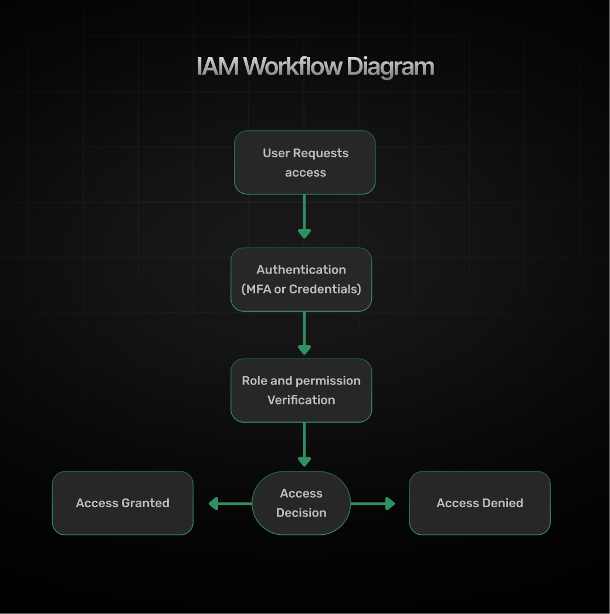
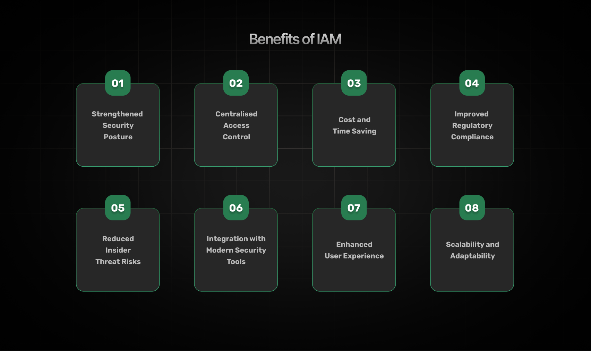
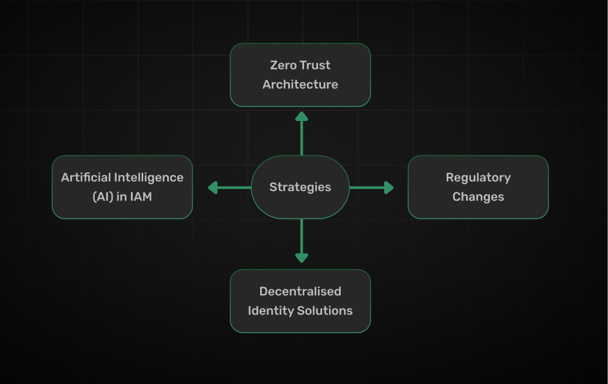
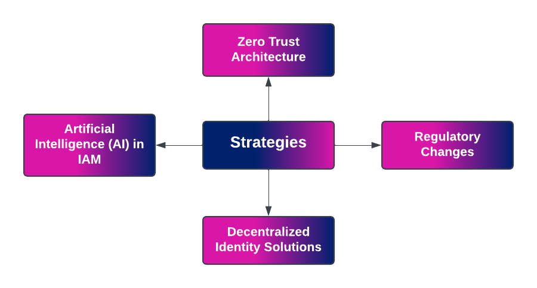
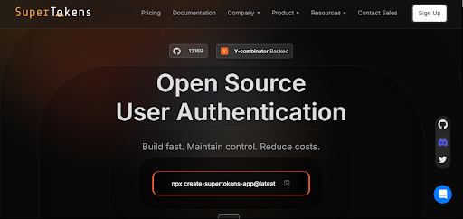

## Table of Contents

- [Why Organizations Need IAM Today](#why-organizations-need-iam-today)
- [Key Benefits of Identity and Access Management](#key-benefits-of-identity-and-access-management)
    - [1. Strengthened Security Posture](#1-strengthened-security-posture)
    - [2. Improved Regulatory Compliance](#2-improved-regulatory-compliance)
    - [3. Enhanced User Experience](#3-enhanced-user-experience)
    - [4. Centralized Access Control](#4-centralized-access-control)
    - [5. Reduced Insider Threat Risks](#5-reduced-insider-threat-risks)
    - [6. Scalability and Adaptability](#6-scalability-and-adaptability)
    - [7. Cost and Time Savings](#7-cost-and-time-savings)
    - [8. Integration with Modern Security Tools](#8-integration-with-modern-security-tools)
- [Emerging Trends in Identity and Access Management](#emerging-trends-in-identity-and-access-management)
- [How to Maximize the Benefits of IAM in Your Organization](#how-to-maximize-the-benefits-of-iam-in-your-organization)
- [Case Studies](#case-studies)
- [Conclusion](#conclusion)

## Why Organizations Need IAM Today
  

Organizations today are becoming increasingly reliant on digital systems for efficient operation. As a result, the Identity and Access Management (IAM) market is projected to experience significant growth, with a compound annual growth rate (CAGR) of 13.7%. This trend will elevate the market to approximately [USD 53.1 billion by 2032.](https://scoop.market.us/identity-and-access-management-statistics/) Such growth underscores the growing recognition of IAM's critical role in enhancing security and ensuring compliance across various sectors.

  

As remote work becomes more prevalent, the need for secure access to sensitive information has never been greater. The following trends highlight the importance of IAM:

*   **Remote Work:** With employees accessing systems from various locations, securing these connections is essential.
    
*   **Multi-Cloud Environments:** Organizations often use multiple cloud services, making centralized access management critical.
    
*   **Rise of Cyberattacks:** Cyber threats are escalating, with unauthorized access posing significant risks to data integrity and privacy.
    

IAM helps mitigate these risks by providing robust authentication mechanisms and ensuring compliance with data protection regulations such as GDPR and HIPAA. 

## Key Benefits of Identity and Access Management

Implementing an Identity and Access Management (IAM) solution provides several critical advantages that empower organizations to secure their resources and streamline operations. Here are the key benefits:

### 1\. Strengthened Security Posture

IAM systems help keep organizations secure by ensuring that only the right people can access important data and resources. They do this by using strong authentication methods like Multi-Factor Authentication (MFA) and Single Sign-On (SSO), which help prevent unauthorized access, data breaches, and identity theft. These systems also help enforce security rules across different parts of the network, reducing the chances of threats from both inside and outside the organization.

  

Moreover, IAM gives a clear view of user activity, so organizations can quickly spot and address any suspicious actions. It ensures that users only have access to the information they need for their jobs, which lowers the risk of attacks. Plus, IAM can detect unusual behavior patterns, alerting security teams to possible threats before they become a bigger problem.

### 2\. Improved Regulatory Compliance

IAM helps organizations follow important rules by keeping track of who can access information. This system makes it easier to show that they are compliant during audits, which can help them avoid fines for data breaches.

  

With IAM, companies can easily create detailed reports whenever they need them, making it simpler to respond to questions from regulators. Automation tools help generate these reports for audits, saving time and minimizing mistakes.

  

Moreover, IAM ensures that access rules are applied the same way across all systems, which helps organizations comply with laws regarding data privacy and security.

### 3\. Enhanced User Experience

Using Single Sign-On (SSO) makes logging in easier for users. Employees can use one set of credentials to access multiple applications, which helps them work more smoothly and boosts productivity. This simplicity also improves user satisfaction and promotes adherence to security policies by reducing the need to write down passwords.

  

Self-service features allow users to change their passwords or manage their profiles without needing help from IT, making things even easier. Plus, many new Identity and Access Management (IAM) systems let users access apps securely from their mobile devices, so they can work from anywhere.

### 4\. Centralized Access Control

IAM helps IT teams control user roles and permissions from one place, making it easier to manage users and adjust access as the organization changes. With a single view of all user identities and their access rights, IT teams can enforce security rules more effectively. 

  

Centralized IAM allows for the easy addition or removal of access as employees change roles or as the company structure shifts, while also maintaining detailed records of any changes made to user permissions over time.

### 5\. Reduced Insider Threat Risks

When organizations have Identity and Access Management (IAM) systems, they can keep an eye on what users are doing and quickly take away access when it's needed. This is super important for protecting against insider threats and making sure that only the right people can get to sensitive information. 

  

By looking at how users normally behave, IAM can spot unusual activities that might suggest someone has bad intentions or that an account has been hacked. Some IAM solutions even use behavioral analytics, which means they can detect potential insider threats by noticing when someone's actions deviate from what they usually do.

### 6\. Scalability and Adaptability

As organizations get bigger, Identity and Access Management (IAM) solutions can easily grow with them, accommodating new users, systems, and devices. This flexibility helps security keep pace with what the organization needs. Whether it’s bringing on new employees or adding cloud services, IAM systems can adapt without dropping the ball on security. 

  

Today’s IAM solutions are made to work well with a variety of cloud applications, ensuring consistent security no matter the setup, whether it's fully on-site, in the cloud, or a mix of both. Plus, organizations can pick the deployment option that works best for them—whether that's on-premises, in the cloud, or something in between.

### 7\. Cost and Time Savings

IAM reduces administrative overhead by automating user provisioning and password reset processes. This efficiency not only saves time but also minimizes support requests related to access issues. By streamlining these processes, organizations can allocate resources more effectively toward strategic initiatives rather than routine administrative tasks. 

  

Automation leads to a reduced help desk load, allowing IT staff to focus on more critical problems rather than repetitive tasks associated with the manual management of access rights.

  

Although there may be an initial investment in IAM technology, the long-term savings through reduced operational costs make it a cost-effective solution.

### 8\. Integration with Modern Security Tools

Modern IAM solutions integrate seamlessly with other security frameworks such as Zero Trust architectures and Security Information and Event Management (SIEM) systems. This integration enhances overall security posture by providing comprehensive visibility into user activities across all platforms. Integrating IAM with SIEM allows organizations to correlate identity data with security events for more effective threat detection and response. 

  

By enforcing strict identity verification regardless of location or device used, IAM supports the principles of Zero Trust security models that are becoming increasingly important in today’s cybersecurity landscape.

  

By leveraging these benefits of Identity and Access Management (IAM), organizations can significantly enhance their security posture while improving operational efficiency and user satisfaction.

## Emerging Trends in Identity and Access Management

The landscape of IAM is continually evolving due to technological advancements and changing organizational needs:

*   **Rise of Passwordless Authentication**: Passwordless security methods, like biometrics and hardware tokens, are gaining traction as businesses prioritize enhanced security and user convenience. This transition reduces vulnerabilities tied to traditional passwords. For example, Microsoft's initiatives in passwordless systems show promising adoption rates, reflecting a significant shift in authentication trends. For more insights, see resources from Forbes([The Benefits Of Passwordless Authentication And How To Choose The Right Method](https://www.forbes.com/councils/forbescommunicationscouncil/2023/02/15/the-benefits-of-passwordless-authentication-and-how-to-choose-the-right-method/)).
    

  

*   **AI-Powered Identity Management**: AI is revolutionizing identity management by using behavioral analysis to detect anomalies and prevent security breaches. For instance, [McKinsey's 2023 report](https://www.mckinsey.com/featured-insights/themes/cybersecurity-in-the-age-of-generative-ai) highlights that 40% of surveyed organizations increased AI investments to improve cybersecurity strategies, leveraging AI to model risks and enhance identity verification methods.
    

  

*   **Focus on User-Centric Approaches**: Modern Identity and Access Management (IAM) solutions are increasingly prioritizing a balance between stringent security measures and intuitive user experiences. According to [InfoSec4TC](https://www.infosec4tc.com/prioritizing-user-centric-security-in-cloud-iam-practice/), organizations leveraging advanced authentication techniques, such as passwordless systems and Multi-Factor Authentication (MFA), significantly improve both security and usability. These measures reduce the burden of password management while enhancing user adoption rates. This approach fosters a culture of security awareness and minimizes barriers to system access, ensuring both compliance and operational efficiency.
    

## How to Maximize the Benefits of IAM in Your Organization

To fully leverage the advantages of IAM, organizations should consider the following strategies:

*   **Zero Trust Architecture:** The Zero Trust model assumes that threats could be both external and internal; therefore, verification is required from everyone attempting to access resources within a network.
    
*   **Artificial Intelligence (AI) in IAM:** AI technologies are increasingly being integrated into IAM solutions to enhance threat detection capabilities through behavioral analytics.
    
*   **Decentralized Identity Solutions:** The rise of blockchain technology is paving the way for decentralized identity management systems that give users more control over their personal information.
    
*   **Regulatory Changes:** As data protection laws evolve globally, organizations must adapt their IAM strategies to remain compliant with new regulations.
    

These trends highlight the ongoing need for organizations to adopt robust IAM strategies that not only secure sensitive information but also streamline operations as they navigate the complexities of the modern digital landscape.

## Case Studies

### Case Study 1: British Consumer Goods Company

A leading multinational British consumer goods company faced challenges with a manual Identity and Access Management (IAM) system that resulted in human errors and increased operational costs. Infosys implemented a comprehensive IAM solution that established a governance framework and automated processes.

  

Key Performance Indicators (KPIs):

*   25% reduction in ticket volume due to automated user provisioning and de-provisioning.
    
*   Improved compliance with internal controls and external regulations.
    
*   Zero-day provisioning of essential logistics for new employees, ensuring they have necessary access from day one.
    

[Link: Infosys IAM Case Study](https://www.infosys.com/services/cyber-security/case-studies/identity-access-management-solution.html)

### Case Study 2: Health Insurance Provider

A health insurance provider faced challenges with an outdated manual identity management system, leading to inefficiencies in onboarding and offboarding employees. To address these issues, the organization implemented a comprehensive Identity and Access Management (IAM) solution that included:

*   Multi-Factor Authentication (MFA) for enhanced security.
    
*   Risk-Based Authentication to tailor security measures based on user behavior.
    
*   Biometric and Behavioral Authentication for secure access.
    

Key Performance Indicators (KPIs):

*   Significant reduction in manual tasks related to identity management.
    
*   Improved compliance with regulatory standards through better visibility over data access.
    
*   Enhanced security posture, reducing the risk of unauthorized access.
    

This case study illustrates how effective IAM implementations can lead to improved operational efficiency and enhanced security measures within organizations.

[Link: Improving ID and Access Management Case Study](https://vsecurelabs.co/improving-id-and-access-management-case-study/)

## Conclusion

In summary, Identity and Access Management is a cornerstone of effective cybersecurity strategies in modern organizations. By adopting IAM solutions proactively, businesses can address evolving security challenges while enhancing operational efficiency. [SuperTokens](https://supertokens.com/product) offers a developer-first solution that is customizable and scalable, empowering organizations to improve their security posture while streamlining user authentication workflows.

Get seamless security and efficiency in your organization with SuperTokens—your ultimate solution for Identity and Access Management! For more insights on self-hosted authentication solutions, visit our blog [here](https://supertokens.com/blog/self-hosted-authentication/).