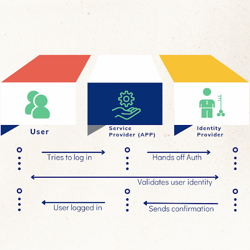
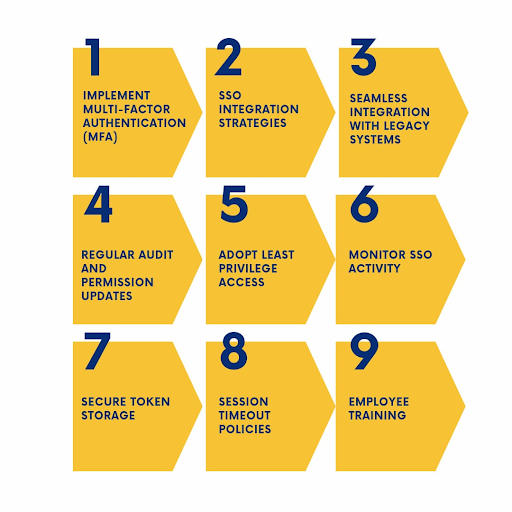
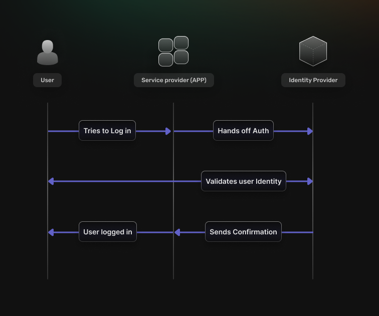

## Table of Contents

- [Understanding SSO Standards](#understanding-sso-standards)
    - [Benefits of Adopting SSO Standards](#benefits-of-adopting-sso-standards)
    - [Key Components of SSO Standards](#key-components-of-sso-standards)
    - [Overview of Common SSO Protocols](#overview-of-common-sso-protocols)
- [Key SSO Best Practices](#key-sso-best-practices)
    - [1. Implement Multi-Factor Authentication (MFA)](#1-implement-multi-factor-authentication-mfa)
    - [2. SSO Integration Strategies](#2-sso-integration-strategies)
    - [3. Seamless Integration with Legacy Systems](#3-seamless-integration-with-legacy-systems)
    - [4. Regular Audit and Permission Updates](#4-regular-audit-and-permission-updates)
    - [5. Adopt Least Privilege Access](#5-adopt-least-privilege-access)
    - [6. Monitor SSO Activity](#6-monitor-sso-activity)
    - [7. Secure Token Storage](#7-secure-token-storage)
    - [8. Session Timeout Policies](#8-session-timeout-policies)
    - [9. Employee Training](#9-employee-training)
- [SuperTokens for Your SSO Needs](#supertokens-for-your-sso-needs)
    - [Key Features](#key-features)
    - [Security Advantages](#security-advantages)
- [Frequently Asked Questions About SSO Best Practices](#frequently-asked-questions-about-sso-best-practices)

Single Sign-On (SSO) has become an essential component of modern identity and access management strategies. [A study by Okta](https://www.okta.com/sites/default/files/2022-06/TheBusinessValueofOktaCustomerIdentityandAccessManagement.pdf) found that organizations implementing SSO experienced a 43% reduction in customer support tickets. By allowing users to authenticate once and gain access to multiple applications, SSO enhances user experience while improving security.

However, implementing SSO effectively requires adherence to best practices that ensure robust security measures. This blog will explore the best practices for SSO in 2024, focusing on their importance and providing actionable insights for organizations.

# Understanding SSO Standards

Before diving into specific best practices, it's essential to understand why SSO standards form the cornerstone of modern authentication systems. Think of SSO standards as the universal language that allows different applications and systems to communicate securely about user identity and access rights.

## Benefits of Adopting SSO Standards

The adoption of SSO standards brings transformative benefits to organizations of all sizes. When properly implemented, these standards create a robust security framework while significantly improving the user experience.

Security teams often struggle with managing multiple authentication systems across various applications. By implementing standardized SSO protocols, organizations can centralize their authentication mechanisms, leading to more consistent security policies and easier compliance monitoring.

From a user management perspective, SSO standards enable IT teams to:

*   Implement consistent access policies across all applications
*   Respond quickly to security incidents by controlling access from a central point
*   Reduce the risk of credential-based attacks
*   Maintain detailed audit trails of authentication events

For end-users, the benefits are equally compelling. Instead of managing multiple credentials, users can access all their authorized applications through a single, secure authentication process. This not only improves productivity but also encourages better security practices, as users are more likely to maintain strong passwords when they only need to remember one.

## Key Components of SSO Standards

The architecture of SSO systems relies on several interconnected components that work together to provide secure authentication. As outlined in [our SSO authentication guide](https://supertokens.com/blog/sso-authentication/), understanding these components is crucial for implementing effective security measures.

### Identity Provider (IdP)

The Identity Provider serves as the central authentication authority in an SSO system. Think of it as a secure vault that stores and verifies user identities. When a user attempts to access an application, the IDP:

1.  Validates the user's credentials through multiple authentication factors
2.  Issues encrypted security tokens with specific time validity
3.  Maintains session information across multiple applications
4.  Enforces organization-wide authentication policies

Modern IdPs like those built with [SuperTokens' SSO implementation](https://supertokens.com/blog/sso-provider/) incorporate advanced security features such as:

*   Adaptive authentication based on risk factors
*   Support for multiple authentication methods
*   Real-time threat detection
*   Comprehensive audit logging

### Service Provider (SP) Integration

Service Providers are the applications and services that rely on the IdP for authentication. For successful SSO implementation, SPs must establish trust relationships with the IdP through secure protocols. As explained in our guide on [testing SSO implementation](https://supertokens.com/blog/testing-sso-implementation), proper SP configuration involves:

1.  Establishing secure communication channels using industry-standard encryption
2.  Implementing robust token validation mechanisms
3.  Managing user sessions with appropriate timeout policies
4.  Handling logout requests across all connected applications

## Overview of Common SSO Protocols

Understanding the different SSO protocols is crucial for choosing the right solution for your organization. Let's examine the three major protocols dominating the SSO landscape:

### SAML 2.0

[As detailed in our SAML guide](https://supertokens.com/blog/demystifying-saml), Security Assertion Markup Language (SAML) 2.0 remains the gold standard for enterprise SSO implementations. Here's why:

*   Provides robust security through XML-based security assertions
*   Supports complex enterprise scenarios with multiple security domains
*   Enables detailed access control and attribute sharing
*   Offers strong audit capabilities for compliance requirements

### OAuth 2.0

OAuth 2.0 serves as a fundamental protocol for API authorization and modern web applications:

*   Facilitates secure delegation of access rights
*   Supports mobile and web applications effectively
*   Enables granular scope-based permissions
*   Integrates well with modern microservices architectures

### OpenID Connect

Built on top of OAuth 2.0, OpenID Connect adds a crucial identity layer:

*   Provides standardized user authentication
*   Supports both simple and complex identity scenarios
*   Offers excellent interoperability
*   Enables seamless mobile authentication

# Key SSO Best Practices

Now that we understand the foundations, let's explore the essential practices organizations should implement to ensure secure and effective SSO deployment.

## 1\. Implement Multi-Factor Authentication (MFA)

Implement Multi-Factor Authentication (MFA) as a foundational element of SSO. MFA is essential in modern security frameworks, significantly reducing the risk of unauthorized access. [Research](https://drivestrike.com/multifactor-authentication-prevents-99-9-of-cyber-attacks/#:~:text=Multifactor%20Authentication%20Prevents,everywhere%20you%20can!) indicates that MFA can thwart 99.9% of automated attacks. Effective implementation involves using primary authentication methods such as usernames and passwords, supplemented by secondary factors like authenticator apps or biometric verification. Organizations should start with essential second factors and gradually introduce additional layers based on risk assessments, ensuring backup authentication methods are also in place. [Read more about the Benefits of MFA](https://supertokens.com/blog/benefits-of-multi-factor-authentication)

## 2\. SSO Integration Strategies

SSO Integration Strategies are crucial for successful deployment. Security considerations must include end-to-end encryption for all authentication traffic, regular certificate management, and secure token handling. Organizations should conduct a comprehensive compatibility assessment of applications, select appropriate protocols (like SAML or OpenID Connect), and implement secure communication channels while establishing robust monitoring systems.

## 3\. Seamless Integration with Legacy Systems

Seamless Integration with Legacy Systems poses a challenge for many organizations. To address this, deploying protocol bridges can facilitate compatibility with older systems, while federation services can help integrate legacy applications. Maintaining detailed documentation of integration points and monitoring system performance is vital to ensure that updates do not disrupt existing services.

## 4\. Regular Audit and Permission Updates

Regular Audit and Permission Updates are necessary to maintain SSO security. Establishing a comprehensive audit program that includes quarterly access reviews and daily security event logging helps organizations stay vigilant against potential threats. Implementing automated permission updates and maintaining compliance records further strengthens security protocols.

## 5\. Adopt Least Privilege Access

Adopting the Least Privilege Access principle is a fundamental strategy for minimizing security risks within organizations. This principle ensures that users are granted only the minimum level of access necessary to perform their job functions, thereby reducing the potential impact of a security breach. Implementing this principle involves defining Role-Based Access Controls (RBAC), which allows IT administrators to assign permissions based on users' roles within the organization.

By regularly reviewing access rights and adjusting permissions as needed, organizations can maintain a secure environment where users do not have excessive privileges that could be exploited by malicious actors.

## 6\. Monitor SSO Activity

In addition to implementing least privilege access, organizations must effectively monitor SSO activity to detect and prevent security incidents. This monitoring should include real-time authentication tracking and anomaly detection to identify unusual access patterns.

Key metrics such as authentication success rates, session duration patterns, and access location analysis are essential for understanding user behavior and identifying potential threats. By maintaining comprehensive logs of user activities, organizations can respond swiftly to suspicious actions and enhance their overall security posture.

## 7\. Secure Token Storage

Secure Token Storage is another critical aspect of SSO implementation. Organizations need to ensure that tokens used for authentication are stored securely, utilizing encrypted storage solutions and secure transmission protocols. Regularly rotating tokens can mitigate risks associated with token theft, while implementing token revocation capabilities ensures that compromised tokens can be invalidated promptly. By prioritizing token security, organizations protect sensitive user credentials from unauthorized access.

## 8\. Session Timeout Policies

Establishing Session Timeout Policies is vital for enhancing security by reducing the risk associated with inactive sessions. Organizations should implement risk-based timeout periods that adjust based on user behavior and context, ensuring that sessions are terminated after a period of inactivity.

Additionally, secure logout procedures should be enforced to prevent unauthorized access after a user has finished their session. Effective session management not only protects sensitive data but also helps maintain compliance with regulatory requirements.

Implementation Guidelines:

1.  Set appropriate timeout values
2.  Implement secure logout procedures
3.  Handle concurrent sessions
4.  Monitor session activities

## 9\. Employee Training

Employee Training is crucial in fostering a culture of security awareness within organizations. Regular training sessions focused on security best practices, including authentication methods and phishing prevention strategies, can significantly reduce the likelihood of human error leading to security breaches. Practical exercises and continuous education initiatives ensure that employees remain vigilant against evolving threats and understand their role in maintaining organizational security.

# SuperTokens for Your SSO Needs

SuperTokens delivers a robust solution that not only meets but also exceeds best practices, offering:

## Key Features

1.  **Customizable Authentication Flows:** Tailor authentication methods to meet your application’s requirements with options like single sign-on (SSO) and multi-factor authentication (MFA).
2.  **Robust Security Standards:** Ensure user data protection through stringent security measures, including token-based authentication and secure password storage practices.
3.  **Seamless Integration:** Easily integrate with a variety of technology stacks across web, mobile, and server-side applications.
4.  **Extensive Documentation:** Access a wealth of resources and guides that simplify the setup and implementation process for your development team.

## Security Advantages

1.  **Integrated Security Features:** Benefit from built-in capabilities such as session management and secure cookie handling to reduce potential risks.
2.  **Frequent Security Updates:** Stay protected with regular updates that address vulnerabilities and strengthen overall security.
3.  **Regulatory Compliance Support:** Get assistance in meeting compliance requirements, such as GDPR and CCPA, to foster user trust and confidence.
4.  **Expert Technical Support:** Gain access to experienced professionals who can provide guidance and customization tailored to your needs.

[Start implementing secure SSO with SuperTokens today →](https://supertokens.com/features/single-sign-on)

# Frequently Asked Questions About SSO Best Practices

*   **How to maintain SSO?**

Maintaining an SSO implementation involves regular audits, updates to protocols, employee training, and monitoring for anomalies in user activity.

*   **What are SSO methods?**

Common methods include social logins (using accounts from social media platforms), enterprise SSO (for internal applications), and passwordless methods (using biometrics or magic links).

*   **What is the best protocol for SSO?**

The choice of protocol depends on specific use cases; however, OAuth 2.0 is favored for its flexibility in authorization scenarios, while SAML is preferred for enterprise-level applications due to its robust security features.

*   **What is the SSO framework?**

An effective SSO framework consists of components such as identity providers, service providers, secure token management, and adherence to established protocols like OAuth or SAML.

*   **What is the principle of SSO?**

The core concept behind Single Sign-On is streamlining authentication processes by allowing users to log in once and gain access to multiple applications without needing separate credentials for each one.