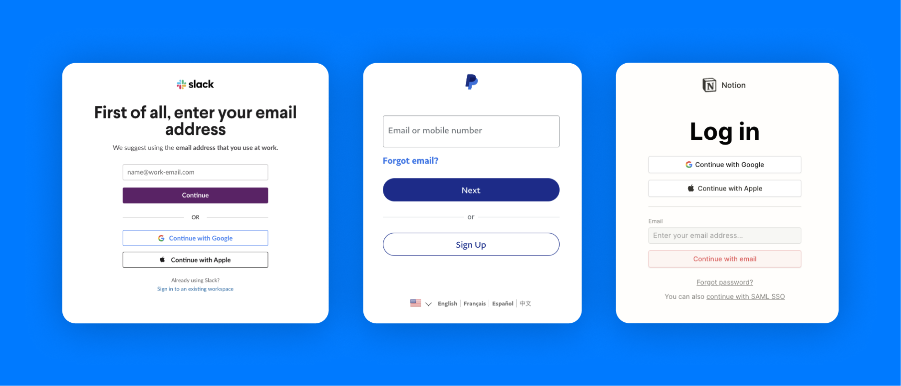

### Introduction

Passwordless authentication is becoming an increasingly popular choice for developers. Even notable names like Slack, Notion, and PayPal are all transitioning to SMS, email, or social logins for their authentication.



A driving factor for its increasing adoption is that it’s inherently less prone to cyberattacks. Since not even password hashes are stored in a database (which have varying degrees of security based on the hashing & salting scheme used), there’s no exposed attack surface with user credentials for malicious actors to target.

There are a few downsides to passwordless. UX becomes more complicated when the user navigates away from the page. Additionally, some implementations come with increased cost (e.g. with physical tokens), and of course - no system is completely infallible against malicious actors.

If you’re looking for a good primer on the different options possible with passworldess, you can refer to this [guide](https://supertokens.com/blog/passwordless-for-product-managers)

For the sake of this post, we’ll focus on a software-based implementation - in our example it’ll be with email magic links.

### The TL;DR

Here’s what we need to do to get passwordless auth up and running:

1. Create a method for generating tokens
2. Create an endpoint for sending your magic link
3. Create an endpoint for verifying tokens
4. Putting it all together

### 1. Create a function for generating tokens

For the sake of simplicity, we’ll be using JWT as our token.

The pseudocode:

```tsx
function generateToken(){

	/* Create the token with your preferred JWT library. We recommend you add
a timeout for best security practices
	*/
	const token = jwt.sign(
      { user_id: user._id, email },
      process.env.TOKEN_KEY,
      {
        expiresIn: "10m",
      }
    );

	return token;
}
```

### 2. Create an endpoint for sending your magic link

Creating the magic link itself is fairly straightforward - the token itself will be in the the query parameter of the link we generate. We’ll be calling the method we just wrote to generate the token.

```tsx
app.get('/send-link', (req, res) => {

	// generate the token
	const token = generateToken();

	// store the token in your database if you'd like to invalidate older tokens for multiple requests
	//db_saveNewVerificationToken(req.query.email, token);

	// create the verification link using your generated JWT
	const magicLink = 'https://example.com/auth/verify-login?token=' + token;

	const mailConfigurations = {
		from: 'example@example.com',
		to: req.query.email,
		subject: 'Log into Example',
		text: magicLink
	};
	
	// send the email to your user's inbox
	sendMail(mailConfigurations);

	res.status(200);
	res.json({ emailSuccess: true });
	res.end();

});
```

### 3. Create an endpoint for verifying tokens

```tsx
app.get('/verify-token', (req, res) => {

	// if only looking for the latest, look up the saved token via the user's email
	//const signature = db_lookupVerificationToken(req.query.email);
	
	// using the secret key, verify the token by comparing the token to a test signature generated from the header and payload
	const decode = jwt.verify(token);
 
	if(decode === true){ // Return response with status
		res.status(200);
		res.json({
			//create a new session here
			data: decode
		});
		res.end();
	}
	else {
		res.status(401);
		res.json({
					login: false,
					data: decode
				});
		res.end();
	}
  //  Return response with decode data
	
});
```

### 4. Putting it all together

Now that you have all the pieces, you can connect your frontend to the two backend API methods to authenticate the user when they log in.

1. When the user submits the form with their email to sign in, calling the send-link endpoint will send an email with the magic link to their inbox - prompt the user to check their email inbox.
2. Once they open the email, clicking on the link should open a dedicated verification page or their destination page such as a dashboard.
3. With the token taken from the query, the frontend should call the verify-token endpoint.
4. Upon receiving a response indicating successful verification, a session is created and the user is granted access to your app - otherwise a flow should be established to redirect the user to the login page anew to try again.


### Edge Cases

Some details to keep in mind:

- **Auto-consumption by email clients.** This is an especially common problem when logging in on mobile, where email clients will often consume the session cookie instead of the original browser. The easiest solution is to prompt the user with a button click on the client before consuming the magic link in case the browser in which they opened the link is not the same as the one they initiated their original flow in.
- ******Reconciling two different browsers.****** In the case of two differing browsers, many opt to log in using the original browser’s session, but this has a security vulnerability in which an attacker may send a link to the user. When the user clicks on the link, the attacker will get logged in as well.
For this reason it’s better to log into the new browser session, but this could lead to a bad UX where the user is logged into a different device from the one they intended.
A compromise is to inform the user in both places of which device initiated the flow and allow them to approve the login - when the user naturally goes to back to their intended browser session, this offers the best UX out of the three options.

### Security Considerations

Depending on how you decide to implement login, there are a few considerations to keep in mind.

- In this example, we chose JWT for our token. Alternatively, you can use an opaque token which is stored in your database - while implementation is more complex, it’s also more secure since there is no single secret key.
- It’s a good idea to limit the number of attempts (with a lockout feature) to prevent brute force attacks.
- Use SSL/TLS encryption when sending the link email securely to ensure the payload of the email, including the magic link, cannot be tampered with.
- Choose as short of a timeout as possible for your token to limit the window of opportunity that an attacker has to use the token. If the token never expires, the token will be available for an attacker to use at any time.

### Conclusion

While we encourage for you to refer to this as a general guide for implementing passwordless auth, security is a critical component to implementing any form of authentication.

For more details and to get started with passwordless authentication within just a few minutes, we invite you to try out the [SuperTokens Passwordless](https://supertokens.com/docs/passwordless/introduction) recipe

Happy building!