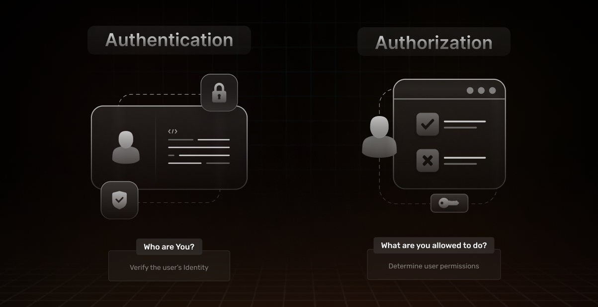

## An overview of Access Control for modern web applications
Today, modern applications have become deeply ingrained in our daily routines. Web, mobile, and business applications serve as the gatekeepers of extensive information, granting users varying degrees of access and power depending on their roles. 

Last year's T-Mobile data breach resulted in [a financial impact of $350 million for the company in 2022](https://tech.co/news/data-breaches-updated-list), which went towards compensating affected customers. This, along with similar incidents during that same year, stemmed from organizations' failure to establish adequate access control measures and enforce a culture of security awareness.

This article delves into the core principles of access control, exploring key mechanisms like Role-Based Access Control (RBAC), Access Control Lists (ACL), and Attribute-Based Access Control (ABAC). 

## What is Access Control and why is it important?
Access control is a security mechanism designed to dictate who has permission to access specific data, applications and resources and under what conditions. Similar to physical spaces protected by keys or guest lists, access control policies serve as digital gatekeepers. Their purpose is clear: **allow the right individuals entry while denying access to unauthorized ones**. Just like Gandalf in the epic Lord Of The Rings scene!

Authentication and authorization techniques underpin access control policies, their goal is to confirm users' identities and ensure they receive the appropriate access levels. For increased protection they can often also factor in variables like device, location, role, and more.

Access control policies safeguard confidential information, including customer data and intellectual property. Any organization prioritizing application security should adhere to the [Zero Trust security model](https://en.wikipedia.org/wiki/Zero_trust_security_model), which operates on the principle of never trusting and always verifying. This model assumes that threats exist both inside and outside the network and focuses on continuous verification of users, devices, and applications attempting to access resources.

In security-conscious organizations users are authenticated and authorized based on their specific attributes and roles, then access is dynamically adjusted based on the continuously monitored security posture.

## Difference between Authentication and Authorization
In the layered landscape of application security, we can conceptualize the process in two key steps, each playing a pivotal role:

### Authentication 
[Authentication](https://supertokens.com/blog/authentication-vs-authorization#the-foundation---what-is-authentication) marks the initial checkpoint where users validate their identity by presenting the correct credentials. The primary goal of authentication is to establish trust and control access to resources or systems. The authentication process typically involves the following steps:

1. **User Initiation**: a user initiates a request to access a protected resource or system. This could be logging into a website using a login form. 
2. **Providing Credentials**: The user provides identification credentials, which can take various forms, depending on the authentication method. Common types of credentials include:
    1. Something you know: Passwords, PINs, passphrases.
    2. Something you have: Smart cards, security tokens, mobile devices.
    3. Something you are: Biometric data (fingerprint, retina scan, facial recognition).
3. **Credential Submission**: The user enters their credentials into the login form, which is linked to an authentication system. 
4. **Credential Verification**: The authentication system verifies the submitted credentials against stored records or a database. This process differs based on the authentication method:
    1. [Password-Based Authentication](https://supertokens.com/docs/emailpassword/introduction): Compares the entered password with the stored password hash.
    2. Token-based Authentication: involves a secondary service confirming a server request. Once the verification process is successfully completed, the server generates a token and provides a response to the request.
5. **Granting access and session management**: If the credentials are valid, the authentication system grants access to the requested resource or system. The user is now considered authenticated. The server then generates a JSON Web Token ([JWT](https://supertokens.com/blog/what-is-jwt)) containing information about the user and sends it to the client.
In many systems, a session is also established for the authenticated user to maintain their state and avoid repeated authentication for subsequent requests during a certain timeframe. Check out how to enable session management using SuperTokens [here](https://supertokens.com/docs/session/introduction). 

The overall goal of the Authentication step ensures that the system recognizes and acknowledges the user as legitimate and is mainly used to answer the question “Who are you”?.

Check out ways you can implement secure and password-less authentication systems using SuperTokens [here](https://supertokens.com/blog/passwordless-for-product-managers). 

### Authorization 
Following successful authentication, the subsequent step is [Authorization](https://supertokens.com/blog/authentication-vs-authorization#understanding-authorization), an equally critical phase that determines the extent of control a user has over the system and the specific actions they are permitted to perform. Authorization is used to answer the question “What are you allowed to do?”

Authorization occurs after authentication, once the system has confirmed the user's identity. It involves checking whether the authenticated entity has the necessary permissions to perform a requested action or access a specific resource. 

This happens with the user sending the acquired JWT after authentication to the server they are attempting to access, the server will read and decode the contents of the JWT. The server then checks the claims in the payload, such as user roles or permissions, to determine if the user is authorized to access the requested resource.

For example, after logging into an email account, determining whether the user has permission to read, edit or delete certain files or folders in a file system.
Authentication and Authorization work hand-in-hand to seamlessly ensure that only legitimate users gain access to specific resources and that their actions within the system are in accordance with predefined permissions. [Click here](https://supertokens.com/blog/authentication-vs-authorization) to learn more. 

## Types of Access control methods
Access control methods undergo continuous evolution to combat emerging threats and align with the evolving technological landscape. These methods, broadly categorized into three types, present different trade-offs, many teams may choose to implement one or multiple layers of those methods for enhanced security:

### Access Control Lists (ACL)
ACLs are a set of rules or permissions attached to an object and can regulate who has access and what operations they can perform on it. 

1. When is RBAC used?
    - ACLs are commonly used in computer systems, networks, and databases to manage access rights and secure resources. 
2. What is an example use case?
    - A filesystem ACL serves as a guide for an operating system that details a user's access rights to a system object, whether it's a singular file or an entire directory. Each object is associated with a table containing various security permissions—such as read, write, update, and delete— each table entry corresponds to the user or group that is granted access and will outline their respective privileges within the system. 
    - ACLs are particularly effective for defining access rights at a granular user level, offering precise control over resource permissions.
3. What are the drawbacks ?
    - ACLs can grow in complexity as the number of users, resources, and permissions grows. Managing and maintaining large and intricate ACLs can become cumbersome. 
    - ACLs might not provide the granularity needed for highly specific access control requirements, leading to either too much access or too little. 
    - ACLs might not cover scenarios where dynamic or context-based access control is necessary.

ACL is often more straightforward and may be sufficient for smaller systems, while Role Based Access Control (RBAC) and Attribute Based Access Control (ABAC) provide more scalability and flexibility for larger and more complex systems.

Access to file systems, network devices, databases, and applications can be governed using ACLs. For instance, in a file system, an ACL could specify which users or groups have read, write, or execute permissions on specific files or directories.

### Role-Based Access Control (RBAC)
RBAC is an access control method that assigns permissions to users based on their roles within an organization, rather than specifying permissions to individual users. In RBAC, roles are defined based on job responsibilities, and users are assigned to these roles.

1. When is RBAC used?
    - RBAC is mostly used when roles and responsibilities within an organization align with the access needs of the system.
2. What is an example use case?
    - Rather than directly granting Sam, a salesperson explicit privileges to view and edit the company's monthly sales reports, RBAC allows us to define permissions for the “salesperson” role. By assigning Sam to this role, we then grant the role itself access to the report, streamlining management and ensuring Sam's access aligns with the defined role's permissions.
3. What are the drawbacks ?
    - RBAC requires careful planning and design, defining roles and permissions for different job functions can become quite complex, in the case where the number of roles expands we can reach a situation where RBAC can be very difficult to manage effectively. Additionally, cases where access requirements are constantly changing require a more dynamic method for setting up access control that can accommodate real-time changes. 

### Attribute-Based Access Control (ABAC)
ABAC makes access decisions based on attributes associated with users, resources, and the environment. 

With ABAC access is determined not just by who the user is or what role they have, but by additional factors like time of access, location, device used, and other dynamic parameters. ABAC can adapt well to complex and dynamic environments where access requirements may change frequently, allowing for more responsive and adaptive access control. 

1. When is ABAC used?
    - ABAC provides more granularity than RBAC, but that can also come with a set of management challenges. Therefore, it should be used when there is an essential need for flexible and expressive access policies.
2. What is an example use case?
    - In a healthcare system, ABAC might be used to control access to patient records. Access decisions could consider attributes like the user's role (doctor, nurse), the patient's sensitivity level, and the time of access.

Check out [this article](https://supertokens.com/blog/what-is-roles-based-access-control-vs-abac) for more information on the differences between RBAC and ABAC. 

## Getting started with Access Control using SuperTokens RBAC
[SuperTokens](https://www.youtube.com/watch?v=EjLxXMRN73I&t=88s) is an open-source authentication solution that can help you set up user authentication in your application in minutes. In addition to the authentication methods like email-password, passwordless and social login, SuperTokens also provides authorization with RBAC through [user roles](https://supertokens.com/blog/introducing-user-roles-authorization-with-supertokens#part-1---introducing-user-roles-and-understanding-why-authorization-matters)

### What are SuperTokens User Roles?
Through SuperTokens user roles, we focus on the equally crucial phase of authorizing users post-authentication. This involves assigning roles, each with a defined set of permissions for application users, mirroring the implementation of RBAC seamlessly in three simple steps:
1. [Create the user roles](https://supertokens.com/docs/userroles/creating-role), by adding a number of permissions to each role.
2. [Assigning user roles](https://supertokens.com/docs/userroles/managing-roles-and-users) to users.
3. [Retrieving user roles and permission](https://supertokens.com/docs/userroles/protecting-routes) in the client application and verifying that users have sufficient permission to perform their tasks.

### Monitor and Evolve  
Regardless of the access control strategy you adopt to protect your resources, it is essential to incorporate efficient mechanisms for updating users' permissions to accommodate changes in their roles and access requirements.

Once the access control strategy is put together, developer teams should regularly review their list of roles and permissions and make sure those are updated against any organizational changes (an employee joining or leaving a company or giving someone elevated permissions for a new project). 

A best practice according to the Zero trust policy, is to establish the default access rights for data resources to deny access at every level, then proceed through an organization’s users, groups, and services, and selectively grant explicit access only to the resources they specifically need.

With SuperTokens user roles, you can easily list, add or remove new roles as needed, [here](https://supertokens.com/docs/userroles/managing-roles-and-users) are some examples on how that can be done. 

## Conclusion
Access Control Lists (ACLs), Role-Based Access Control (RBAC), and Attribute-Based Access Control (ABAC) stand as vital components in access management. ACLs define precise permissions at the object level, RBAC streamlines access via role allocation, and ABAC adds sophistication by considering multiple attributes for decision-making. Their integration empowers organizations to forge a resilient and adaptable access control framework. 

Check out the SuperTokens [blog](https://supertokens.com/blog) for a deeper dive on open-source and easy Access control solutions that can safeguard your applications against the threat of potential cyber attacks. 
