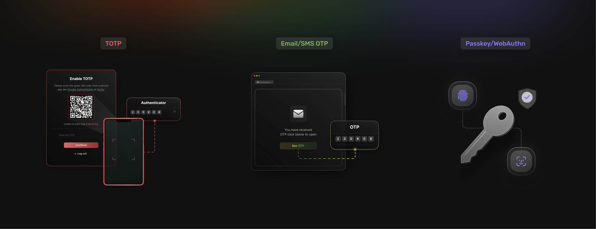

Next.js powers everything from enterprise SaaS dashboards to consumer-facing applications, making security paramount across diverse
deployment scenarios. A single stolen password can compromise entire systems and expose sensitive user data. According to a [Microsoft report](https://techcommunity.microsoft.com/blog/coreinfrastructureandsecurityblog/microsoft-will-require-mfa-for-all-azure-users/4140391#:~:text=The%20need%20for,security%20measures%20available.), 99.9% of compromised accounts did not use MFA; and enabling MFA can block more than 99.2% of account compromise attacks. That means that adding MFA is one of the simplest, highest-impact ways to secure your Next.js app. And with SuperTokens, you can set it up in just a few minutes.

## **What Does MFA Mean Inside a Next.js Project?**

**[Multi-factor authentication](https://supertokens.com/docs/additional-verification/mfa/introduction)** **(MFA)** requires users to provide a second verification step beyond their primary password, typically through time-based one-time passwords (TOTP), email or SMS codes, or hardware-backed authentication methods like passkeys. This additional security layer dramatically reduces the risk of unauthorized access, even when primary credentials are compromised.

**[Next.js architecture](https://nextjs.org/docs/architecture)** requires careful consideration of how MFA flows integrate with modern framework features. MFA implementations must work seamlessly with App Router, edge functions, and Incremental Static Regeneration (ISR) pages, without blocking server-side rendering processes. The authentication flow needs to handle both client-side and server-side verification, while maintaining performance characteristics that users expect from Next.js applications.

Authentication state management becomes particularly critical in Next.js environments where pages can render on servers, at the edge, or in browsers. MFA flows must coordinate between these different execution environments while maintaining security guarantees and providing smooth user experiences across all rendering strategies.

## **Popular MFA Methods You Can Enable in Next.js**



-   **Time-Based One-Time Passwords (TOTP)** is the most widely adopted MFA method, popularized by Google Authenticator and similar applications. TOTP generates six-digit codes that refresh every 30 seconds based on shared secrets, providing offline functionality that works even without network connectivity. Users scan QR codes during setup to establish the shared secret between their authenticator app and the application.
-   **Email and SMS One-Time Passcodes (OTP)** offer the lowest user friction for SaaS applications since they require no additional app installations or hardware purchases. Email OTP works across all devices with email access, while SMS OTP provides immediate delivery to mobile phones. However, SMS-based authentication faces increasing security concerns due to SIM swapping attacks and carrier vulnerabilities.
-   **Passkeys and WebAuthn** deliver hardware-backed, phishing-proof authentication that represents the future of secure login experiences. Passkeys leverage built-in biometric sensors like fingerprints or facial recognition, providing both security and convenience. Browser support includes Chrome, Safari, Firefox, and Edge, with mobile support across iOS and Android platforms.

## **Planning MFA &mdash; 4 Questions to Answer Before You Code**


**Mandatory or Step-Up Authentication?** This determines whether all users must complete MFA during every login, or only for high-risk actions like financial transactions or administrative operations. Mandatory MFA provides maximum security but may create user friction, while step-up authentication balances security with usability by requiring additional verification only when accessing sensitive features.

**Recovery Path Strategy** addresses inevitable scenarios where users lose access to their MFA devices or forget backup codes. Options include issuing printable backup codes during MFA setup, allowing email-basedemergency access, or implementing administrative reset procedures for enterprise environments. Recovery mechanisms must balance user convenience with security requirements.

**Device Remembering Policy** controls whether trusted devices can bypass MFA requirements for specified periods, typically 30 days. Device remembering reduces user friction on frequently used devices while maintaining security for new or suspicious login attempts. Implementation requires secure device fingerprinting and careful consideration of security implications.

**State Management Model** determines how the authentication state persists across requests and sessions. Central session stores provide comprehensive control and real-time revocation capabilities, while stateless JWT tokens enable better scalability and edge deployment compatibility. The choice impacts performance, scalability, and security characteristics of the overall authentication system.

## **Implementation Strategies Seen in the Wild**

 | Strategy            | Libraries / Services        | Pros                                                   | Cons                                                                 |
|---------------------|-----------------------------|--------------------------------------------------------|----------------------------------------------------------------------|
| NextAuth.js + Custom 2FA | next-auth + plugins         | Familiar to many developers, extensive community        | DIY secret storage requirements, limited step-up authentication      |
| AWS Amplify Authentication | Cognito backend             | Fully hosted solution, built-in SMS and TOTP            | Vendor lock-in concerns, TTL configuration limits                    |
| Custom Speakeasy    | speakeasy + QR libraries    | Complete implementation control                         | High maintenance overhead, security implementation risks             |
| SuperTokens MFA     | Self-hosted or managed      | Drop-in UI components, automatic token rotation, theft detection | Requires Core instance deployment (Docker or Cloud)                  |

**NextAuth.js with custom 2FA** leverages familiar developer patterns but requires manual implementation of secret storage, backup codes, and step-up authentication flows. While the initial setup feels straightforward, production-grade security features require significant
additional development.

[AWS Amplify Authentication](https://aws.amazon.com/amplify/authentication/) provides comprehensive hosting through Cognito but creates vendor dependencies that may limit future flexibility. The platform includes built-in SMS and TOTP support with enterprise-grade scaling, though configuration options can be restrictive for complex authentication
requirements.

**Custom implementation by using Speakeasy** offers maximum control over authentication flows and user experience, but requires expertise in cryptographic operations, secure secret management, and vulnerability prevention. The maintenance burden grows significantly as security
requirements evolve.

[SuperTokens](https://supertokens.com/) **MFA** delivers production-ready authentication with minimal configuration, while supporting both self-hosted and managed deployment options. The solution includes advanced security features like automatic token rotation and theft detection that would require substantial custom development.

## **Step-by-Step MFA Integration with SuperTokens (Next.js App Router)**

**1. Deploy SuperTokens Core** by using Docker for local development or the free managed trial for production testing:

```js
  docker run -p 3567:3567 -d supertokens/supertokens-postgresql
```

**2. Install Required SDKs** for both backend and frontend integration:

```js
  npm install supertokens-node supertokens-auth-react
```

**3. Configure Authentication Recipes** in your Next.js API route at `app/api/auth/\[\...route\]/route.ts`:

```js
 import EmailPassword from \"supertokens-node/recipe/emailpassword\";  
 import TOTP from \"supertokens-node/recipe/totp\";                                                                    
 import MultiFactorAuth from                                           
 \"supertokens-node/recipe/multifactorauth\";                    
 // Recipe configuration                                                                     
 EmailPassword.init(); // Primary authentication                          
 TOTP.init(); // Secondary factor                                                                       
 MultiFactorAuth.init({                                                
 firstFactors: \[\"emailpassword\"\],                                                                      
 getMFARequirementsForAuth: () =\> \[\"totp\"\]                       
 });
```                                                          

**4. Protect Pages and APIs** by using SuperTokens middleware to verify both session validity and MFA completion claims:

```js
 import { verifySession } from                                         
 \"supertokens-node/recipe/session/framework/express\";                
 import { withTenantId } from                                          
 \"supertokens-node/recipe/multitenancy\";                                                                    
 // Protect API routes                             
 app.post(\'/api/protected\', verifySession(), (req, res) =\> {                                                                       
 // Verified user with completed MFA                                                
 });                                                                      
```

**5. Frontend Integration** automatically injects TOTP setup and verification screens:

```js
import TOTP from \"supertokens-auth-react/recipe/totp\";              
 // Frontend recipe initialization                                                                       
  TOTP.init();                                   
 // Auto-generates UI at /auth/mfa/totp                                                                      
```  

**6. Test Security Features,** including token rotation and theft detection:

```js
 // Token theft detection hook                                         
 Session.init({                                                                       
  onTokenTheftDetected: (sessionHandle, userId) =\> {                                                    
 // Log security incident                                              
   console.log(\'Token theft detected:\', { sessionHandle, userId });    
 }});  
```                                                                                                                                  
                                                                 
## **Security Best Practices for Next.js + MFA**

-   **Rotate Refresh Tokens on Every Use** to invalidate stolen tokens immediately and minimize exposure windows. Automatic token rotation ensures that even if attackers obtain refresh tokens through various attack vectors, the tokens become useless after the legitimate user\'s next session refresh.
-   **Use Secure Cookie Configuration** with HttpOnly, Secure, and SameSite=Lax attributes for all session cookies. HttpOnly prevents JavaScript access to session tokens, Secure ensures HTTPS-only transmission, and SameSite protection prevents cross-site request forgery attacks.
-   **Implement Short Access Token TTLs** of 15 minutes or less while relying on silent refresh mechanisms to maintain user sessions. Short-lived access tokens limit the impact of token compromise, while automatic refresh maintains seamless user experiences.
-   **Edge-Runtime Friendly Session Verification** enables authentication checks in middleware before requests reach API routes. This approach improves performance and security by preventing unauthorized requests from consuming backend resources.
-   **Log and Alert on Token Theft Detection** to provide Security Operations Center (SOC) visibility into potential security incidents. Real-time alerting enables rapid response to credential compromise attempts and helps identify attack patterns.

## **How SuperTokens Gives You an Edge**


Implementing MFA in Next.js can be complex, with trade-offs between security and usability. [SuperTokens](https://supertokens.com/) simplifies this by delivering a complete solution that integrates smoothly and enforces best practices out of the box.

- [Drop-In UI Components](https://supertokens.com/blog/how-to-use-supertokens-pre-built-ui-with-vuejs) eliminate custom CSS development while providing easily themeable interfaces that integrate seamlessly with existing design systems. The pre-built components handle complex authentication flows, including error states, loading indicators, and accessibility requirements.
- **Flexible Policy Engine** enables both global MFA enforcement and granular step-up authentication per route by using claim validators. This flexibility supports diverse security requirements from consumer applications to enterprise systems with varying risk profiles.
- **Built-In Token Theft Detection and Rotation** provides session resilience against sophisticated attack vectors, including token replay attacks, session fixation, and credential stuffing. The system automatically detects suspicious patterns and takes protective actions without user intervention.
- [First-Class Next.js Support](https://supertokens.com/blog/adding-login-to-your-nextjs-app-using-the-app-directory-and-supertokens) ensures compatibility with App Router, edge middleware, ISR, and API routes across all deployment scenarios. The integration handles server-side rendering, client-side hydration, and edge execution environments seamlessly.
- **Open Source and Self-Hostable** architecture meets compliance requirements without vendor lock-in concerns. Organizations can audit the complete authentication stack while maintaining control over data residency and security policies.

## **Common Pitfalls &mdash; and How to Avoid Them**

Even well-planned MFA setups can fail if common mistakes are overlooked. The points below outline frequent errors in Next.js projects and how SuperTokens helps mitigate them:

-   **Plain-Text TOTP Secrets** create catastrophic security vulnerabilities that expose all user accounts to compromise. [SuperTokens](https://supertokens.com/) handles secret encryption automatically, but custom implementations must use proper encryption with secure key management practices.
-   **Skipping CSRF Checks on OTP APIs** enables cross-site request forgery attacks that can bypass MFA protections. Built-in middleware enforces anti-CSRF tokens automatically, but disabling these protections for convenience creates serious security gaps.
-   **Long-Lived JWTs** undermine MFA session safety by providing extended access even after MFA devices are compromised. Resist the temptation to use long-lived tokens for convenience, because they create security risks that far outweigh operational benefits.
-   **Inadequate Recovery Planning** leaves users permanently locked out when MFA devices are lost or damaged. Implement secure recovery mechanisms during initial planning rather than adding them reactively after user complaints.

## **Future-Proofing Your MFA Stack**

MFA is shifting rapidly toward passwordless and adaptive models. These trends show how to keep your Next.js implementation resilient and ready for what comes next:

-   **Passkeys Everywhere** represent the inevitable evolution toward passwordless authentication. SuperTokens beta-supports FIDO2/WebAuthn flows today, preparing applications for the passwordless future as browser and operating system support expands.
-   **Risk-Based Adaptive MFA** leverages IP addresses, geographic locations, and device telemetry to dynamically trigger step-up authentication flows dynamically. This approach balances security with user experience by requiring additional verification only when risk indicators suggest potential threats.
-   **Zero-Trust Edge Enforcement** combines SuperTokens authentication claims with service mesh policies, to secure micro-frontend architectures and distributed applications. This pattern enables fine-grained access control across complex application topologies.
-   **Emerging Threat Response** requires authentication systems that can quickly adapt to new attack vectors and security requirements. Flexible authentication platforms enable rapid deployment of new security measures as threats evolve.

## **Conclusion &mdash; Ship MFA the Smart Way in Next.js**

Adding multi-factor authentication to Next.js applications shouldn\'t require weeks of complex authentication infrastructure development and security expertise. With [SuperTokens](https://supertokens.com/), development teams can implement production-ready TOTP, email/SMS OTP, or passkey authentication in hours rather than months.

SuperTokens’ comprehensive solution includes advanced security features like automatic token rotation, theft detection, and polished user interfaces that would otherwise require substantial custom development. This approach enables teams to focus on core product features while ensuring enterprise-grade security standards.

***Start with [SuperTokens](https://supertokens.com/) today to ship secure, user-friendly MFA that protects your Next.js applications and users from the growing threat of account compromise attacks.***
