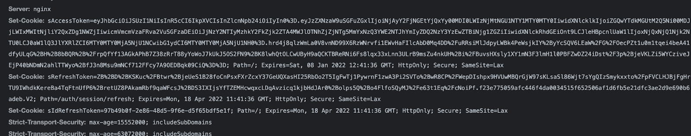

This tutorial walks you through integrating your frontend with social login APIs provided by SuperTokens.

> Note, that it’s only meant for users who are building their own frontend and are building a website. If you are using our pre built UI, these API integrations are already done for you.

To start off, you want to make sure that you have finished the frontend and backend quick setup guides for [the recipe](https://supertokens.com/docs/community/recipes) that you have chosen.

As of this writing, that’s either:
- [ThirdParty recipe](https://supertokens.com/docs/thirdparty/introduction) (only social login)
- [ThirdPartyEmailPassword recipe](https://supertokens.com/docs/thirdpartyemailpassword/introduction) (social + email password login)

After finishing the quick setup guides, you should have:
- Session feature setup on the frontend
- All social auth + sessions related APIs exposed via your backend API (as per [this API spec](https://app.swaggerhub.com/apis/supertokens/FDI)).

Now we can see how to integrate your frontend UI to work with the backend social auth APIs exposed by SuperTokens.

**For ease of explanation, we will assume the following:**

We want to implement sign in with GitHub
- Your website domain is `http://localhost:3000`
- Your API domain is `http://localhost:3001`
- You have chosen the default `api base path` and `website base path` (`/auth` in both the cases)
- You want to implement the **thirdpartyemailpassword** recipe.
- The authorisation redirect URL set on the github dashboard is `http://localhost:3000/auth/callback/github`

On a high level, there are two steps to the flow:
- When the user clicks on the `Sign in with GitHub` button, you want to fetch the GitHub redirect URL and redirect the user to that page. This is where the user will interact with GitHub to enter their credentials.
- When GitHub redirects the user back to your app, you want to use the (one time use) auth code issues by Github to sign in / sign up the user.

### Step 1

When the user clicks on `Sign in with GitHub` button, you want to make the following API call:

```js
const response = await fetch("http://localhost:3001/auth/authorisationurl?thirdPartyId=github",
  {
    method: "GET",
    headers: {
      rid: "thirdpartyemailpassword"
    }
  }
);
```

A successful response will look something like: 

```js
{
  "status": "OK",
  "url": "https://github.com/login/oauth/authorize?scope=read%3Auser+user%3Aemail&client_id=21d82062d1f35b68e66c"
}
```

Couple of pointers:
- As stated previously, we assume that your API is on `http://localhost:3001` and the api base path is `/auth`. Therefore, the resulting API URL is `http://localhost:3001/auth/authorisationurl`.
- This API takes one query param which is the `thirdPartyId` field. Since we are implementing logic with GitHub, the value of this is `github`. If we were implementing login with Google, the value of this would be `google`.
- The header contains a special `rid` field whose value is `thirdpartyemailpassword`. This helps the backend SDK know which recipe to send this request to. If you are implementing the `thirdparty` recipe, the value of this header should be `thirdparty`
- The response is where the user is supposed to be redirected to. The URL contains the scopes and the github client ID you configured on the backend when following the [quick setup > backend guide](https://supertokens.com/docs/thirdpartyemailpassword/quick-setup/backend).

The URL returned in the response is where you will redirect your user to. Before doing that though, you will need to append a query param called `redirect_uri` to this `url` whose value should be the callback URL you configured on the GitHub dashboard. We assume that this URL is `http://localhost:3000/auth/callback/github.`

```js
let urlObj = new URL(response.url)

urlObj.searchParams.append("redirect_uri", "http://localhost:3000/auth/callback/github");

let url = urlObj.toString();
```

The value of `url` after the above operation will be:

`https://github.com/login/oauth/authorize?scope=read%3Auser+user%3Aemail&client_id=21d82062d1f35b68e66c&edirect_uri=http%3A%2F%2Flocalhost%3A3000%2Fauth%2Fcallback%2Fgithub`

As you can see, we have appended the `redirect_uri` query param successfully. Now we can redirect the user to this URL.

### Step 2

When the user is navigated back to your app (from GitHub), the URL will contain a `code` query param (on successful login), like this:

`http://localhost:3000/callback/github?code=3cf143e0af0f1bed8d34`

First, you need to extract this code in the following way:

`let code = new URL(window.location.href).searchParams.get('code');`

Then, you need to call another API exposed by the SuperTokens backend SDK to complete the login operation:

```js
const response = await fetch("http://localhost:3001/auth/signinup", {
  method: "POST",
  headers: {
    "rid": "thirdpartyemailpassword",
    "Content-Type": "application/json"
  },
  body: JSON.stringify({
    code,
    redirectURI: "http://localhost:3000/callback/github",
      thirdPartyId: "github"
  }
});
```

Successful execution will result in a response that looks something like:

```js
{
  "status": "OK",
  "user": {
    "id": "fa7a0841-b533-4478-95533-0fde890c3483",
    "email": "johndoe@gmail.com"
  },
  "createdNewUser": true
}
```

A few important points:
- The `redirectURI` in the request body is the same as what you had put on the GitHub dashboard.
- Just like the previous API call, we add a `rid` header with the value of `thirdpartyemailpassword`.

## Where are the session tokens?

From inspecting the response from the `/signinup` API call, we don’t see an access token / JWT in the body - so where are they?

SuperTokens issues session cookies that get sent via the `Set-Cookie` header in the response and is automatically handled by the browser.



Furthermore, our frontend SDK handles these session tokens for you automatically:

- Automatic refresh of session
- Automatic injection of the access token for your API calls
- Provides a signOut function

These features are a part of the session recipe that you initialised when following the quick setup guide.

<h4 id="last-section-social-login-with-supertokens">Conclusion</h4>

We have seen how to integrate your custom UI with the social login API exposed by SuperToken’s backend SDK. It involves calling the GET `/authorisationurl` and the POST `/signinup` API. Furthermore, we see that on successful login, we are issued cookie based session tokens which are handled automatically via our frontend SDK.
