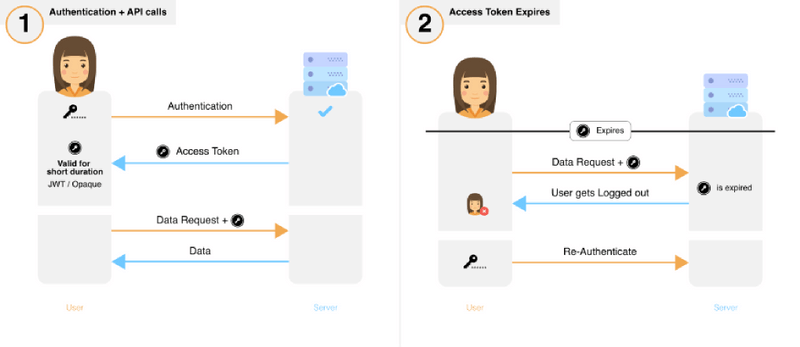
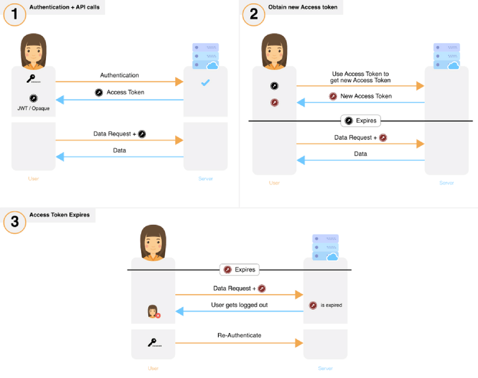
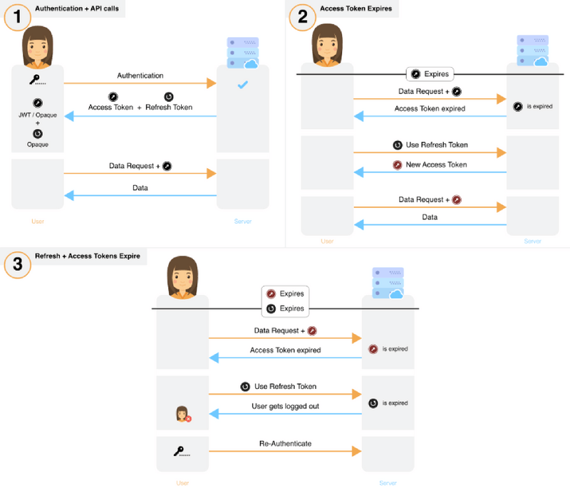

What follows is a 2 part series on session management — inspired by extensive conversations with over 70 developers and our own intensive research. We will explore different session management practices, identify issues and converge on a solution to these issues. Through it all, I hope to leave you with clarity on deciding how to manage user sessions (and auth tokens) for your application. In 20 minutes, we summarise all the important information it took us hundreds of hours to obtain and document.

This is part 1 in a two-part series on session management.

*Part 1: Introduction to session management, analysis of most commonly used session flows, and best practices*

*[Part 2](/blog/the-best-way-to-securely-manage-user-sessions): Analysis of a new, open source session flow that is secure and easy to integrate into existing systems — provided by [SuperTokens](https://supertokens.com)*

Specifically, in part 1, we cover

- [Why is session security important?](#why-is-session-security-important)
- [JWT vs Opaque access tokens](#jwts-vs-opaque-access-tokens)
- [Common attacks on sessions](#common-attacks-on-sessions)
- [Detection vs Prevention of stolen auth tokens](#detection-vs-prevention-of-stolen-auth-tokens)
- [Common ways of implementing session management flows](#common-ways-of-implementing-session-management-flows)
- [Best practices for attack mitigation](#best-practices-for-attack-mitigation)

*Note: Do not confuse session management with OAuth, as the latter is a protocol designed only for the purpose of delegation. Session management, for the purpose of this article, is about how auth tokens are handled, stored and changed during an active session — whether it be for OAuth flows, or for server-client session flows.*

## Why is session security important?

Session security is an important consideration in the design of any system that requires communication between a server and a client. Improper security can lead to user accounts being vulnerable to unauthorized access. OWASP (Open Web Application Security Project — leading authority for security) considers the improper implementation of authorisation / authentication as the [second biggest risk](https://owasp.org/www-project-top-ten/2017/) to application security. Several notable hacks illustrate this point:

- The Docker hub database hack earlier this year resulted in stolen Github access tokens. [Source](https://www.trustedreviews.com/reviews/google-pixel-4)

- Gitlab had a vulnerability where all its user’s auth tokens were exposed in the URLs, had no expiry time and were susceptible to brute force attacks due to their short length. [Source](https://threatpost.com/session-hijacking-bug-exposed-gitlab-users-private-tokens/127747/)

- A software bug made it possible to steal access tokens — affecting 90 million Facebook accounts. [Source](https://about.fb.com/news/2018/09/security-update/)

- Youtube influencers’ accounts compromised for several days via session token theft to completely hijack their account and change their video content. The tokens were stolen via a malware installed on the victim’s computer. [Source](https://twitter.com/MarcoStyleNL/status/1192179230341251075?s=09)

It is tricky, time-consuming and expensive to correctly implement user session management. According to an [a16z](https://a16z.com/about/) operating partner (top tier VC) and former Box CSO (Chief Security Officer), **authentication and authorisation is the number one spending cost for organisations when it comes to their security budget.** [Source](https://www.youtube.com/watch?v=FdIW7BiCBtI&t=524s)

This is the tip of the iceberg but we hope it is enough for anyone to realize that they could be the next Titanic if they do not correct their course.

## JWTs vs Opaque access tokens

We’ll briefly explore the two predominant types of tokens that are used in session management. Several of the flows we discuss require an understanding of these tokens.

### JSON Web Tokens ([JWT](https://jwt.io/))

- Each JWT contains specific information that can be interpreted by any party that has that token. For example, this information can contain the user ID of the user for whom it was issued.
- An advantage of using JWTs is scalability as the backend does not need to do a database lookup for every API call.
- The drawback is that revoking a single token on demand (before it expires) can be difficult if methods like blacklisting are not used (which impacts the scalability of the solution). However, one can revoke all tokens by changing the signing key.

### Opaque Tokens
- These are random strings which act as pointers to information that is held only by the system that issues them.
- These require a database/cache lookup each time they are used.
- A single token can easily be revoked on demand.

While these two token types have different properties, theft of either type can lead to unauthorised access to a user’s account.

### Common attacks on sessions

Auth tokens are stored on the frontend and the backend and are frequently sent over the network (depending on the session flow). As such, they are vulnerable to several types of attacks.

- Man in the Middle attack
- OAuth token theft
- XSS
- CSRF
- Database/filesystem access
- Session fixation
- Brute force attack
- Social Engineering / physical access

**While it may seem that these attacks are unlikely, it is important to take session security seriously and deploy appropriate measures.** The vulnerability of the system is based on the cumulative probabilities of all the types of attacks.

Further on, we discuss how each of these attacks could lead to token theft and we explore best practices to mitigate against these types of attacks.

To keep tokens safe, a system architect should not only prevent tokens from being stolen but, as a fail-safe, also ensure that should token theft occur, the system is able to detect it as quickly as possible. Detection is an important concept to consider and will be explored in the next section.

## Detection vs Prevention of stolen auth tokens

Prevention is a first line of defense and all attempts should be made to minimize theft. However, auth tokens are fundamentally susceptible to theft because they are transmitted to an untrusted party (the app’s frontend). Hence, detection of token theft has an important role to play in the security of the system. Existing detection methods rely largely on **heuristic algorithms** such as tracking sudden changes in IP addresses and browser (or mobile) fingerprints and flagging “unusual user behaviour”. Unfortunately, these methods themselves can be inaccurate, easy to spoof and difficult to implement. However, there is a reliable way to integrate detection of theft in the session management flow and in [part 2](/blog/the-best-way-to-securely-manage-user-sessions), we propose a flow that does that.

On a related note, in cases where session vulnerabilities are publicly exposed, companies may release statements stating that there was no indication that the vulnerability was exploited. However, what they fail to mention is how extensively their system would be able to detect token theft in the first place!

## Common ways of implementing session management flows
We’ve identified the most commonly used session management flows and classified them into 5 groups.

1. Long-lived access token
2. Short — Medium term lived access token used to get a new access token
3. Short — Medium term access token whose usage extends its expiry
4. Short-lived access token
5. Short-lived access token with long-lived refresh token

### 1. Long-lived access token

- If the user voluntarily logs out, the access token is revoked and cleared from the frontend.

**Damage Analysis**
There are no critical auth tokens in this case. However, this method frequently exposes the user’s credentials during transit — making it susceptible to attack.

*Effect of stolen auth tokens: 
If the token is stolen, the attacker will only be able to do damage for a short period of time.*

*Detection of theft: 
Token theft may only be detected through the use of heuristic algorithms or if the user notifies the provider/developer of the service.*

*Once detected: 
If the flow is implemented using JWTs, it may be difficult to revoke the token. However, stolen Opaque access tokens can be easily revoked.*

### 2. Short-Medium term lived access token used to get a new access token

- The new access token can be used by the frontend even if the previous token has not expired.
- If the user voluntarily logs out, the access token is revoked on the backend and cleared from the frontend.
- It is likely that a user will be logged out if the access token is short lived.

**Damage analysis**  
The critical auth token is perpetually exposed over three attack surfaces — the frontend, during transit and the backend.

*Effect of stolen auth tokens:*  
An attacker must constantly renew their token to maintain unauthorised access.

*Detection of theft:*  
To stay logged in, both the attacker and victim need to request the server for a new access token before the current (stolen) token expires. Both would do this using the same access token. If the same token is used twice for the request, then the system could deduce that there has been a theft — depending on how the frontend is implemented. A shorter-lived access token would enable quicker detection of theft, but it may also result in poor user experience due to repeated logouts when there is no theft.

*Once detected: 
The access token associated with this session would need to be revoked. It may be complex to stop the attack if the access token is a JWT.*

### 3. Short-Medium term lived access token whose usage extends their expiry

- If the user voluntarily logs out, the access token is revoked and cleared from the frontend.
**Damage Analysis**  
The critical auth token is perpetually exposed over three attack surfaces — the frontend, during transit and the backend. Note that this flow does not apply to JWTs as extended their expiry time would result in a change of the token value itself (thank you [Mehmood Deshmukh](https://medium.com/@meshde) for pointing this out).

*Effect of stolen auth tokens:* 
As long as either the victim or the attacker is active, the attacker would be able to maintain unauthorised access.

*Detection of theft:* 
Token theft may only be detected through the use of heuristic algorithms or if the user notifies the provider/developer of the service.

*Once detected:* 
The access token associated with this session would need to be revoked.

### 4. Short-lived access tokens

- If the user voluntarily logs out, the access token is revoked and cleared from the frontend.

**Damage Analysis** 
There are no critical auth tokens in this case. However, this method frequently exposes the user’s credentials during transit — making it susceptible to attack.

*Effect of stolen auth tokens:* 
If the token is stolen, the attacker will only be able to do damage for a short period of time.

*Detection of theft:* 
Token theft may only be detected through the use of heuristic algorithms or if the user notifies the provider/developer of the service.

*Once detected:* 
Access tokens need not be revoked since they are short lived. However, if needed, Opaque access tokens can be revoked by removing them from the database.

### 5. Short-lived access token with long-lived refresh token

- If the user voluntarily logs out, the access token is revoked and cleared from the frontend.
**Damage analysis** 
The critical auth token (refresh token) is perpetually exposed over two attack surfaces, the frontend, and the backend and occasionally exposed over transit.

*Effect of stolen auth tokens:* 
Access token stolen: The attacker will have unauthorised access for a short period of time (until token expiry).

Refresh token stolen: The attacker can use the stolen refresh token to get new access tokens and have unauthorised access to the victim’s account over a long period of time. In rare scenarios (described below), this theft can be detected and the damage can be minimised.

*Detection of theft:* 
Access token stolen: This theft may only be detected through use of heuristic algorithms or if the user notifies the provider / developer of the service.

Refresh token stolen: Detection of theft is possible in certain scenarios and implementations. For example:

- One implementation could result in previous access tokens being immediately revoked upon generation of a new access token. This enables the system to recognize theft in the case when the attacker and victim are online at the same time. For example: if the attacker uses the refresh token, the victim’s access token would be revoked — causing the victim to request for a new access token. This would result in another request from the attacker and so on. If the backend could detect short interval requests for new access tokens, then it would be possible to deduce that there has been a theft.

*Once detected:* 
Access tokens need not be revoked since they are short lived. However, if needed, Opaque access tokens can be revoked easily by removing them from the database.

*Refresh tokens can be revoked easily by removing them from the database.*

These flows are not designed with token theft detection as a requirement. In [Part 2](/blog/the-best-way-to-securely-manage-user-sessions), we propose an alternate session flow that we believe would be far more secure. For now, we’ll revisit the types of attacks that sessions are vulnerable to and some steps to mitigate against the risks.

## Best practices for attack mitigation

### Man in the middle attacks

Man in the middle (MITM) attacks are possible in the following scenarios.

1. When using HTTP or incorrectly implementing HTTPS:   If the application does not use https and secure cookies, an attacker could connect to the same network as the victim, monitor the network packets and see the auth tokens in plain text during transit. Often, even when the application has an SSL certificate, an incorrect implementation can lead to MITM attacks. For example, ESPN.com sends auth cookies over unsecured HTTP (as of 10th May 2019) and this [Netcraft](https://www.netcraft.com/blog/95-of-https-servers-vulnerable-to-trivial-mitm-attacks/) article elaborates on the prevalence of incorrectly implemented https.

2. When using a Proxy:   Two of the last three organizations I worked at, monitored all the traffic on their network. At workplaces, devices likely use the corporate wifi network. Companies can enable the connected devices to trust their network proxy as an SSL Certificate Authority as a prerequisite to connect to the wifi. This would enable them (or a malicious actor) to see auth token information during transmission.

**Methods of prevention:** 
The easiest way to protect against this type of attack is to use https and secure cookies throughout your application. However, this doesn’t prevent attacks that result from the use of a proxy. One could take extra precaution by using public/private keys that are fixed per device. The frontend and backend would exchange these public keys at the point of initialization (before the user logs in). For subsequent communication, the token data could be encrypted using the public keys. This limits transit attacks to only the initial public key exchange. There is a modification that would enable the prevention of replay attacks but that is not covered in this blog post. (Feel free to [reach out](mailto:team@supertokens.com) if you would like to know more). Regardless, some of the described flows (flow 5 and the proposed flow in [Part 2](/blog/the-best-way-to-securely-manage-user-sessions)) aim to minimize exposure of the critical token by reducing its frequency of transit.

### OAuth token theft

If an application provides access/refresh tokens to other apps via OAuth, then there is a risk of the main app’s auth tokens being stolen if the other app’s servers are compromised. For reference, see the recent docker hub case study mentioned at the start.

The solution to this is to have appropriate measures in place to detect stolen refresh tokens and to use only short-lived access tokens.

### XSS Attack

In XSS, an attacker can maliciously inject Javascript code into an application running on the victim’s browser / mobile device. The injected code reads and transmits auth tokens to the attacker (read more about XSS attacks [here](https://owasp.org/www-community/attacks/xss/)). Malicious JS code can be injected in a variety of ways: Inadequate user input checking; Manipulating the user to copy & paste some JS into their browser console; Injecting malicious JS via a third party dependency the website / hybrid app depends on.

For websites: This can be prevented fairly easily by using HttpOnly or Secure cookies to store auth tokens. [Do not use localStorage](https://dev.to/rdegges/please-stop-using-local-storage-1i04) to store auth tokens, as they are accessible by javascript. All described session flows can be protected against this attack by following this recommendation.

For hybrid / JS-based apps (like react-native): Preventing this attack could be difficult. One way is to make sure that all the dependencies being used are “secure”, however, this is time-consuming and expensive. Ultimately, having token theft detection in place is the only real solution in this scenario.

### CSRF

This attack is not used to steal auth tokens — instead, it allows an attacker to piggyback on an existing active session (read more [here](https://owasp.org/www-community/attacks/csrf)).

Prevention of CSRF attacks typically requires the use of an anti-CSRF token or SameSite cookies. However, there are other methods that can be used to solve this in a way that is seamless with the whole authentication process. Please contact us for more details.

### Database/filesystem access

If an attacker manages to access the database/file system (either via database injection attack or actual server access), they could potentially get hold of currently active auth tokens or the JWT / SSL private key *(theft of these keys is potentially even worse than stolen passwords).* This would enable them to easily hijack sessions — leading to serious security consequences. Do note that the attacker could be an employee within your organisation (especially for high growth startups — are all the proper access controls in place for employee database/server access?).

To control damage caused by unauthorized access to your database or filesystem, you could do the following:

- Store only the hashed versions of the refresh and access tokens in your database to prevent an attacker from hijacking any live session. This recommendation is applicable to all implementations described above.

- Using JWTs requires the private key to be stored on the server — which is susceptible to theft. If the attacker obtains the private key, they will be able to hijack both current and future sessions. To limit the damage, the private key used to sign the JWTs will need to be changed — instantly invalidating all current JWTs. In methods that use a refresh token (flow 5, Part 1 and the proposed flow in [Part 2](/blog/the-best-way-to-securely-manage-user-sessions)), changing the private key will not affect the user experience as the refresh token will be used to generate a JWT signed with the new private key.

### Session fixation
This may be possible if you have anonymous sessions for your web application (read more [here](https://owasp.org/www-community/attacks/Session_fixation))

The best way to solve this is to generate a new set of auth tokens each time a user logs in and to invalidate the old ones if any. This is done per device and not per user. Doing so will safeguard all described session flows against this attack.

### Brute force attack

An attacker with sufficient resources can incessantly ‘guess’ auth tokens until one of the attempts proves successful. This would provide them with all the access the stolen token confers.

The best way to prevent this is to use long auth tokens with high entropy.

### Social engineering / Physical access

An attacker with physical access to a victim’s device can steal auth tokens in multiple ways.

- An attacker could simply read the cookies (even if they are secure or HttpOnly) by inspecting the application page if the service is accessible via a browser. On a mobile app, this is harder but still possible.

- Depending on how an app’s session flows are implemented, an attacker could steal a user’s auth tokens even after the victim has logged out of the app. [This](https://www.youtube.com/watch?v=RO-K7oIkjFQ) video from 2013 shows how Twitter did not invalidate the session cookie even after the user logged out. As a commenter points out, this was still occurring even in 2016!

Both of the above issues are even more probable if an app is being used on a public computer — which has to be factored in.

The only way to really fix this problem is to have token theft detection in place and to enable users to log out of all devices. This would mean being able to revoke all refresh and access tokens for that user. Some methods that have long lived JWT access tokens, might find this difficult to do.

This wraps up the best practices to prevent common types of attacks and this section of the post. We hope it helps and provides the answers you were looking for. Please do leave any comments you have.

## Part 2

Studying all these session flows enabled us to conceptualize a flow (inspired by [IETF RFC 6819](https://datatracker.ietf.org/doc/html/rfc6819)) which enables greater security and detection of theft. We subsequently built the flow for our own service ([Qually.com](https://qually.com)) and, on request of the developer community, decided to open source our code. Click the button below to navigate to a post which discusses this flow and has links to the GitHub repo — should you be interested. Do check it out and let us know what you think!

<!-- TODO add part 2 button. -->