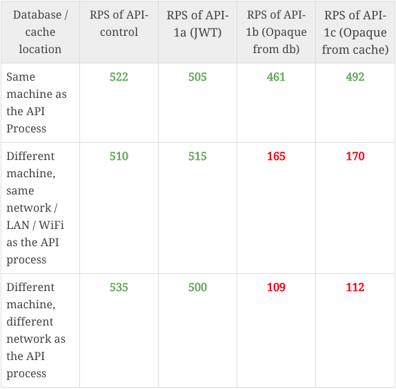
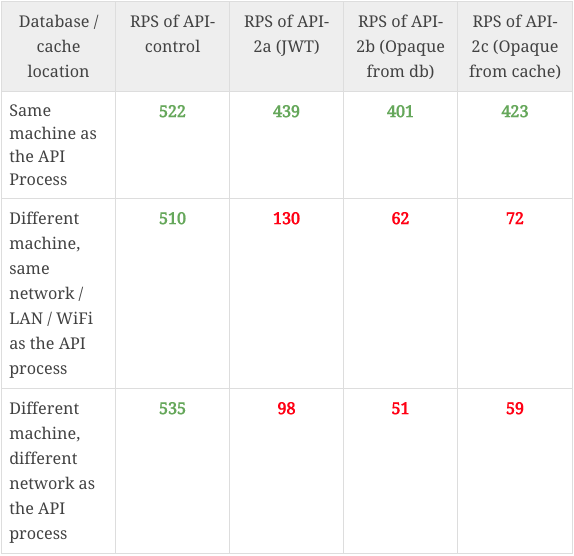

JSON Web Tokens (or JWTs) have become incredibly popular and you’ve likely heard of them before. What you may not have heard is that JWTs were originally designed for use in OAuth – which is fundamentally different to user sessions.

While the use of JWTs for OAuth is widely accepted, its use for authenticating users sessions is controversial (see [this](https://news.ycombinator.com/item?id=22354534) post). In this article, I will attempt to make a comprehensive list of the pros and cons of using JWT for this context. I do not intend to solve this debate, since devs (especially devs) are often strongly opinionated. I only aim to summarize all the perspectives.

However, I do offer my opinion on the best solution for [session management](https://supertokens.com/blog/the-best-way-to-securely-manage-user-sessions) (spoiler: it has the advantages of JWTs without any of its disadvantages!)

The flow of the content is as follows:

- Advantages and disadvantages of JWTs (including common misconceptions)
- A proposed session management flow using JWTs and server sessions (opaque tokens)
- Evaluating the new flow
- Conclusion

##### A cursory note on session management.

User sessions involve managing tokens across your app’s backend and frontend. These tokens act as a proxy to your’s identity and can either be:

- Opaque (a.k.a session tokens – a long random meaningless string which is a reference to some information stored in a database)
- Non-opaque (contains some meaningful information like a userID, encoded in base64)

Non opaque tokens have a special property that enables the backend to verify that the token is legitimate. This is achieved by cryptographically signing them, and in doing so, we get what is known as a **JWT – a signed, non-opaque token**.

*A clarification note*: I am only concerned with session management between an app’s backend APIs and frontend. There is no third party service involved (i.e. no OAuth 2.0).

## The Pros

The following is a list of all the pros for using JWTs – aggregated across multiple sources. These are benchmarked relative to opaque tokens (the only other type of token for sessions). I have also included some common misconceptions and have labeled them as “myths”:

**1) Fact: No database lookups**: It’s generally known that for most APIs, network calls add the most latency. Hence, it’s reasonable to expect that having no network calls (no database lookups) for session verification is beneficial.

To prove this, I ran a test to see latency times (requests per second or RPS) of APIs that used JWTs and not. The displayed RPS are an average of running the tests 60 times. Following are the different APIs that were tested:

- API-control: This API does nothing and can be used as a maximum RPS reference
- API-1a: JWT verification and response
- API-1b: Opaque token verification via database and response
- API-1c: Opaque token verification via cache and response
- API-2a: JWT verification, a database read and response
- API-2b: Opaque token verification via database, another database read and response
- API-2c: Opaque token verification via cache, a database read and response

For each API, I set up the database / cache in three locations:

1) The same machine (as the API process)

2) A different machine, but within the same WiFi network

3) A different machine with a different network (to the API process), but within the same city (an AWS EC2 instance). All machines have roughly the same spec in terms of processing power and RAM.

### Results for API-1 (No extra database read):

### Results for API-2 (one extra database read in API):

As it can be seen, database lookups are indeed much slower, especially over distributed machines (which is very often the case). However, there are counters to this point:

- <u>Other database calls in the API will slow it down anyways</u>: This is true. However, I’d argue that most API calls don’t have 100s of db lookups but just a few of them. Hence you are eliminating a good percentage of latency causing actions most of the time.
- <u>Other services have scaled successfully without JWT</u>: This is also true (even Facebook doesn’t use JWTs). It is possible to scale well with opaque tokens, but it’s just much more difficult and expensive to do so (in terms of engineering costs as well as running costs).

**2) Myth: Saving on database space**: Since JWT’s don’t need to be stored in the database, it’s true that it does save space. To get a sense of how much, let’s do a back of an envelope calculation:

- Opaque tokens (64 characters long), would take 64 bytes of space.
- We want to associate a userId (36 bytes) and some session information with this token (200 bytes). Overall, it takes 300 bytes of space to store one user’s session information.
- If we assume an app has a million active sessions (which is a lot), that means it’s using 300 million bytes or 300 MB for sessions. 10 million sessions? 3GB of storage.

So by using JWTs, we are saving 300 MB of database space per million users. This doesn’t make much difference since it would cost approximately $0.03 extra per month on AWS as per [their pricing](https://aws.amazon.com/ebs/pricing/).

**3) Myth: More secure because it’s signed**: The signing of the JWT token is only required so that clients cannot manipulate the content in the token. Whereas, opaque tokens cannot be manipulated since the string itself doesn’t have any meaning. Just having a long opaque token (high entropy) is good enough. Hence, the signing of JWTs doesn’t add any extra security in comparison to opaque tokens, it simply matches the security level.

**4) Myth: JWTs are easier to use**: It is true that JWTs are easier to get started with since we don’t have to take the effort to build a system that reads the database for session verification, or a cron job to remove expired tokens… However, these are quite easy to implement anyway.

**5) Myth: JWTs are more flexible**: Flexibility comes because we can put anything in a JWT. However, we can do the same with opaque tokens. Any data can be stored in the database against an issued opaque access token.

**6) Myth: JWTs automatically prevent CSRF**: As long as we are using cookies for JWT (which is recommended), we also have to take care of CSRF attacks, just like if we use an opaque token. This attack vector will have to be prevented using anti CSRF tokens or SameSite cookie attribute, both of which are independent of if we use JWT or opaque tokens.

**7) Myth: No need to ask users for ‘cookie consent’**: Cookie consent which is required for GDPR, applies only to cookies used for analytics and tracking. Not for keeping users logged in securly. JWTs and opaque tokens are the same in regards to this point.

**8) Other myths**: I have also read people claim that JWTs work better than opaque tokens for mobile and also work even if cookies are blocked. Both of these are simply not true.

Overall, it seems that the only advantage of JWT over opaque token is lesser latency in API requests (which is a major win). Now let’s have a look at the cons.

## The Cons

Like the above section, the following is a list of all the cons that I have thought about, as well as what I have read from other sources:

**1) Fact: Non revocable**: Since verifying JWTs doesn’t require any lookup to a single source of truth (database), revoking them before they expire can be difficult. I say difficult and not impossible because one can always change the JWT signing key and then all issued JWTs will be immediately revoked. Revocation is important in many cases:

- Logging out users
- Banning users instantly
- Changing user’s permission in your system
- Changing a user’s password

One solution that people recommend is to use revocation lists. This is where you keep a list of revoked JWTs and check against that list when verifying the JWT. But if we do this, it’s almost the same as opaque tokens since we will have to do a database / cache lookup in each API. **I say *almost* since here, we have the option to choose which APIs should check against the blacklist and which should not**. So this may be an advantage in certain scenarios over opaque tokens.

One more solution is to keep the lifetime of the JWT very small (~10 mins). However, this also means that users will be logged out every 10 mins. There are various session flows that one can implement to have short lived JWTs while maintaining a long session as explained in [this blog post](https://supertokens.com/blog/all-you-need-to-know-about-user-session-security). We will be exploring the recommended method later in this post.

**2) Fact: Bottlenecked against one secret key**: If the signing key of the JWTs is compromised, then the attacker can use that to change the userId in their JWT to any other user’s. This allows them to hijack any user’s account in a system. This secret key can be compromised in a variety of ways like employees making a mistake (by pushing the key to github) or purposely leaking the key. Attacks to your servers might also leak this key.

A counter to this is that even opaque tokens from the database can be leaked. However, those are much harder to leak  (because of their sheer volume) and cannot be used to compromise new accounts or accounts that don’t have an active session during the time of attack.

**3) Fact: Crypto deprecation**: Signing of JWTs requires use of a cryptography instrument called hashing. It is usually recommended to use SHA256 for this. However, what happens when this gets deprecated? At that point, one may want to switch to a newer algorithm. While making this change is relatively straightforward, the problem is that developers are very busy and often will miss out on such deprecations. That being said, such deprecations are very infrequent.

**4) Fact: Monitoring user devices**: In the most simple implementation, if one is using JWTs for their sessions without any session information stored in the database, their app will not be able to know which devices or how many devices a user is using. This may often cause business logic and analytics issues. This being said, it’s easy to add some information to the database when a JWT is issued and remove it once it expires. This way, this disadvantage can be mitigated. However, this is something that needs to be done purely outside the scope of a JWT (hence this point).

**5) Myth: Cookie size is too large**: A typical JWT can be 500 bytes long[^1], versus a 36 or 64 bytes sized opaque token. These are to be sent to the frontend via cookies and these are sent to the backend on each API request. This causes two problems:

- <u>No more space in cookie store</u>: The maximum cookie size a browser allows is 4096 bytes per domain. Even if using a 500 byte JWT, we still have 87% of the cookie store left for use. This seems to be more than enough for most applications.
- <u>Higher amount of data transferred on each API call</u>: If we take the above numbers, we are transferring 464 bytes extra each API call (500 minus the size of an opaque token). This means, the client is uploading that much more and the server needs to download that much more for each API call.
    - If we assume that a client has an upload speed of 10kbps (very low), this means each API call will take an extra 46 milliseconds. In general, I believe this  is completely acceptable. In typical situations (1mbps upload speed), this would take an extra 0.4 milliseconds per API request. For applications which are extremely sensitive to latency and want to save every millisecond, this is something that you could consider factoring in.
    - A typical EC2 instance on AWS has a download speed of 5+ gbps. Let’s assume a low of 1 gbps for argument’s sake. If we also assume that this instance gets 100k concurrent requests (which is very high!), this would imply that the server needs to download an extra 464 * 100k bytes = 46.4 MB of data. Given the download speed, it would take the server an extra 46.4 milliseconds across all the requests to do this which is insignificant.

**6) Myth: Data in JWT is visible to everyone**: First, the priority should be that JWTs themselves should not be accessible by anyone malicious because then they can gain unauthorised access to an account (which is a far bigger problem than being able to see the contents of the JWT). However, if that does happen, one should also refrain from putting any sensitive information in a JWT. Instead, one can store this information in the database. Either way, this is not a con of using JWTs.

Seeing the pros and the cons above, my opinion is that just using JWTs is probably not worth it. The risks, I feel, outweigh the benefits. However, what if we could use a different approach where we use both, opaque tokens and JWTs. Perhaps, this would allow us to eliminate the cons whilst keeping the pros?

## The new approach

Once the user logs in, the backend issues a short lived JWT (access token) and a long lived opaque token (refresh token). Both of these are sent to the frontend via httpOnly and secure cookies. The JWT is sent for each API call and is used to verify the session. Once the JWT expires, the frontend uses the opaque token to get a new JWT and a new opaque token. This is known as rotating refresh tokens. The new JWT is used to make subsequent API calls and the session continues normally. This flow is illustrated in the diagram below:

Now let’s revisit pros and cons for this new session flow.

## Revisiting the pros:

**1) No database lookups**: Since most API calls still use the JWT, this advantage still holds. We will need to call the database when refreshing the session, but this is a relatively rare event (relative to the number of session verifications that do not require a database lookup).

**Cookie 3; Localstorage 1**

**2) Added security via session hijacking detection**: Using rotating refresh tokens, we are now able to detect stolen tokens in a reliable way. This will help prevent session hijacking attacks. Learn more about it here.

We can see that the main advantage of using JWTs still holds, and we have also added a new advantage!

## Revisiting the cons:

**1) Partially Solved: Non revocable**: We can use short lived JWTs and long lived refresh tokens to maintain a long session as well as get substantially more control on revocability. To revoke a session, we must now simply remove the opaque token from the database. This way, when the refresh API is called, we can detect that the session has expired and log out the user. Note that this will not immediately revoke a session – it depends on the lifetime of the JWT. But it makes this problem much more bearable.

**2) Solved: Bottlenecked against one secret key**: We can keep changing the JWT signing key every fixed interval of time. When the key is changed, all current JWTs will be immediately invalidated. In this event, the frontend can simply use its refresh token to get a new JWT (and a new refresh token) signed with the new key. This way, we can vastly minimise our dependency on this secret key.

**3) Not solved: Crypto deprecation**: This point is still a problem, however, changing the hashing algorithm can be done smoothly and immediately just like how we change the signing key.

**4) Solved: Monitoring user devices**: Since we have an opaque token for each session, we can easily monitor the devices each user has.

We can see that most of the cons have been roughly resolved and are now all acceptable risks.

## Conclusion:
My opinion is that using JWTs, especially for long lived sessions, is not a good idea. Using short lived JWTs with long lived opaque (refresh) tokens in the following scenarios:

- The need for **easier scalability** is higher than the need for **immediate token revocation**. The final decision depends on your use case. Do you expect your app to **scale to millions of users** (JWTs preferable) or less than tens of thousands (opaque tokens preferable)? How important is **instant revocation**? If you ban a user or detect theft, the token will continue to be valid till it expires (let’s say 30 minutes).
- The 4k bytes cookie size is not a limiting factor.
- You do not need to map “sensitive” information to the access token that is required in each API call.

When I think of consumer apps that I want to develop, most of them meet the criteria above. I feel that it is a perfect balance between scalability and security. For all other requirements, stick to short lived opaque access tokens and long lived opaque refresh tokens.

Note that we have not spoken about the applicability of JWTs for OAuth and have only focused on sessions between an app’s backend API and frontend. JWTs are generally an excellent use case for delegation of access to third party services (OAuth). In fact, they were originally designed for this exact purpose.

If you like the session flow I described, please checkout [SuperTokens](/). It is a robust solution that has implemented rotating refresh tokens with JWTs (and opaque tokens coming out soon). It provides all the benefits mentioned above and also prevents all session related attacks.

If you liked this blog, you may also like other blogs from us:

- [All you need to know about user session security](https://supertokens.com/blog/all-you-need-to-know-about-user-session-security)
- [The best way to securely manage user sessions](https://supertokens.com/blog/the-best-way-to-securely-manage-user-sessions)

[^1]: A typical JWT contains the following information:
    - iss (issuer): site name (20 bytes is a good upper limit)
    - sub (subject): 36 bytes UUID
    - aud (audience): site name (20 bytes is a good upper limit)
    - exp (expiry): timestamp: 13 bytes
    - nbf (not before time): timestamp: 13 bytes
    - iat (issued at time): timestamp: 13 bytes
    - custom roles and information: 200 bytes more
    This is a total of 315 bytes. The JWT header is normally between 36 and 50 bytes and finally the signature is between 43 and 64 bytes. So this gives us a maximum of 429 bytes which would take about 10% of cookie space.