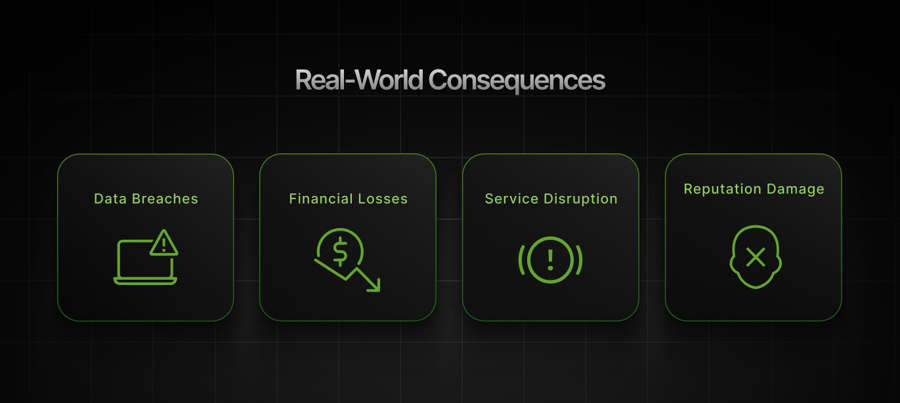
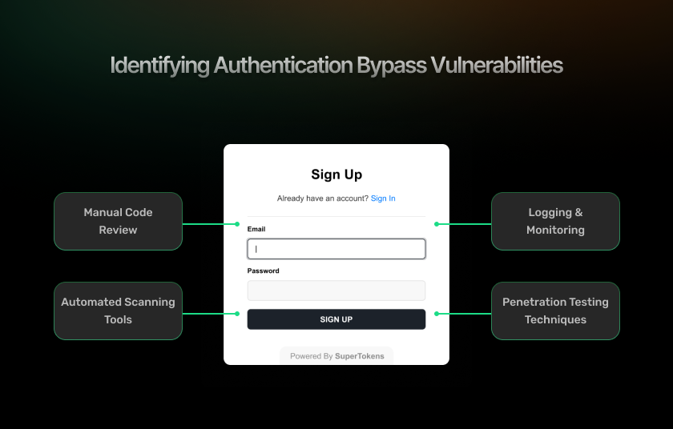

Authentication bypass vulnerabilities are among the most severe security flaws in web applications, enabling attackers to bypass login mechanisms and access sensitive systems without providing valid credentials. This comprehensive guide explores how these attacks occur, reviews real-world examples, and offers actionable strategies to safeguard your applications against such threats.

## **What Is Authentication Bypass and Why Is It Dangerous?**

Authentication bypass lets attackers access protected resources without providing valid credentials&mdash;seemingly simple, but it can cause serious, wide-reaching damage to any system.

### **Definition: Authentication Bypass vs. Authorization Bypass**

Before diving deeper, it\'s important to distinguish between authentication and authorization bypasses:

-   **Authentication bypass** skips identity verification, allowing access without login.
-   **Authorization bypass** lets authenticated users access unauthorized resources (privilege escalation).

Though related, these vulnerabilities have different causes and impacts. This guide focuses on authentication bypass, while acknowledging some overlapping techniques.

### **Risks: The Consequences of Broken Authentication**

When authentication mechanisms fail, several critical security risks emerge:

1.  **Data Exposure**: Sensitive user information or business information becomes accessible.
2.  **Account Takeover**: Attackers can act as legitimate users.
3.  **System Compromise**: Full access may allow further exploitation or damage.
4.  **Regulatory Violations**: Violates data protection standards like [GDPR](https://gdpr-info.eu/), [HIPAA](https://www.cdc.gov/phlp/php/resources/health-insurance-portability-and-accountability-act-of-1996-hipaa.html#:~:text=The%20Health%20Insurance%20Portability%20and,Rule%20to%20implement%20HIPAA%20requirements.), [PCI-DSS](https://www.pcisecuritystandards.org/).

5.  **Loss of Trust**: Breaches lead to user distrust and reputational damage.

### **Real-World Consequences**



The impact of authentication bypass vulnerabilities extends beyond theoretical risks:

-   **Data Breaches**: Weak authentication has led to massive data exposures.
-   **Financial Losses**: Poor authentication can lead to billions in damages. The [**IBM Cost of a Data Breach Report 2024**](https://www.ibm.com/reports/data-breach) shows average breach costs hitting \$4.88M, the highest ever recorded.

-   **Service Disruption**: Incidents often force downtime and service loss.
-   **Reputation Damage**: Trust and brand value suffer from auth failures.

### **OWASP Context: Where Authentication Bypass Fits**

Authentication bypass vulnerabilities align with multiple categories in the [OWASP Top10](https://owasp.org/www-project-top-ten/), most notably:

-   **Broken Authentication** (A2:2017, A07:2021)
-   **Insecure Design** (A04:2021)
-   **Security Misconfiguration** (A05:2021)

The prevalence of these issues in the OWASP Top 10 underscores how common and dangerous authentication bypass vulnerabilities remain,
despite awareness of the risks.

## **Common Causes of Authentication Bypass Vulnerabilities**

Authentication bypass vulnerabilities stem from various errors in design and development. Recognizing these common causes is crucial for
effective prevention.

### **Improper Session Validation**

Many authentication bypasses stem from flawed session management:

-   **Token Verification:** Always validate token authenticity and integrity.
-   **Cookie Checks:** Ensure cookies are securely validated server-side.
-   **Session IDs:** Use strong, unpredictable session identifiers.
-   **Client Storage:** Avoid storing sensitive auth data on the client.

Code snippet showing vulnerable session validation:

```js
// VULNERABLE: No actual validation of the session token
function isAuthenticated(req) {
  return req.cookies.sessionId !== undefined;
}
```

### **Hardcoded Admin Routes or Logic Flaws**

Developers sometimes create shortcuts or backdoors that bypass normal authentication flows:

-   **Backdoors:** Remove temporary dev access before deployment.
-   **Boolean Checks:** Avoid simple flags for critical access control.
-   **Object References:** Always validate permissions for resource access.

Example of a logic flaw in authentication:

```js
// VULNERABLE: Trusting client-provided admin flag
def process_request(request):
    user_data = json.loads(request.body)
    if user_data.get('is_admin', False):
        # Grant admin access based on client-provided value
        return admin_dashboard()
    else:
        return regular_user_view()
```

### **Parameter Tampering**

Manipulating request parameters is a common technique for bypassing authentication:

-   **Hidden Fields:** Avoid relying on hidden inputs for auth control.
-   **Query Strings:** Prevent manipulation of URL parameters in auth logic.
-   **Request Body:** Validate all POST data server-side.
-   **Header Manipulation:** Don\'t trust headers for authentication decisions.

### **Insecure Default Credentials**

Default or test accounts often provide an easy path to authentication bypass:

-   **Default Credentials:** Remove or change factory-set admin logins.
-   **Testing Accounts:** Eliminate predictable dev accounts in production.
-   **Hardcoded Credentials:** Avoid embedding credentials in code or configs.
-   **Backdoor Accounts:** Secure or disable support access points.

### **Missing Authentication on Internal APIs**

A particularly dangerous pattern is assuming certain endpoints don\'t need protection:

-   **Internal APIs:** Never assume internal means secure&mdash;always authenticate.
-   **Admin Interfaces:** Protect all admin panels by using strict authentication.
-   **Dev/Debug Endpoints:** Remove or secure all non-production endpoints.
-   **Legacy Endpoints:** Audit and secure outdated or forgotten APIs.

## **Real-World Authentication Bypass Examples**

Examining real-world examples helps illustrate how these vulnerabilities manifest in practice.

### **Example #1: URL Manipulation Bypasses Login**

URL manipulation is one of the simplest, yet surprisingly common, authentication bypass techniques:

**Vulnerable Scenario:** A web application uses URL parameters to determine access rights. For example:

    https://example.com/dashboard?user=regular

**The Attack:** An attacker simply modifies the URL parameter:

    https://example.com/dashboard?user=admin

**What Went Wrong:** The application trusted client-provided parameters without verification. The server code might look something like:

```js
// VULNERABLE: Trusting URL parameters for authentication
app.get('/dashboard', (req, res) => {
  if (req.query.user === 'admin') {
    // Show admin dashboard
    return res.render('admin-dashboard');
  } else {
    // Show regular dashboard
    return res.render('user-dashboard');
  }
});
```

**The Fix:** Authentication should be based on server-validated session data, not client-provided parameters:

```js
// SECURE: Using server-side session data
app.get('/dashboard', (req, res) => {
  // Check if user is authenticated
  if (!req.session.userId) {
    return res.redirect('/login');
  }
 
  // Get user role from database based on authenticated session
  const userRole = getUserRoleFromDatabase(req.session.userId);
 
  if (userRole === 'admin') {
    return res.render('admin-dashboard');
  } else {
    return res.render('user-dashboard');
  }
});
```

### **Example #2: JSON Web Tokens Tampering**

JSON Web Tokens (JWTs) are commonly used for authentication, but improper implementation can lead to bypasses:

**Vulnerable Scenario:** Roles stored in JWT payload.

**The Attack:** An attacker decodes the JWT, modifies the payload to change their role from \"user\" to \"admin\," and then uses the modified token:

Original JWT payload:

```json
{
  "sub": "1234567890",
  "name": "John Doe",
  "role": "user",
  "iat": 1516239022
}

```
Modified JWT payload:

``` json
{
  "sub": "1234567890",
  "name": "John Doe",
  "role": "admin",
  "iat": 1516239022
}
```

**What Went Wrong:** The application either:

1.  Failed to verify the JWT signature, allowing tampered tokens to be accepted.
2.  Used an insecure \"none\" algorithm.
3.  Had its signing key leaked or was using a weak key.

Vulnerable code might look like:

```js
// VULNERABLE: Not verifying JWT signature
function getUser(token) {
  const payload = token.split('.')[1];
  const decodedPayload = Buffer.from(payload, 'base64').toString();
  return JSON.parse(decodedPayload);
}
```

**The Fix:** Proper JWT handling includes signature verification and secure algorithms:

```js
// SECURE: Using a library to validate JWT
const jwt = require('jsonwebtoken');


function getUser(token) {
  try {
    const verified = jwt.verify(token, SECRET_KEY, {
      algorithms: ['RS256']
    });
    return verified;
  } catch (error) {
    // JWT validation failed
    return null;
  }
}
```

### **Example #3: Insecure Mobile App API**

Mobile applications frequently have authentication vulnerabilities due to the assumption that API endpoints won\'t be directly accessed:

**Vulnerable Scenario:** Some endpoints lack proper server-side authentication.
**The Attack:** Attacker intercepts traffic, finds unprotected endpoint,
and manipulates requests.
**What Went Wrong:** Developers relied on security through obscurity, assuming that because an endpoint was only called from the mobile app, it didn\'t need server-side authentication checks:

``` js
# VULNERABLE: Endpoint missing authentication check
@app.route('/api/user_data')
def get_user_data():
    user_id = request.args.get('user_id')
    # No authentication check before retrieving potentially sensitive data
    return jsonify(get_data_for_user(user_id))

```

**The Fix:** Every API endpoint needs proper authentication validation:

```js
# SECURE: Authentication middleware applied to all API routes
@app.route('/api/user_data')
@require_authentication
def get_user_data():
    # Current user is determined from authenticated session, not parameters
    user_id = get_authenticated_user_id(request)
    return jsonify(get_data_for_user(user_id))

```

### **Lessons Learned**

These examples highlight several important lessons:

1.  Never trust client input; always validate server-side.
2.  Server-side verification is essential.
3.  Centralize authentication logic.
4.  Use a defense-in-depth strategy, with multiple verification layers.

## **How to Detect Authentication Bypass Vulnerabilities**



Identifying authentication bypass vulnerabilities requires a multi-faceted approach that combines human expertise and automated tools.

### **Manual Code Review**

Code review remains one of the most effective ways to identify authentication vulnerabilities:

-   **Flow Analysis:** Trace authentication steps to find bypass points.
-   **Pattern Recognition:** Identify vulnerable access control patterns.
-   **Logic Review:** Examine conditions controlling resource access.
-   **Credential Search:** Detect hardcoded or default credentials in code and configs.

### **Automated Scanning Tools**

Several tools can help detect authentication vulnerabilities:

-   **OWASP ZAP:** Free tool for detecting web app vulnerabilities, including auth issues.
-   **Burp Suite:** Leading security tool with modules for authentication testing.
-   **Static Application Security Testing (SAST)**: Code analysis tools like SonarQube and Checkmarx find auth flaws pre-deployment.
-   **Dynamic Application Security Testing (DAST)**: Tools that simulate attacks on live apps, to identify vulnerabilities.

### **Logging and Monitoring**

Proper logging and monitoring can help detect attempted or successful authentication bypasses:

-   **Failed Attempts:** Monitor failed logins for brute-force signs.
-   **Access Patterns:** Detect unusual resource access behaviors.
-   **Session Anomalies:** Identify irregular session activities.
-   **Log Reviews:** Analyze logs for auth-related errors and bypass indicators.

### **Penetration Testing Techniques**

Professional penetration testing can identify authentication bypasses that automated tools might miss:

-   **Fuzzing Endpoints:** Test input variations to expose auth edge cases.
-   **Replay and Modify:** Capture and alter valid requests to test security.
-   **Token Analysis:** Evaluate tokens for predictability and leaks.
-   **Flow Manipulation:** Attempt to bypass steps in multi-factor authentication.

## **Preventing Authentication Bypass in Web Applications**

Implementing strong prevention measures is essential for protecting against authentication bypass vulnerabilities.

### **Always Validate Authentication Server-Side**

Client-side validation is never sufficient for security:

-   **Never Trust Client:** Always validate client data on the server.
-   **Full Verification:** Confirm complete authentication state, not just tokens.
-   **Deep Checks:** Verify tokens are valid, signed, unexpired, and user-specific.

Example of proper server-side authentication validation:

```js
// SECURE: Complete server-side validation
async function authenticate(req, res, next) {
  const token = req.headers.authorization?.split(' ')[1];
 
  if (!token) {
    return res.status(401).json({ error: 'Authentication required' });
  }
 
  try {
    // Verify token signature and expiration
    const decoded = jwt.verify(token, SECRET_KEY);
   
    // Check if token has been revoked
    const isRevoked = await checkTokenRevocationStatus(token);
    if (isRevoked) {
      return res.status(401).json({ error: 'Token revoked' });
    }
   
    // Add user info to request for later use
    req.user = decoded;
    next();
  } catch (error) {
    return res.status(401).json({ error: 'Invalid authentication' });
  }
}
```

### **Centralize Access Control Logic**

Fragmented authentication checks lead to inconsistencies and
vulnerabilities:

-   **Authentication Middleware:** Use middleware for all protected routes.
-   **Single Source of Truth:** Centralize authentication logic.
-   **Consistent Application:** Apply the same verification everywhere.
-   **Framework Support:** Use built-in authentication features.

Example of centralized authentication middleware:

```js
// Express.js example of centralized authentication middleware
const express = require('express');
const app = express();


// Define authentication middleware once
function requireAuth(req, res, next) {
  // Authentication logic here
  if (!isAuthenticated(req)) {
    return res.status(401).redirect('/login');
  }
  next();
}


// Apply to all routes that need protection
app.get('/dashboard', requireAuth, dashboardController);
app.get('/profile', requireAuth, profileController);
app.get('/settings', requireAuth, settingsController);


// Or protect entire route groups
const protectedRoutes = express.Router();
protectedRoutes.use(requireAuth);
protectedRoutes.get('/dashboard', dashboardController);
protectedRoutes.get('/profile', profileController);
// Add protected routes...
app.use(protectedRoutes);

```

### **Use Frameworks with Built-in Authentication Middleware**

Don\'t reinvent the wheel when secure options already exist:

-   **Express and Passport:** Robust auth middleware solutions for Node.js.
-   **Django Auth:** Comprehensive, secure built-in system.
-   **Spring Security:** Powerful auth for Java applications.
-   **Laravel Sanctum/Fortify:** Lightweight, secure Laravel solutions.

These frameworks have been extensively tested and continuously updated
to address new vulnerabilities.

### **Enforce Principle of Least Privilege**

Always provide the minimum access necessary:

-   **Default Deny:** Treat all users as unauthenticated until verified.
-   **Explicit Role Checks:** Verify roles for every protected action.
-   **Resource-Level Control:** Enforce access at the resource, not just route level.
-   **Contextual Auth:** Factor in context like time, IP, and device for authorization.

### **Implement Strong Session Management**

Proper session handling is critical for preventing authentication bypasses:

-   **Token Expiry:** Set short-lived expiration times for authentication tokens.
-   **Token Rotation:** Rotate refresh tokens upon each use to enhance security.
-   **Secure Storage:** Ensure secure storage of session data on both client and server.
-   **Invalidation Mechanisms:** Implement methods to invalidate all sessions when needed (e.g., after password changes or incidents).
-   **Anomaly Monitoring:** Monitor and flag unusual session activity to detect potential threats.

## **How SuperTokens Prevents Authentication Bypass**


[SuperTokens](https://supertokens.com/) is an open-source authentication solution designed to help developers implement secure
authentication without common vulnerabilities.

### **Centralized Authentication Middleware**

SuperTokens wraps your Express (or other) app in a single middleware layer that enforces session validation on every protected route,
eliminating ad-hoc checks.

```js
// Express.js + SuperTokens
import express from "express";
import supertokens from "supertokens-node";
import { middleware } from "supertokens-node/framework/express";
import Session from "supertokens-node/recipe/session";


supertokens.init({
  appInfo: {
    appName: "YourApp",
    apiDomain: "https://api.yourapp.com",
    websiteDomain: "https://yourapp.com",
  },
  recipeList: [Session.init()],
});


const app = express();
app.use(middleware());

// All protected routes require authentication
app.get("/protected-api", Session.verifySession(), (req, res) => {
  res.json({ message: "You are authenticated!" });
});

```

This ensures that every request passes through SuperTokens' centralized checks, preventing routes from being accidentally left unprotected.

### **Robust Session and Token Handling**

-   Cryptographically signed JWTs with strong algorithms
-   Automatic key rotation for fresh signing keys
-   Token blacklisting/revocation support
-   Built-in CSRF protection on refresh flows

By handling signing, expiry, and CSRF in a battle-tested library, SuperTokens removes common pitfalls that lead to bypass.

### **Role-Based Access Control (RBAC)**

SuperTokens stores roles in the session and enforces them server-side:

```js
import { verifySession } from "supertokens-node/recipe/session/framework/express";
import { SessionRequest } from "supertokens-node/framework/express";


function requireAdmin(req: SessionRequest, res, next) {
  const roles = req.session.getRoles();
  if (!roles.includes("admin")) {
    return res.status(403).json({ error: "Admin access required" });
  }
  next();
}


app.get("/admin-panel", verifySession(), requireAdmin, (req, res) => {
  res.json({ message: "Admin panel data" });
});

```

This removes ad-hoc role checks scattered throughout your code and prevents any client-side manipulation of roles.

### **Secure JWT Signing and Validation**

SuperTokens uses modern algorithms (e.g., RS256), validates signatures, checks expirations, and supports token revocation and claim
validation&mdash;all out of the box.

### **Developer-Friendly Security Defaults**

-   Secure defaults for cookies, headers, and session lifetimes
-   Pre-built UI components for login and signup
-   TypeScript support with full typing
-   Clear documentation and examples

**These reduce the chance of misconfiguration that could otherwise lead to bypass**

## **Bonus: Tips for Secure Authentication Design**

### **1. Treat All Endpoints as Public**

Apply the same authentication middleware to every route, rather than relying on naming conventions or hidden URLs.

### **2. Separate Authentication from Authorization**

```js
async function getDocument(req, res) {
  if (!req.isAuthenticated()) {
    return res.status(401).json({ error: "Authentication required" });
  }
  const documentId = req.params.id;
  const userId = req.user.id;
  const hasAccess = await checkUserDocumentAccess(userId, documentId);
  if (!hasAccess) {
    return res.status(403).json({ error: "Access denied" });
  }
  const document = await getDocumentById(documentId);
  res.json(document);
}

```

### **3. Never Trust the Frontend**

Validate all permissions and inputs on the server, because hidden form fields or JS flags can be manipulated.

### **4. Implement Rate Limiting**

```js
const rateLimit = require("express-rate-limit");


const loginLimiter = rateLimit({
  windowMs: 15 * 60 * 1000, // 15 minutes
  max: 5,                    // 5 attempts per window
  message: "Too many login attempts. Try again later.",
});


app.post("/login", loginLimiter, handleLogin);

```

### **5. Regularly Audit Your APIs**

Maintain an inventory of routes, run automated security scans (SAST/DAST), and conduct periodic reviews.

## **Summary: Avoiding Authentication Bypass the Right Way**

Authentication bypass vulnerabilities remain a critical security risk for modern applications. They allow attackers to circumvent login checks entirely, potentially gaining unauthorized access to sensitive functionality and data.

**These vulnerabilities typically stem from common mistakes:**

-   Improper validation of session tokens or credentials
-   Reliance on client-side security controls
-   Logic flaws in authentication flows
-   Hardcoded credentials or backdoors
-   Missing authentication checks on \"internal\" endpoints

**To protect your applications:**

1.  Use trusted libraries (e.g., **SuperTokens**) for centralized authentication.
2.  Always validate on the server side.
3.  Layer security beyond just login.
4.  Manage sessions securely with proper token handling.
5.  Regularly test and update authentication mechanisms.

By understanding authentication bypass and applying preventive measures, you can greatly reduce unauthorized access risks and safeguard user data.

***Remember, authentication security demands ongoing vigilance, testing, and continuous improvement to stay ahead of evolving threats.***
