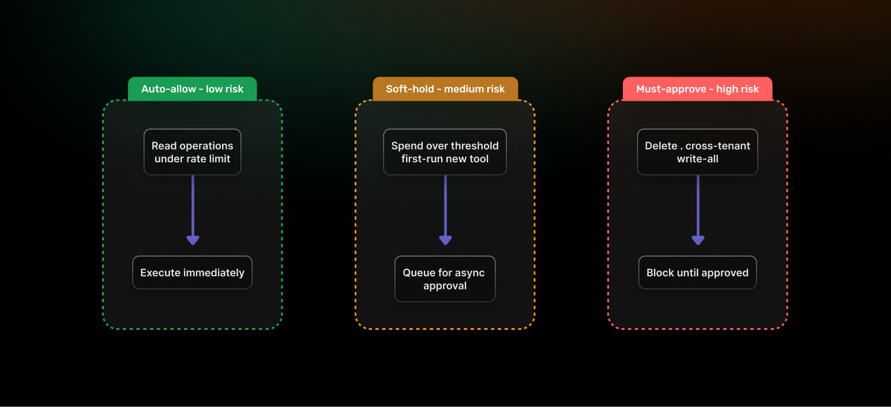

AI agents are no longer experimental. Production systems today delegate real action, such as sending emails, committing code, and modifying records, to autonomous runtimes that chain tool calls without pausing for confirmation. That shift introduces authentication challenges that classic OAuth and session models were never designed to handle.

This post maps the full authentication blueprint for AI agent systems: who the principals are, how tokens flow across trust boundaries, where policy enforcement must sit, and when a human must approve before execution continues.

## What Changes When the "User" Is an Agent?

### **Principles and Boundaries**

Four distinct actors exist in a typical agentic system:

-   **End-user**: The human who initiates a task.
-   **Application backend**: The service that authenticates the user and spawns the agent.
-   **Agent runtime**: The LLM-backed process that plans and executes steps.
-   **Tool servers**: APIs or microservices the agent calls to perform real-world actions.

Each actor has its own identity, and each boundary between them is a potential trust gap.

### **Risk Deltas Versus Classic Applications**

Classical web applications execute deterministic code paths. Agents do not. The primary new risks are:

-   **Tool chaining**: An agent may call ten tools in sequence; a compromise at step three poisons all downstream steps.
-   **Unbounded actions**: Without explicit scope limits, an agent granted "write" access may write far more than intended.
-   **Prompt injection**: Malicious content in tool outputs can hijack agent behavior mid-session.
-   **Data exfiltration**: An agent with read access to sensitive data and outbound tool access can leak it with trivial ease.

### **Blast Radius and Least-Privilege**

Because agents act autonomously, the blast radius of a misconfigured permission is orders of magnitude larger than a misconfigured human-facing role. Scope narrowing is not optional: it is the primary control.

**Minimal sequence diagram:**

```js
End-User → App Backend: authenticate (OIDC/OAuth)
App Backend → Agent Runtime: spawn(session_token, scopes=[narrow])
Agent Runtime → Tool Server A: call(capability_token_A)
Agent Runtime → Tool Server B: call(capability_token_B)
Tool Server → Policy Engine: evaluate(actor, action, resource)
Policy Engine → Tool Server: allow | deny
```

## Core Architecture: Identity, Sessions, and Scopes

### **Workspace and Tenant Model**
Each agent identity should be scoped to a single tenant or organization. An agent operating inside Org A must never present credentials that are valid inside Org B. Org IDs must be encoded into every token, every log line, and every policy evaluation. Cross-tenant isolation is not a nice-to-have; it is the foundational invariant.

### **Session Tiers**

A healthy architecture separates session lifetimes into two tiers:

1. **Long-lived user session**: Issued at login; backed by refresh tokens; hours to days in TTL.
2. **Short-lived agent session**: Derived from the user session at task start; minutes in TTL; non-refreshable by design.

Agent sessions should expire when the task completes or when the wall-clock TTL expires, whichever comes first.

### **Scope Inheritance**

Scopes flow strictly downward. A user token carrying `repo:read` can produce an agent token carrying `repo:read`, but never `repo:write.` An agent token can produce a per-tool capability token carrying an even narrower scope. The rule is: **only narrow, never widen.**

## Token Strategy That Actually Works

### **Token Types**

| Token Type           | Issued To       | Audience           | Rotation                 |
|----------------------|-----------------|--------------------|--------------------------|
| User access token    | End-user        | App backend        | On refresh               |
| Agent session token  | Agent runtime   | Agent runtime      | Per task                 |
| Capability token     | Agent → Tool    | Specific tool server     | Per call or per minute   |

### **Sender-Constrained Tokens**

Standard bearer tokens can be replayed if intercepted. Sender-constrained tokens bind a token to the entity presenting it. Two
standard mechanisms exist:

- **DPoP (Demonstrating Proof-of-Possession)**: The agent signs each request with a private key; the token is only valid when accompanied by a matching proof JWT.
- **MTLS (Mutual TLS)**: The client certificate is bound to the token; the server verifies the certificate at the transport layer.

DPoP is generally preferred for agent-to-tool communication because it works over standard HTTPS without requiring certificate infrastructure at every tool server.

### **Token Exchange and Downgrades**

Use RFC 8693 (OAuth 2.0 Token Exchange) to derive capability tokens from agent session tokens. Key rules:

- **Audience restriction**: Each capability token is valid for exactly one tool server.
- **TTL**: Capability tokens should expire in 60--300 seconds.
- **Break-glass flows**: Emergency elevated access should require explicit re-authentication, not scope widening on existing tokens.

## Tool Permissions as Policy (RBAC/FGA)

### **Modeling Tools as Resources**

Every tool call maps to a structured permission check:

```js
subject: agent-id / tenant-id                                         
action: github.issues.label                                           
resource: repo:acme-org/payments-service                              
```

Verbs, resource IDs, and any contextual constraints (time of day, rate limits, spend thresholds) are all inputs to the policy engine.

### **RBAC Versus Relationship-Based Access Control**

RBAC (role-based access control) is sufficient when tool access maps cleanly to a small number of roles. It fails when:

- Access depends on the relationship between the agent and a specific resource instance.
- Permissions vary per tenant, per data owner, or per environmental condition.

In those cases, fine-grained authorization (FGA) systems such as OpenFGA or AWS Cedar evaluate relationship graphs rather than flat role assignments.

### **Evaluate at the Tool Server**

Policy must be evaluated by the tool server or a sidecar policy engine immediately adjacent to it. Evaluating policy inside the LLM prompt is not a security control; it is advisory text that a sufficiently crafted prompt can override. The tool server must return a structured `allow` or `deny` response with a reason code, regardless of what the agent was told to do.

**Minimal policy schema:**

```js
{
"subject": "agent:a1b2/tenant:acme",
"action": "github.issues.label",
"resource": "repo:acme/payments",
"decision": "allow",
"reason": "policy:triage-agent-v2"
}
```

## Human-in-the-Loop Where It Matters



### **Approval Triggers**

Not every action requires human approval. A risk-scoring layer should route requests into one of three buckets:

| **Ruleset**    | **Example Condition**                   | **Outcome**                         |
|----------------|-----------------------------------------|-------------------------------------|
| Auto-allow     | Read-only ops under rate limit          | Execute immediately                 |
| Soft-hold      | Spend > $10, first run of new tool      | Queue for async approval            |
| Must-approve   | Delete op, cross-tenant data access     | Block until explicit approval       |

### **UX Patterns**

- **Inline approve/deny:** Push a notification to the authorizing user with full context; single-click decision.
- **Time-boxed holds:** If no approval arrives within N minutes, the agent abandons the task and notifies the user.
- **Bulk approvals:** For high-frequency agents, allow pre-approval of a category of actions within a session.

### **Evidence and Audit Capture**

Every approval or denial must be stored with: agent ID, tenant ID, action, resource, a hash of the input parameters, the approver identity, and a timestamp. This record is the chain of custody if an action is disputed later.

## Secrets, Data Boundaries, and Prompt-Safe Design

### **No Secrets in Prompts**

API keys, database credentials, and tokens must never appear in the agent's context window. The correct pattern is: the agent calls a tool; the tool server fetches the secret from a vault and uses it server-side. The agent receives only the result.

### **Minimize Data in Context**

- Apply field-level masking before injecting query results into the prompt.
- Redact PII (emails, phone numbers, account numbers) unless the task explicitly requires them.
- Use allow-list field filters at the tool server, not inside the prompt.

### **Output Validation**

Before any agent-generated content is committed to a downstream system, validate it against a strict schema. Reject outputs that contain unexpected fields, executable content, or values outside allowed ranges.

**Anti-patterns to avoid:**

- Passing raw database rows into the prompt without redaction.
- Using the LLM's own output as a policy decision.
- Granting an agent a "super" token and filtering in-prompt.
- Logging full prompt content, including injected secrets.

## Observability and Audit You'll Actually Use

### **Per-Tool Logs**

Every tool invocation should produce a structured log event containing:

- `actor` (agent ID + tenant ID)
- `scope` presented
- `action` and `resource`
- SHA-256 hash of input parameters
- SHA-256 hash of output
- Policy decision + reason code
- Latency and status

### **Distributed Tracing**

Propagate a shared `trace-id` and `span-id` from the frontend through the backend, into the agent runtime, and into every tool server call. This makes it possible to reconstruct the full execution chain of a multi-step task in a single trace view. OpenTelemetry is the standard instrumentation layer for this.

### **Alerting**

Configure alerts on:

- Deny rate spike (>X denials/minute per tenant)
- Approval backlog (holds older than N minutes)
- Spend anomaly (agent cost >Y per hour)
- Unusual tool access patterns (new tool called for the first time in production)

## Threat Models and Practical Mitigations

| **Threat**                    | **Control**                                                                 |
|-------------------------------|-----------------------------------------------------------------------------|
| Prompt injection via tool output | Sanitize tool outputs; treat them as untrusted data, not instructions.      |
| Tool abuse / scope escalation | Allow-list tools per agent role; enforce at tool server.                     |
| Supply chain compromise       | Sign dependencies; maintain SBOMs; use runtime isolation (containers/VMs).  |
| SSRF via agent-initiated HTTP calls | Egress allow-list on agent runtime network; block RFC 1918 ranges.     |
| Data exfiltration             | Content filters on outbound tool calls; canary data in sensitive datasets.  |
| Token replay                  | DPoP or MTLS on all agent-to-tool calls.                                     |
| Cross-tenant data access      | Tenant ID in every token claim; policy engine enforces isolation.           |

## Reference Implementation with SuperTokens


### **Sessions and Claims**

[SuperTokens](https://supertokens.com/) supports custom session claims. Encode the following into the agent session payload:

```json
{
 "sub": "user:u123",
  "agent_id": "agent:a456",
  "tenant_id": "acme",
  "scopes": ["github.issues.read", "github.issues.label"],
  "task_id": "task:t789",
  "exp": 1700000300
}
```

### **Capability Token Issuance (Pseudocode)**

```python
# Issue a short-lived capability token for one tool
def issue_capability_token(agent_session, tool_audience):
    claims = {
        "sub": agent_session["agent_id"],
        "tenant": agent_session["tenant_id"],
        "aud": tool_audience,  # e.g. "tool:github-triage"
        "scopes": narrow_scopes(  # only scopes valid for this tool
            agent_session["scopes"], tool_audience
        ),
        "exp": now() + 120  # 2-minute TTL
    }
    return sign_jwt(claims, private_key)
```

### **DPoP Validation at the Tool Server (Pseudocode)**

```python
def validate_dpop_request(http_request):
    proof = parse_dpop_proof(http_request.headers["DPoP"])
    token = parse_bearer_token(http_request.headers["Authorization"])

    assert proof["htu"] == http_request.url
    assert proof["htm"] == http_request.method
    assert token["cnf"]["jkt"] == thumbprint(proof["jwk"])

    assert not replay_cache.seen(proof["jti"])
    replay_cache.add(proof["jti"], ttl=120)

    return evaluate_policy(token)
```

### **Policy Evaluation (Pseudocode)**

```python
def evaluate_policy(token):
    decision = policy_engine.check(
        subject=token["sub"],
        tenant=token["tenant"],
        action=current_action(),
        resource=current_resource(),
        scopes=token["scopes"]
    )

    audit_log(token, decision)

    return decision  # allow | deny + reason
```

## Example Build: "GitHub Triage" Agent (End-to-End)

### **Allowed Actions**

The triage agent may apply labels, assign issues, and post comments. It may not delete issues, push code, or modify repository settings. These boundaries are encoded in the capability token scopes, not in the system prompt.

### **Policy Configuration**

```yaml
# triage-agent-policy.yaml
agent: github-triage
tenant_scope: per_org

allowed_actions:
  - github.issues.label
  - github.issues.assign
  - github.issues.comment

rate_limits:
  per_hour: 200
  business_hours_only: false

hitl_triggers:
  - action: github.issues.move_repo
    ruleset: must-approve
  - cost_usd_per_task: 5.00
    ruleset: soft-hold
```

### **Sample Audit Log (Deny Event)**

```json
{
  "event": "tool_call_denied",
  "agent_id": "agent:triage-01",
  "tenant_id": "acme",
  "action": "github.issues.delete",
  "resource": "repo:acme/payments#441",
  "reason": "action_not_in_allow_list",
  "trace_id": "4bf92f3577b34da6",
  "timestamp": "2025-11-01T14:23:07Z"
}
```

## Rollout Plan and Guardrails

### **Promotion Phases**
| **Phase**   | **Capability**                                | **Exit Criteria**                          |
|-------------|-----------------------------------------------|--------------------------------------------|
| Dev         | Full access in an isolated sandbox            | Zero policy violations in 48h             |
| Shadow      | Live traffic; all actions logged but not executed | Deny rate < 1%                         |
| Read-only   | Read operations only in production            | Stable for 5 business days                 |
| Partial write | Writes to low-risk resources; HITL on all others | Approval rate < 20%                    |
| Full write  | Full-scoped write access; HITL on high-risk only | Deny rate stable; no anomalies        |

### **Metrics to Track**

- Approval rate (target: trending toward zero for routine ops)
- Deny rate (spikes indicate policy gaps or attack activity)
- MTTR for stuck approvals (SLA: under 30 minutes during business hours)

### **Kill Switches**

Every agent deployment should have a per-tenant circuit breaker (disable one tenant's agent without affecting others), a feature flag (disable globally in under 30 seconds), and a hard cost cap (agent halts if cumulative spend exceeds threshold within a rolling window).

## Compliance and Data Residency

### **PII in Prompts and Outputs**

Log the minimum necessary. Hash or truncate PII in audit logs. Define retention windows per data class, for example, 30 days for tool invocation metadata, 7 days for prompt/response hashes, and immediate deletion for any inadvertently logged credentials.

### **Residency Tags**

Attach a `data_region` claim to every agent session. Route token issuance, key storage, and audit log writes to region-specific infrastructure. Encryption keys should never leave their designated region.

### **Access Reviews**

Conduct quarterly reviews of all agent scopes and capability token definitions. Flag any scope that has not been exercised in 90 days as a candidate for removal. Automated scope-usage reporting from audit logs makes this tractable.

## Implementation Checklist

**Identity and Tokens**

- Tenant-scoped identity + short-lived tokens
- Capability tokens per tool (audience-restricted)
- DPoP/MTLS for secure calls + RFC 8693 exchange
- Re-auth required for break-glass

**Policy and HITL**

- Tools as resources; policy enforced at tool server
- RBAC/FGA for access control + risk-based routing
- Approval flow with context, timeouts, and audit logs

**Observability**

- Structured logs + end-to-end trace IDs
- Alerts (denies, backlog, anomalies) + key dashboards

**Threats and Controls**

- Sanitize tool outputs + enforce allow-lists
- Signed dependencies + restricted network egress
- Content filters + replay protection

## FAQs

- **Do I need DPoP if I'm already using MTLS?** No. MTLS is enough if you already have a certificate infrastructure. DPoP is a simpler alternative without full PKI. Both solve token replay and theft.
- **Should agents share user tokens or get their own?** Agents must have their own tokens. Sharing user tokens breaks security, auditability, and revocation control.
- **How do I sandbox tools that call the internet?** Use a network allow-list. Block all outbound traffic by default, allow only required domains, and filter requests/responses to prevent SSRF and data leaks.
- **What is the simplest HITL pattern to start with?** Use a cost threshold. If a task exceeds a set limit, pause and ask for user approval.

## CTA

**Try the sample app:** A reference implementation of agent-safe authentication by using SuperTokens, complete with scoped capability tokens, DPoP proof validation, HITL approval hooks, and a structured audit trail is available as a runnable repository. It demonstrates every pattern covered in this post in a single deployable stack.

**Book 30-minute office hours:** Teams designing agent authentication architectures from scratch can schedule a design review session to walk through token strategy, policy modeling, and HITL trigger configuration for their specific use case.

The patterns described in this post, scoped capability tokens, sender-constrained transport, tool-server policy enforcement, and evidence-backed approvals, are the minimum viable security posture for any AI agent operating in a production environment with real data and real consequences.
