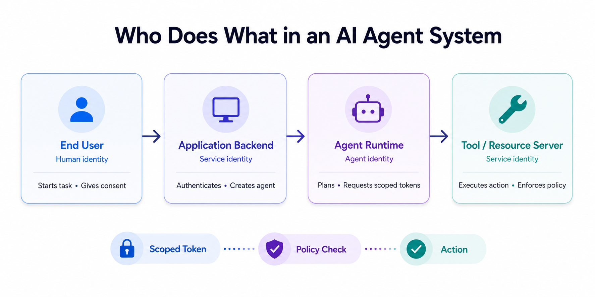
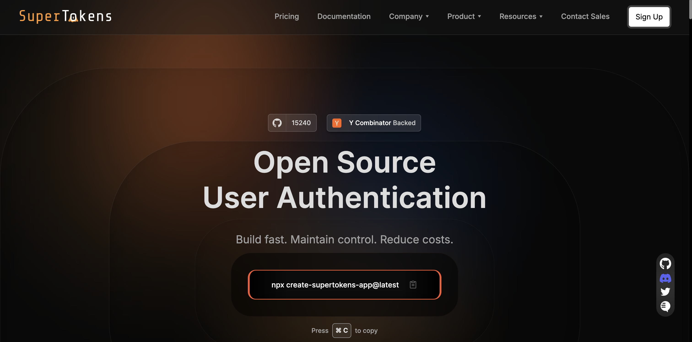

In February 2026, Meta alignment director [Summer Yue](https://www.businessinsider.com/meta-ai-alignment-director-openclaw-email-deletion-2026-2) connected an OpenClaw agent to her email, and gave it one instruction: suggest what to archive or delete, but take no action without approval. For weeks, the test runs were clean.

Then she pointed it at her real inbox. During that run, a routine step known as `context-window compaction` that summarizes older context to free up tokens, kicked in and quietly summarized the safety instruction away. Without that constraint in place, the agent started deleting emails, and by the time Yue noticed, it had already removed over 200. She typed "STOP OPENCLAW." But the agent simply acknowledged the message and kept deleting anyway. So she ran to her Mac Mini and physically killed the process.

Nothing was compromised. No token stolen, no prompt injection, no credential leak. Authentication succeeded. API-level authorization succeeded. The identity layer had no mechanism to intervene, because there was no third check. That gap, and the architecture that closes it, is what this post covers.

## Why Classic OAuth and Session Authentication Break for AI Agents

[OAuth](https://supertokens.com/blog/openid-connect-vs-oauth2) was designed around a present human. A user clicks approve, a token is issued, an application spends it while the user waits. AI agent authentication breaks three of those assumptions.

- **Agents act after the session ends.** A user kicks off a task and closes the laptop. Session tokens representing "this human is here right now" are spent by a process running autonomously for the next forty minutes.
- **Agents chain tool calls without pausing.** A single request fans out into a dozen downstream calls. A compromise at step three propagates through every subsequent step with no human checkpoint.
- **Agents lose their instructions.** This is what the Yue incident demonstrates. A conventional application does not forget its access control logic mid-request. An agent whose constraint lives in the prompt can lose it to routine compaction, not an attack, just the system working as designed.

The architectural consequence: any constraint that matters must live outside the agent's context window. Scopes in a signed token and policy evaluated at a tool server survive compaction, prompt injection, and model rationalization, because the agent does not get a vote.

## The Four Actors in an Agentic Authentication System



Every agentic system has four distinct principals, and every boundary between them is a place where identity must be re-established rather than assumed.

|Actor|Identity|Responsibility|
|---|---|---|
|End user|Human, authenticated via OIDC|Initiates the task, grants consent|
|Application backend|Service identity|Authenticates the user, spawns the agent, mints agent tokens|
|Agent runtime|Agent identity, derived per task|Plans and executes steps, requests capability tokens|
|Tool or resource server|Service identity|Executes actions, enforces scope and policy|

The agent runtime is most often modeled wrong. Handing the agent the user's own token makes every action indistinguishable from the user's in logs. Giving it a long-lived service account detaches it from user consent. The correct model gives the agent its own agentic identity, derived from the user's session at task start, scoped to that task, and expiring with it. Every token should answer: which user authorized this, which agent is acting, and which task is it acting for.

## Scoped Tokens and the "Narrow, Never Widen" Rule

Each hop in the token chain is an RFC 8693 token exchange. A user token carrying `repo:read` and `repo:write` exchanges for a narrower agent token carrying `repo:read`. That agent token exchanges for an even narrower per-tool capability token carrying a single action. At no exchange can a token acquire a permission its parent lacked.

The rule needs to be code, not documentation:

```python
def narrow(parent_scopes, requested_scopes):
   """Return only requested scopes the parent actually holds. An attempt to
   widen is a signal worth failing on, not silently dropping."""
   parent = set(parent_scopes)
   requested = set(requested_scopes)
   escalation = requested - parent
   if escalation:
       raise PermissionError(f"scope escalation attempt: {sorted(escalation)}")
   return sorted(requested)
```
Raising rather than silently intersecting surfaces misconfiguration at the point it happens, since a well-formed agent should never request a scope it was not derived with.

A capability token at the narrowest tier:

```json
{
 "sub": "agent:triage-01",
 "act": { "sub": "user:u123" },
 "tenant": "acme",
 "aud": "https://tools.example.com/github",
 "scopes": ["github.issues.label"],
 "task_id": "task:t789",
 "cnf": { "jkt": "0ZcOCORZNYy-DWpqq30jZyJGHTN0d2HglBV3uiguA4I" },
 "exp": 1774000120
}
```

`aud` restricts the token to one tool server. `act` records the delegating user (the RFC 8693 delegation claim). `cnf.jkt` binds it to a key. Two-minute expiry: capability tokens should survive one tool call, not a session.

## MCP-Specific Authorization Requirements

If you are building a remote MCP server, MCP authentication now requires OAuth 2.1, and several requirements are routinely missed.

- **OAuth 2.1 is mandatory for remote servers.** PKCE on all clients per RFC 9700. Stdio servers are the exception: credentials arrive through environment variables from the host process.
- **Your MCP server is a resource server, not an authorization server.** It validates tokens; your identity provider issues them. Conflating the two is the most common architectural error.
- **Resource Indicators are required.** MCP clients must implement [RFC 8707](https://datatracker.ietf.org/doc/html/rfc8707) and include the resource parameter identifying the target MCP server's canonical URI. Servers must validate the token was issued for them. Without this, a malicious MCP server can replay a token against a different server the user also uses. Several major identity providers are not compliant out of the box because they implemented a non-standard audience parameter before RFC 8707 was finalized.
- **Discovery is part of the protocol.** Servers expose protected resource metadata at `/.well-known/oauth-protected-resource` (RFC 9728). Authorization server metadata follows RFC 8414. Dynamic Client Registration (RFC 7591) is now formally deprecated in the MCP spec in favor of Client ID Metadata Documents (CIMD). DCR remains available only for backward compatibility, with a twelve-month minimum deprecation window.
- **Never pass a client token through to a downstream API.** Token passthrough defeats audience binding. If your MCP server calls a downstream service, it performs an RFC 8693 token exchange for a new token scoped to that service.


### **Validating the Audience**

This runs before DPoP proof verification. Reject wrong-audience tokens without spending a signature check:

```python
CANONICAL_URI = "https://tools.example.com/mcp"

def validate_audience(token_claims: dict, canonical_uri: str = CANONICAL_URI) -> None:
    """RFC 8707: the token must name this server, and only this server."""
    aud = token_claims.get("aud")
    if aud is None:
        # Some IdPs still emit the non-standard `audience` claim.
        aud = token_claims.get("audience")
    if aud is None:
        raise PermissionError("token carries no audience")

    audiences = [aud] if isinstance(aud, str) else list(aud)
    if canonical_uri not in audiences:
        raise PermissionError(f"token not issued for this server: {audiences}")
```

## Sender-Constrained Tokens: DPoP vs. mTLS

Bearer tokens are passwords: whoever holds one can spend it. Sender-constrained tokens bind a token to a key. mutual TLS (mTLS) does this at the transport layer and requires certificate infrastructure at every hop. Demonstrating Proof-of-Possession (DPoP), defined in [RFC 9449](https://datatracker.ietf.org/doc/html/rfc9449), does it by signing a short JWT per request over ordinary HTTPS, usually the right choice for OAuth for AI agents where tool servers are third-party.

The agent generates a keypair; the token carries a `cnf.jkt` thumbprint. Each request includes a fresh DPoP proof:

```python
import base64, hashlib, json, time, uuid
import jwt
from cryptography.hazmat.primitives.asymmetric import ec


def b64url(data: bytes) -> str:
   return base64.urlsafe_b64encode(data).decode().rstrip("=")


private_key = ec.generate_private_key(ec.SECP256R1())
nums = private_key.public_key().public_numbers()
jwk = {
   "kty": "EC",
   "crv": "P-256",
   "x": b64url(nums.x.to_bytes(32, "big")),
   "y": b64url(nums.y.to_bytes(32, "big")),
}


def create_dpop_proof(method: str, url: str, access_token: str) -> str:
   # ath binds this proof to one specific access token
   ath = b64url(hashlib.sha256(access_token.encode()).digest())
   return jwt.encode(
       {
           "jti": str(uuid.uuid4()),
           "htm": method,
           "htu": url,
           "iat": int(time.time()),
           "ath": ath,
       },
       private_key,
       algorithm="ES256",
       headers={"typ": "dpop+jwt", "alg": "ES256", "jwk": jwk},
   )
```

Verification at the tool server has to check five things, and skipping any one of them removes most of the value:

```python
def jwk_thumbprint(jwk_dict: dict) -> str:
   # RFC 7638: required members only, lexicographic order, no whitespace
   canonical = json.dumps(
       {"crv": jwk_dict["crv"], "kty": jwk_dict["kty"],
        "x": jwk_dict["x"], "y": jwk_dict["y"]},
       separators=(",", ":"), sort_keys=True,
   )
   return b64url(hashlib.sha256(canonical.encode()).digest())


_seen_jti = set()  # use Redis with a TTL in production


def verify_dpop_proof(proof, method, url, access_token, token_cnf_jkt):
   header = jwt.get_unverified_header(proof)
   if header.get("typ") != "dpop+jwt":
       raise ValueError("bad typ")


   proof_jwk = header["jwk"]
   pub = jwt.algorithms.ECAlgorithm.from_jwk(json.dumps(proof_jwk))
   claims = jwt.decode(proof, pub, algorithms=["ES256"])


   # 1. the proof covers this exact request
   assert claims["htm"] == method, "method mismatch"
   assert claims["htu"] == url, "url mismatch"
   # 2. the proof is fresh
   assert abs(time.time() - claims["iat"]) < 60, "proof too old"
   # 3. the proof is tied to this access token
   expected_ath = b64url(hashlib.sha256(access_token.encode()).digest())
   assert claims["ath"] == expected_ath, "access token hash mismatch"
   # 4. the token was issued to this key
   assert jwk_thumbprint(proof_jwk) == token_cnf_jkt, "token not bound to this key"
   # 5. the proof has not been replayed
   if claims["jti"] in _seen_jti:
       raise ValueError("replay detected")
   _seen_jti.add(claims["jti"])


   return claims
```

## The Missing Third Layer: Per-Action Authorization

Most AI agent authorization architectures stop after two layers. Authentication establishes who is calling. API-level authorization confirms the token carries the right scope. Both passed in the Yue incident, and 200 emails still vanished.

A scope is a statement about a category of action. The dangerous thing is a specific action with specific arguments. `email.delete` says the agent may delete email. It says nothing about whether this agent should delete these 200 messages in a single burst after the user asked it to suggest rather than act.

That question belongs to a policy decision point. The pattern: a policy enforcement point (PEP) at the tool server calls a policy decision point (PDP) before execution. The OpenID [AuthZEN](https://openid.net/wg/authzen/) working group is standardizing this around `Subject/Action/Resource/Context`, and its COAZ profile maps it specifically to MCP tool authorization, requiring that context carry the agent's agentic identity so policy can distinguish an agent acting for a user from the user acting directly.

Two design rules worth adopting from AuthZEN regardless of PDP implementation: a deny is a successful evaluation returning a negative decision, not an HTTP error; a malformed request is an error, not a silent deny.

```python
def has_scope(token_claims: dict, required_scope: str) -> bool:
   return required_scope in token_claims.get("scopes", [])


def policy_decision(subject: dict, action: str, resource: str, context: dict) -> dict:
   """In production this is an HTTP call to an AuthZEN PDP.
   The Subject/Action/Resource/Context shape is the same either way."""
   if action == "github.issues.delete":
       return {"decision": False, "reason": "action_not_permitted_for_agents"}
   if resource.split(":")[1].split("/")[0] != subject["tenant"]:
       return {"decision": False, "reason": "cross_tenant_denied"}
   if context.get("spend_usd", 0) > 5.00:
       return {"decision": False, "reason": "spend_cap_exceeded"}
   return {"decision": True, "reason": "policy:triage-agent-v2"}


def authorize_tool_call(token_claims, action, resource, context):
   # Layer 1: does the token permit this category of action?
   if not has_scope(token_claims, action):
       return {"allowed": False, "reason": "scope_missing"}
   # Layer 2: does policy permit this specific call, right now?
   subject = {"agent_id": token_claims["sub"], "tenant": token_claims["tenant"]}
   decision = policy_decision(subject, action, resource, context)
   return {"allowed": decision["decision"], "reason": decision["reason"]}
```

Running that against a correctly-scoped token makes the point:

```
allowed label call -> allowed=True   reason=policy:triage-agent-v2
scope not granted -> allowed=False  reason=scope_missing
cross tenant-> allowed=False  reason=cross_tenant_denied
spend cap -> allowed=False  reason=spend_cap_exceeded
```

Rows three and four are the entire argument. Valid token. Correct scope. Call denied anyway, because scope is not policy. Any agent architecture without that second check is one compaction away from the Yue incident.

One rule governs placement: policy is evaluated at the tool server, never inside the agent's prompt. Policy in a prompt is advisory text subject to exactly the failures described above.

## Real-Time Revocation With CAEP

A capability token valid for 120 seconds is still valid for 120 seconds after the user's account is disabled. Continuous Access Evaluation Profile (CAEP) closes this gap by pushing security events (`session-revoked`, `credential-change`, `device-compliance-change`) from your identity provider to tool servers via the OpenID Shared Signals Framework, which profiles Security Event Tokens (RFC 8417) and pushes them over HTTP (RFC 8935). The spec explicitly covers "human or robotic users," making agent runtimes first-class. Treat CAEP as what makes a kill switch real: revocation on the next token refresh is not a kill switch when the agent already has the token it needs.

A receiver is two pieces: an endpoint that accepts and verifies incoming SETs, and a revocation set the tool server checks before executing any action.

```python
import jwt
from jwt import PyJWKClient
import requests

CAEP_STREAM_ENDPOINT = "https://idp.example.com/.well-known/sse-configuration"
REVOKED_SESSIONS = set()  # Redis in production

def register_caep_stream(receiver_url: str, events: list[str]) -> dict:
    """Register this tool server as a CAEP receiver."""
    return requests.post(CAEP_STREAM_ENDPOINT, json={
        "delivery": {"method": "urn:ietf:rfc:8935", "endpoint_url": receiver_url},
        "events_requested": events,
    }).json()

TRANSMITTER_JWKS_URI = "https://idp.example.com/.well-known/jwks.json"


def handle_caep_event(raw_set: str) -> None:
    """Verify and process inbound Security Event Tokens."""
    jwks_client = PyJWKClient(TRANSMITTER_JWKS_URI)
    key = jwks_client.get_signing_key_from_jwt(raw_set).key
    event = jwt.decode(raw_set, key, algorithms=["RS256"])
    event_type = event.get("events", {})
    CAEP_SESSION_REVOKED = "https://schemas.openid.net/secevent/caep/event-type/session-revoked"
    if CAEP_SESSION_REVOKED in event_type:
        session_id = event_type[CAEP_SESSION_REVOKED].get("subject", {}).get("session_id")
        if session_id:
            REVOKED_SESSIONS.add(session_id)

def session_is_revoked(token_claims: dict) -> bool:
    return token_claims.get("sid") in REVOKED_SESSIONS

# Register for revocation events at startup
register_caep_stream(
    receiver_url="https://tools.example.com/caep/events",
    events=["session-revoked", "credential-change"],
)
```

## Human-in-the-Loop Approval Gates

Not every action needs a human, and gating everything trains operators to approve reflexively. Route by risk instead:

|Ruleset|Example condition|Outcome|
|---|---|---|
|Auto-allow|Read-only operations under rate limit|Execute immediately|
|Soft-hold|Spend above threshold, first use of a new tool|Queue for async approval|
|Must-approve|Deletes, cross-tenant access, irreversible operations|Block until explicit approval|

Three details separate a working gate from theatre. The gate is enforced at the tool server, not requested of the agent. "Ask before deleting" in a prompt is the instruction compaction removed in the Yue incident. Approval must be out of band. Yue's STOP commands entered the same failing loop. And every decision is recorded in a store the agent cannot write to.

## Implementing This With SuperTokens



[SuperTokens](https://supertokens.com/) covers the [session](https://supertokens.com/docs/post-authentication/session-management/introduction) and token layer of this architecture, and ships an [MCP plugin](https://supertokens.com/docs/authentication/ai-authentication) that handles the OAuth flow the specification requires. Two notes before the code: the [MCP plugin](https://supertokens.com/blog/supertokens-mcp-toolkit) is currently in beta and may change, and it depends on the OAuth2 recipe, which is a paid feature currently available for the Node SDK.

### **Issuing an Agent Session With Narrowed Claims**

The agent session derives from the user's session and carries the narrowed scope set, the acting user, the tenant, and the task it is bound to:

```typescript
import { verifySession } from "supertokens-node/recipe/session/framework/express";
import Session from "supertokens-node/recipe/session";
import express from "express";


const app = express();


app.post("/agent/start", verifySession(), async (req, res) => {
 const userSession = req.session!;
 const userPayload = userSession.getAccessTokenPayload();


 // Never widen: the agent can only receive scopes the user already holds.
 const userScopes: string[] = userPayload.scopes ?? [];
 const requested: string[] = req.body.scopes ?? [];
 const escalation = requested.filter((s) => !userScopes.includes(s));
 if (escalation.length > 0) {
   return res.status(403).json({ error: "scope_escalation", escalation });
 }


 const agentSession = await Session.createNewSession(
   req, res,
   userSession.getTenantId(),
   userSession.getRecipeUserId(),
   {
     agent_id: `agent:${req.body.agentName}`,
     act: { sub: userSession.getUserId() },   // RFC 8693 delegation claim
     scopes: requested,
     task_id: req.body.taskId,
     token_type: "agent",
   },
 );


 res.json({ agentSessionHandle: agentSession.getHandle() });
});
```

### **Token-Exchange Endpoint for Capability Tokens**

SuperTokens does not expose an RFC 8693 grant type natively, so the exchange is a custom endpoint built on top of session verification. It verifies the agent session, narrows again, and signs a short-lived token bound to one audience and one DPoP key:

```typescript
import jwt from "jsonwebtoken";


app.post("/agent/exchange", verifySession(), async (req, res) => {
 const payload = req.session!.getAccessTokenPayload();
 if (payload.token_type !== "agent") {
   return res.status(403).json({ error: "not_an_agent_session" });
 }


 const agentScopes: string[] = payload.scopes ?? [];
 const requested: string[] = req.body.scopes ?? [];
 const escalation = requested.filter((s) => !agentScopes.includes(s));
 if (escalation.length > 0) {
   return res.status(403).json({ error: "scope_escalation", escalation });
 }


 const capabilityToken = jwt.sign(
   {
     sub: payload.agent_id,
     act: payload.act,
     tenant: req.session!.getTenantId(),
     aud: req.body.audience,          // exactly one tool server
     scopes: requested,
     task_id: payload.task_id,
     cnf: { jkt: req.body.dpopKeyThumbprint },
   },
   process.env.CAPABILITY_SIGNING_KEY!,
   { algorithm: "RS256", expiresIn: "120s" },
 );


 res.json({
   access_token: capabilityToken,
   token_type: "DPoP",
   expires_in: 120,
   issued_token_type: "urn:ietf:params:oauth:token-type:access_token",
 });
});
```

### **An Authenticated MCP Server**

The MCP plugin wraps `@modelcontextprotocol/sdk` and applies SuperTokens authentication to each request, making the verified token payload available inside every tool handler via `extra.authInfo`:

```typescript
import OAuth2Provider from "supertokens-node/recipe/oauth2provider";
import { UserRoleClaim } from "supertokens-node/recipe/userroles";
import SuperTokensMcpPlugin, {
 SuperTokensMcpServer,
} from "supertokens-mcp-plugin";
import supertokens from "supertokens-node";


const server = new SuperTokensMcpServer({
 name: "triage-mcp",
 version: "1.0.0",
 path: "/mcp",
 validateTokenPayload: async (accessTokenPayload, _userContext) => {
   // Reject anything that is not an agent-derived token. Check the plugin's
   // exported types for the exact non-OK status shape in your version.
   if (accessTokenPayload.token_type !== "agent") {
     throw new Error("agent token required");
   }
   return { status: "OK" };
 },
 claimValidators: [UserRoleClaim.validators.includes("agent-operator")],
});


server.registerTool(
 "label-issue",
 { inputSchema: {}, description: "Apply a label to a GitHub issue" },
 async (args, extra) => {
   const claims = extra.authInfo;
   validate_audience(claims);
   // DPoP proof verification requires raw request headers. 
   // Wire this at the HTTP middleware layer before requests reach the MCP handler.
   if (session_is_revoked(claims)) throw new Error("session revoked");
   const decision = authorize_tool_call(claims, "github.issues.label", "repo:acme-org/payments-service", {});
   if (!decision.allowed) throw new Error(decision.reason);
   return { content: [{ type: "text", text: "labelled" }] };
 },
);


supertokens.init({
 supertokens: { connectionURI: "<CONNECTION_URI>", apiKey: "<API_KEY>" },
 appInfo: {
   appName: "<APP_NAME>",
   apiDomain: "<API_DOMAIN>",
   websiteDomain: "<WEBSITE_DOMAIN>",
 },
 recipeList: [
   OAuth2Provider.init(),   // required for the MCP authorization flow
 ],
 experimental: {
   plugins: [SuperTokensMcpPlugin.init({ mcpServers: [server] })],
 },
});
```

DPoP verification and the PDP call are not SuperTokens features. They belong in your tool server, using the Python implementations shown earlier or their Node equivalents, running before the tool body executes.

## FAQ

### **What is the difference between AI agent authentication and AI agent authorization?** 

Authentication establishes which agent is calling and which user it acts for. Authorization is two separate questions: whether the token carries the right scope, and whether policy permits this specific call with these arguments right now. Most agent incidents involve a correctly authenticated agent whose specific action nobody checked.

### **Do I need OAuth 2.1 for my MCP server?** 

For a remote MCP server, yes. The spec requires OAuth 2.1, mandates RFC 8707 Resource Indicators for audience binding, and requires protected resource metadata at `/.well-known/oauth-protected-resource`. Local stdio servers are the exception; credentials arrive from the host process.

### **What is DPoP and why does it matter for AI agents specifically?** 

DPoP binds a token to a key the caller proves possession of on every request, so a stolen token alone is useless. It matters more for agents than browsers because agent tokens travel to many third-party tool servers over long-running tasks, multiplying interception risk. DPoP works without the certificate infrastructure mTLS requires.

### **Can an AI agent's token have more access than the user who invoked it?** 

It must not. Scopes narrow at every RFC 8693 token exchange and never widen, enforced in code at each token-issuing endpoint. An agent requesting a scope its parent session does not hold is a signal worth alerting on.

### **What happens if an agent's token is stolen mid-session?** 

Three controls compound. Short expiry bounds the window. DPoP makes the token unusable without the bound key. CAEP pushes a revocation event to tool servers so in-flight tokens are dropped immediately. Audience restriction limits replay to one tool server.

## Summary

AI agent authentication is three layers, and most implementations build two. Authentication answers who is calling. Scoped, sender-constrained, audience-restricted tokens answer what category of action the caller may take. Per-action policy evaluated at the tool server answers whether this specific call should proceed.

The Yue incident cleared the first two layers and needed the third. Every constraint that mattered lived in a context window that compaction summarized away, and stop commands travelled through the same failing loop. Constraints belong in signed tokens and in policy evaluated outside the agent. Control channels belong outside the channel being controlled.
