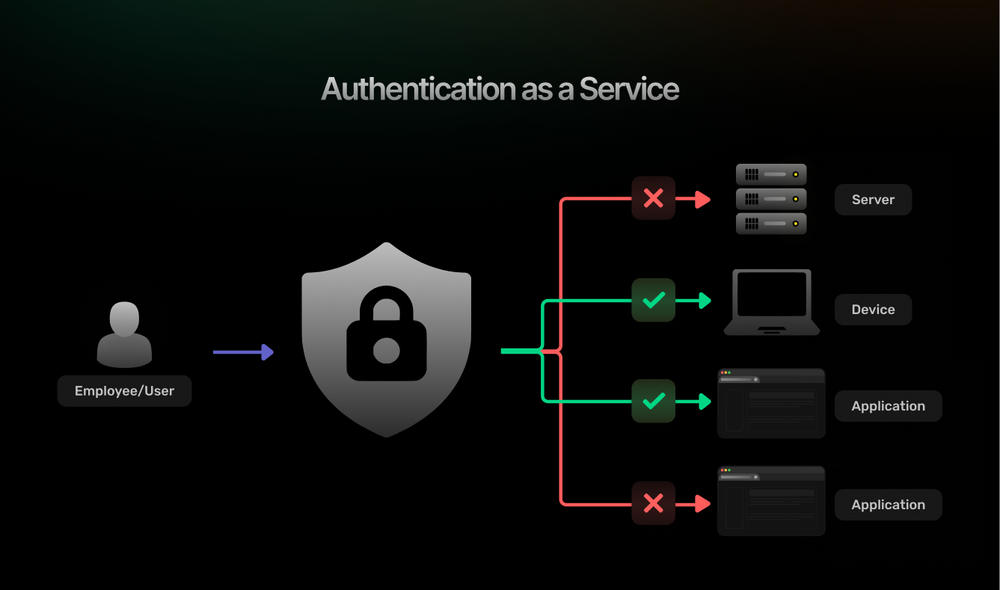
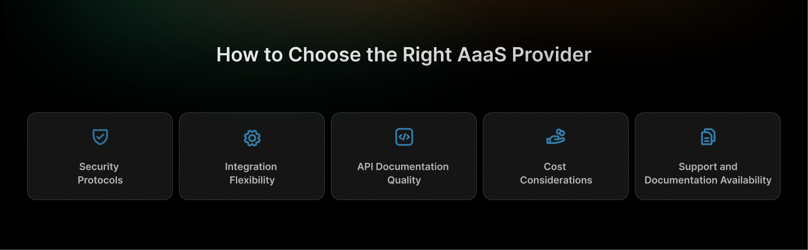

Authentication as a Service (AaaS) is a cloud-hosted offering that abstracts the complexities of user authentication, authorization, and identity management into a fully managed solution. Rather than writing and maintaining custom authentication code&mdash;handling user registration, password hashing, session management, and security monitoring&mdash;developers integrate with an AaaS provider via APIs, SDKs, or pre-built UI components. This shift enables engineering teams to focus on core product features instead of reinventing authentication workflows.

Key benefits of AaaS include:

-   **Rapid Time-to-Market:** Pre-built flows and UI components accelerate integration.
-   **Continuous Security Updates:** Providers stay abreast of evolving threats.
-   **Global Scalability:** Elastic infrastructure adapts to traffic spikes.
-   **Compliance Built-In:** Many solutions are certified for GDPR, SOC 2, HIPAA, and other standards.

In contrast, traditional in-house authentication often involves extended development cycles, frequent security audits, and ongoing maintenance to patch vulnerabilities. A simple misconfiguration&mdash;like improper salt usage in password hashing or insecure session storage&mdash;can expose millions of user credentials. AaaS centralizes best practices, encapsulating protocols such as OAuth2, OpenID Connect, SAML, and JWT, while offering plug-and-play features like social login, multi-factor authentication (MFA), and single sign-on (SSO).

By outsourcing identity management, businesses&mdash;from bootstrapped startups to large enterprises&mdash;gain robust, battle-tested systems that handle everything from risk-based authentication to threat detection, allowing them to innovate faster with peace of mind.

## **Why Choose AaaS Over Building Your Own Authentication System?**

The decision between building a custom authentication system and adopting an AaaS solution involves weighing multiple factors that can significantly impact your project\'s success, security posture, and long-term sustainability.

### **Cost and Maintenance**

Building a custom authentication system initially appears cost-effective, especially for small projects with basic requirements. However, the true cost of ownership extends far beyond initial development. Custom authentication systems require ongoing maintenance, security updates, bug fixes, and feature enhancements that can consume significant engineering resources over time.

AaaS providers spread these costs across their entire customer base, allowing them to invest heavily in security infrastructure, hire specialized security experts, and maintain comprehensive compliance programs that would be prohibitively expensive for individual organizations to replicate.

### **Security Vulnerabilities and Threat Mitigation**

Security represents perhaps the most compelling argument for choosing AaaS solutions. Authentication systems are prime targets for attackers, and even minor implementation flaws can lead to catastrophic security breaches. Professional AaaS providers employ dedicatedsecurity teams that continuously monitor threat landscapes, implement advanced security measures, and respond rapidly to emerging vulnerabilities.

### **Scalability and Performance Optimization**

Custom authentication systems often struggle with scalability challenges as applications grow. AaaS providers have already solved these scalability challenges and can seamlessly handle traffic spikes, geographic distribution, and high availability requirements.

### **Compliance with Standards**

Modern applications must comply with various regulatory requirements such as [GDPR](https://gdpr.eu/what-is-gdpr/), [HIPAA](https://www.cdc.gov/phlp/php/resources/health-insurance-portability-and-accountability-act-of-1996-hipaa.html#:~:text=The%20Health%20Insurance%20Portability%20and,Rule%20to%20implement%20HIPAA%20requirements.), [SOC 2](https://secureframe.com/hub/soc-2/what-is-soc-2), and industry-specific standards. Established AaaS providers typically maintain compliance with multiple standards and can provide compliance documentation and certifications that customers can leverage for their own compliance requirements.

## **Key Features of AaaS Solutions**

Understanding the essential features of AaaS solutions helps organizations evaluate providers and ensure their chosen solution meets both current and future requirements.

### **Multi-Factor Authentication**

[Multi-factor authentication](https://supertokens.com/docs/additional-verification/mfa/introduction) (MFA) has evolved from a nice-to-have feature to a fundamental security requirement. Modern AaaS solutions support various MFA methods, including SMS codes, authenticator apps, hardware tokens, biometric authentication, and push notifications. The best providers offer adaptive MFA that adjusts authentication requirements based on risk factors such as user location, device recognition, and behavioral patterns.

### **Single Sign-On**

[Single sign-On](https://supertokens.com/features/single-sign-on) (SSO) capabilities allow users to authenticate once and access multiple applications within an organization\'s ecosystem. SSO reduces password fatigue, improves user experience, and simplifies access management for IT administrators. AaaS solutions typically support industry-standard protocols like SAML, OAuth 2.0, and OpenID Connect.

### **Passwordless Authentication**

The trend toward [passwordless authentication](https://supertokens.com/features/passwordless-login) reflects growing recognition that traditional passwords are both a security weakness and a user experience friction point. AaaS solutions increasingly offer passwordless options such as magic links, biometric authentication, and hardware security keys.

### **Role-Based Access Control (RBAC)**

Effective access management requires granular control over user permissions and roles. Role-based access control (RBAC) systems allow organizations to define roles with specific permissions and assign users to appropriate roles, simplifying access management and reducing the risk of privilege escalation.

### **JSON Web Tokens and Opaque Tokens**

Token management represents a critical aspect of modern authentication systems. JSON Web Tokens (JWT) offer stateless authentication but require careful implementation to avoid security vulnerabilities. Opaque tokens provide better security characteristics but require additional infrastructure for token validation.

### **API Security**

Modern applications rely heavily on APIs, making API security a crucial component of authentication systems. AaaS solutions provide comprehensive API security features, including rate limiting, request validation, and integration with API gateways and management platforms.

## **How Does AaaS Work?**

Understanding the technical architecture and workflows of Authentication as a Service helps developers implement these solutions effectively and troubleshoot potential issues.

### **User Authentication Flows**

AaaS solutions implement standardized authentication flows based on protocols like [OAuth 2.0](https://oauth.net/2/) and OpenID Connect. These flows define how applications redirect users to authentication providers, how users provide credentials, and how authentication results are communicated back to applications.

### **Token Management and Refresh Flows**

Effective [token management](https://supertokens.com/docs/post-authentication/session-management/introduction) balances security and user experience by implementing appropriate token lifetimes and refresh mechanisms. Short-lived access tokens reduce the impact of token theft but require frequent renewal. Refresh tokens enable seamless token renewal without requiring users to re-authenticate.

### **Security Best Practices and Threat Detection**

Professional AaaS providers implement multiple layers of security monitoring and threat detection. These systems analyze authentication patterns, detect anomalous behavior, and automatically respond to potential security threats.

### **Data Encryption and Secure Token Storage**

AaaS solutions implement comprehensive encryption strategies for data at rest and in transit. This includes encrypting user credentials, session data, and authentication tokens using industry-standard encryption algorithms and key management practices.

## **Benefits of Using AaaS**

The advantages of adopting Authentication as a Service extend beyond simple cost savings to encompass strategic benefits that can significantly impact application success.

### **Reduced Development Time**

AaaS solutions dramatically reduce the time required to implement authentication functionality. Instead of spending weeks or months building custom authentication systems, developers can integrate AaaS solutions in days or even hours using well-documented APIs and SDKs.

### **Enhanced Security Protocols**

Professional AaaS providers invest heavily in security infrastructure and employ specialized security teams that continuously monitor and improve their security postures. This level of security expertise and infrastructure is typically beyond the reach of individual organizations.

### **Improved User Experience**

AaaS solutions typically offer polished, user-friendly authentication interfaces that have been tested and refined across thousands of applications and millions of users. Features like social login integration, passwordless authentication, and seamless SSO improve user experience while reducing abandonment rates.

### **Simplified Compliance Management**

Maintaining compliance with various regulatory requirements represents a significant ongoing burden for organizations. AaaS providers typically maintain compliance with multiple standards and can provide documentation and certifications that customers can leverage.

### **Scalable Infrastructure for Growing Applications**

AaaS providers operate a global infrastructure designed to handle massive scale and traffic spikes. This infrastructure automatically scales to accommodate growing user bases without requiring customers to invest in additional servers, databases, or networking equipment.

## **Challenges of Using AaaS Solutions**

While AaaS solutions offer significant advantages, organizations should also consider potential challenges and limitations.

### **Limited Customization**

AaaS solutions prioritize standardization and best practices, which can limit customization options for organizations with unique requirements. While most providers offer theming and branding options, deep customization of authentication flows or security policies may not be possible.

### **Vendor Lock-in Concerns**

Migrating authentication systems can be complex and risky, potentially creating vendor lock-in situations where changing providers becomes prohibitively expensive or disruptive. Organizations should evaluate migration paths and data portability options when selecting an AaaS provider.

### **Potential Downtime Risks**

Relying on external AaaS providers introduces dependency on their infrastructure and availability. Provider outages or performance issues can directly impact customer applications, potentially causing user frustration and business disruption.

### **Cost of Scaling**

While AaaS solutions often provide better value than custom systems, costs can increase significantly as applications scale. Pricing models based on monthly active users or authentication events can become expensive for high-traffic applications.

## **How to Choose the Right AaaS Provider**

Selecting an appropriate AaaS provider requires careful evaluation of multiple factors that align with both current needs and future requirements.

### **Security Protocols**

Evaluating provider security measures should include reviewing their compliance certifications, security audit reports, and incident response procedures. Providers should implement Zero Trust Architecture principles, maintain SOC 2 compliance, and demonstrate proactive security monitoring capabilities.

### **Integration Flexibility**

The ease of integration significantly impacts implementation timelines and ongoing maintenance requirements. Evaluate a provider's SDK quality, [API documentation](https://www.postman.com/api-platform/api-documentation/) comprehensiveness, and support for your technology stack.

### **API Documentation Quality**

Comprehensive, accurate documentation accelerates integration and reduces support requirements. Evaluate a provider's documentation for completeness, clarity, and regular updates.

### **Cost Considerations**

Understanding pricing models and projected costs helps avoid unexpected expenses as applications scale. Compare pricing across different usage patterns and growth scenarios.

### **Support and Documentation Availability**

Reliable support becomes crucial during integration phases and when troubleshooting production issues. Evaluate a provider's support response times, available support channels, and the quality of their technical support teams.

## **How SuperTokens Enhances AaaS Implementations**

[SuperTokens](https://supertokens.com/) represents an innovative approach to Authentication as a Service that addresses many common limitations of traditional auth providers through its open-source foundation and flexible architecture.

### **Short-Lived Access Tokens with Rotating Refresh Tokens**

SuperTokens implements advanced token management strategies that balance security and user experience. The platform uses short-lived access tokens combined with rotating refresh tokens to minimize the impact of token theft while maintaining seamless user experiences.

### **JWT vs. Opaque Token Management**

SuperTokens offers flexible token implementations supporting both JWT and opaque tokens depending on specific use case requirements. The platform handles the complexity of token validation, caching, and revocation automatically.

### **Built-in Token Theft Detection Mechanisms**

SuperTokens implements sophisticated token theft detection that monitors for unusual access patterns, such as concurrent sessions from different locations. When suspicious activity is detected, the system can automatically invalidate potentially compromised sessions.

### **Easy Integration with Modern Tech Stacks**

SuperTokens provides comprehensive SDKs and libraries for popular programming languages and frameworks, including React, Node.js, Python, Go, and mobile platforms.

### **SuperTokens vs. Traditional AaaS Solutions**

                     
 | **Feature**        | **SuperTokens**        | **Traditional AaaS**   |
 | -------------------| -----------------------| ----------------------------|
 | **Open Source**    | Yes, full transparency | Typically proprietary       |
 | **Self-Hosting Option**| Available          | Usually cloud-only          |
 | **Customization Level**| High flexibility   | Limited customization       |
 | **Token Security** | Advanced theft detection| Standard implementations   |         
 | **Vendor Lock-in** | Minimal risk           | Higher dependency           |
                                                                        

## **Best Practices for Implementing AaaS**

Successful AaaS implementation requires following established security best practices.

### **Use HTTPS Everywhere**

Implementing HTTPS for all authentication-related communications represents a fundamental security requirement. Ensure that your application enforces HTTPS and implements HTTP Strict Transport Security (HSTS) headers to prevent downgrade attacks.

### **Secure Cookie Management**

Proper cookie configuration significantly impacts authentication security. Implement HttpOnly cookies to prevent client-side script access, use Secure flags to ensure cookies are only transmitted over HTTPS, and configure SameSite attributes appropriately.

### **Implementing Rate Limiting**

Rate limiting protects authentication endpoints from brute force attacks and abuse. Implement rate limiting at multiple levels, including per-IP, per-user, and per-endpoint restrictions.

### **Regularly Reviewing and Updating Permissions**

Implement regular reviews of user permissions and roles to ensure that access rights remain appropriate as users\' responsibilities change. Establish processes for promptly removing access when users leave the organization.

### **Monitoring and Logging Suspicious Activity**

Comprehensive logging and monitoring enable rapid detection and response to security incidents. Implement logging for all authentication events and establish alerting mechanisms for suspicious patterns.

## **Common Use Cases for AaaS**

Understanding typical use cases for Authentication as a Service helps organizations identify opportunities to leverage these solutions effectively.

### **SaaS Applications**

Software-as-a-service (SaaS) applications benefit significantly from AaaS solutions due to their multi-tenant architecture and need for scalable authentication. SaaS applications typically require features like organization-level user management and SSO integration for enterprise customers.

### **Financial and Healthcare Applications**

Applications in highly regulated industries like finance and healthcare require robust security measures and compliance with specific standards. AaaS providers that specialize in these industries offer features like enhanced audit logging and compliance reporting.

### **E-commerce Platforms**

E-commerce applications need to balance security with user experience to minimize cart abandonment while protecting customer data. AaaS solutions can provide features like social login integration and seamless account creation processes.

### **Enterprise Applications**

Large enterprises require sophisticated authentication capabilities, including SSO integration, directory service synchronization, and RBAC management. AaaS solutions designed for enterprise use offer features like Active Directory integration and administrative dashboards.

## **Conclusion**

Authentication as a Service represents a mature and compelling solution for organizations seeking to implement robust, scalable authentication systems without the complexity and risks associated with custom development. The benefits of reduced development time, enhanced security, improved user experience, and simplified compliance management make AaaS an attractive option for most applications.

However, success with AaaS requires careful provider selection, thorough evaluation of features and limitations, and proper implementation of security best practices. Organizations should consider factors like customization requirements, integration complexity, long-term costs, and vendor lock-in risks when making provider decisions.

The emergence of innovative solutions like SuperTokens demonstrates that the AaaS landscape continues to evolve, offering new approaches that address traditional limitations while maintaining the core benefits of managed authentication services. As applications become increasingly complex and security threats continue to evolve, Authentication as a Service will likely become even more important for organizations seeking to balance security, user experience, and development efficiency.
