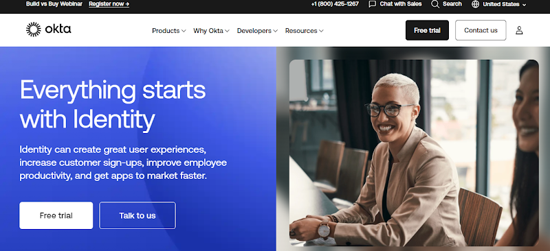
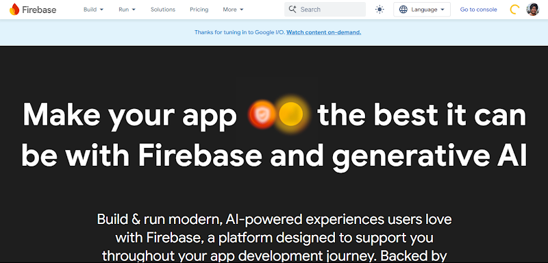
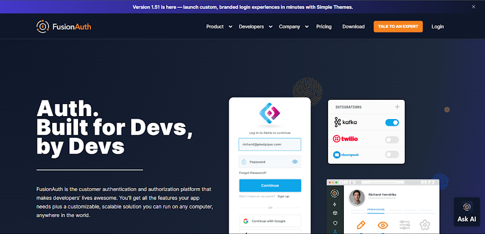
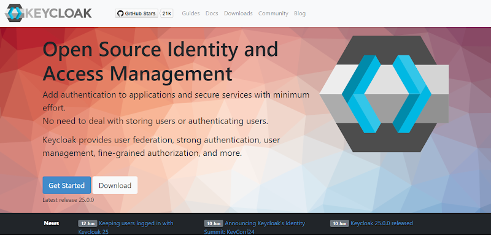

## Table of Contents

1. [Introduction](#introduction)
2. [When To Search Outside Of Auth0 For Access Management](#when-to-search-outside-of-auth0-for-access-management)
3. [Understanding Your Priorities: What To Look For In Auth Services](#understanding-your-priorities-what-to-look-for-in-auth-services)
4. [Top Auth0 Alternatives For Secure Authentication & Authorization](#top-auth0-alternatives-for-secure-authentication--authorization)
5. [Comparing Features & Pricing: Auth0 vs. Alternatives](#comparing-features--pricing-auth0-vs-alternatives)
6. [Is Open Source Important?](#is-open-source-important)
7. [Custom vs. Out-Of-The-Box Auth Providers](#custom-vs-out-of-the-box-auth-providers)
8. [Conclusion](#conclusion)

## Introduction

In today's digital landscape, access management has become a critical component of any application or service. Auth0, a leading identity and access management (IAM) platform, has gained significant popularity for its comprehensive set of features and robust security measures. However, as with any solution, Auth0 may not be the perfect fit for every organization's unique requirements. That's why we're here to explore some alternatives that might better suit your needs, focusing on features, pricing, flexibility, and implementation.

## When To Search Outside Of Auth0 For Access Management

While Auth0 is a powerful and widely adopted solution, there are several reasons why you might want to consider exploring alternatives:

- **High pricing of Auth0:** Auth0's pricing model can be quite expensive, especially for smaller organizations or projects with limited budgets.
- **Specific customization needs:** If you require highly customized authentication or authorization features that Auth0 doesn't offer out-of-the-box, an alternative solution might be a better fit.
- **Scalability concerns:** Depending on your application's growth trajectory, Auth0's price can increase dramatically and your product revenue might not be able to keep up.
- **Integration challenges with existing systems:** Integrating Auth0 with your existing systems and workflows might be complex or require significant effort.

So in short, Auth0 might not be the ideal choice for scenarios where you need extensive customization, self-hosting capabilities, or a more cost-effective solution for smaller projects or startups. Additionally, if you have specific compliance or regulatory requirements that Auth0 doesn't fully address, exploring alternatives could be beneficial.

## Understanding Your Priorities: What To Look For In Auth Services

Before diving into the alternatives, it's crucial to understand your priorities and what features you should be looking for in an authentication and authorization service:

### Key considerations and features

- **Security features:** Robust security measures like multi-factor authentication (MFA), strong encryption standards, and compliance with regulations such as GDPR and SOC2 are essential.
- **Ease of implementation:** The quality of documentation, community support, and overall ease of integration with your existing systems can significantly impact the implementation process.
- **Customizability:** The availability of SDKs, APIs, and customization options if you need to tailor the solution to your specific requirements.
- **Scalability:** Handling high traffic volumes, multi-tenant support, and the ability to scale seamlessly as your application grows are crucial factors to consider.
- **Pricing structure:** Evaluate the pricing models, including free tiers, pay-as-you-go options, and enterprise pricing, to find the most cost-effective solution for your needs.
- **Support and maintenance:** The level of support provided, whether it's a service-level agreement (SLA), community support, or dedicated support, can be a deciding factor, especially for mission-critical applications.

## Top Auth0 Alternatives For Secure Authentication & Authorization
Now, let's dive into some of the top Auth0 alternatives and explore their unique selling points:

- **SuperTokens (Customizable, open-source, developer-friendly):** SuperTokens is a highly flexible and customizable authentication solution that offers a wide range of features, including support for various authentication mechanisms, multi-factor authentication, and session management. Its open-source nature and developer-friendly approach make it an attractive choice for organizations seeking transparency and control over their authentication system.

- **Okta (Enterprise-focused, robust security, extensive integrations):** Okta is a well-established and enterprise-grade identity management platform known for its robust security features and extensive integrations with various applications and services. It's particularly well-suited for larger organizations with complex authentication and authorization requirements.

- **Firebase Authentication (Strong Google ecosystem integration, ease of use):** Firebase Authentication is a part of the Firebase suite of products offered by Google. It seamlessly integrates with other Firebase services and the broader Google ecosystem, making it an excellent choice for developers already invested in Google's technology stack. Its ease of use and comprehensive documentation make it a popular option, especially for smaller projects.

- **Cognito (AWS integration, good for scaling, complex setup):** Amazon Cognito is AWS's authentication and user management service. It offers tight integration with other AWS services, making it a natural choice for applications built on the AWS platform. Cognito is particularly well-suited for applications that require scalability and high availability, but its setup can be more complex compared to some alternatives.

- **FusionAuth (Full-featured, great for self-hosting, community-focused):** FusionAuth is a full-featured authentication and authorization solution that can be self-hosted or used as a cloud service. It offers a wide range of features, including support for various authentication mechanisms, multi-factor authentication, and advanced customization options. FusionAuth has a strong community focus and is well-suited for organizations that prioritize self-hosting and customization.

- **Keycloak (Open-source, highly customizable, strong community):** Keycloak is an open-source identity and access management solution that offers a high degree of customization and flexibility. It's particularly popular in the Java ecosystem and has a strong community backing. Keycloak is a great choice for organizations that value open-source solutions and require extensive customization capabilities.

## Comparing Features & Pricing: Auth0 vs. Alternatives
To help you make an informed decision, let's compare the features and pricing structures of Auth0 and the alternatives we've discussed:

- **Security:** Auth0 and most of the alternatives offer robust security features like MFA, strong encryption, and SSO capabilities. However, some solutions like SuperTokens and Keycloak provide more flexibility and customization options for advanced security requirements.
- **Customization:** While Auth0 offers a good level of customization through APIs and SDKs, solutions like SuperTokens, FusionAuth, and Keycloak excel in providing extensive customization options, including the ability to modify the underlying code and user interfaces.
- **Scalability:** Auth0, Cognito, and Okta are generally well-suited for handling high traffic volumes and supporting a large number of users. However, solutions like SuperTokens and FusionAuth also offer robust scalability features, particularly when self-hosted.

### Auth0 Pricing

Auth0 pricing tiers and structure: Auth0 offers a free tier for up to 7,500 active users, followed by various paid tiers based on the number of active users and additional features required. The pricing can become quite expensive for larger organizations or projects with a high number of users.

| Plans       | Free | Essentials | Professional | Enterprise |
|-------------|------|------------|--------------|------------|
| Auth0       | $0   | $35/month  | $240/month   | Contact    |

Many alternatives, like Keycloak and FusionAuth, offer open-source versions with no user-based pricing, making them more cost-effective for smaller projects or those with a large user base. FusionAuth also offers hosting-based pricing.

### FusionAuth pricing

#### Cloud Hosting

| Basic  | Business | High Availability |
|--------|----------|--------------------|
| $37/month | $225/month | $500 / month (starting) |

#### Self Hosted

| Community | Starter  | Essential | Enterprise |
|-----------|----------|-----------|------------|
| Free     | $125/month| $850/month | $3300/month |

### Okta pricing

Okta offers diverse plans for both the Workforce Identity Cloud and the Customer Identity Cloud. Their pricing is flexible, catering to various organizational needs.

| Okta Plans  | Essential | Professional |
|-----------|----------|-----------|
| B2C |$35/mo      | $240/mo   |
| B2B | $150/mo      | $800/mo |
| Enterprise | Contact      | Contact |

### Cognito pricing

Solutions like Cognito typically have usage-based (pay-as-you-go) pricing models, which can be more cost-effective for larger organizations or projects with fluctuating user volumes.

Unlike many competitors that charge based on user count, SuperTokens' pricing is primarily based on the features you require. To truly understand how SuperTokens' pricing stacks up against the competition, we encourage you to explore their detailed feature comparison page. This comprehensive resource allows you to see at a glance how SuperTokens compares to other authentication solutions across key factors like pricing, customizability, scalability, and more.

Don't just take our word for it – see for yourself how SuperTokens' flexible and cost-effective approach can benefit your organization.

## Is Open Source Important?

When evaluating authentication solutions, the open-source aspect is a crucial factor to consider. Open-source solutions like SuperTokens, Keycloak, and FusionAuth offer several benefits:

### Benefits of open-source authentication solutions:

- **Transparency:** With access to the source code, you can thoroughly review and understand how the solution works, ensuring it aligns with your security and privacy requirements.
- **Customizability:** Open-source solutions often provide greater flexibility for customization and integration with your existing systems and workflows.
- **Cost-effectiveness:** Many open-source solutions offer free or more cost-effective pricing models, particularly for smaller projects or those with a large user base.
- **Community support:** Active open-source communities can provide valuable resources, support, and contributions to continuously improve the solution.

However, it's important to note that open-source solutions also come with their own set of challenges:

### Challenges of open-source authentication solutions:

- **Maintenance and updates:** While the community contributes to ongoing development, you may need dedicated resources to maintain and update the solution according to your specific requirements.
- **Security responsibilities:** With open-source solutions, you assume greater responsibility for ensuring the security and compliance of the solution within your environment.
- **Lack of dedicated support:** While community support can be valuable, you may not have access to dedicated support resources like those offered by commercial vendors.

## Custom vs. Out-Of-The-Box Auth Providers
 
Another important consideration is whether to go with a custom authentication solution or an out-of-the-box provider. Both approaches have their advantages and disadvantages:

### Custom solutions:

**Pros:** Tailored to specific needs, full control over features.
 
- Custom solutions can be tailored to meet your organization's exact requirements, ensuring a perfect fit for your specific use cases and workflows.
- You have complete control over the features, security measures, and customization options, allowing for maximum flexibility.

**Cons:** Higher development time, maintenance, and cost.

- Building a custom authentication solution from scratch can be a time-consuming and resource-intensive process, requiring a dedicated development team and ongoing maintenance efforts.
- The costs associated with development, testing, and maintenance can be significantly higher compared to out-of-the-box solutions, especially for small to medium-sized organizations.

### Out-of-the-box providers

**Pros:** Quick implementation, lower initial cost, regular updates.

- Out-of-the-box authentication providers offer a faster and more straightforward implementation process, allowing you to quickly integrate authentication capabilities into your application.
- The initial costs are typically lower compared to building a custom solution, making them more accessible for organizations with limited resources.
- Most providers offer regular updates and security patches, ensuring that your authentication system remains up-to-date and secure.

**Cons:** Less flexibility, potential for vendor lock-in.

- While many out-of-the-box providers offer customization options, they may not always meet your specific requirements or integrate seamlessly with your existing systems.
- There is a risk of vendor lock-in, where switching to a different authentication provider in the future can be a complex and costly process.

## Conclusion

Choosing the right authentication solution is crucial for the security and success of your application. While Auth0 is a popular option, exploring alternatives that better align with your specific needs and priorities can be beneficial.

In this article, we've covered a range of Auth0 alternatives, including SuperTokens, Okta, Firebase Authentication, AWS Cognito, FusionAuth, and Keycloak, each with its unique strengths and capabilities.

If you're seeking a flexible, developer-friendly, and cost-effective solution, SuperTokens is definitely worth considering. With its open-source core, extensive customization options, and affordable pricing models, SuperTokens offers a compelling choice for projects of all sizes and budgets.

Ultimately, the right authentication solution is the one that seamlessly integrates with your systems, meets your security and compliance requirements, and provides the flexibility and scalability to grow with your organization. Take the time to evaluate your options carefully, and don't hesitate to seek expert advice or engage with the developer communities surrounding these solutions.
