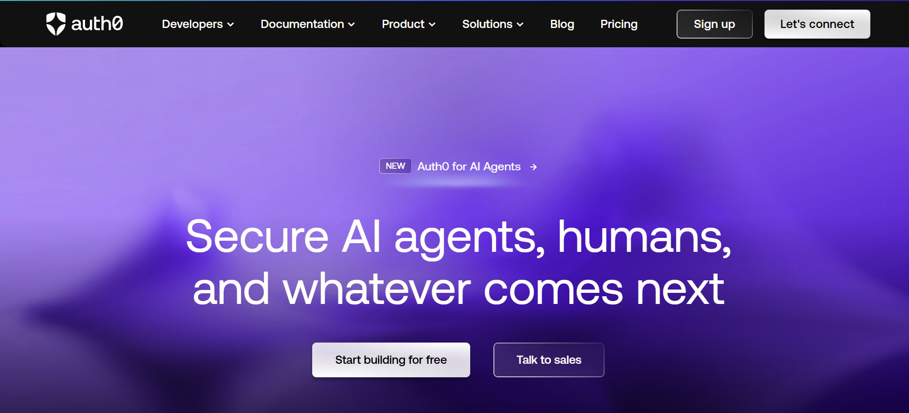
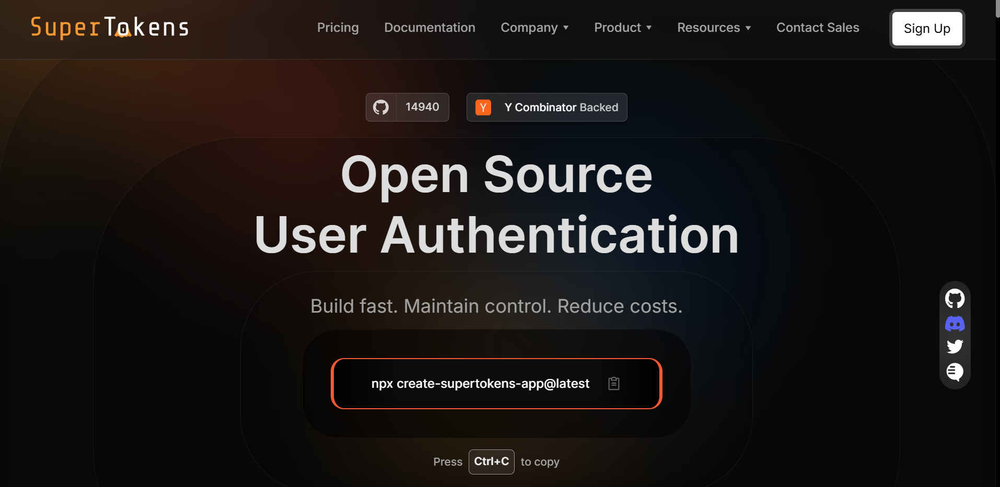
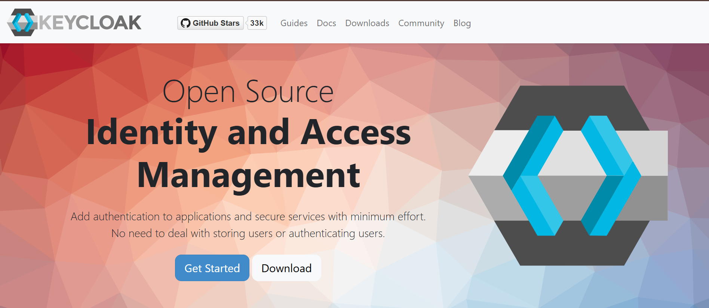
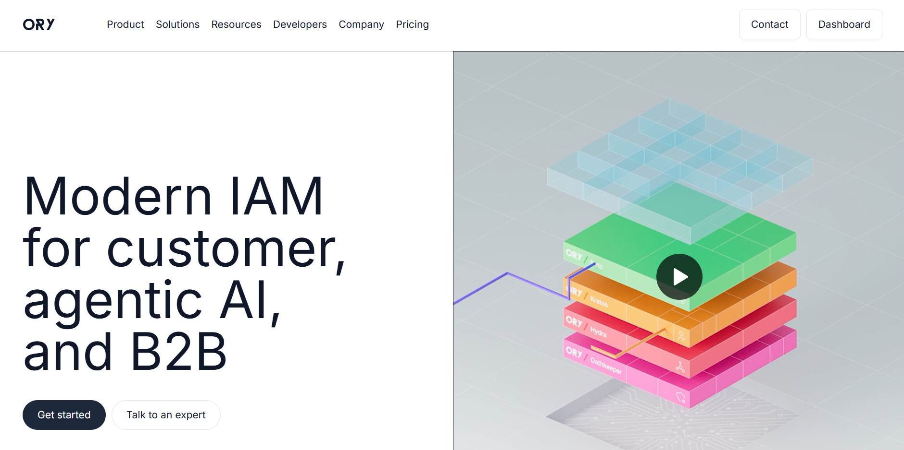
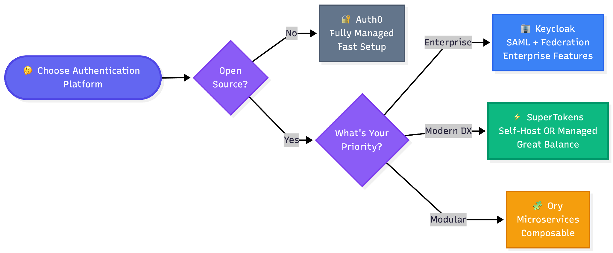

When you're choosing an authentication platform, open source can be a dealbreaker. Maybe you need full control over your authentication infrastructure. Maybe you want to avoid vendor lock-in. Or maybe you just want to see exactly how your authentication works under the hood.

Auth0 comes up in almost every discussion of authentication. But is it actually open source? And if not, what are your best alternatives?

Let's clear this up.

## TL;DR: Is Auth0 Open Source?

Short answer: No, Auth0 is not open source.

Auth0 is a proprietary SaaS platform. You can't self-host it. You can't see the source code for the core platform. You're entirely dependent on Auth0's infrastructure and pricing.

That said, Auth0 does release some open-source projects. They maintain client SDKs and a few standalone tools under open-source licenses. But the authentication platform itself? That's closed source.

This matters because if you need an open-source authentication system, you can't just grab Auth0 and run it yourself. You'll need a different solution.

## What Auth0 Actually Open-Sources

Auth0 contributes to open source, but not where it counts most. Here's what they actually release publicly.

### **SDKs and Client Libraries**

Auth0 publishes client libraries under open-source licenses (usually MIT). These help you integrate with their hosted service.

**What's available:**

- JavaScript SDKs for React, Angular, Vue
- Mobile SDKs for iOS and Android
- Backend SDKs for Node.js, Python, Java, Go
- Auth0 CLI for managing configurations
- Sample apps and quickstart templates

These are helpful for developers using Auth0. You can read the code, submit pull requests, and understand how the integration works. But they only work with Auth0's proprietary backend. You can't use these SDKs to build your own authentication system.

### **OpenFGA (Fine-Grained Authorization)**

This is Auth0's most substantial open-source contribution. OpenFGA is a fully open-source authorization system inspired by Google's Zanzibar.

**What it does:**

- Manages complex permissions and relationships
- Handles questions like "Can user X edit document Y?"
- Scales to millions of permission checks
- Runs completely independently from Auth0

**Important distinction:** OpenFGA handles authorization (who can do what), not authentication (who you are). It doesn't manage users, passwords, or login flows. You still need an authentication system alongside it.

You can self-host OpenFGA for free, or use Auth0's managed version. Either way, it's separate from authentication.

### **What Stays Proprietary**

Everything that makes Auth0 actually work is closed source:

- User database and management
- Login flows and session handling
- Password storage and verification
- Multi-factor authentication
- Social login integrations
- The admin dashboard
- All the infrastructure and scaling logic

You can't self-host any of this. You can't modify it. You can't see how it works. You're completely dependent on Auth0's service.

## If You Need an Open-Source Platform for Authentication: Leading Options

If you actually need open-source authentication (not just open-source SDKs), you've got three solid choices in 2026.

### **SuperTokens: Modern OSS with Managed Option**

[SuperTokens](https://supertokens.com/) gives you full open-source authentication that you can self-host for free. They also offer managed hosting if you want it.

**Why it works:**

The entire authentication core is Apache 2.0 licensed. That means you get complete source code access. You can self-host it. You can modify it. You own your authentication infrastructure.

Unlike Auth0's SDK-only approach, SuperTokens open-sources the actual authentication platform. User management, sessions, login flows, everything.

**How it's different from Auth0:**

SuperTokens keeps your JWT verification keys on your domain. Your application verifies tokens locally without calling back to SuperTokens
servers. This means:

- Faster authentication (no network round-trips)
- Better reliability (works even if SuperTokens go down)
- Easy migration (standard JWT tokens work anywhere)
- No vendor lock-in (you're not tied to proprietary formats)

Auth0 requires your app to call their servers for token verification. That creates dependency and latency.

**Developer experience:**

SuperTokens focuses on giving developers control. You can override any authentication endpoint. You can customize flows without hitting platform limitations. You can embed authentication directly in your app instead of redirecting to hosted pages.

The code is readable and well-documented. When something breaks, you can actually debug it yourself.

**When to choose SuperTokens:**

- You want open-source control but modern developer experience
- You might start self-hosted and move to managed later (or vice versa)
- You need deep customization without rebuilding everything
- You want to avoid vendor lock-in from day one

For more details, check out the [SuperTokens vsAuth0](https://supertokens.com/blog/supertokens-vs-auth0) comparison.

### **Keycloak: Enterprise OSS with Everything Included**

Keycloak is the veteran of open-source authentication. It's been around since 2014, backed by Red Hat, and handles enterprise requirements out of the box.

**What you get:**

- Full identity and access management
- SAML, OAuth 2.0, OpenID Connect support
- User federation and LDAP integration
- Fine-grained authorization
- Comprehensive admin console

**When to choose Keycloak:**

- You need enterprise features like SAML and identity brokering
- You're already in the Red Hat / Java ecosystem
- You want a mature, battle-tested solution
- You have ops capacity to run Java infrastructure

**Trade-offs:**

Keycloak is powerful but heavyweight. It's Java-based, which means higher resource usage. The learning curve is steeper. Setup and configuration take more time than lighter alternatives.

### **Ory: Modular OSS Components**

Ory takes a different approach. Instead of one monolithic platform, they offer separate components you compose together.

**The components:**

- Ory Kratos (user management and authentication)
- Ory Hydra (OAuth 2.0 and OpenID Connect server)
- Ory Oathkeeper (identity and access proxy)
- Ory Keto (permissions and authorization)

**When to choose Ory:**

- You want to pick exactly which pieces you need
- You're comfortable with microservices architecture
- You need OAuth 2.0 / OIDC server capabilities
- You like having control over each component

**Trade-offs:**

The modular approach gives you flexibility but adds complexity. You need to understand how the pieces fit together. You're managing multiple services instead of one unified platform.

Ory also offers managed hosting (Ory Network) if you don't want to run it yourself.

## Decision Pillars: When to Go OSS vs Hosted

Choosing between open source and hosted platforms isn't just about philosophy. There are real trade-offs.

### **Hosting and Control**

**Open source (SuperTokens, Keycloak, Ory):**

- Full control over infrastructure
- Self-host in your VPC or on-premises
- Complete data ownership
- You handle scaling and uptime

**Hosted (Auth0):**

- No infrastructure to manage
- Auth0 handles scaling and security
- Multi-tenant shared infrastructure
- Less control over data and deployment

If you need data to stay in specific regions, require air-gapped deployments, or have strict compliance requirements, open source gives you options hosted platforms can't match.

### **Developer Experience and Speed**

**Hosted platforms ship faster initially:**

- Pre-built UI components
- Managed social login integrations
- Less infrastructure setup
- Support team available

**Open source requires more setup:**

- You deploy and configure everything
- You handle updates and security patches
- You build integrations yourself (or use what's available)
- Community support instead of dedicated help

If you're racing to launch and don't have devops capacity, hosted makes sense. If you have engineers who can handle infrastructure, open source gives you more long-term flexibility.

### **Cost Model**

**Open source costs:**

- $0 in licensing fees
- Infrastructure costs (servers, database, bandwidth)
- Engineering time for deployment and maintenance
- Potential support contracts if you want them

**Hosted platform costs:**

- Usually per monthly active user (MAU)
- Add-ons for features like MFA or SSO
- Pricing scales automatically with usage
- No infrastructure management overhead

For small projects, hosted can be cheaper (free tiers are generous). As you scale to 100k+ users, open source often becomes more cost-effective despite operational overhead.

## Quick Best-Fit Snapshots

Not sure which option fits your needs? Here are some quick recommendations.

**Need open source with enterprise features?** → Keycloak

Best for organizations that need SAML support, identity provider brokering, user federation, and comprehensive enterprise capabilities. Worth the operational complexity if you need the features.

**Need open source with fast integration?** → SuperTokens

Best for teams that want modern developer experience, clean APIs, and the option to switch between self-hosted and managed hosting. Good balance of control and convenience.

**Need modular components you can compose?** → Ory

Best for teams comfortable with microservices who want to pick exactly which authentication pieces they need. Offers maximum flexibility at the cost of complexity.

**Need hosted simplicity and don't care about open source?** → Auth0

Best for teams prioritizing speed over control, with budget for per-user pricing as you scale. Good if you want everything managed for you.

For a broader comparison of Auth0 alternatives, see the [top Auth0 alternatives in 2025](https://supertokens.com/blog/top-auth0-alternatives-in-2025) guide.

## Conclusion

Auth0 isn't open source. The platform itself is proprietary, even though they release some SDKs and tools under open-source licenses.

If you actually need open-source authentication, you're looking at Keycloak, Ory, or SuperTokens. Each has different strengths:

- **Keycloak** for enterprise breadth and maturity
- **Ory** for modular, composable architecture
- **SuperTokens** for modern DX with managed optionality

The choice depends on what you value more: control or convenience, upfront speed or long-term flexibility, infrastructure costs or engineering time.

Before committing, run a time-boxed pilot. Deploy your top choice in staging. Build a sample integration. See how it feels to work with. Authentication is too important to choose based on blog posts alone.

For teams wanting open-source control without rebuilding authentication from scratch, SuperTokens offers a pragmatic middle ground. Full source code access, modern developer experience, and the flexibility to self-host or use managed hosting as your needs change.
