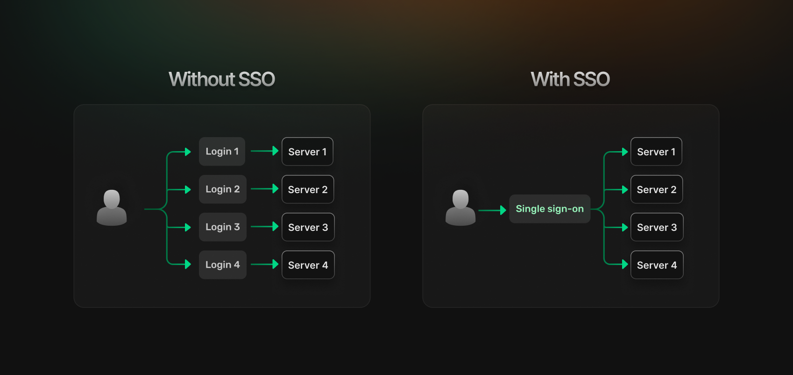
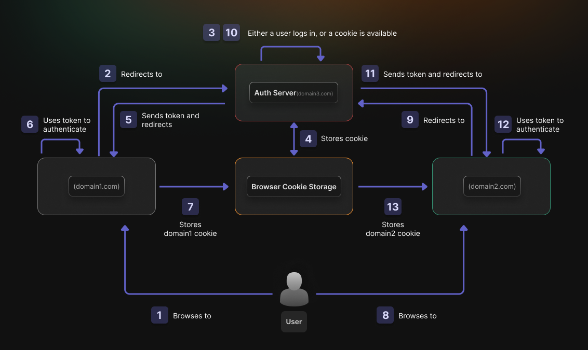
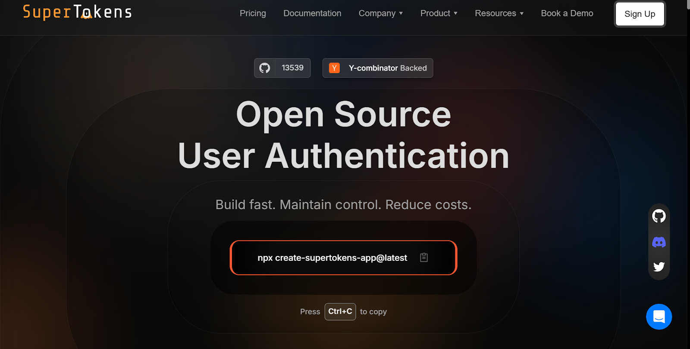

Authentication is a critical component of modern applications, and [Single Sign-On(SSO)](https://www.codecontent.net/blog/what-is-sso) has
become an essential feature for businesses looking to streamline user access across multiple applications. [Auth0](https://auth0.com/), a widely adopted authentication platform, offers robust SSO capabilities&mdash;but is it the right solution for your specific needs?

This guide walks you through implementing Auth0 SSO, highlights its limitations, and introduces SuperTokens as a flexible alternative that
gives developers more control over their authentication flows.

## **What Is Auth0 SSO and How Does It Work?**

Single Sign-On (SSO) allows users to authenticate once and access multiple applications, instead of having to log in separately for each one. Auth0 provides SSO functionality through its centralized identity platform, serving as a broker between your applications and various identity providers.




### **Definition**

[Auth0 SSO](https://auth0.com/docs/authenticate/single-sign-on) works by centralizing user authentication across multiple applications.
When a user logs into one application, Auth0 establishes a session that other connected applications can recognize, thus eliminating the need for repeated logins. This improves user experience while maintaining robust security standards.

### **Supported Protocols**

Auth0 supports all major SSO protocols, giving you flexibility in how you implement authentication:

-   **SAML (Security Assertion Markup Language)**: An XML-based protocol commonly used in enterprise environments, SAML allows secure exchange of authentication and authorization data between an identity provider and a service provider.

-   **OpenID Connect (OIDC)**: Built on top of OAuth 2.0, OIDC adds an identity layer that allows clients to verify the identity of end-users and obtain basic profile information.

-   **OAuth 2.0**: While not strictly an SSO protocol, OAuth 2.0 serves as the foundation for modern authentication flows, to enable secure delegation of access without sharing credentials.

### **Identity Provider (IdP) Setup**

Auth0 functions as an identity broker that can connect to various enterprise identity providers:

-   [Okta](https://www.okta.com/): Auth0 can delegate authentication to Okta, allowing users with Okta accounts to access your applications.

-   [Azure Active Directory](https://www.microsoft.com/en-in/security/business/identity-access/microsoft-entra-id): Enables SSO for organizations using Microsoft\'s directory service.

-   [Google Workspace](https://workspace.google.com/intl/en_in/lp/business/?utm_source=google&utm_medium=cpc&utm_campaign=1710070-Workspace-APAC-IN-en-BKWS-EXA-HV-Hybrid&utm_content=text-ad-none-none-DEV_c-CRE_608675944021-ADGP_Hybrid+%7C+BKWS+-+EXA+%7C+Txt-Workspace-N/A-KWID_43700079340244364-kwd-346911454270&userloc_1007820-network_g&utm_term=KW_google%20workspace&gad_source=1&gad_campaignid=17662087385&gclid=CjwKCAjwiezABhBZEiwAEbTPGB8PRCSkX6V4UZ2hDrZLyHq7C4KLkCnnLVTc5HY4udmgH5NBeBuacBoCjG8QAvD_BwE&gclsrc=aw.ds): Allows users to log in by using their Google Workspace (formerly G Suite) credentials.

-   [Custom SAML Providers](https://auth0.com/docs/authenticate/protocols/saml/saml-configuration): Auth0 can integrate with any SAML-compliant identity provider, such as OneLogin, Ping Identity, or in-house solutions.

The integration process involves exchanging metadata between Auth0 and the identity provider, establishing trust relationships that enable
secure authentication flows.

### **Session Management**

Auth0 handles user sessions through a combination of:

-   **Access Tokens**: Short-lived credentials that applications use to access protected resources on behalf of the user.

-   **Refresh Tokens**: Longer-lived tokens that can obtain new access tokens, without requiring the user to log in again.

-   **ID Tokens**: Contains user identity information and is used by the client application to understand who the user is.

Auth0 allows configuration of session durations, idle timeouts, and token lifetimes, though with some limitations we\'ll discuss later.

## **Steps to Implement SSO with Auth0**



Implementing SSO with Auth0 requires several configuration steps that bridge your application with identity providers. Let\'s walk through the process:

### **Step 1: Set Up Auth0 Tenant**

A tenant in Auth0 represents your organization and serves as a logical isolation unit for your users, applications, and connections.

1.  Sign up for an Auth0 account if you don\'t already have one.

2.  Navigate to the Auth0 dashboard, and create a new tenant or select an existing one.

3.  Choose the region closest to your user base, for optimal performance.

4.  Set your tenant domain (e.g., `yourcompany.auth0.com` or a custom domain).

Your tenant settings determine fundamental behavior, such as which identity providers you can connect to and which features are available
to you.

### **Step 2: Configure an Enterprise Connection**

Enterprise connections link Auth0 to external identity providers such as Microsoft Active Directory or Okta.

**For SAML Connections:**

1.  In the Auth0 dashboard, go to **Authentication \> Enterprise \> SAML**.

2.  Click **Create Connection,** and then enter a name for your connection.

3.  Configure the connection by entering the details obtained from your identity provider:

    -   Sign-in URL (SSO URL)

    -   X.509 Signing Certificate

    -   SAML Request Binding

    -   SAML Response Binding

4.  Click **Save** to apply the configuration.

5.  After saving, download the Auth0 metadata file and provide it to your IdP to complete the trust relationship.

**For OIDC Connections:**

1.  Go to **Authentication \> Enterprise \> OpenID Connect**.

2.  Click **Create Connection,** and then enter a descriptive name.

3.  Enter the required OIDC configuration parameters:

    -   Issuer URL

    -   Client ID and secret

    -   Scopes to request

4.  Configure the callback URLs in both Auth0 and your identity provider.

5.  Click **Save** to complete the setup.

### **Step 3: Map Claims and Roles**

Auth0 allows you to map user attributes from your identity provider to standardized claims in Auth0:

1.  In your enterprise connection settings, navigate to the **Mappings** tab.

2.  Map the source attributes from your IdP to Auth0 user profile attributes.

Consider setting up rules to transform claims or add additional logic:

```js
function (user, context, callback) { 
// Map department to role
  if (user.department === 'Engineering') {
    context.idToken['https://yourapp.com/roles'] = ['engineer'];
  }
  callback(null, user, context);
}
```

3.  You can also use Auth0 Actions for more complex transformations or validations.

### **Step 4: Integrate SDK in Your App**

Auth0 provides SDKs for various platforms, to simplify integration:

**Frontend Integration**

For a React application:

```js
import { Auth0Provider, useAuth0 } from '@auth0/auth0-react';


function App() {
  return (
    <Auth0Provider
      domain="your-domain.auth0.com"
      clientId="your-client-id"
      redirectUri={window.location.origin}
      audience="your-api-identifier"
    >
      <MainApp />
    </Auth0Provider>
  );
}


function MainApp() {
  const { isAuthenticated, loginWithRedirect, logout, user } = useAuth0();
 
  return (
    <div>
      {isAuthenticated ? (
        <>
          <div>Hello, {user.name}</div>
          <button onClick={() => logout()}>Logout</button>
        </>
      ) : (
        <button onClick={() => loginWithRedirect()}>Login</button>
      )}
    </div>
  );
}

```

**Backend Integration**

For a Node.js API:

```js
const express = require('express');
const { auth } = require('express-oauth2-jwt-bearer');


const app = express();


// Authentication middleware
const checkJwt = auth({
  audience: 'your-api-identifier',
  issuerBaseURL: `https://your-domain.auth0.com/`,
});


// Protected route
app.get('/api/protected', checkJwt, (req, res) => {
  res.json({ message: 'This is a protected endpoint' });
});


app.listen(3000, () => console.log('Server running on port 3000'));

```

### **Step 5: Testing and Debugging**

Testing your SSO implementation is crucial before going live:

1.  **Verify IdP Configuration**: Ensure the metadata exchange between Auth0 and your IdP is correctly configured.

2.  **Test Login Flow**: Attempt to log in through your IdP and verify the user is correctly redirected back to your application.

3.  **Inspect Token Contents**: Verify that user claims and roles are properly mapped.

4.  **Check Session Behavior**: Test session duration and renewal to ensure they match your expectations.

**Common Issues and Solutions**:

-   **SAML Response Validation Errors**: Often caused by clock synchronization issues between servers or an incorrect certificate configuration.

-   **Redirect Loop**: Can occur when callback URLs are misconfigured or during cookie/session management problems.

-   **Missing Claims**: Check your mapping configuration if the expected user attributes aren\'t appearing in tokens.

-   **Cross-Origin Issues**: Ensure your application\'s origins are properly listed in Auth0\'s allowed origins.

## **Common Limitations of Auth0 SSO**

While Auth0 offers robust SSO capabilities, it comes with several limitations that developers should be aware of:

### **High Pricing for Enterprise SSO**

Auth0\'s pricing model can become expensive as your user base grows:

-   Enterprise SSO features are only available on higher-tier plans.

-   Per-active-user pricing makes costs unpredictable for growing applications.

-   Additional charges for certain features, such as adaptive MFA or SSO integrations.

-   Limited free-tier functionality for testing and development.

For startups and growing businesses, these costs can quickly become prohibitive, especially when SSO is a requirement for enterprise
customers.

### **Opaque Session Management**

Auth0\'s session management has several limitations:

-   Limited control over token lifetime and renewal logic.

-   Refresh token rotation policies can\'t be fully customized.

-   Session validation happens on Auth0\'s servers, adding latency.

-   Difficult to implement custom session behaviors.

These restrictions can be particularly challenging for applications that require granular control over session security or custom
validation logic.

### **Vendor Lock-in**

Auth0\'s proprietary architecture creates significant lock-in:

-   User data is stored in Auth0\'s proprietary database.

-   Custom rules and actions are written in Auth0\'s specific formats.

-   Complex migration process to extract user data and authentication logic.

-   Redevelopment required when switching providers.

This lack of portability increases risk and can limit future architectural decisions.

### **Limited Customization**

Developers often face friction when implementing custom authentication flows:

-   Universal Login customization is limited without premium plans.

-   Complex workflows require chaining multiple rules or actions.

-   Limited ability to modify core authentication behaviors.

-   Custom databases have performance limitations and restrictions.

Applications requiring unique authentication experiences often struggle with Auth0\'s constraints.

### **Compliance Barriers**

Auth0 can present challenges for organizations with strict compliance
requirements:

-   Data residency and sovereignty may be difficult to guarantee.

-   Full audit trails require premium tiers.

-   Limited control over exactly how user data is stored and processed.

-   Difficult to implement custom encryption or security protocols.

## **How SuperTokens Enhances the SSO Experience**



[SuperTokens](https://supertokens.com/) offers an open-source alternative to Auth0 that addresses many of its limitations, while providing robust SSO capabilities.

### **Self-Hosting and Full Control**

Unlike Auth0, SuperTokens gives you complete control over your authentication infrastructure:

-   Self-host on your own infrastructure or use SuperTokens\' managed service.

-   Access to all source code (MIT-licensed) for full transparency.

-   Deploy in your own cloud environment for complete data sovereignty.

-   Modify any component to suit your specific requirements.

This level of control eliminates vendor lock-in and gives you ownership of your authentication system.

### **Built-in SSO and Multi-Tenant Support**

SuperTokens offers comprehensive SSO capabilities, with multi-tenant support out of the box:

-   Implement SSO across multiple domains and applications seamlessly.

-   Create tenant-specific authentication policies and branding.

-   Support for both B2B and B2C scenarios with different authentication requirements.

-   Custom claims and session properties per tenant.

For SaaS applications serving multiple organizations, these features are invaluable.

### **Session Security and Transparency**

SuperTokens provides superior session management with full transparency:

-   Automatic refresh token rotation, for enhanced security.

-   Built-in anti-CSRF protection.

-   Customizable token lifetimes and validation logic.

-   Session hijacking detection.

You can inspect and modify the session handling code to match your specific security requirements.

```js
// Example of custom session validation in SuperTokens
import Session from "supertokens-node/recipe/session";

Session.init({
  override: {
    functions: (originalImplementation) => {
      return {
        ...originalImplementation,
        createNewSession: async function(input) {
          // Custom validation before creating session
          if (input.userId === "blacklisted") {
            throw new Error("User is blacklisted");
          }
         
          // Add custom claims to session
          input.sessionData = {
            ...input.sessionData,
            role: "admin",
            orgId: "org123"
          };
         
          return originalImplementation.createNewSession(input);
        }
      };
    }
  }
});

```

### **Flexible Login Methods**

SuperTokens allows you to combine multiple authentication methods seamlessly:

-   Enterprise SSO via SAML and OIDC

-   Passwordless authentication (email/SMS)

-   Social login (Google, GitHub, etc.)

-   Traditional email/password

This flexibility enables you to support various user segments with different authentication preferences, while maintaining a unified session management system.

### **Custom UI and API Control**

SuperTokens gives you full control over your authentication UI and backend logic:

-   Use pre-built UI components or create completely custom interfaces.

-   Override any API endpoint, and add custom logic.

-   Implement custom verification flows.

-   Add organization-specific branding.

With SuperTokens, you\'re not limited to template customizations&mdash;you have complete freedom to implement any authentication experience.

## **When Should You Choose SuperTokens Over Auth0?**

While Auth0 remains a solid choice for certain use cases, there are several scenarios where SuperTokens offers significant advantages:

### **You\'re Building a Multi-Tenant SaaS**

If you\'re developing a SaaS platform that serves multiple organizations, SuperTokens provides benefits that Auth0 doesn\'t:

-   Per-tenant SSO configuration&mdash;without premium pricing.

-   Tenant-specific authentication flows and branding.

-   Custom session properties and validation logic per tenant.

-   Easier implementation of organization switching within apps.

These features allow you to offer enterprise-grade authentication to your customers, without the associated enterprise-grade costs.

### **You Want to Avoid High Licensing Fees**

Auth0\'s per-user pricing model can become expensive as your user base grows:

-   SuperTokens\' open-source version is free, with no per-user fees.

-   SuperTokens\' managed service offers predictable pricing that is not tied to number of users.

-   No essential functionality locked behind premium tiers.

-   Lower total cost of ownership, especially for applications with a large user base.

For startups and growing businesses, this cost advantage can be significant.

### **You Require Custom Authentication Logic**

If your application has unique authentication requirements, SuperTokens offers greater flexibility:

-   Override any authentication flow component.

-   Implement custom verification processes.

-   Add application-specific security checks.

-   Create unique user experiences based on context.

This flexibility allows you to implement authentication flows that match your exact business requirements, rather than adapting your requirements to fit the authentication provider.

### **You Value Full Transparency**

With SuperTokens, you have complete visibility into how your authentication system works:

-   MIT-licensed open-source code.

-   Full audit capability for security reviews.

-   No black-box components in critical security infrastructure.

-   Community-reviewed and continuously improved codebase.

For security-conscious organizations, this transparency can be invaluable.

## **Final Thoughts: Moving Beyond Auth0 for Scalable SSO**

Auth0 is a leading authentication platform known for its ease of setup and extensive features. However, it has limitations, including high costs, limited customization, and vendor lock-in, which can be challenging for growing businesses.

SuperTokens offers an open-source alternative that emphasizes developer control, transparency, and flexibility. It enables sophisticated authentication systems, without the drawbacks of traditional providers, making it ideal for teams seeking customizable solutions with predictable costs.

For those building new applications or considering a migration from Auth0, SuperTokens may align better with long-term technical and business goals, and provide your organization with transparent and adaptable authentication technology.
