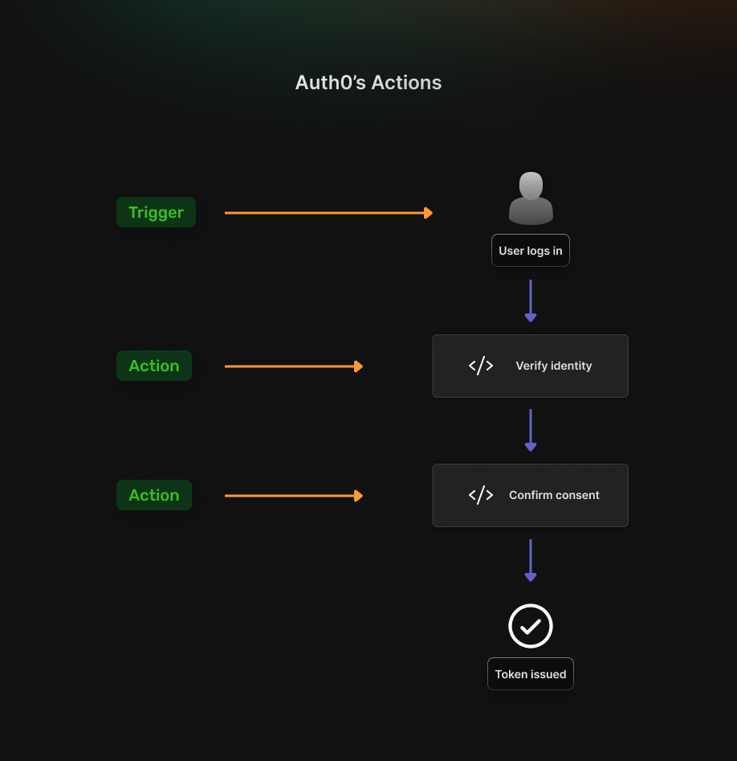
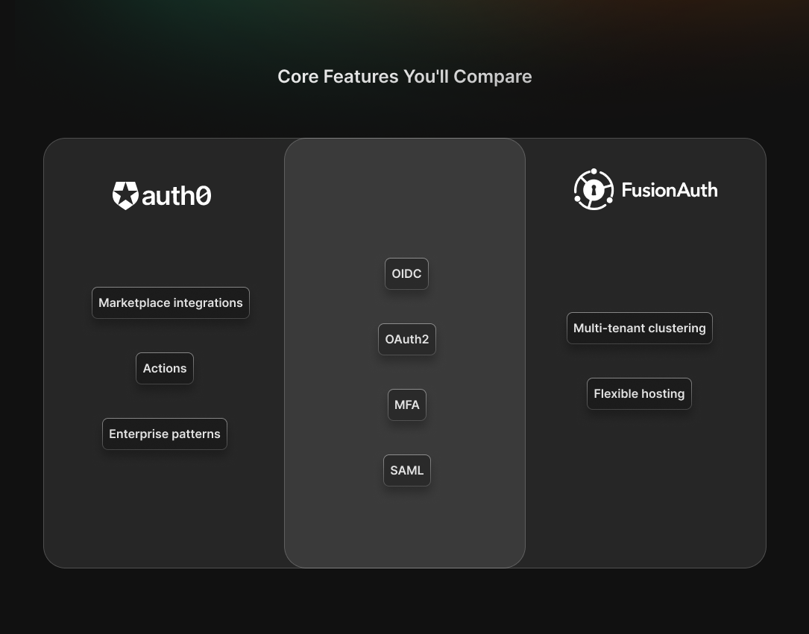

Selecting between managed authentication services and self-hosted solutions requires evaluating trade-offs between operational convenience and infrastructure control. The Auth0 vs FusionAuth comparison highlights a fundamental choice: comprehensive SaaS simplicity versus flexible deployment with data sovereignty.

Both platforms deliver enterprise-grade authentication, but they serve different organizational priorities. Understanding where each solution excels helps teams align authentication architecture with business requirements and technical constraints.

## **Auth0 vs FusionAuth: Where Each Fits**

[Auth0](https://auth0.com/) (now part of Okta) provides broad enterprise CIAM (Customer Identity and Access Management) through hosted Universal Login, extensive ecosystem integrations, and comprehensive add-ons. The platform excels when organizations need mature SSO and MFA capabilities with minimal infrastructure management. Auth0\'s strength lies in its ecosystem breadth and battle-tested enterprise patterns that work immediately after configuration.

[FusionAuth](https://fusionauth.io/) delivers flexible CIAM capabilities with a strong focus on developer control and deployment choice. It fits best when organizations want to own their user data, deploy within their own infrastructure or VPC, and maintain predictable costs over time. FusionAuth's API-first design and consistent feature set across self-hosted and cloud environments make it ideal for engineering-driven teams that value customization, transparency, and full control of their authentication stack.

The distinction matters: Auth0 optimizes for operational simplicity through managed SaaS, while FusionAuth prioritizes deployment flexibility and cost transparency through self-hosting capabilities.

## **Pricing and Packaging Signals to Verify**

Pricing transparency and structure significantly affect long-term total cost of ownership as authentication requirements evolve.

**Auth0 pricing** follows enterprise SaaS conventions with public pricing pages supplemented by tier-specific feature gates. Organizations
should examine MAU (Monthly Active Users) tier thresholds, add-on costs for MFA, Organizations, and SSO, and plan change implications documented in Auth0\'s blog posts. [Enterprise plans typically start around \$30,000 annually](https://www.infisign.ai/reviews/auth0?), with features like advanced MFA or custom domains residing in higher tiers.

**FusionAuth pricing** emphasizes transparency with clear feature splits between editions. The **Community edition is free for unlimited users** when self-hosted. FusionAuth's **cloud plans** start at **\$37/month** (billed annually) for the **Basic** tier, while higher-tier self-hosted and enterprise plans begin at higher price points depending on usage and features. Paid self-hosted tiers and FusionAuth Cloud plans list features explicitly, reducing pricing surprise as deployments scale.

**SuperTokens** offers an alternative pricing model with open-source core features available for free self-hosting. The managed cloud service provides low monthly active user costs with predictable scaling, while self-hosted deployments incur only infrastructure expenses. This model works particularly well for teams wanting enterprise-grade authentication without SaaS vendor lock-in or unpredictable cost escalation.

## **Deployment and Data Control**

The hosting model determines infrastructure responsibility, data residency options, and operational complexity.

-   **Auth0 operates as a multi-tenant SaaS** with hosted Universal Login implementing redirect-based authentication flows. This approach simplifies operations&mdash;no infrastructure to manage, automatic updates, and minimal operational overhead. However, multi-tenant architecture means reduced control over data location, update timing, and infrastructure customization. Organizations with strict data residency requirements or compliance mandates requiring on-premises deployment may find this model constraining.
-   **FusionAuth emphasizes deployment flexibility** through self-hosting on private cloud or on-premises infrastructure, or FusionAuth Cloud for managed hosting. Self-hosting provides complete control over data location, update schedules, and infrastructure configuration. Organizations can deploy FusionAuth in specific geographic regions, integrate with existing security infrastructure, and maintain full audit trails within their own systems. This portability becomes essential for organizations with regulatory requirements mandating data sovereignty or those preferring infrastructure control.

## **Developer Experience and Customization**

Implementation approach and customization capabilities affect both initial development velocity and long-term maintenance requirements.

-   **Auth0\'s Actions system** replaced the legacy Rules and Hooks architecture, providing extensibility for authentication flows. Hosted login pages support theming and customization within Auth0\'s framework. Organizations should track deprecation notices and migration requirements&mdash;for example, the WCAG-compliant UI transition in 2025 required updates for customized login pages. The hosted approach accelerates initial implementation but can constrain complex customization requirements.
-   **FusionAuth\'s API-first architecture** provides extensive customization capabilities through comprehensive REST APIs. The platform supports multiple Identity Providers through OIDC, SAML, and social login integrations with detailed SSO implementation guides. Developer reviews frequently praise FusionAuth\'s API design and documentation quality, noting that the API-centric approach enables integration patterns beyond what hosted solutions typically support.

## **Core Features You\'ll Compare**

Both platforms implement authentication fundamentals, with difference emerging in enterprise features and deployment models.

**Common capabilities** include:

-   OIDC and OAuth 2.0 support for modern authentication flows
-   SAML integration for enterprise identity providers
-   Multi-factor authentication options (varies by tier)
-   Organization and tenant management (tier-specific features)
-   User profile management and administration

**Platform-specific strengths:**

Auth0 provides ecosystem breadth through an extensive marketplace, Actions for workflow customization, and mature enterprise patterns developed over years of production use. The platform\'s integration library covers most enterprise identity providers and SaaS applications commonly used in enterprise environments.

FusionAuth\'s tenant model enables multi-tenant deployments with isolation and customization per tenant. Self-hosted clustering and high-availability options in paid tiers support production deployments requiring redundancy. The platform\'s deployment flexibility allows organizations to architect an authentication infrastructure matching specific reliability and performance requirements.

## **Quick Scenarios (Map to Your Shortlist)**

-   **Organizations requiring comprehensive enterprise SSO and complex identity integrations** should evaluate Auth0 first. The ecosystem depth and add-on library accelerate the implementation of enterprise identity provider connections and third-party service integrations. Auth0\'s hosted approach works well when operational simplicity takes priority over infrastructure control.
-   **Organizations prioritizing VPC deployment, data control, and predictable costs** benefit from evaluating FusionAuth. The free self-hosted Community edition enables proof-of-concept without cost commitment, while transparent paid plan pricing supports accurate budget forecasting. FusionAuth works particularly well for organizations with existing infrastructure expertise comfortable managing authentication services.
-   **Organizations uncertain about requirements** should conduct parallel evaluations using identical success metrics. Measure time to first login, SSO and MFA enablement complexity, and total cost at projected MAU scales. Aggregate signals from third-party review platforms regarding support responsiveness and developer experience quality to supplement technical evaluation.

## **Open-Source, Self-Hosted Alternative (SuperTokens)**

[SuperTokens](https://supertokens.com/) represents a third architectural approach worth considering for organizations with specific
requirements around control and flexibility.

**SuperTokens belongs in this comparison** because it provides open-source core features with options for self-hosting or managed cloud deployment. The platform offers predictable pricing&mdash;free for self-hosted open-source features with low MAU costs for cloud hosting. Deep customization capabilities enable implementation of authentication flows beyond what pre-configured platforms typically support.

**SuperTokens makes sense when:**

-   Portable JWKS and tokens on your own domain matter for infrastructure independence
-   Full control over authentication implementation is required without rebuilding sessions and MFA from scratch
-   A hybrid approach combining self-hosted authentication with managed convenience fits organizational requirements
-   Avoiding vendor lock-in justifies investment in authentication infrastructure management

SuperTokens provides modern SDKs, pre-built UI components, and comprehensive [documentation](https://supertokens.com/docs) while maintaining the flexibility of open-source software. This approach works well for organizations comfortable managing authentication infrastructure but wanting to avoid building authentication systems entirely from scratch.

## **Conclusion**

The Auth0 vs FusionAuth decision depends on four main factors: pricing transparency, hosting preferences, customization needs, and data portability. Auth0's enterprise SaaS model offers operational ease but can lead to unpredictable costs as usage grows, while FusionAuth's transparent pricing and free Community edition improve budget control.

Auth0 simplifies infrastructure through managed hosting, whereas FusionAuth's self-hosting grants full control at the cost of maintenance responsibility.

Auth0's ecosystem speeds up standard integrations, while FusionAuth's API-first design supports deeper customization. For long-term flexibility, self-hosted solutions like FusionAuth or SuperTokens provide stronger portability. Organizations should run pilot tests to
evaluate all three against their unique needs.

***The best authentication solution balances operational convenience with strategic control, matching technical capabilities to organizational requirements rather than choosing based on feature checklists alone.***
