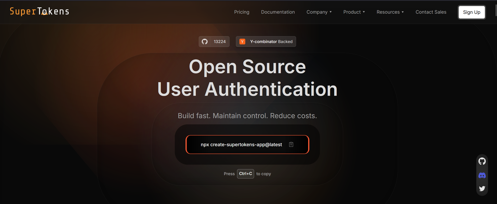
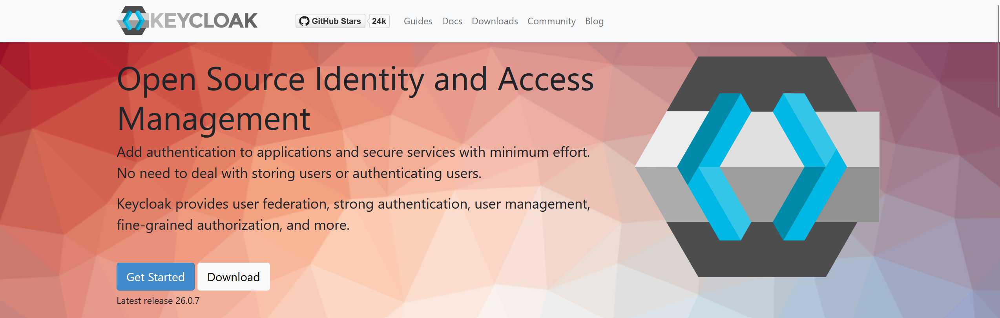
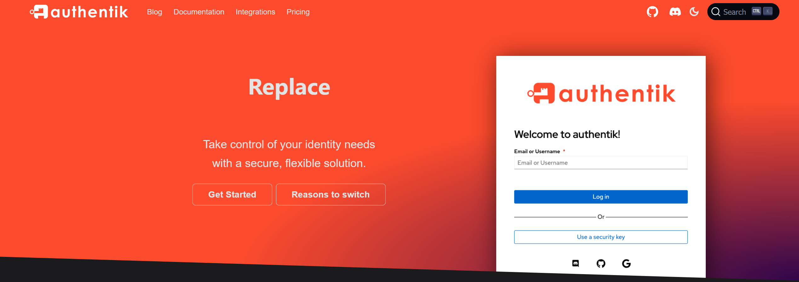
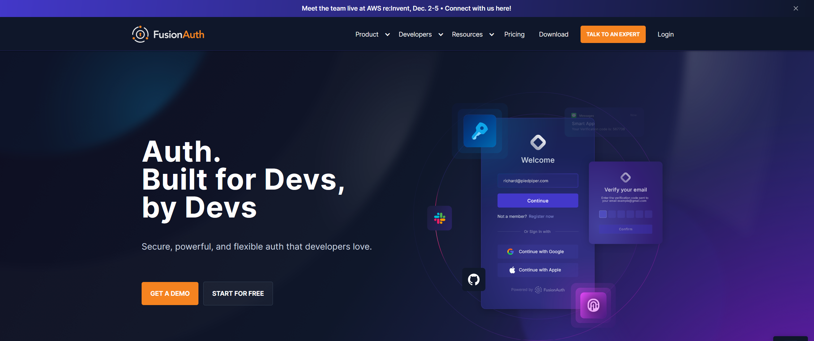
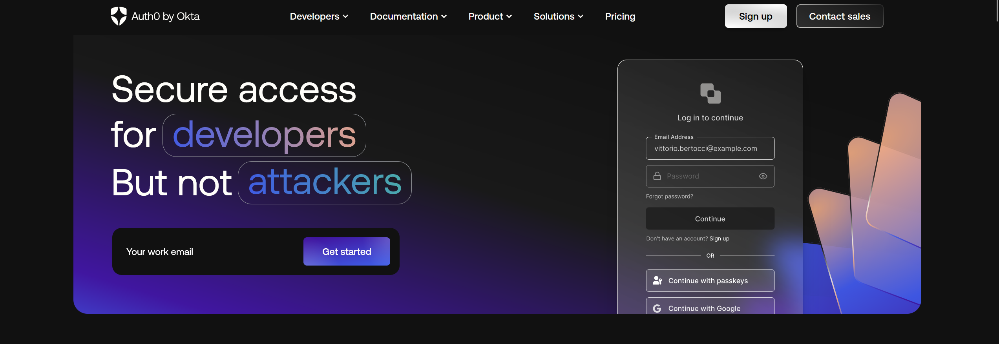
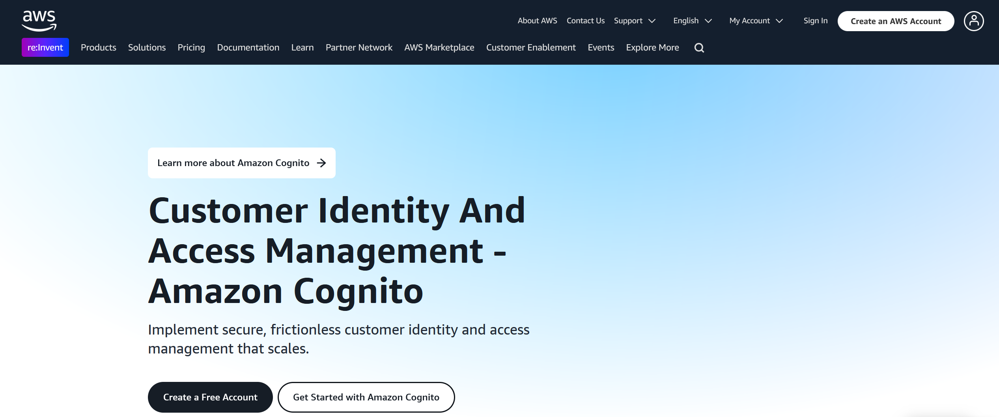

## Table of Contents

- [Introduction](#introduction)
- [**1. SuperTokens**](#1-supertokens)
   * [**Key Features:**](#key-features)
   * [**Pricing:**](#pricing)
   * [**Limitations:**](#limitations)
- [**2. Keycloak**](#2-keycloak)
   * [**Key Features:**](#key-features-1)
   * [**Pricing:**](#pricing-1)
   * [**Limitations:**](#limitations-1)
- [**3. Authentik**](#3-authentik)
   * [**Key Features:**](#key-features-2)
   * [**Pricing:**](#pricing-2)
   * [**Limitations:**](#limitations-2)
- [**4. FusionAuth**](#4-fusionauth)
   * [**Key Features:**](#key-features-3)
   * [**Pricing:**](#pricing-3)
   * [**Limitations:**](#limitations-3)
- [**5. Okta**](#5-okta)
   * [**Key Features:**](#key-features-4)
   * [**Pricing:**](#pricing-4)
   * [**Limitations:**](#limitations-4)
- [**6. Auth0**](#6-auth0)
   * [**Pricing:**](#pricing-5)
   * [**Limitations:**](#limitations-5)
- [**7. Amazon Cognito**](#7-amazon-cognito)
   * [**Pricing:**](#pricing-6)
   * [**Limitations:**](#limitations-6)
- [**Making the Right Choice**](#making-the-right-choice)

## Introduction

Authentication servers form the backbone of modern application security and developers are looking for strong and flexible options that offer more than just simple password protection. Authelia is a good choice, but many organizations are checking out other options that might fit their needs better, whether that means having more features, different pricing plans, or easier integrations.

According to recent[ security statistics from IBM](https://www.ibm.com/security/data-breach), compromised credentials remain the most common attack vector for data breaches, accounting for nearly [16% of all incidents](https://www.zscaler.com/blogs/product-insights/7-key-takeaways-ibm-s-cost-data-breach-report-2024#:~:text=Notable%20stats%3A%C2%A0Credential%2Dbased%20attacks%20were%20the%20most%20common%20attack%20vector%2C%20accounting%20for%C2%A016%25%20of%20all%20breaches.). This underscores the critical importance of choosing the right authentication solution for your organization.

In this blog, we're going to look at the top 7 alternatives to Authelia. Each one has its own strengths and is designed to meet different needs for security, scalability, and ease of use. Whether you're a startup looking for a simple solution that works well for developers or a large company with complex identity and access management needs, you'll find plenty of choices for secure authentication. We’ll go over the main features, pricing, pros and cons of each option to help you decide what’s best for your authentication strategy.

## **1. SuperTokens**

SuperTokens has emerged as a powerful contender in the authentication space, particularly for organizations prioritizing secure session management and user data protection. Unlike traditional solutions, SuperTokens offers a unique approach to handling user sessions through rotating refresh tokens, making it significantly harder for attackers to exploit stolen credentials.

### **Key Features:**

- **Advanced Session Management**: SuperTokens offers rotating refresh tokens for heightened security. If a token is compromised, it’s immediately invalidated, preventing potential session hijacking.

- **Comprehensive MFA Support**: Supports various[ multi-factor authentication methods](https://supertokens.com/blog/benefits-of-multi-factor-authentication), including Time-based One-Time Passwords (TOTP). This MFA can adapt based on factors like login location and device.

- **Developer-First Approach**: Provides extensive documentation and SDKs for popular frameworks

- **Customizable User Flows**: Offers flexibility in implementing[ various authentication types](https://supertokens.com/blog/types-of-authentication)

- **Self-Hosting Option**: Gives complete control over data and infrastructure

- **Passwordless Authentication**: Supports modern[ email magic links](https://supertokens.com/features/email-magic-links) for seamless login experiences

### **Pricing:**

- The [self-hosted](https://supertokens.com/blog/self-hosted-authentication) version is free and open-source

- Managed service available with tiered pricing based on usage

- Enterprise features available for larger implementations

### **Limitations:**

- Some enterprise-level features might require additional configuration

- Community is growing but smaller compared to more established alternatives

## **2. Keycloak**

Keycloak is a proven and reliable tool for managing identity and access, perfect for businesses of all sizes. It's open-source, which means it's flexible and can fit various needs, whether for a small app or a big system. With strong support for different protocols and lots of customization options, it gives organizations the control they need over their authentication processes.

### **Key Features:**

- **Comprehensive Protocol Support**: Delivers enterprise-grade implementation of OAuth2, OpenID Connect, and SAML protocols. Organizations can use multiple protocols simultaneously, making it easier to support legacy systems while adopting modern authentication standards.

- **User Federation**: Seamless integration with LDAP and Active Directory

- **Social Login**: Built-in support for major social identity providers like Google, Facebook, and GitHub.

- **Custom Authentication Flows**: It allows the creation of complex authentication flows configured in the Keycloak Admin Console by adding authenticators, sub-flows, and custom rules directly, with custom Java code options for advanced requirements. This supports multi-step and conditional authentication setups too.

- **Admin Console**: Intuitive interface for managing users and configurations

- **Clustering Support**: Implements true high availability through active-active clustering, supporting large-scale deployments. The system handles session replication and failover automatically, ensuring continuous service availability.

### **Pricing:**

- Free and open-source

- Commercial support is available through Red Hat

- Optional enterprise consulting services

### **Limitations:**

- The initial setup can be complex

- Requires significant resources for optimal performance

- Developers may face a steep learning curve when working with advanced features

## **3. Authentik**

Authentik offers a new way to handle identity management that’s both modern and easy to use. It’s built for self-hosted setups and has strong access control features along with a user-friendly interface. What really makes Authentik stand out is how it simplifies complicated authentication processes while still providing all the features you'd expect from a top-tier solution. Plus, its focus on Docker makes it a great choice for teams that are into modern deployment methods.

### **Key Features:**

- **Flexible Policy Engine:** Create advanced access control rules based on user details, time, location, and more with an easy-to-use builder. 

- **Built-in Application Catalog:** Access ready-to-use integration templates for popular apps, complete with setup guides and automated technical management.

- **Automated User Provisioning:** Simplify user account management with automated creation, updates, and disabling across apps based on your rules. 

- **Custom Branding:** Personalize the login experience with customizable layouts, colors, and the option to add custom CSS or JavaScript.

- **Docker-First Deployment:** Enjoy consistent setup across environments with included Docker and Kubernetes deployment files.

- **Event Export:** Track activities with detailed logs and export events for monitoring along with real-time notification webhooks.

### **Pricing:**

- The core version is free and open-source

- Enterprise and Enterprise Plus tiers are available with additional features

- Support packages are offered separately

### **Limitations:**

- Primarily focused on self-hosted deployments

- Some enterprise features are only available in paid tiers

- Smaller ecosystem compared to major competitors

## **4. FusionAuth**

FusionAuth delivers a compelling blend of powerful features and developer-friendly implementation. This authentication solution stands out for its attention to unique use cases, such as family accounts and complex user relationships. Built to handle sophisticated authentication scenarios while maintaining ease of use, FusionAuth particularly excels in situations requiring deep customization of the authentication experience.

### **Key Features:**

- **Advanced Password Security**: Offers breach detection, password strength checks, and customizable password rules, enforcing security policies and automatically checking passwords against known breaches.

- **Comprehensive API**: Provides a robust RESTful API covering all UI functionalities, with extensive documentation, client libraries, and integration examples.

- **Theme Management**: Allows for flexible theming with support for multiple themes, enabling customized branding for various applications and user groups.

- **Family Support**: Supports family relationships and parental controls, handling consent, access restrictions, and family account linking in line with COPPA compliance.

- **Advanced Analytics**: Provides in-depth insights into user behavior and login patterns through interactive dashboards, tracking failed attempts and engagement metrics.

- **Webhook System**: Integrates with external systems in real-time via a flexible webhook system, allowing custom notifications and complex automation.

### **Pricing:**

- Free tier available for basic usage

- Usage-based pricing for additional features

- Enterprise plans for larger implementations

### **Limitations:**

- Limited field-specific filtering in user searches

- Some advanced features require paid tiers

- Setup complexity can increase with custom requirements

## **5. Okta**

Okta has become a popular choice for companies when it comes to managing identity and access. It offers a wide range of services for authentication and authorization. What sets Okta apart is its ability to provide a strong and flexible solution that meets the needs of larger organizations without being too complicated to use. It combines top-notch security with the ability to work well with various tech systems, making it a great fit for many businesses.

### **Key Features:**

- **Universal Directory**: Centralized user management with custom schemas, rich profiles, and automatic profile enrichment. Supports custom attributes, group hierarchies, and advanced segmentation, with real-time sync across connected applications.

- **Adaptive MFA**: Context-aware, risk-adaptive authentication using device, location, and behavior data. Supports custom risk profiles and automated step-up authentication.

- **Lifecycle Management**: Automates user journeys with workflow automation, role-based access control, and audit trails. Updates access across integrated applications in real-time.

- **API Access Management**: Secures APIs via OAuth 2.0 and OpenID Connect, with token management, rate limiting, and API analytics.

- **Advanced Reporting**: Provides custom dashboards and scheduled reports for insights on user activity, authentication patterns, and security events.

- **Okta Integration Network**: Connects with thousands of apps, providing easy access management and integration for secure, unified application access across the organization.

### **Pricing:**

- Premium pricing structure

- Custom enterprise pricing based on requirements

- Volume discounts available

### **Limitations:**

- Higher cost compared to other solutions

- May be overly complex for smaller implementations

- Limited self-hosting options

## **6. Auth0**

Auth0 has carved out its niche by focusing on developer experience without compromising on security features. This authentication platform simplifies the implementation of complex authentication flows while providing the flexibility needed for custom solutions. Plus, with its detailed documentation and ready-made components, it’s super appealing for teams that want to set up authentication quickly without stressing over the technical stuff.

**Key Features:**

- **Rules Engine**: Customizable JavaScript-based rules engine for tailored authentication flows and real-time user profile modifications, with pre-built templates.

- **Lock Widget**: Customizable, mobile-friendly authentication interface that accelerates deployment and maintains consistent branding.

- **Extensive SDKs**: Development kits for multiple languages with authentication flows, token handling, and debugging tools.

- **Social Connections**: Easy integration with 30+ social identity providers, supporting OAuth and profile linking.

- **Anomaly Detection**: Detects suspicious activity with brute force protection, IP blacklisting, and real-time security alerts.

- **Breached Password Detection**: Monitors passwords against breaches and enforces custom security policies for compromised accounts.

### **Pricing:**

- A free tier with basic features

- Pay-as-you-go pricing based on active users

- Enterprise plans available

### **Limitations:**

- Costs can increase significantly with user growth

- Limited control over infrastructure

- Some features are restricted to higher tiers

## **7. Amazon Cognito**

Amazon Cognito is a user-friendly authentication service that works well for organizations using AWS. It helps manage user identities and connects easily with other AWS services. Cognito is great for cloud-based applications, offering a mix of simplicity and advanced features. It provides user authentication for both web and mobile applications, making it a solid choice for teams that already know their way around AWS and want a straightforward login solution.

**Key Features:**

- **User Pools**: Comprehensive user directory with registration, authentication, and Lambda-based security customization.

- **Identity Pools**: Secure management of temporary AWS credentials with fine-grained IAM roles for user access.

- **AWS Integration**: Deep integration with AWS services, supporting Lambda customization and serverless workflows.

- **Scalable Infrastructure**: Automatically scales for millions of users, ensuring high availability and easy backup.

- **Security Features**: Adaptive authentication with account lockouts and event logging.

- **Advanced Security**: Risk-based authentication that detects suspicious behavior with step-up authentication and real-time alerts.

### **Pricing:**

- Free tier available (up to 50,000 MAUs)

- Pay-as-you-go pricing model

- Volume-based discounts

### **Limitations:**

- Complex setup for non-standard use cases

- Limited customization options

- Primarily designed for the AWS ecosystem

## **Making the Right Choice**

When selecting an Authelia alternative, consider these key factors:

1. **Deployment Requirements**: Whether you need self-hosted or managed solutions

2. **Scalability Needs**: Current and projected user base

3. **Integration Requirements**: Compatibility with existing systems

4. **Budget Constraints**: Total cost of ownership

5. **Technical Expertise**: Available resources for implementation and maintenance

The world of authentication is changing all the time, and each option has its own perks. Big companies usually lean towards all-in-one solutions like Okta or Auth0. On the other hand, organizations that want more control and flexibility often prefer options like SuperTokens or Keycloak.

Ready to upgrade your authentication system? Explore [SuperTokens](https://supertokens.com/product) today for a secure, scalable, and developer-friendly alternative to Authelia. With its robust session management capabilities and flexible deployment options, SuperTokens offers a modern solution for today's authentication challenges. Sign up today!
