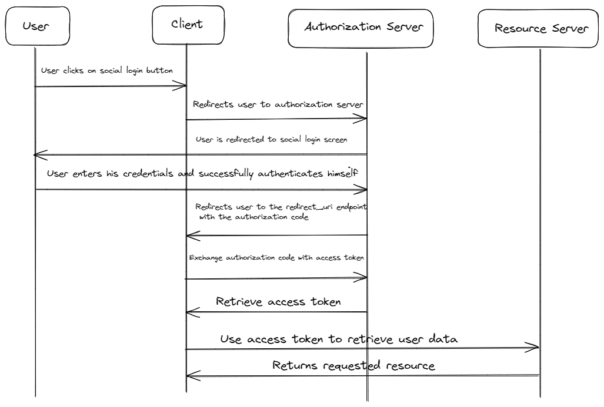
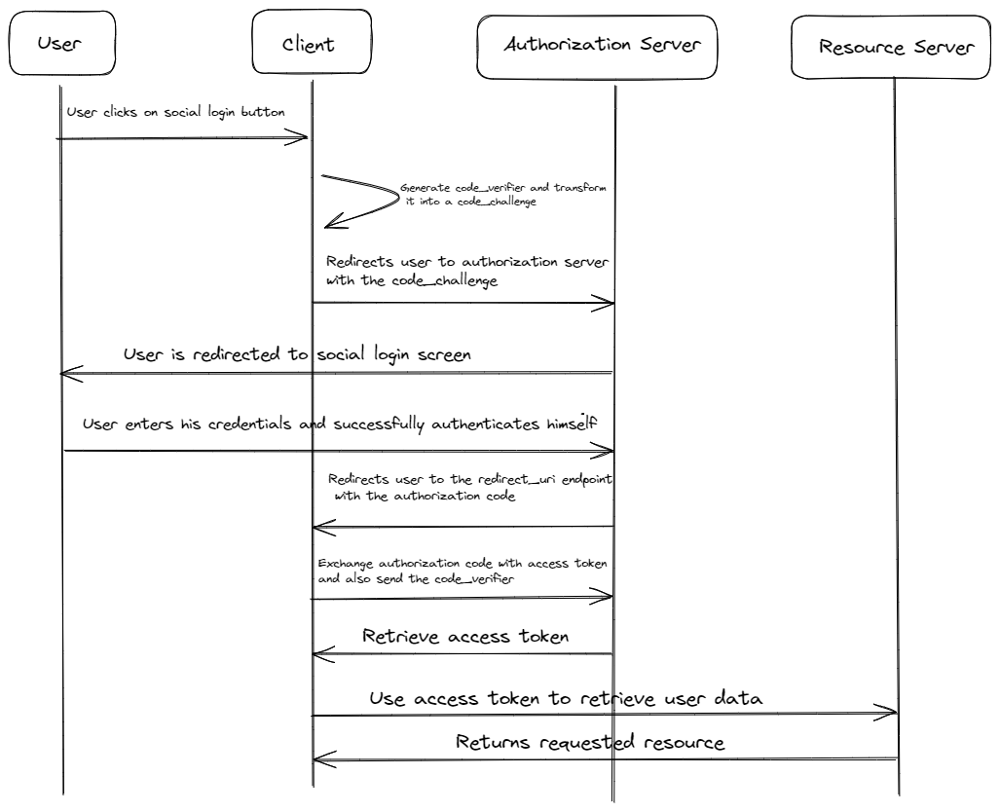

In the authentication space, password based authentication is considered to be the least secure. Most users tend to reuse passwords and not use password managers. This is why [federated identity](https://en.wikipedia.org/wiki/Federated_identity) has gain an increase in popularity in the last decade. OAuth is a a protocol that enables identity federation allowing applications and is key enabling the social login flows we interact with on a daily basis. Although it is very popular, there are a few critical concerns around OAuth and OAuth with Authorization Code flow. This is where Authorization Code flow with Proof Key for Code Exchange comes in.

## What are the security concerns with OAuth?

The authorization code grant flow in OAuth 2.0 is actually quite secure.

In this method, after the user is redirected from the client server and authenticates with the authorization server an authorization code is given to the user. The client server exchanges the authorization code with the client id and secret to receive an access token.

This is fine for most web applications which have a backend server and the client id and client secret are not exposed. The problem comes up with embedded systems and mobile applications. In these cases the client id and client secret can be exposed. This means that if the authorization code is intercepted by an attacker, they can now generate an access token and request information about the user.

## How does PKCE solve this issue?

The problem with authorization code flow, as mentioned above, is that the client secret and client id can be accessed on public clients(de-compiled from mobile apps or embedded systems). PKCE tackles this problem by getting rid of client secrets all together. Instead when the user gets redirected to the identity server, the public client also generates a unique code called a `code_verifier` and from it generates a `code_challenge` which is sent to the identity server. After the identity server verifies the user, it will store the `code_challenge` and issue an authorization code. Now when the client goes to exchange the authorization code for an access token, they will also need to send along the `code_verifier` which will be validated by the identity server against the stored `code_challenge` before it issues an access token. This way even if an attacker intercepts the authorization code, they will not be able exchange it for an access token since they do not have the `code_verifier`.

## How does PKCE work?

### Step 1: Authorization Request and PKCE Challenge creation:

- The user initiates the flow by clicking on the social login button.
- The client will generate a unique code called a `code_verifier`. This client will proceed to hash the `code_verifier`. This value is called a `code_challenge` and is sent to the Identity provider, during the authorization request.
 
### Step 2: User Authentication:

- The user is redirected to the identity providers login screen along with the `code_challenge` and the hashing method. This is stored by the identity provider.
- On successful verification, the user is redirected back to the client with an authorization code.

### Step 3: Token Exchange:
- To get the access token from the identity provider, the client will send over the authorization code along with the original `code_verifier`.
- The server verifies the authorization code and will hash the `code_verifier`(using the hashing method shared in Step 2) and compare it to the stored value, ensuring that the client initiating the token exchange is the same one that initiated the authorization request.

## What are the problems PKCE solves

**Code Interception**: In the standard Authorization Code Flow, a malicious actor can intercept the authorization code during transmission between the authorization server and the client. PKCE negates the fallout of this attack by ensuring that the unique `code_verifier` is needed which is only known by the client and is dynamically generated for each auth request, so it cannot be guessed.

**Client Secrecy**: It removes the reliance of a client secret during the token exchange. So now clients do not store a client secret and are not vulnerabilities.

## Conclusion
 
Federated identity with the OAuth protocol's popularity has made it a popular choice for auth due to its ease of use and security benefits. Therefore it's imperative that it is updated whePKCE n vulnerabilities are discovered. With the rise of single page applications and the prevalence of embedded systems.