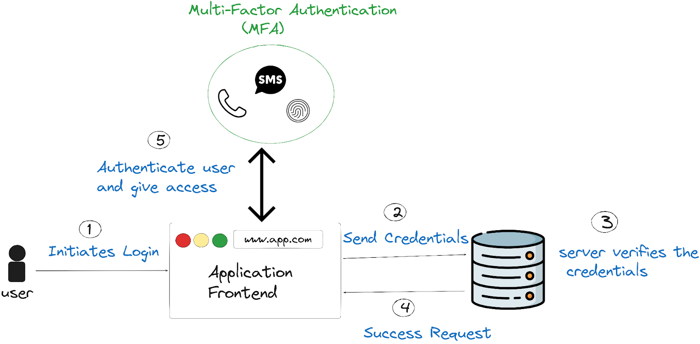

## Table of Contents

- [Introduction](#introduction)
- [What Is Multi-Factor Authentication (MFA)?](#what-is-multi-factor-authentication-mfa)
- [Types of Multi-Factor Authentication](#types-of-multi-factor-authentication)
- [10 Benefits of Multi-Factor Authentication](#10-benefits-of-multi-factor-authentication)
- [Problems With Traditional Security Mechanisms and How MFA Solves Them](#problems-with-traditional-security-mechanisms-and-how-mfa-solves-them)
- [Designing Multi-Factor Authentication Without Sacrificing Good UX](#designing-multi-factor-authentication-without-sacrificing-good-ux)
- [Real-world Use Cases of Multi-Factor Authentication](#real-world-use-cases-of-multi-factor-authentication)
- [The Future of Secure Access: What to Expect for MFA?](#the-future-of-secure-access-what-to-expect-for-mfa)
- [Getting Started with MFA in 2024](#getting-started-with-mfa-in-2024)
- [Conclusion](#conclusion)

## Introduction

In 2022, over [80% of data breaches](https://www.verizon.com/business/en-gb/resources/2022-data-breach-investigations-report-dbir.pdf) were attributed to compromised passwords.

Although email-password based authentication has become the de facto method for authentication, it is very vulnerable to attacks. Through phishing, keylogging or simple brute-force attacks, traditional authentication mechanisms can be exploited to gain access to a users account. This is why modern platforms like Google, Amazon and Netflix have moved towards MFA or multi-factor authentication.

## What Is Multi-Factor Authentication (MFA)?

Multi-Factor Authentication is a security mechanism that requires users to provide two or more verification factors to gain access to a resource such as an application, online account, or VPN. Unlike traditional password-based systems, MFA adds extra layers of security, significantly reducing the risk of unauthorized access.



### Types of Multi-Factor authentication

With Multi-factor authentication, the user would have to prove their identity through multiple forms of identification. The basic idea is that adding challenges to the authentication flow exponentially increases the difficulty of the account being compromised.

These additional forms of authentication can be based of the following types:

1. What you know. Example: An email and password combination
2. What you possess: A credit / debit card, a hardware key (Yubikey)
3. What you are: Biometrics such as fingerprints or retinal scans

The implementation of additional factors is a tradeoff between security and user experience. While not always true, higher security leads to a more cumbersome user experience. We’ll evaluate the security and UX tradeoffs associated with different authentication factors

### Common MFA methods include

1. **SMS or email-based one-time passwords (OTP)**: The system sends a unique code via text message or email. While convenient, this method is vulnerable to interception.
2. **Authenticator apps generating time-based one-time passwords (TOTP)**: These apps generate short-lived codes on the user's device. They're more secure than SMS but require the user to have a compatible device.
3. **Hardware tokens**: Physical devices that generate codes or use cryptographic techniques. They're highly secure but can be inconvenient and costly to implement.
4. **Biometric authentication**: Uses physical characteristics like fingerprints, facial features, or voice patterns. It's user-friendly and difficult to forge, but implementation can be expensive.
5. **Push notifications to registered devices**: The system sends a notification to a pre-registered device, which the user must approve. This method is user-friendly and secure, but relies on the user having access to their registered device.

## 10 Benefits of Multi-Factor Authentication

### 1. Enhanced Security

The primary benefit of MFA is the significant improvement in security it offers. By requiring multiple forms of verification, MFA creates a multi-layered defense that is much more difficult for unauthorized users to breach. Even if an attacker manages to obtain one factor (such as a password), they would still need to overcome additional barriers to gain access.

### 2. Reduced Risk of Unauthorized Access

MFA significantly mitigates the risk of unauthorized access, even if credentials are compromised. According to a report by Microsoft, implementing MFA can block 99.9% of automated attacks on accounts. This statistic demonstrates the powerful impact MFA has on preventing account takeovers, making it an essential tool in modern cybersecurity strategies.

### 3. Protection Against Phishing Attacks

MFA provides robust protection against phishing attacks, one of the most common cyber threats. Even if a user accidentally reveals their password to a phishing site, the additional authentication factors required by MFA can prevent attackers from gaining access to the account. This added layer of security is crucial in an era where phishing attempts are becoming increasingly sophisticated.

### 4. Customizable Security Policies

MFA offers organizations the flexibility to tailor security measures based on various factors such as user roles, location, or data sensitivity. This customization allows for a balanced approach to security, where high-risk activities or sensitive data access can be protected with additional or more robust authentication factors, while routine access remains user-friendly. For instance, a company might require biometric verification for financial transactions but only a push notification for accessing general company announcements, ensuring security without sacrificing convenience.

### 5. Enhanced User Trust and Confidence

In an era where data breaches are frequently in the news, implementing MFA can significantly boost user trust. Customers and employees alike appreciate knowing that their sensitive information is protected by more than just a password. This increased confidence can lead to improved customer loyalty and employee satisfaction.

### 6. Ease of Integration and Usability

Modern MFA solutions are designed with user experience in mind. Many can be seamlessly integrated into existing systems and applications, providing enhanced security without sacrificing usability. With options like biometric authentication and push notifications, MFA can often be more convenient than traditional password-only systems.

### 7. Cost-Effectiveness

While implementing MFA does require some investment, it is often far less costly than dealing with the aftermath of a security breach. The potential savings in terms of prevented data loss, regulatory fines, and reputational damage make MFA a cost-effective security measure in the long run. Interestingly, a study by IBM found that the average cost of a data breach in 2024 was $5.17 million, while the cost of implementing MFA is typically a fraction of this amount, often less than $50 per user annually.

### 8. Future-Proof Security

As cyber threats continue to evolve, MFA provides a flexible framework that can adapt to new security challenges. Many MFA systems can be updated to incorporate new authentication methods as they become available, ensuring that security measures remain effective against emerging threats.

### 9. Reduced Impact of Password Fatigue

MFA can alleviate some of the pressure associated with creating and remembering complex passwords for multiple accounts. While strong passwords remain important, the additional factors in MFA mean that security doesn't rely solely on password strength, potentially reducing password fatigue among users.

### 10. Improved Access Management

MFA systems often come with robust access management features, allowing organizations to have granular control over user permissions. This enables better monitoring of access attempts, easier management of user accounts, and the ability to quickly revoke access when needed.

## Problems With Traditional Security Mechanisms and How MFA Solves Them

According to the Verizon data breach investigation report of 2022, “There’s been an almost 30% increase in stolen credentials since 2017, cementing it as one of the most tried-and-true methods to gain access to an organization for the past four years.”

Further, exploiting vulnerability attributes for almost 20% of methods to access an organization. And finally, brute force attacks still contributed to more than 10% of all attacks.

Once a hacker obtains a user’s login credentials, they can access sensitive information which they can abuse to get more information about the user, often leading to financial losses and reputational damage.

For instance, thousands of high-profile YouTube accounts got hacked in 2019-2020 through session hijacking and using privilege escalation to change account owners. That is why protecting sensitive actions like "changing account ownership" behind secondary factors is important. This common strategy used by many applications can reduce the fallout of a compromised account.

Traditional security mechanisms, primarily relying on username and password combinations, have several inherent weaknesses:

- **Single Point of Failure:** If a password is compromised, the entire account becomes vulnerable. MFA mitigates this risk by requiring additional factors, making it much harder for attackers to gain unauthorized access even if they obtain the password.
- **Password Reuse:** Users often reuse passwords across multiple accounts, amplifying the impact of a single breach. MFA helps contain the damage from password reuse, as the additional factors are typically unique to each service.
- **Weak Passwords:** Despite guidelines, many users still choose easily guessable passwords. Attackers exploit this using dictionary attacks and advanced hardware for brute-force attempts. MFA provides a strong defense against these methods, as the additional factors are not susceptible to such attacks.
- **Phishing Vulnerability:** Traditional systems are susceptible to phishing attacks that trick users into revealing their credentials. MFA, especially when using hardware keys or biometrics, offers robust protection against phishing. Even if a user falls for a phishing attempt, the attacker won't have the additional factors needed to access the account.
- **Lack of User Verification:** Password-only systems cannot verify if the person entering the correct credentials is actually the authorized user. MFA addresses this by incorporating factors that are inherently tied to the user, such as biometrics or possession-based factors like a smartphone or hardware key.

### MFA addresses these issues by adding additional layers of security and verification

- **Biometric Factors:** Fingerprints, facial recognition, or iris scans provide a highly secure and user-friendly authentication method. These are extremely difficult to spoof, especially when combined with other factors.
- **Hardware Keys:** USB or NFC-based security keys offer a physical factor that must be present for authentication. These are highly resistant to remote attacks and phishing attempts.
- **Time-based One-Time Passwords (TOTP):** Apps like Google Authenticator generate temporary codes that change every 30 seconds, adding a dynamic layer of security.
- **Push Notifications:** Services can send authentication requests directly to a user's registered device, allowing for quick and secure approval of login attempts.

### It's important to note that while MFA significantly enhances security, it's not a silver bullet. Good cybersecurity practices remain crucial

- Using password managers to generate and store strong, unique passwords for each account.
- Staying vigilant about clicking links and checking domain names before entering credentials or performing sensitive actions.
- Keeping software and systems updated to protect against known vulnerabilities.
- Educating users about current threats and best practices for online security.

## Designing Multi-Factor Authentication Without Sacrificing Good UX

While security is paramount, it's crucial to implement MFA in a way that doesn't negatively impact user experience. Here are some strategies to achieve this balance:

- **Offer Multiple MFA Options:** Provide users with choices such as SMS, email, authenticator apps, or biometrics.
- **Implement Risk-Based Authentication:** Only trigger additional authentication factors when suspicious activity is detected.
- **Use Seamless Authentication Methods:** Leverage technologies like push notifications or biometrics that require minimal user interaction.
- **Provide Clear Instructions:** Ensure users understand how to set up and use MFA features.
- **Optimize for Mobile:** Design MFA processes that work smoothly on mobile devices.
- **Allow Remember Device Options:** Give users the ability to mark trusted devices to reduce the frequency of MFA prompts.
- **Implement Single Sign-On (SSO):** Combine MFA with SSO to reduce the number of times users need to authenticate.

By focusing on these aspects, organizations can implement robust MFA systems that enhance security without frustrating users.

## Real-world Use Cases of Multi-Factor Authentication

A good example of an MFA is corporate data protection. Companies use Security Assertion Markup Language (SAML) for Single Sign-On (SSO) authentication to allow employees to access multiple applications with one set of credentials.

Integrating MFA with SAML adds an extra layer of security. When employees access resources, they not only enter their credentials but also authenticate via a second factor. For example, an SMS or email passcode, or biometric verification. Adding a second factor ensures that only authorized personnel can access sensitive corporate data.

The same is true for [Lightweight Directory Access Protocol (LDAP)](https://supertokens.com/blog/what-is-ldap). Many organizations use LDAP to store and manage user access to different systems. Integrating MFA with LDAP means that when users try to access a system, they must provide additional authentication like an SMS or email passcode. Integrating LDAP with MFA is particularly useful in large organizations with complex access control requirements.

## The Future of Secure Access: What to Expect for MFA?

It’s almost certain that multi-factor authentication (MFA) will grow in popularity. Here’s what you can expect for MFA in the future:

- **Biometric Integration**

While biometric factors are already a part of MFA, they are expensive. However, market growth in biometric technology is projected to reach $55.42 billion by 2027, and including biometric sensors in mobile devices makes this technology more accessible than ever.

- **Adaptive and Contextual Authentication**

One downside of MFA is the friction it can add to the authentication experience. Multiple factors increase the likelihood of the user dropping off during the login process. Adaptive and Contextual MFA analyze patterns such as device use, location, and access times to dynamically increase the number of factors a user must go through to authenticate. If the system sees that the user is accessing his account from his personal computer from his usual IP address he may be presented with a single factor during authentication. If the user tries to authenticate from a different device and timezone, then additional factors may be provided to prove the user's identity.

In short, the future of MFA is expected to be more integrated with a strong focus on context and biometrics.

## Getting Started with MFA in 2024

[SuperTokens MFA](https://supertokens.com/docs/mfa/introduction) offering supports a number of auth factors like email/sms based OTP or TOTP as an auth factor.

It also supports the following features:

- Allow access to APIs only if multi factor auth has been completed.
- Allow access to frontend routes only if multi factor auth has been completed.
- Use pre-built UI or your own custom UI for the second auth factor.
- Allow individual users to choose if they want to enable multi factor auth or not.
- Step up authentication
- Separate MFA config per tenant
- SuperTokens MFA can also be customized to add the following features:
  - Account recovery using backup codes
  - Skipping MFA for trusted devices for a period of time.

You can test out how SuperTokens MFA works with our demo application. Get started by running the following command:

```
npx create-supertokens-app@latest --recipe=multifactorauth
```

You can find the complete documentation for [SuperTokens MFA here](https://supertokens.com/docs/mfa/introduction).

## Conclusion

Traditional authentication methods have become susceptible to cyber attacks. MFA acts as a roadblock, making it exponentially harder for an attacker to compromise an account. For this reason, many companies have made MFA a requirement.
SuperTokens is on a mission to make it easier for developers to add MFA capabilities to their applications.
