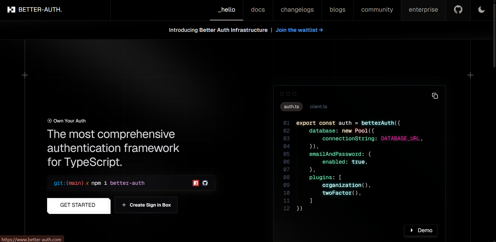
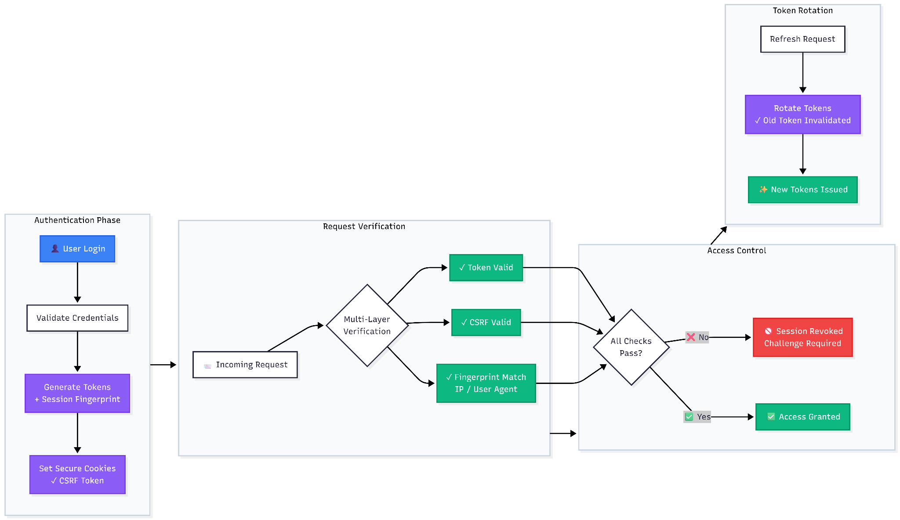
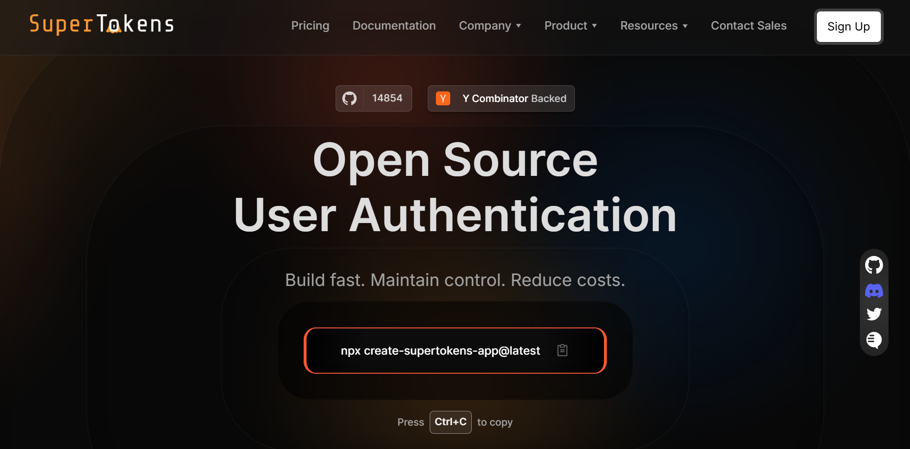

Authentication libraries proliferate in the JavaScript ecosystem, each promising simplified integration and developer-friendly APIs. [Better Auth](https://www.better-auth.com/) emerged as a lightweight, TypeScript-first authentication solution emphasizing framework agnosticism and plugin-based extensibility. Understanding its strengths, limitations, and ideal use cases helps developers make
informed decisions about authentication infrastructure.

Better Auth positions itself as a modern authentication library built from the ground up for TypeScript environments. It provides social login integration, two-factor authentication (2FA), organization and team management support, and a growing plugin ecosystem. The library\'s architecture prioritizes flexibility, allowing developers to compose authentication features through modular plugins rather than inheriting a monolithic framework.

## **Where Better Auth Shines**



Better Auth excels in specific scenarios where its design philosophy aligns with project requirements and team preferences. Understanding these strengths helps developers identify when Better Auth represents an appropriate choice.

### **TypeScript-Native Environments**

Better Auth delivers first-class TypeScript support with full type inference across authentication flows. Type definitions cover user objects, session data, authentication methods, and plugin configurations. Developers working exclusively in TypeScript ecosystems benefit from compile-time safety and IDE autocompletion throughout the authentication layer.

The library leverages TypeScript\'s type system to enforce correct plugin composition and configuration. This type-driven approach catches
configuration errors during development rather than runtime, reducing debugging cycles and improving confidence in authentication setup.

### **Framework-Agnostic Use Cases**

Better Auth intentionally avoids tight coupling to specific frameworks. While many authentication solutions optimize for Next.js or Express, Better Auth provides adapter patterns that work across multiple platforms:

- [Nextjs.org](https://nextjs.org/) (App Router and Pages Router)
- [SvelteKit](https://svelte.dev/docs/kit/introduction)
- [Remix](https://remix.run/)
- [Nuxt](https://nuxt.com/)
- [Astro](https://astro.build/)
- Standard Node.js servers

This framework independence appeals to teams using less common frameworks or those planning framework migrations. Authentication logic remains stable even when frontend or backend frameworks change.

### **DIY Extensibility via Plugins**

The plugin architecture enables developers to add authentication features incrementally. Core authentication remains minimal, with plugins providing:

- Social providers (Google, GitHub, Discord, etc.)
- Magic link authentication
- Two-factor authentication
- Rate limiting
- Audit logging
- Custom session storage backends

This modularity suits developers who prefer explicit control over included features and want to avoid bundling unused authentication
capabilities.

## **Where It\'s Still Maturing**

Better Auth\'s relative newness introduces challenges that established authentication solutions have already addressed through years of
production testing. Teams evaluating Better Auth should understand these limitations to make informed risk assessments.

### **Smaller Community and Fewer Integrations**

Better Auth launched relatively recently compared to established solutions like Passport.js, Auth.js (NextAuth), or SuperTokens. The
smaller community translates to:

- Fewer third-party plugins and extensions
- Less community-generated documentation and tutorials
- Slower issue resolution on GitHub
- Fewer Stack Overflow answers and blog posts
- Limited production case studies and reference architectures

Early adopters contribute significantly to ecosystem growth, but developers expecting comprehensive resources may find gaps in coverage
for edge cases or advanced configurations.

### **Emerging Session Security and Edge-Case Handling**

Session management security involves multiple layers: token generation, storage, rotation, revocation, and protection against various attack vectors. Better Auth implements basic session functionality but lacks some advanced security features present in mature authentication libraries:

- Automatic token rotation on privilege escalation
- Sophisticated session hijacking detection
- Built-in CSRF protection across all authentication flows
- Transparent handling of concurrent sessions across devices
- Grace periods for session revocation in distributed systems

These features exist in some form but may require additional plugin configuration or custom implementation. Security-conscious teams need to audit Better Auth\'s session handling thoroughly and potentially supplement it with additional security measures.

### **Limited Production Proof in Large-Scale Deployments**

Large-scale production deployments reveal authentication challenges invisible in development or small deployments:

- Session storage performance under high concurrency
- Database query optimization for user lookups
- Rate limiting effectiveness during sustained attacks
- Memory leak detection under long-running processes
- Edge case handling in distributed architectures

Better Auth\'s relative newness means fewer organizations have stress-tested it at scale. While the codebase may handle large deployments successfully, limited production data makes capacity planning and risk assessment more challenging.

## **Side-by-Side: Better Auth vs SuperTokens**

Understanding feature parity and architectural differences helps developers evaluate authentication solutions objectively.
| Feature              | Better Auth                                   | SuperTokens                                                                 |
|----------------------|-----------------------------------------------|-------------------------------------------------------------------------------|
| Session Management   | Basic cookie-based sessions with customizable storage | Advanced token theft detection, automatic rotation, anti-CSRF, and device tracking |
| Passwordless Support | Magic link via plugin                         | Built-in email/phone OTP, magic links, customizable templates                  |
| Plugin Ecosystem     | Modular plugin architecture for extensibility | Recipe-based architecture with battle-tested core + official recipes          |
| Hosting Options      | Self-hosted only                              | Self-hosted or managed cloud with BYO infrastructure support                  |
| TypeScript Support   | First-class with full type inference          | Strong TypeScript support across SDKs                                          |
| Framework Support    | Framework-agnostic adapters                  | Dedicated SDKs for React, Next.js, Node.js, Express, Vue, Angular              |
| Production Scale     | Early stage, limited large-scale deployments | Trusted in high-traffic production environments                                |
| Multi-Tenancy        | Plugin-based organization support             | Built-in multi-tenant recipes with tenant isolation                            |
| SSO / SAML           | Requires custom implementation or third-party plugins | Built-in enterprise SSO support                                        |
| Dashboard            | No built-in admin dashboard                   | Included user management dashboard                                             |
| Security Features    | Basic session security                        | OWASP-compliant flows, token rotation, hijack detection                        |
| Migration Tools      | Manual migration required                    | Built-in migration support for Auth0, Cognito, Firebase, Clerk                |
| License              | MIT                                           | Apache 2.0                                                                     |
| Community Size       | Growing, smaller community                   | Established community with extensive documentation                             |

**Session Management Deep Dive:**

Better Auth provides functional session management suitable for standard use cases. Sessions are stored in cookies or custom backends, and basic token validation ensures authenticated requests. However, advanced security scenarios require additional consideration:

- **Token Rotation**: Better Auth does not automatically rotate session tokens on security-sensitive operations
- **Anti-CSRF**: CSRF protection requires manual implementation or additional middleware
- **Session Hijacking**: Basic detection exists, but lacks the sophisticated anomaly detection found in mature systems
- **Concurrent Sessions**: Managing multiple active sessions across devices requires custom logic

SuperTokens implements these features natively with configurable policies, providing production-ready security without custom
development.

**Passwordless Authentication:**

Better Auth supports magic link authentication through plugins. Implementation requires:

1. Installing the magic link plugin
2. Configuring email provider integration
3. Setting up token generation and validation
4. Implementing email templates
5. Handling edge cases (expired links, multiple devices, etc.)

SuperTokens includes passwordless authentication as a core recipe with:

- Email and SMS OTP support out of the box
- Pre-built UI components for verification flows
- Configurable code length, expiration, and retry limits
- Template management through the dashboard
- Automatic rate limiting and abuse prevention

## **Why SuperTokens Is a Safer Long-Term Bet**

Authentication infrastructure decisions impact applications for years. Choosing solutions with proven security, scalability, and maintainability reduces long-term technical debt.

### **Proven Session Security**



Session security represents the foundation of authentication. Compromised sessions enable unauthorized access regardless of how strong
the initial authentication was. [SuperTokens](https://supertokens.com/) implements comprehensive session protection:

- **Token Rotation:** SuperTokens automatically rotates refresh tokens on each use, limiting the window of vulnerability if tokens are compromised. Old tokens become invalid immediately after rotation, preventing replay attacks.
- **Anti-CSRF Protection:** Built-in CSRF protection uses synchronized tokens that validate request origins. This protection applies across all authentication endpoints without requiring manual configuration.
- **Session Hijacking Detection:** SuperTokens monitors session characteristics (IP address changes, user agent switches, geographic anomalies) to detect potential hijacking. Suspicious sessions trigger automatic challenges or revocation based on configurable policies.
- **Transparent Revocation:** Session revocation propagates across all application instances immediately. Users logged out in one location see a consistent authentication state everywhere, even in distributed deployments.

These features operate transparently&mdash;developers get enterprise-grade security without implementing complex security logic manually.

### **Battle-Tested Passwordless Support**

Passwordless authentication eliminates password-related vulnerabilities (weak passwords, reuse, phishing) while improving user experience.
SuperTokens provides comprehensive passwordless support:

**Multiple Verification Methods:**

- Email OTP (one-time passwords)
- SMS OTP
- Magic links
- WhatsApp (via custom providers)

**Built-In Features:**

- Configurable code length and expiration
- Rate limiting per email/phone number
- Automatic retry handling
- Template customization
- Multi-language support
- Delivery status tracking

**No Plugin Dependencies:**

Passwordless functionality exists in the core SuperTokens recipe system. No third-party plugins or complex integration required&mdash;authentication flows work immediately after configuration.

**Production-Ready Edge Cases:**

SuperTokens handles passwordless edge cases that emerge in production:

- User requests new code before the previous expires
- Multiple devices are attempting a simultaneous login
- Email delivery failures and retry logic
- Phone number format validation across countries
- Prevention of SMS pumping attacks

### **Open-Source and Scalable**

SuperTokens provides clear scaling paths from development through enterprise deployment:

- **Development:** Start with a Docker container running locally:
```js
docker run -p 3567:3567 registry.supertokens.io/supertokens/supertokens-postgresql
```
- **Small Production:** Deploy to a single server or container platform (ECS, Cloud Run, Render)
- **Growing Scale:** Add a load balancer, a separate database, and multiple application instances
- **Enterprise:** Multi-region deployment with managed SuperTokens Cloud or self-hosted across regions

**Key Advantage:** The same codebase and APIs work across all deployment scales. No architectural changes required&mdash;just infrastructure scaling.

### **Flexibility Without Reinventing the Wheel**

SuperTokens balances customization with sensible defaults. Developers gain control without building security primitives from scratch.

**Customization Points:**

- Override any API endpoint logic
- Custom user metadata storage
- Modified authentication flows (signup, sign in, reset password)
- Custom session claims and access token payloads
- Email/SMS template customization
- UI component styling and structure

**Provided Foundation:**

- Secure token generation and validation
- Password hashing with bcrypt/argon2
- Rate limiting and abuse prevention
- Email deliverability optimization
- Database schema management
- Session storage optimization

**Example Customization:**
```js
import SuperTokens from "supertokens-node";
import EmailPassword from "supertokens-node/recipe/emailpassword";


EmailPassword.init({
  override: {
    apis: (originalImplementation) => ({
      ...originalImplementation,
      signUpPOST: async (input) => {
        // Custom validation before signup
        if (input.formFields.email.endsWith("@competitor.com")) {
          return {
            status: "GENERAL_ERROR",
            message: "Competitor emails not allowed",
          };
        }
       
        // Execute standard signup
        const response = await originalImplementation.signUpPOST(input);
       
        // Custom post-signup actions
        if (response.status === "OK") {
          await sendWelcomeEmail(response.user.email);
          await createUserProfile(response.user.id);
        }
       
        return response;
      },
    }),
  },
});
```
This override pattern provides surgical control while preserving battle-tested security logic.

## **When Better Auth Might Be the Right Fit**

Despite limitations, Better Auth suits specific scenarios where its characteristics align with project requirements.

### **For TypeScript Purists**

Teams that prioritize TypeScript-native development and value compile-time safety throughout the stack may prefer Better Auth\'s
type-first approach. If your team:

- Uses TypeScript exclusively across frontend and backend
- Values type inference over runtime flexibility
- Has the capacity to contribute to open-source projects
- Prefers explicit control over implicit conventions
- Can invest time in plugin development when features are missing

Better Auth\'s architecture aligns with the TypeScript-first development philosophy.

**Trade-offs:** This approach requires accepting responsibility for security implementation details and maintaining authentication logic as the library matures. Teams must evaluate whether type safety benefits outweigh the development burden of implementing production-grade
security features.

### **For Simpler MVPs**

Early-stage projects where authentication requirements remain basic may benefit from Better Auth\'s minimal footprint:

**Suitable MVP Characteristics:**

- Small user base (hundreds, not thousands)
- Basic email/password authentication is sufficient
- No immediate need for passwordless, SSO, or MFA
- The development team is comfortable with authentication security
- Timeline tolerant of authentication iteration

**Risk Considerations:**

Authentication is difficult to retrofit. MVPs that succeed scale rapidly, often before teams plan for it. Starting with a limited authentication infrastructure creates technical debt during growth phases.

**Migration Cost:** If authentication proves insufficient as the product scales, migration costs include:

- Exporting user data and password hashes
- Rewriting authentication logic
- Testing authentication flows comprehensively
- Updating frontend components
- Managing user communication during transition

These costs often exceed the initial time saved by choosing simpler authentication.

## **When SuperTokens Is the Smarter Choice**



SuperTokens provides advantages for projects prioritizing security, scalability, and development velocity.

### **1. For Production-Ready Security**

Security cannot be an afterthought in authentication infrastructure. SuperTokens is designed with **production-grade defaults**, aligning
closely with OWASP best practices and eliminating the need for custom security plumbing.

**Zero-Compromise Session Handling** 

Sessions are protected through layered mechanisms that reduce the risk of hijacking and misuse:

- Automatic token rotation with configurable lifetimes
- Built-in CSRF protection and session fingerprinting
- Device awareness and session revocation support

**OWASP-Aligned Authentication Flows** 

SuperTokens implements secure-by-default flows recommended by OWASP:

- Strong password hashing, rate limiting, and enumeration prevention
- Secure password reset and multi-factor authentication support
- Built-in audit logging for authentication events

All of this works out of the box, without requiring deep security expertise or custom implementation.

### **2. For Fast-Growing Teams**

As teams scale, authentication shifts from a simple login system to a **shared platform concern**. SuperTokens provides the structure needed to support growth without internal tooling overhead.

**Multi-Tenancy & Access Isolation** 

Designed for SaaS and multi-org environments:

- Tenant-level user and session isolation
- Tenant-specific authentication configuration
- Strong safeguards against cross-tenant access

**Role-Based Access Control (RBAC)** 

Authorization is managed centrally and consistently:

- Role and permission definitions with fine-grained control
- Dynamic role assignment and API/UI permission checks
- Auditable role changes

**Enterprise-Ready Integrations** 

To support larger customers and internal teams:

- SAML and OAuth/OpenID Connect support
- Native integrations with Azure AD, Okta, and Google Workspace
- Just-in-time user provisioning and lifecycle handling

These capabilities allow teams to scale authentication reliably as organizational complexity increases.

### **3. For Dev Teams That Value DX and Stability**

Developer experience directly affects delivery speed and long-term maintainability. SuperTokens is built to reduce friction while remaining production-stable.

**Strong SDKs and Integrations** 

The platform offers well-maintained, framework-aware tooling:

- Type-safe SDKs with clear errors and examples
- Native support for React, Next.js, Express, Vue, and Angular
- Pre-built UI components to accelerate setup

**Predictable Upgrades and Longevity** 

Stability is treated as a first-class feature:

- Semantic versioning with clear migration paths
- Backward compatibility and advance deprecation warnings
- Automated support for major version upgrades

**No Vendor Lock-In** 

Teams retain full ownership and flexibility:

- Open-source core with permissive licensing
- Self-hosting and infrastructure-agnostic deployment
- Full user data export and auditability

Together, these choices make SuperTokens suitable for teams that care about both **developer happiness and long-term system stability**.

## **Conclusion: What \"Better Auth\" Really Means**

\"Better authentication\" extends beyond elegant APIs and trendy architecture patterns. Production authentication requires:

- **Predictable Scaling:** Authentication infrastructure must handle growth from hundreds to millions of users without architectural rewrites. SuperTokens provides this scaling path with consistent APIs across deployment sizes.
- **Resilient Session Handling:** Session security protects user accounts from the most common attack vectors. SuperTokens implements token rotation, hijacking detection, and CSRF protection as standard features.
- **Sane Defaults with Full Control:** Developers should not choose between security and flexibility. SuperTokens provides secure defaults that work immediately while offering override mechanisms for custom requirements.
- **Battle-Tested Reliability:** Authentication libraries prove their worth through production deployments at scale. SuperTokens has demonstrated reliability in high-traffic environments with diverse security requirements.

**Recommendation:**

- **Choose Better Auth** if: You\'re building a TypeScript-exclusive MVP, prioritize framework agnosticism above all else, and have the capacity to implement security features as needed
- **Choose SuperTokens** if: You need production-ready security, plan to scale beyond basic use cases, value comprehensive features over minimal dependencies, or want battle-tested reliability

For most developers, SuperTokens represents the safer long-term choice&mdash;delivering \"better auth\" through proven security comprehensive features, and predictable scaling without compromising flexibility or control.
