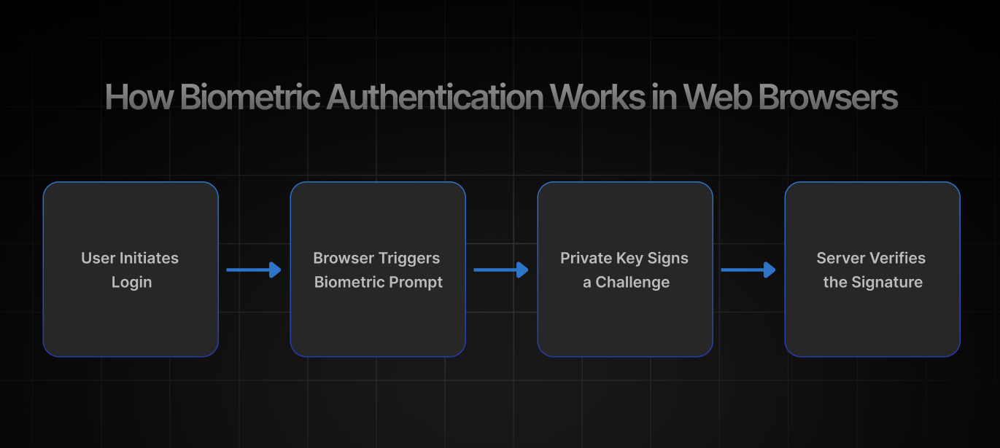
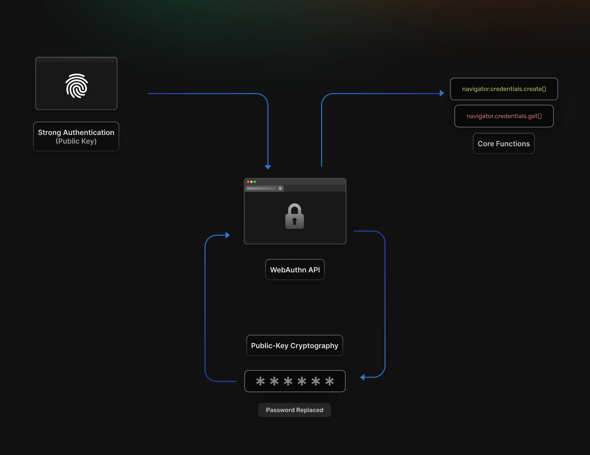

Passwords have long been the weak link in web security. They're reused, guessed, phished, or simply forgotten. In a world where data breaches and account takeovers make headlines every week, the industry is shifting to stronger, passwordless alternatives. One of the most
promising of these is **biometric web authentication**&mdash;using your fingerprint, face, or device security hardware to log into web apps.

Thanks to modern standards like **WebAuthn** and **FIDO2**, biometrics can now be safely integrated into browsers, SaaS products, and
enterprise applications. This blog breaks down how biometric web authentication works, its benefits, challenges, and how you can implement it in your own projects with tools like SuperTokens.

## **What Is Biometric Web Authentication?**

**Biometric web authentication** leverages device-level biometric features such as fingerprint sensors, facial recognition cameras, or
iris scanners to authenticate users directly within web browsers. This approach eliminates password dependencies while providing stronger security guarantees than traditional credential-based systems.

### **Web Standards at the Core**

This isn't just proprietary magic. Biometric login on the web relies on open standards:

- [**FIDO2**:](https://supertokens.com/blog/what-is-fido) An authentication framework developed by the FIDO Alliance.
- [**WebAuthn**](https://supertokens.com/docs/authentication/passkeys/important-concepts#:~:text=Terminology-,WebAuthn,explanation%20of%20WebAuthn%2C%20you%20can%20refer%20to%20the%20actual%20specification.,-Passkeys): A W3C API standard that browsers implement to allow public-key cryptography--based login.

Together, these allow biometrics to act as a secure "unlock" mechanism for cryptographic keys stored on the device.

### **Real-World Examples**

Biometric login is already a daily reality for millions of users:

-   **Banking apps** prompting for Face ID or Touch ID to confirm a transaction.
-   **Enterprise dashboards** restricting access with fingerprint-based step-up authentication.
-   **Consumer apps** like password managers, which integrate with biometric hardware for secure autofill.

The big shift is that these patterns are no longer limited to native mobile apps&mdash;they're now possible in browsers too.

## **How Biometric Authentication Works in Web Browsers**



To understand how biometrics are both secure and user-friendly, it helps to look at the flow inside the browser.

**Step-by-Step Authentication Process:**

1.  **User Initiates Login** by clicking a biometric authentication option or being prompted during the normal login flow
2.  **Browser Triggers Biometric Prompt** via platform authenticator APIs that interface with device hardware like Touch ID, Face ID, or Windows Hello
3.  **Private Key Signs a Challenge** using cryptographic keys stored securely in device hardware, with biometric verification required to access the keys
4.  **Server Verifies the Signature** by validating the cryptographic response against stored public keys, confirming both device possession and biometric verification

**Platform Support** includes comprehensive coverage across major browsers with Chrome, Firefox, Safari, and Edge all supporting WebAuthn,
though biometric support varies by platform integration. Safari on iOS and Chrome on Android provide the most seamless biometric experiences due to tight platform integration with native security features.

**Authenticator Types** fall into two primary categories:

-   **Platform Authenticators** integrate directly with device hardware including Touch ID on MacBooks, Face ID on iPhones, Windows Hello on PCs, and fingerprint sensors on Android devices
-   **Roaming Authenticators** include external security keys like YubiKey Bio that combine biometric verification with portable hardware tokens

The authentication process leverages public-key cryptography, where biometric verification unlocks access to private keys stored in secure
hardware enclaves. This approach ensures that biometric data never leaves the device while enabling strong authentication across web applications.

## **Benefits of Biometric Authentication on the Web**

Biometrics strengthen both security and usability while reducing operational burdens. Key advantages include:

- **Enhanced Security** provides robust resistance against phishing, replay, and man-in-the-middle attacks that commonly compromise password-based systems. Over two-thirds of medium-sized organizations now require biometrics for IT resource access, recognizing the security advantages over traditional authentication methods.
- **Superior User Experience** delivers instant, frictionless login experiences that eliminate password memorization, typing errors, and password recovery workflows. Users can authenticate in seconds using familiar biometric gestures they already use to unlock their devices.
- **Regulatory Compliance** helps organizations meet multi-factor authentication requirements under frameworks like [GDPR](https://gdpr-info.eu/), [HIPAA](https://www.hhs.gov/hipaa/index.html), and [SOC2](https://secureframe.com/hub/soc-2/what-is-soc-2). and industry-specific regulations. Biometric authentication provides inherent \"something you are\" factors that satisfy compliance requirements without additional complexity.
- **Reduced Support Overhead** dramatically decreases password-related support tickets including password resets, account lockouts, and credential recovery requests. IT teams can focus on strategic initiatives rather than routine authentication support tasks.

## **WebAuthn: The API Behind Biometric Web Login**



**WebAuthn** represents a W3C API standard supported by the FIDO2 specification that enables strong authentication using public-key cryptography. The Web Authentication API extends the Credential Management API to enable passwordless authentication and secure multi-factor authentication without SMS dependencies.

**Core API Functions** provide simple but powerful interfaces for credential management:

- `navigator.credentials.create()` handles credential registration, generating public-private key pairs and associating them with user accounts
- `navigator.credentials.get()` manages authentication flows, prompting for biometric verification and returning signed challenges
- **Public-key cryptography** replaces password-based authentication with mathematically provable security guarantees

**Biometric Integration** ties WebAuthn credentials to devices secured by biometric authentication, ensuring that credential access requires both device possession and biometric verification. The API abstracts platform-specific biometric implementations behind a consistent interface.

The WebAuthn standard ensures that biometric data remains on the device while enabling web applications to benefit from biometric security. This approach addresses privacy concerns while providing strong authentication capabilities.

## **How to Implement Biometric Login in Your Web App**

Implementing biometric login with WebAuthn involves both frontend and backend steps. The process ensures secure credential creation, storage, and verification.

**1. Check Browser Support** using feature detection to ensure WebAuthn availability:

```js
 if (window.PublicKeyCredential) {                                     
    // WebAuthn is supported                                                                    
    PublicKeyCredential.isUserVerifyingPlatformAuthenticatorAvailable()                                             
        .then(available =\> {                                                                        
            if (available) {   
                // Biometric authentication available                                                                       
            }                                                
        });                                                                      
 }                                                       
```                                                                                                                              
**2. Setup Backend Infrastructure** to securely store and manage public keys:

```js
 // Store credential during registration                               
 const credential = {                                                                      
    id: credentialId,                                                 
    publicKey: publicKeyBytes,                                                                      
    counter: 0,                                                     
    userId: userId                                                                      
 };                                            
 await database.storeCredential(credential); 
```                              
**3. Register Biometric Credential** by prompting users during onboarding:

```js
 const createCredential = await navigator.credentials.create({         
    publicKey: {                                                                       
        challenge: new Uint8Array(32),                                                         
        rp: { name: "Your App", id: "yourapp.com" },                                                                       
        user: {                                         
            id: userIdBytes,                                                                      
            name: userEmail,                     
            displayName: userName                                                                      
        },                                                              
        pubKeyCredParams: [{ alg: -7, type: "public-key" }],                                                                       
        authenticatorSelection: {                                                      
            authenticatorAttachment: "platform",                                                                      
            userVerification: "required"                                                      
        }                                                                      
    }                                                 
 });                                                                      
```                                                                
**4. Authenticate Users** by verifying biometric challenges:

```js
 const assertion = await navigator.credentials.get({                   
    publicKey: {                                                                       
        challenge: challengeBytes,                                                         
        allowCredentials: [{                                                                      
            id: credentialId,                                            
            type: "public-key"                                                                       
        }],                                                 
        userVerification: "required"                                                                      
    }                                                      
 });                                                                   
```
**5. Use Established Libraries** like SimpleWebAuthn, \@webauthn/server, or framework integrations in NextAuth.js to handle complex cryptographic operations and edge cases.

**6. Secure the Implementation** by enforcing HTTPS, implementing proper fallback mechanisms, and rate-limiting authentication attempts to
prevent abuse.

## **Challenges and Limitations of Web Biometric Authentication**

While powerful, biometric authentication brings its own set of hurdles organizations must prepare for:

- **Device Dependency** creates the primary limitation where credentials bind to specific devices, potentially creating access issues when users switch devices or experience hardware failures. Organizations must plan for device lifecycle management and credential migration scenarios.
- **User Education Requirements** address confusion around biometricauthentication concepts, fallback mechanisms, and security implications. Many users don\'t understand the difference between biometric-only authentication and biometric-protected credentials,leading to support issues.

- **Privacy Concerns** require clear communication that biometric data never leaves the user\'s device and isn\'t stored by web applications. Despite security benefits, the average cost of biometric data breaches reached \$5.22 million in 2024, emphasizing the importance of proper implementation.
- **Revocation and Recovery Challenges** complicate account recovery when biometric authenticators are lost, damaged, or replaced.Organizations must implement secure backup authentication methods and account recovery procedures that don\'t undermine biometric security benefits.
Cross-platform compatibility varies significantly, with some combinations of browsers and operating systems providing limited biometric support. Testing across target platforms becomes essential for consistent user experiences.

## **Best Practices for Biometric Web Authentication**

Strong implementation isn't just about technology&mdash;it's about trust, usability, and resilience.

- **Always Provide Authentication Fallbacks,** including backup PIN codes, email-based recovery, TOTP codes, or alternative authentication methods. Users must have secure recovery options when biometric authentication fails or isn\'t available.
- **Implement Comprehensive User Education** through clear onboarding flows, help documentation, and user interface prompts that explain biometric authentication benefits and proper usage patterns.
- **Respect User Privacy** by clearly communicating data handling practices, never storing biometric templates, and ensuring all biometric processing occurs locally on user devices. Transparency builds user trust and adoption.
- **Conduct Regular Security Audits** of WebAuthn implementations, including penetration testing, code reviews, and compliance assessments to identify potential vulnerabilities or implementation flaws.
- **Design for Accessibility** by ensuring biometric authentication works with assistive technologies and providing alternative authentication methods for users who cannot use biometric features.

## **SuperTokens and Biometric Authentication**


Biometric authentication is powerful on its own, but its true value emerges when paired with a platform that ensures security, flexibility, and ease of use.
[**SuperTokens**](https://supertokens.com/) brings this together by enabling WebAuthn-based biometrics with strong session management, customizable SDKs, and enterprise-grade protections.

- **WebAuthn Integration** enables SuperTokens users to implement passwordless flows and customize authentication experiences with WebAuthn APIs. The platform provides flexible authentication recipes that can incorporate biometric authentication alongside traditional methods.
- **Comprehensive Session Management** handles secure session creation, automatic token rotation, and anti-CSRF protection that works seamlessly with biometric authentication flows. SuperTokens manages the complex session lifecycle while enabling biometric convenience.
- **Customizable Frontend SDKs** allow easy extension of login interfaces to support biometric authentication prompts, fallback mechanisms, and user education flows. The React, Vue, and vanilla JavaScript SDKs support custom authentication UI development.
- **Open Source Architecture** ensures full transparency and control over authentication implementation, enabling security audits and customization that meets specific organizational requirements without vendor dependencies.
- **Enterprise-Grade Security Features** include token theft detection, session hijacking prevention, and comprehensive audit logging that complement biometric authentication security with additional protection layers.

## **The Future of Biometrics on the Web**

Biometrics are quickly moving from an add-on security layer to the foundation of digital identity. Emerging trends point toward a web where authentication is seamless, secure, and interoperable.

- **Passkeys and Cross-Platform Credentials** represent the evolution toward seamless biometric authentication across devices and platforms. Passkey adoption surged 400% in 2024 as Apple, Google, and Microsoft collaborate on interoperable credential standards that sync biometric-protected credentials across ecosystems.
- **Biometrics Replacing Traditional MFA** will eliminate SMS and email-based two-factor authentication vulnerabilities while providing superior user experience. Device biometrics offer stronger security guarantees than SMS codes while requiring no additional user action.
- **Decentralized Identity Integration** combines biometric authentication with portable web identities, enabling users to carry verified credentials across different applications and services without creating new accounts or managing multiple authentication methods.
- **Enhanced Fraud Detection** leverages behavioral biometrics and continuous authentication to detect account takeover attempts and suspicious activity patterns in real-time, providing adaptive security that responds to emerging threats.

## **Conclusion**

Biometric authentication offers secure, seamless authentication experiences that address fundamental limitations of password-based systems. Modern web browsers provide robust WebAuthn support that enables practical biometric implementation today, not in some distant
future.

Implementation becomes accessible through established libraries and frameworks, while platforms like [SuperTokens](https://supertokens.com/) can enhance scalability and security through proven session management and authentication infrastructure. Organizations can deploy biometric authentication incrementally, starting with high-value use cases and expanding coverage as user adoption grows.

***Start exploring biometric authentication today to future-proof your web applications against evolving security threats while delivering the seamless user experiences that modern applications demand.***
