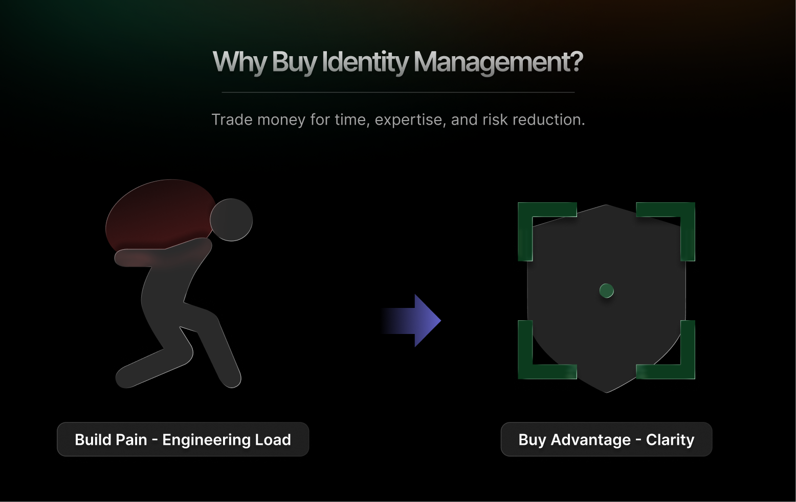
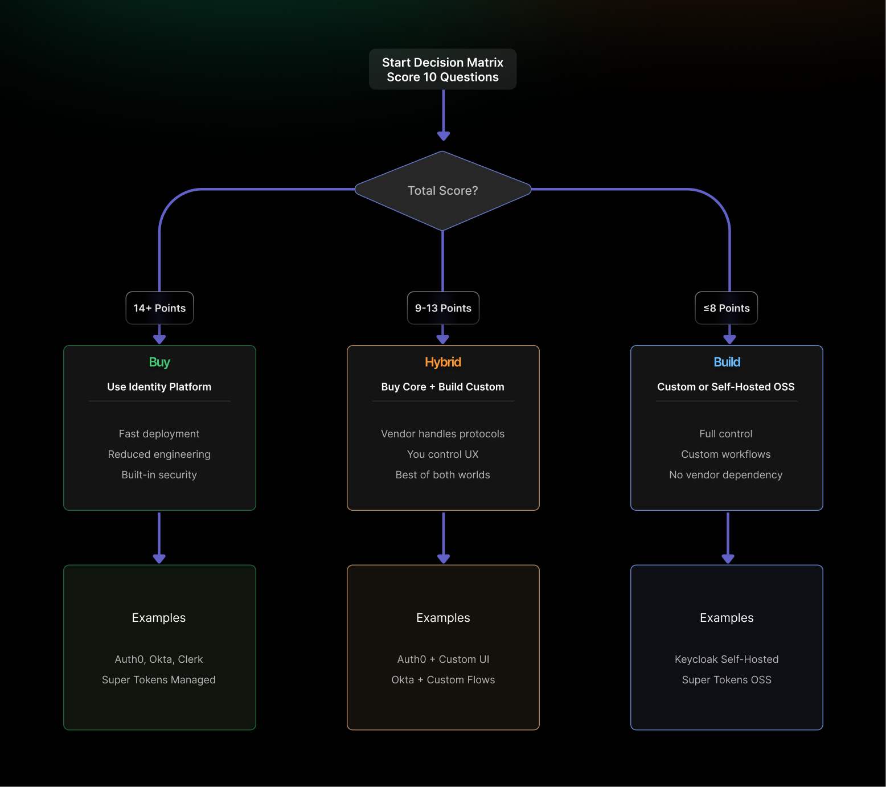

Identity management sits at the heart of every application. Get it wrong, and you're dealing with security breaches, compliance violations, and user frustration. Get it right, and nobody notices because it just works.

The question every development team faces: should we build our own identity system or buy one off the shelf?

This guide gives you a practical decision framework based on real-world experience from teams who've gone both routes. We'll cover when building makes sense, when buying saves time and money, and how to assess your specific situation to make the right call.

## Why Build Identity Management?

Building your own identity system appeals to teams that value control and customization. For certain scenarios, it's absolutely the right choice.

### **When Building Fits**

- **Simple use cases work well with custom builds.** If you're managing authentication for a single application with a straightforward username/password login, building might make sense. You understand exactly what you need. The requirements won't change much. You can ship something workable in a few weeks.
- **Few applications mean less complexity.** When you're not juggling multiple services, mobile apps, partner integrations, and third-party systems, the architectural burden stays manageable. Your authentication logic stays simple.
- **Modest security needs reduce risk.** If you're building an internal tool or non-critical application where a breach wouldn't be catastrophic, the security stakes are lower. You can learn as you go without gambling with customer data.

### **What Drives the Build Decision**

- **Full control over every detail.** You own the code. You make every architectural decision. Want to change how sessions work? Go ahead. Need a weird edge case handled? Build it yourself. No vendor tells you what's possible.
- **Bespoke user experience without constraints.** Bought solutions come with pre-built UIs and flows. Building lets you create exactly the experience you want. Custom branding, unique flows, experimental features. You're not constrained by someone else's product roadmap.
- **Limited external dependencies.** No vendor contracts to negotiate. No pricing changes to worry about. No service outages from someone else's infrastructure. Your auth system lives and dies on your own servers.

This appeals to teams with strong opinions about user experience and the engineering capacity to back those opinions up.

### **Skills, Resources, and Complexity**

Building identity management sounds straightforward until you actually start. Then reality hits.

- **Protocol expertise becomes essential.** OAuth 2.0, OpenID Connect, SAML. These protocols have subtle gotchas that take years to master. Get token validation wrong and you've opened a security hole.
- **Library patching never stops.** Authentication libraries find vulnerabilities regularly. You're responsible for monitoring security advisories, testing patches, and deploying updates. Miss one and you're exposed.
- **Standards drift requires constant updates.** Identity standards evolve. OAuth 2.1 deprecates implicit grant flow. WebAuthn adoption grows. If you built your system in 2020, it's already outdated in 2026 &mdash; unless you've kept up.
- **Multi-app sprawl multiplies complexity.** That simple single-application authentication you built? Now marketing wants a mobile app. Sales wants a partner portal. Suddenly you need single sign-on, token refresh, different authentication methods per platform, and federated identity for partners.
- **Scope grows after version one.** You ship basic email/password authentication. Then the business needs social login, multi-factor authentication, passwordless magic links, enterprise SSO, SCIM provisioning, and compliance logging. Each feature takes weeks to build properly.

Teams regularly discover that the "simple auth system" they thought would take a month actually consumes 6-12 months of engineering time.

## Why Buy Identity Management?

Buying an identity management solution trades money for time, expertise, and risk reduction. For most teams, it's the pragmatic choice.

### **Core Advantages of Buying**

**Faster time to market gets you shipping.** Pre-built authentication systems deploy in days, not months. You integrate SDKs, configure settings, and you're live. No protocol research. No security deep dives. No building infrastructure from scratch.

Those saved months let you focus on actual product features that differentiate your business.

**Reduced engineering burn preserves team capacity.** Your engineers work on your product instead of becoming identity experts. They build features customers pay for instead of reinventing authentication infrastructure.

This matters more as teams stay lean. Every engineer-month spent on auth is an engineer-month not spent on product development.

**Built-in security posture from day one.** Professional identity providers employ security teams full-time. They handle:

- Regular penetration testing
- Security audits and certifications
- Vulnerability scanning and patching
- Threat monitoring and response
- Compliance attestations

You get enterprise-grade security without hiring a security team.

### **TCO and Time-to-Market Signals**

**Budget overruns happen constantly with custom builds.** Teams estimate 2-3 months to build authentication. Reality delivers 6-12 months. The hidden costs pile up:

- Security reviews and remediation
- Compliance work for SOC 2, GDPR, HIPAA
- Operational monitoring and alerting
- Documentation and runbooks
- On-call rotation for auth incidents
- Ongoing maintenance and updates

Companies routinely spend $200-500K building what they could buy for $20-50K annually.

**Identity features blow timelines.** Authentication is deceptively complex. What seems like simple login expands into session management, password resets, account recovery, security notifications, and audit logging.

Each feature introduces edge cases. Each edge case requires testing. Each test reveals new scenarios. Deadlines slip.

**Offloading reclaims development capacity.** Buying identity management returns 20-40% of your engineering team's time. For a five-person team, that's 1-2 full-time engineers focused on your actual product instead of authentication plumbing.

That recovered capacity ships features faster. Features generate revenue. Revenue justifies the identity platform cost many times over.

**Operational load drops dramatically.** No auth-related pages at 3 AM. No emergency patches for security vulnerabilities. No scaling crises when your product goes viral. The identity vendor handles operations, monitoring, and incident response.

Your team sleeps better and ships faster.

## Pros and Cons (Quick Reference)

### **Building Identity Management**

- **Pros:** Complete control over architecture, custom authentication flows, bespoke user experience, no per-user pricing as you scale, no vendor lock-in.
- **Cons:** Ongoing security maintenance, compliance burden (SOC 2, GDPR, PCI), protocol expertise required, operational overhead, feature development diverts from core product, underestimated time, and cost.

### **Buying Identity Management**

- **Pros:** Ship in days instead of months, lower total cost of ownership, integrate SDKs instead of building infrastructure, enterprise-grade protection, expert support, inherit certifications, and audits.
- **Cons:** Platform may not match all requirements, per-user pricing can scale unpredictably, constrained by vendor capabilities, user data lives in vendor systems, switching vendors requires effort.

## 2026 Decision Matrix

Use this scoring system to evaluate your situation objectively. Score each question 0-2:

- **0 points** = Factor strongly favors building
- **1 point** = Factor is neutral or mixed
- **2 points** = Factor strongly favors buying

**Total Score Interpretation:**

- **14+ points** = Buy (outsource to identity platform)
- **9-13 points** = Hybrid (buy core, customize edges)
- **≤8 points** = Build (in-house or self-hosted OSS)

### **The 10 Questions**

**1. Differentiation: Are authentication flows core to your product value?**

- 0 = Yes, unique auth is a competitive advantage.
- 1 = Somewhat, we have some custom requirements.
- 2 = No, auth is commodity infrastructure.

**2. Deadline: Do you need production-ready authentication in under 90 days?**

- 0 = No, we have 6+ months.
- 1 = Somewhat urgent, 3-6 months.
- 2 = Yes, we need to ship ASAP.

**3. Team: Do you have in-house protocol and security expertise?**

- 0 = Yes, we have identity/security specialists.
- 1 = We have general backend skills.
- 2 = No, we'd need to learn everything.

**4. Scope: Do you need MFA, SSO, multi-tenancy, or M2M auth in year one?**

- 0 = No, basic auth only.
- 1 = Maybe one or two advanced features.
- 2 = Yes, multiple advanced features needed.

**5. Compliance: Are you targeting SOC 2, GDPR, or PCI compliance in the next 12 months?**

- 0 = No compliance requirements.
- 1 = Some compliance needed eventually.
- 2 = Yes, critical for business.

**6. Operations: Can you staff 24/7 on-call for authentication SLOs?**

- 0 = Yes, we have ops capacity.
- 1 = We could manage with effort.
- 2 = No, we need vendor SLAs.

**7. Change Rate: Do you expect frequent IdP integrations or protocol updates?**

- 0 = No, stable requirements.
- 1 = Some changes expected.
- 2 = Yes, lots of integration requests.

**8. Budget Model: Do you prefer predictable per-user pricing over staff costs?**

- 0 = No, we prefer fixed costs.
- 1 = Either model works.
- 2 = Yes, per-user pricing is clearer.

**9. Data Control: Do you need VPC deployment or self-hosting options?**

- 0 = Yes, critical requirement.
- 1 = Nice to have.
- 2 = No, SaaS is fine.

**10. Exit Plan: Can you migrate users and rotate keys cleanly if switching vendors?**

- 0 = Not important, won't switch.
- 1 = Somewhat important.
- 2 = Critical, need portability.

Add up your score and check the ranges above. The matrix gives you a data-driven starting point for the build/buy/hybrid decision.

## Quick Scenarios (Real-World Examples)

Here's how different teams should score on the matrix and what they should choose.

### **Early-Stage SaaS, 2 Developers, Tight Launch Deadline**

**Situation:** You're two founders trying to ship an MVP in three months. Every day counts. You need to validate product-market fit, not build infrastructure.

**Matrix Score:** 16-18 points

- Differentiation: Auth isn't core (2)
- Deadline: Need to ship fast (2)
- Team: No identity experts (2)
- Scope: Need basics plus social login (1)
- Compliance: Not yet (1)
- Operations: Can't staff on-call (2)
- Change rate: Will add features (2)
- Budget: Per-user makes sense (2)
- Data control: SaaS is fine (2)
- Exit: Want portability (2)

**Decision: Buy.** Use a managed service such as Auth0, Clerk, or [SuperTokens](https://supertokens.com/). Get authentication working in a week and spend the rest of your time building actual product features.

### **B2B SaaS with Enterprise Customers Requiring SSO**

**Situation:** You're selling to companies that mandate SAML SSO, SCIM provisioning, and compliance certifications. You need enterprise features but want control over user experience.

**Matrix Score:** 11-13 points

- Differentiation: Some custom needs (1)
- Deadline: Moderate urgency (1)
- Team: Decent backend skills (1)
- Scope: Need SSO, MFA, provisioning (2)
- Compliance: SOC 2 required (2)
- Operations: Prefer vendor SLAs (2)
- Change rate: Frequent enterprise requests (2)
- Budget: Either model works (1)
- Data control: Some flexibility needed (1)
- Exit: Want options (2)

**Decision: Hybrid.** Buy the authentication plumbing (protocols, SSO, MFA) from a platform like Auth0 or Okta. Build custom onboarding flows and user management interfaces that match your product experience. Use the vendor's infrastructure but own the user-facing experience.

### **Regulated Industry with Complex Custom Workflows**

**Situation:** You're building for healthcare or finance with strict compliance requirements. You need custom authentication flows that match specific regulatory requirements. Data residency is non-negotiable.

**Matrix Score:** 6-8 points

- Differentiation: Auth workflows are unique (0)
- Deadline: Can take time to get it right (0)
- Team: Have security experts (0)
- Scope: Custom flows required (0)
- Compliance: Multiple frameworks (1)
- Operations: Will staff dedicated team (1)
- Change rate: Stable once built (0)
- Budget: Fixed costs preferred (0)
- Data control: Must self-host (0)
- Exit: Will build for long term (0)

**Decision: Build on a self-hostable platform.** Use an open-source foundation like Keycloak or SuperTokens. Get the protocols and security right through established code, but deploy in your infrastructure with full control. Customize flows while benefiting from battle-tested authentication primitives.

## What to Validate Before Buying

### **Pricing and MAU Tiers**

Understand the pricing model completely. What counts as an active user? What happens when you exceed tier limits? Run projections from current users to expected growth.

### **Extensibility and Customization**

Check what you can actually customize. Can you override authentication flows? Add custom claims to tokens? Implement custom MFA methods? Know the limits before you hit them.

### **Migration Path and Data Portability**

Plan your exit before your entrance. Can you export user data with all metadata, password hashes, audit logs, and configuration? Vendors that make export difficult are banking on lock-in.

### **SLAs and Support**

What's the uptime SLA? How fast do they respond to security incidents? Production applications need guaranteed response times for critical
issues.

### **Data Residency and Compliance**

Verify where data lives and what certifications exist. Does the vendor have SOC 2, ISO 27001, and GDPR compliance? Will they sign a BAA for HIPAA?

### **Multi-Tenancy Support**

B2B SaaS needs organization structures with isolated user directories. Can the platform handle hierarchical organizations, per-organization SSO, and organization-level admin permissions?

## Conclusion

The build vs. buy decision for identity management comes down to your specific constraints: team size, timeline, compliance requirements, budget model, and control needs.

Use the 2026 Decision Matrix as your starting point. Score the 10 questions honestly, based on your real situation, not aspirational goals.
The numbers will point you toward build, buy, or hybrid.

**Key takeaways:**

- **Build** when authentication flows are core to your competitive advantage and you have identity expertise in-house.
- **Buy** when speed and efficiency matter more than perfect customization, and you want to focus engineering on your actual product.
- **Hybrid** when you need enterprise features but want control over user experience.

Most teams overestimate their ability to build and underestimate the ongoing cost of maintaining custom identity systems. The initial build might take 2-3 months, but the lifetime cost of security updates, compliance work, and operational burden accumulates for years.

For early-stage companies and small teams, buying almost always wins. For regulated industries with unique requirements, building on self-hosted open-source foundations often makes sense. For scaling B2B companies, hybrid approaches work well.

Whatever you choose, validate before committing. Test the vendor's capabilities. Prototype critical flows. Calculate the total cost of ownership honestly. Identity management touches every user interaction. Get this decision right, and everything else gets easier.
