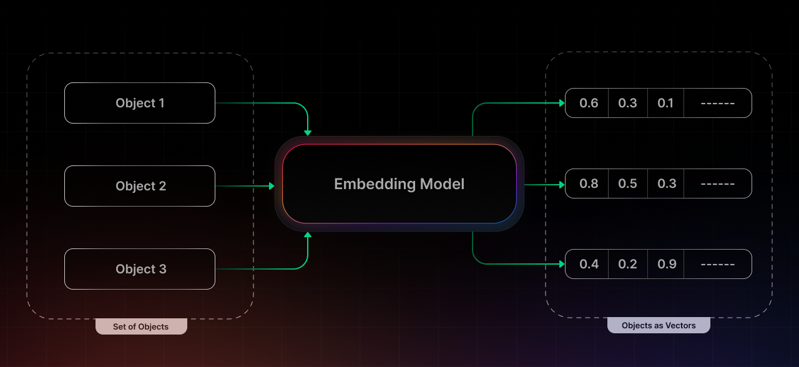
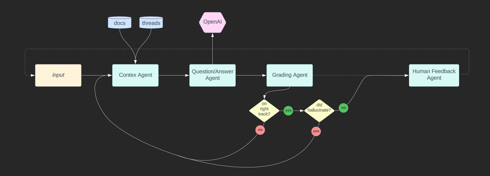

## Introduction

At SuperTokens, we spend a lot of time providing support for our customers. Considering the complexity of authentication and our tools, this can be time-consuming and expensive. But, what if we could leverage AI to help us out? What if we could create a Q&A bot that is an expert on our product? So that's what we made! Powered by ChatGPT, the SuperTokens AI bot leverages the SuperTokens documentation as context to accurately answer questions and point the user to the right resources. Let's take a look at how it works.

## How does SuperTokens AI work?

On a high level, the [SuperTokens AI](https://github.com/supertokens/supertokens-ai/) works by taking a question as input, finding the relevant SuperTokens documentation, and passing it to ChatGPT as context to answer the question. Additionally, it will use a host of agents to make sure that the answers that are being produced are correct. 

Before we get into the details we need to understand some of the limitations of ChatGPT. 

- **Training data**: LLMs like ChatGPT are only as good as the data they were trained on. In our case, that means that changes to the product or new versions and updates might not be recorded resulting in incorrect responses.
- **Contextual understanding**:  Although ChatGPT accepts contextual information to create better answers and solve the limitations of training data, there is a restriction on the tokens you are allowed to pass. This means that we cannot just pass the entire SuperTokens documentation as context, but, need to find the relevant information from the documentation.

So how do we filter thousands of pages of documentation to figure out what's relevant? Well, that's where vector embeddings come in. 

Vector embeddings is a mathematical model that can take arbitrary pieces of data like text and map it to a long string of numbers. What makes vector embeddings special though is you can find semantic similarity between phrases based on the vector distance between them. Essentially, we can find how related phrases are based on their vector distance.

Vector embeddings are a mathematical model that can take arbitrary pieces of data like text and map them to a long string of numbers. What makes vector embeddings special though is you can find semantic similarity between phrases based on the vector distance between them. Through this, we can find the most relevant documentation to be used as context

Now that we know how to filter out the context from the documentation, let's get back to how the SuperTokens AI bot works:

### Step 1: Retrieve the SuperTokens documentation and discord messages and tokenize the data
- The first step is to retrieve the SuperTokens documentation and discord messages.
- The `update_docs.py` and `update_discord.py` scripts will load the SuperTokens documentation and discord conversations into memory, tokenize the input and ask OpenAI to create vector embeddings.

### Step 2: Run the Agent Executor to, generate context from the input, answer the question, and rate the answer.
The next step is to deploy some agents to accomplish the task. An agent is simply a pre-programmed mode of thought to interact with an LLM, in our case that's ChatGPT. Driven by an agent executor, we will have 4 agents who will work together to answer questions as accurately as possible trying to minimize hallucinations in the process.

**The Context Agent:**:
- The context agent will load the vector embeddings we generated in the previous step and calculate the cosine distance between the input question and the vector embeddings to find the most appropriate context.
- Given the directive that it is an expert at SuperTokens and Authentication, it will proceed to ask ChatGPT whether the selected context is relevant to the question.
- It will retry this process for a fixed number of iterations until the relevant context is found. 

**The Question/Answer Agent**:
- The Question/Answer agent is given the directive that it is a friendly developer that is an expert at SuperTokens and is asked to answer the question with the context generated by the previous agent.
- It is also told that if it cannot answer this question with a high degree of uncertainty it should reply with “I don't know”.
- This is done to minimize the outcome of the answer being a hallucination which is a common issue with LLMs like ChatGPT.

**The Grading Agent**:
- The grading agent will then proceed to evaluate the answer, checking if it relevant to the question and the context, and assign it a grade.
- In case the question/answer agent did produce a hallucination, the grading agent will help us filter this out.

**The Human Feedback Agent:**
Finally, the human feedback agent can take additional questions from the user using the results of the previous conversation to answer the new question.

## Conclusion:

It seems like there is a new breakthrough tool coming out every day in the AI space and that can be really overwhelming. We hope that by taking you through our project, we could inspire you to get started on your own AI-powered documentation bot and create powerful tools to help your business. 

