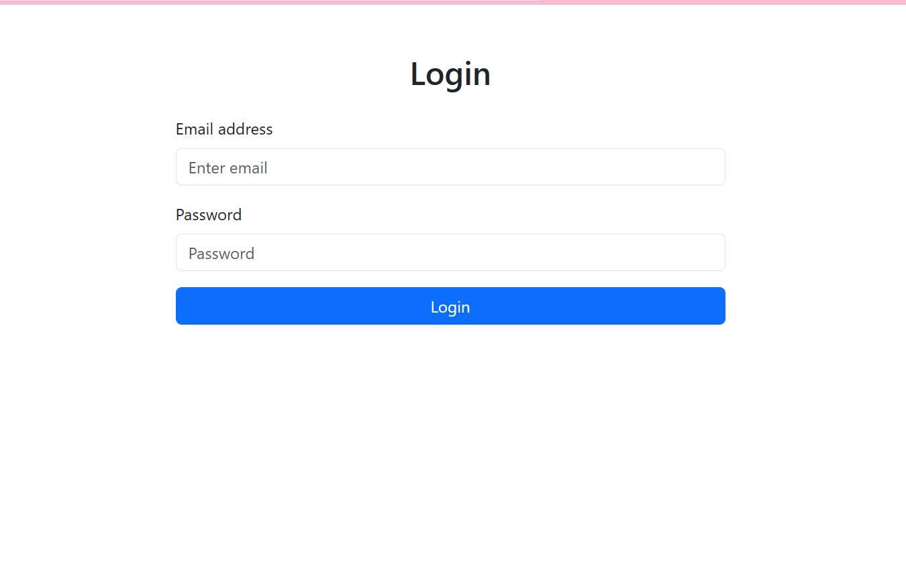
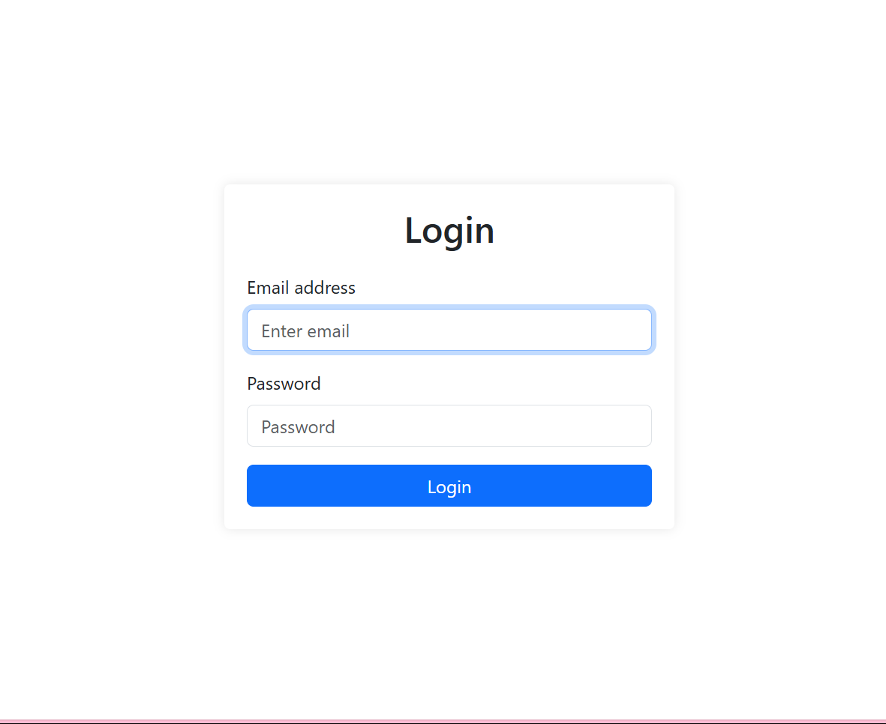
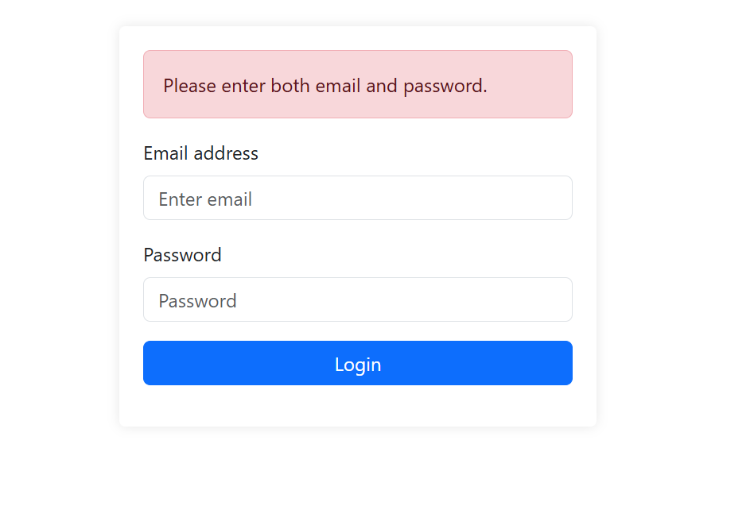
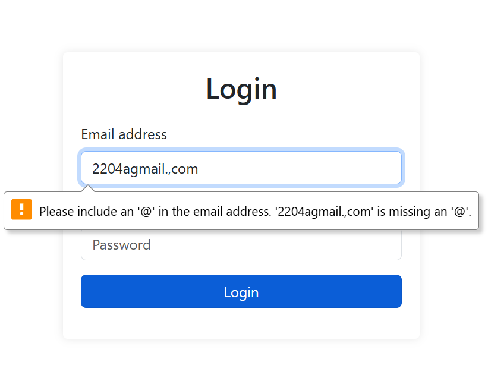
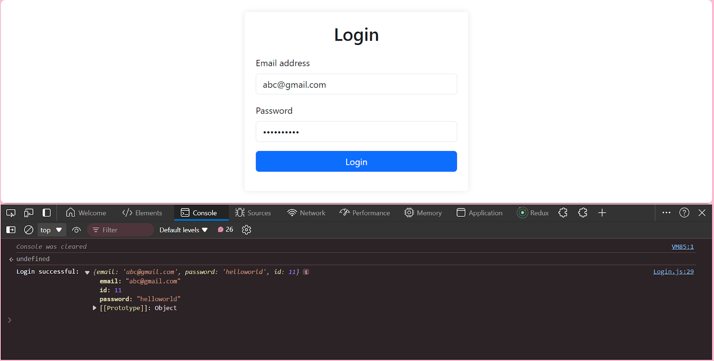

## Table of Contents

1. [Introduction](#introduction)
2. [Prerequisites](#prerequisites)
3. [Step 1: Setting Up the Project](#step-1-setting-up-the-project)
4. [Step 2: Creating the Login Component](#step-2-creating-the-login-component)
5. [Step 3: Styling the Login Page](#step-3-styling-the-login-page)
6. [Step 4: Handling User Input](#step-4-handling-user-input)
7. [Step 5: Adding Form Validation](#step-5-adding-form-validation)
8. [Step 6: Connecting to a Backend](#step-6-connecting-to-a-backend)
9. [Step 7: Implementing Authentication](#step-7-implementing-authentication)
10. [Step 8: Adding Navigation](#step-8-adding-navigation)
11. [Conclusion](#conclusion)

## Introduction

In this comprehensive guide, we'll walk you through the process of building a login page using React and Bootstrap. Whether you're a seasoned developer or just starting out, this tutorial will help you create a professional-looking login component that's both responsive and user-friendly.

## Prerequisites

Before we dive in, make sure you have the following:

- **Basic Understanding of React**: You should be familiar with React's component-based architecture, JSX syntax, and how to manage state and props. Understanding React hooks, particularly useState and useEffect, will be beneficial as we'll be using them extensively in our login component.
- **Familiarity with Bootstrap**: A general understanding of Bootstrap's grid system, utility classes, and component library will help you follow along more easily. We'll be leveraging Bootstrap's pre-built components to create a responsive and visually appealing login page.
- **Development Environment**: Ensure you have Node.js and npm (Node Package Manager) installed on your machine. These tools are essential for creating and managing React projects. Additionally, having a code editor like Visual Studio Code will make the development process smoother.
- **Command Line Basics**: You should be comfortable using the command line interface to run npm commands and navigate your project directory.
- **HTML/CSS Knowledge**: While we'll be using React and Bootstrap, a good grasp of HTML structure and CSS styling principles will help you understand and customize the login page design.

## Step 1: Setting Up the Project

Let's start by creating a new React project and setting up Bootstrap.

**1. Open your terminal and run the following command to create a new React project:**

```bash
npx create-react-app react-login-page
cd react-login-page
```

**2. Install Bootstrap and its dependencies:**

```bash
npm install bootstrap react-bootstrap
```


**3. Open src/index.js and import Bootstrap CSS:**

```bash
import 'bootstrap/dist/css/bootstrap.min.css';
```

**4. Create a new file src/components/Login.js for our login component.**

## Step 2: Creating the Login Component

Now we'll dive into the heart of our login page – the Login component. This React component will contain all the necessary elements for user authentication. We'll use React's `useState` hook to manage the form's state, allowing us to capture and control user input efficiently. The component will include input fields for email and password, along with a submit button, all styled using Bootstrap classes for a clean, professional look.

In `src/components/Login.js`, add the following code:

```javascript
// Login.js:
import React, { useState } from 'react';
import { Form, Button, Container, Row, Col } from 'react-bootstrap';

function Login() {
  const [email, setEmail] = useState('');
  const [password, setPassword] = useState('');

  const handleSubmit = (event) => {
    event.preventDefault();
    console.log('Login attempted with:', { email, password });
    // Here you would typically send a request to your server
  };

  return (
    <Container>
      <Row className="justify-content-md-center mt-5">
        <Col xs={12} md={6}>
          <h2 className="text-center mb-4">Login</h2>
          <Form onSubmit={handleSubmit}>
            <Form.Group className="mb-3" controlId="formBasicEmail">
              <Form.Label>Email address</Form.Label>
              <Form.Control
                type="email"
                placeholder="Enter email"
                value={email}
                onChange={(e) => setEmail(e.target.value)}
              />
            </Form.Group>

            <Form.Group className="mb-3" controlId="formBasicPassword">
              <Form.Label>Password</Form.Label>
              <Form.Control
                type="password"
                placeholder="Password"
                value={password}
                onChange={(e) => setPassword(e.target.value)}
              />
            </Form.Group>

            <Button variant="primary" type="submit" className="w-100">
              Login
            </Button>
          </Form>
        </Col>
      </Row>
    </Container>
  );
}

export default Login;
```

This creates a basic login form with email and password fields using React Bootstrap components.




## Step 3: Styling the Login Page

Bootstrap provides pre-styled components, but let's add some custom CSS to make our login page stand out. Create a new file `src/components/Login.css` and add the following styles:

```css
.login-wrapper {
  display: flex;
  justify-content: center;
  align-items: center;
  min-height: 100vh;
  padding: 20px;
}

.login-form-container {
  width: 100%;
  max-width: 400px;
  padding: 20px;
  border-radius: 5px;
  box-shadow: 0 0 10px rgba(0,0,0,0.1);
  background-color: #fff;
}

.login-title {
  text-align: center;
  margin-bottom: 20px;
}

.login-form {
  margin-bottom: 15px;
}

.login-button {
  width: 100%;
}
```

Now, update your `Login.js` to import and use these styles:

```js
import React, { useState } from 'react';
import { Form, Button, Container } from 'react-bootstrap';
import './Login.css';

function Login() {
  // ... (previous state and handleSubmit code)

  return (
    <div className="login-wrapper">
      <div className="login-form-container">
        <h2 className="login-title">Login</h2>
        <Form onSubmit={handleSubmit}>
          {/* ... */}

          <Button variant="primary" type="submit" className="login-button">
            Login
          </Button>
        </Form>
      </div>
    </div>
  );
}

export default Login;
```



## Step 4: Handling User Input

We've already set up state variables for email and password, and we're updating them on input change. Let's add some basic validation to improve user experience.
Update your `Login.js` with the following changes:

```js
import React, { useState } from 'react';
import { Form, Button, Container, Alert } from 'react-bootstrap';
import './Login.css';


function Login() {
  const [email, setEmail] = useState('');
  const [password, setPassword] = useState('');
  const [error, setError] = useState('');


  const handleSubmit = (event) => {
    event.preventDefault();
    setError('');
    if (!email || !password) {
      setError('Please enter both email and password.');
      return;
    }
    console.log('Login attempted with:', { email, password });
    // Here you would typically send a request to your server
  };


  return (
<div className="login-wrapper">
    <div className="login-form-container">
      <h2 className="login-title">Login</h2>
  {error && <Alert variant="danger">{error}</Alert>}
          <Form onSubmit={handleSubmit} className="login-form”>
          {...}


            <Button variant="primary" type="submit" className="login-button">
          Login
        </Button>
      </Form>
      </div>
      </div>


  );
}


export default Login;

```

This adds basic validation for empty fields and a simple email format check.



## Step 5: Adding Form Validation

Proper input handling is crucial for any form, especially a login form. We'll implement onChange handlers to update our component's state as the user types. This step lays the groundwork for form validation and submission, ensuring we have access to the most up-to-date user input at all times.

Update `src/components/Login.js`:

```js
import React, { useState } from 'react';
import { Form, Button, Alert } from 'react-bootstrap';
import './Login.css';


function Login() {
  const [email, setEmail] = useState('');
  const [password, setPassword] = useState('');
  const [errors, setErrors] = useState({});


  const validateForm = () => {
    const newErrors = {};
    if (!email) newErrors.email = 'Email is required';
    else if (!/\S+@\S+\.\S+/.test(email)) newErrors.email = 'Email is invalid';
    if (!password) newErrors.password = 'Password is required';
    else if (password.length < 6) newErrors.password = 'Password must be at least 6 characters';
    return newErrors;
  };


  const handleSubmit = (event) => {
    event.preventDefault();
    const formErrors = validateForm();
    if (Object.keys(formErrors).length > 0) {
      setErrors(formErrors);
    } else {
      setErrors({});
      console.log('Login attempted with:', { email, password });
      // Here you would typically send a request to your server
    }
  };


  return (
    <div className="login-wrapper">
      <div className="login-form-container">
        <h2 className="login-title">Login</h2>
        <Form onSubmit={handleSubmit} className="login-form">
          <Form.Group className="mb-3" controlId="formBasicEmail">
            <Form.Label>Email address</Form.Label>
            <Form.Control
              type="email"
              placeholder="Enter email"
              value={email}
              onChange={(e) => setEmail(e.target.value)}
              isInvalid={!!errors.email}
            />
            <Form.Control.Feedback type="invalid">
              {errors.email}
            </Form.Control.Feedback>
          </Form.Group>


          <Form.Group className="mb-3" controlId="formBasicPassword">
            <Form.Label>Password</Form.Label>
            <Form.Control
              type="password"
              placeholder="Password"
              value={password}
              onChange={(e) => setPassword(e.target.value)}
              isInvalid={!!errors.password}
            />
            <Form.Control.Feedback type="invalid">
              {errors.password}
            </Form.Control.Feedback>
          </Form.Group>


          <Button variant="primary" type="submit" className="login-button">
            Login
          </Button>
        </Form>
      </div>
    </div>
  );
}


export default Login;
```



## Step 6: Connecting to a Backend

For this tutorial, we'll simulate a backend response.In a real-world application, your login form would communicate with a backend server to authenticate users. We'll simulate this process using a mock API. This step introduces you to the concept of asynchronous API calls in React and how to handle responses, setting the stage for integration with a real authentication system in the future.

```js
import axios from 'axios';


const API_URL = 'https://jsonplaceholder.typicode.com'; // Mock API


export const login = async (email, password) => {
  try {
    const response = await axios.post(`${API_URL}/users`, { email, password });
    return response.data;
  } catch (error) {
    throw error;
  }
};
Update src/components/Login.js:


import React, { useState } from 'react';
import { Form, Button, Container, Alert } from 'react-bootstrap';
import { login } from '../services/api';
import './Login.css';


function Login() {
  // ... (previous state and validation code)


  const handleSubmit = async (event) => {
    event.preventDefault();
    const formErrors = validateForm();
    if (Object.keys(formErrors).length > 0) {
      setErrors(formErrors);
    } else {
      setErrors({});
      try {
        const userData = await login(email, password);
        console.log('Login successful:', userData);
        // Here you would typically store the user data and redirect
      } catch (error) {
        setErrors({ form: 'Login failed. Please try again.' });
      }
    }
  };


  // ... (rest of the component)
}


export default Login;
```



### Step 7: Implementing Authentication

In a real application, you'd want to manage authentication state across your app. Here's a simple example using React Context:

Create a new file `src/context/AuthContext.js`:

```js
import React, { createContext, useState, useContext } from 'react';


const AuthContext = createContext(null);


export const AuthProvider = ({ children }) => {
  const [user, setUser] = useState(null);


  const login = (userData) => {
    setUser(userData);
    localStorage.setItem('user', JSON.stringify(userData));
  };


  const logout = () => {
    setUser(null);
    localStorage.removeItem('user');
  };


  return (
    <AuthContext.Provider value={{ user, login, logout }}>
      {children}
    </AuthContext.Provider>
  );
};


export const useAuth = () => useContext(AuthContext);
```

**Update `src/App.js` to use the AuthProvider:**

```js
Update src/App.js to use the AuthProvider:


import React from 'react';
import { AuthProvider } from './context/AuthContext';
import Login from './components/Login';


function App() {
  return (
    <AuthProvider>
      <div className="App">
        <Login />
      </div>
    </AuthProvider>
  );
}


export default App;
Step 8: Adding Navigation
Install React Router:
npm install react-router-dom
Create a new file src/components/Navigation.js:
import React from 'react';
import { Navbar, Nav, Container } from 'react-bootstrap';
import { Link } from 'react-router-dom';
import { useAuth } from '../context/AuthContext';


function Navigation() {
  const { user, logout } = useAuth();


  return (
    <Navbar bg="light" expand="lg">
      <Container>
        <Navbar.Brand as={Link} to="/">My App</Navbar.Brand>
        <Navbar.Toggle aria-controls="basic-navbar-nav" />
        <Navbar.Collapse id="basic-navbar-nav">
          <Nav className="me-auto">
            <Nav.Link as={Link} to="/">Home</Nav.Link>
            {user && <Nav.Link as={Link} to="/profile">Profile</Nav.Link>}
          </Nav>
          <Nav>
            {user ? (
              <Nav.Link onClick={logout}>Logout</Nav.Link>
            ) : (
              <Nav.Link as={Link} to="/login">Login</Nav.Link>
            )}
          </Nav>
        </Navbar.Collapse>
      </Container>
    </Navbar>
  );
}


export default Navigation;
```

**Create placeholder components for Home and Profile:**

```js
src/components/Home.js:


import React from 'react';
import { Container } from 'react-bootstrap';


function Home() {
  return (
    <Container>
      <h1>Welcome to My App</h1>
    </Container>
  );
}


export default Home;


src/components/Profile.js:


import React from 'react';
import { Container } from 'react-bootstrap';
import { useAuth } from '../context/AuthContext';


function Profile() {
  const { user } = useAuth();


  return (
    <Container>
      <h1>Profile</h1>
      <p>Welcome, {user.email}!</p>
    </Container>
  );
}


export default Profile;
```


**Now user shall navigate to /profile on successful login.**

```js
function Login() {
  const [email, setEmail] = useState('');
  const [password, setPassword] = useState('');
  const [errors, setErrors] = useState({});
  const { login } = useAuth();
  const navigate = useNavigate();


  const validateForm = () => {
    const newErrors = {};
    if (!email) newErrors.email = 'Email is required';
    else if (!/\S+@\S+\.\S+/.test(email)) newErrors.email = 'Email is invalid';
    if (!password) newErrors.password = 'Password is required';
    else if (password.length < 6) newErrors.password = 'Password must be at least 6 characters';
    return newErrors;
  };


  const handleSubmit = async (event) => {
    event.preventDefault();
    const formErrors = validateForm();
    if (Object.keys(formErrors).length > 0) {
      setErrors(formErrors);
    } else {
      setErrors({});
      try {
        const userData = await login(email, password);


        navigate('/profile');
        console.log('Login successful:', userData);
        // Here you would typically store the user data and redirect
      } catch (error) {
        setErrors({ form: 'Login failed. Please try again.' });
      }
    }
  };
```

## Conclusion

You've successfully built a login page using React and Bootstrap. This login component includes:
- A responsive design using Bootstrap
- Form validation
- Simulated API interaction

- Basic authentication state management
Remember, this is just the beginning. In a production application, you'd want to add more features like:

- Proper error handling and user feedback
- Password strength requirements
- Remember me functionality
- Password reset option
- Multi-factor authentication

Building secure login pages is crucial for protecting user data and ensuring a smooth user experience. With React and Bootstrap, you have powerful tools at your disposal to create professional, responsive, and secure login interfaces.
