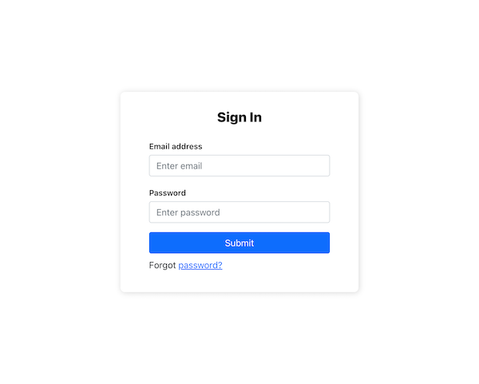
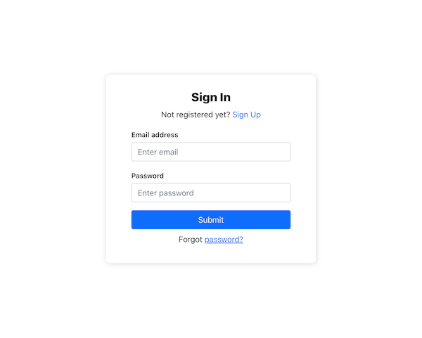
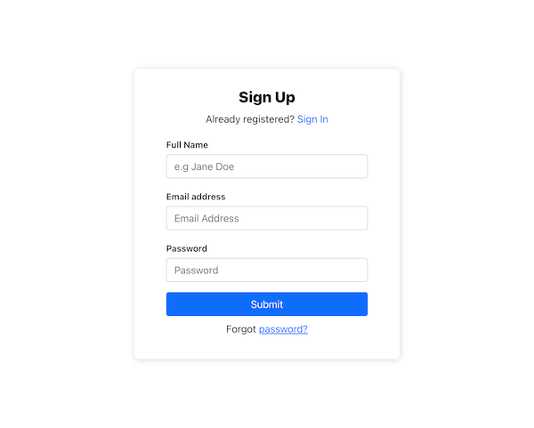

Most web applications today require users to register in order to use certain features or visit specific pages, but building a login form is one of the most tedious things to do. In this article we will build a simple and elegant sign in screen using React and Bootstrap 5.

## Prerequisites

- A basic understanding of HTML, CSS and Javascript
- A basic understanding of React
- Setup [NodeJS](https://nodejs.org/en/) on your machine

## Setup the React app

Run the following command to create a fresh react project:

```sh
npx create-react-app react-login
```

Navigate into the project and start the app

```sh
cd react-login
npm start
```

Once the build is ready, the app should look like this:


## Install Bootstrap

Install bootstrap using npm:

```sh
npm install –save bootstrap
```

Edit `App.js` and add an import statement for bootstrap

```jsx
import "bootstrap/dist/css/bootstrap.min.css"
```

We will also go ahead and remove the boilerplate code that the default React app adds to App.js. The file should now look like this:

```jsx
import "bootstrap/dist/css/bootstrap.min.css"
import "./App.css"

function App() {
  return <div className="App"></div>
}

export default App
```

## Setup Routes

First we will create a new component Auth in Auth.js. We will work on the actual Auth component later for now we need this to set up routes.

```jsx
import React from "react"

export default function (props) {
  return <div>Auth Screen</div>
}
```

In a real world application you would redirect users to your login screen if they were not already logged in. This is where routing comes into the picture, run the following command to install `react-router-dom`, restart the react app after the installation is complete.

```sh
npm install --save react-router-dom
```

Modify the `App.js` file to set up the default and login routes. We will show the login UI on the `/auth` route.

```jsx
import "bootstrap/dist/css/bootstrap.min.css"
import "./App.css"
import { BrowserRouter, Routes, Route } from "react-router-dom"
import Auth from "./Auth"

function App() {
  return (
    <BrowserRouter>
      <Routes>
        <Route path="/auth" element={<Auth />} />
      </Routes>
    </BrowserRouter>
  )
}

export default App
```

## Create the Login form

Modify `Auth.js` that we created earlier

```jsx
import React from "react"

export default function (props) {
  return (
    <div className="Auth-form-container">
      <form className="Auth-form">
        <div className="Auth-form-content">
          <h3 className="Auth-form-title">Sign In</h3>
          <div className="form-group mt-3">
            <label>Email address</label>
            <input
              type="email"
              className="form-control mt-1"
              placeholder="Enter email"
            />
          </div>
          <div className="form-group mt-3">
            <label>Password</label>
            <input
              type="password"
              className="form-control mt-1"
              placeholder="Enter password"
            />
          </div>
          <div className="d-grid gap-2 mt-3">
            <button type="submit" className="btn btn-primary">
              Submit
            </button>
          </div>
          <p className="forgot-password text-right mt-2">
            Forgot <a href="#">password?</a>
          </p>
        </div>
      </form>
    </div>
  )
}
```

Also modify `App.css` to include:

```css
.App {
  background-color: white;
}

.Auth-form-container {
  display: flex;
  justify-content: center;
  align-items: center;
  width: 100vw;
  height: 100vh;
}

.Auth-form {
  width: 420px;
  box-shadow: rgb(0 0 0 / 16%) 1px 1px 10px;
  padding-top: 30px;
  padding-bottom: 20px;
  border-radius: 8px;
  background-color: white;
}

.Auth-form-content {
  padding-left: 12%;
  padding-right: 12%;
}

.Auth-form-title {
  text-align: center;
  margin-bottom: 1em;
  font-size: 24px;
  color: rgb(34, 34, 34);
  font-weight: 800;
}

label {
  font-size: 14px;
  font-weight: 600;
  color: rgb(34, 34, 34);
}
```

If you open the `/auth` route you should see the form



## Add the signup form

Typically you want to allow users to register if they haven’t already. Modify the `Auth.js` component

```jsx
import React, { useState } from "react"

export default function (props) {
  let [authMode, setAuthMode] = useState("signin")

  const changeAuthMode = () => {
    setAuthMode(authMode === "signin" ? "signup" : "signin")
  }

  if (authMode === "signin") {
    return (
      <div className="Auth-form-container">
        <form className="Auth-form">
          <div className="Auth-form-content">
            <h3 className="Auth-form-title">Sign In</h3>
            <div className="text-center">
              Not registered yet?{" "}
              <span className="link-primary" onClick={changeAuthMode}>
                Sign Up
              </span>
            </div>
            <div className="form-group mt-3">
              <label>Email address</label>
              <input
                type="email"
                className="form-control mt-1"
                placeholder="Enter email"
              />
            </div>
            <div className="form-group mt-3">
              <label>Password</label>
              <input
                type="password"
                className="form-control mt-1"
                placeholder="Enter password"
              />
            </div>
            <div className="d-grid gap-2 mt-3">
              <button type="submit" className="btn btn-primary">
                Submit
              </button>
            </div>
            <p className="text-center mt-2">
              Forgot <a href="#">password?</a>
            </p>
          </div>
        </form>
      </div>
    )
  }

  return (
    <div className="Auth-form-container">
      <form className="Auth-form">
        <div className="Auth-form-content">
          <h3 className="Auth-form-title">Sign In</h3>
          <div className="text-center">
            Already registered?{" "}
            <span className="link-primary" onClick={changeAuthMode}>
              Sign In
            </span>
          </div>
          <div className="form-group mt-3">
            <label>Full Name</label>
            <input
              type="email"
              className="form-control mt-1"
              placeholder="e.g Jane Doe"
            />
          </div>
          <div className="form-group mt-3">
            <label>Email address</label>
            <input
              type="email"
              className="form-control mt-1"
              placeholder="Email Address"
            />
          </div>
          <div className="form-group mt-3">
            <label>Password</label>
            <input
              type="password"
              className="form-control mt-1"
              placeholder="Password"
            />
          </div>
          <div className="d-grid gap-2 mt-3">
            <button type="submit" className="btn btn-primary">
              Submit
            </button>
          </div>
          <p className="text-center mt-2">
            Forgot <a href="#">password?</a>
          </p>
        </div>
      </form>
    </div>
  )
}
```

We use `useState` to change between signing in and signing up. Now when you visit `/auth` you can toggle between sign in and sign up.




## Conclusion

We have created a sign in / up UI using React with Bootstrap. However, there is still work needed to actually get it to function - to make API calls and to do session management. To quickly get those setup, checkout [SuperTokens](https://supertokens.com)
