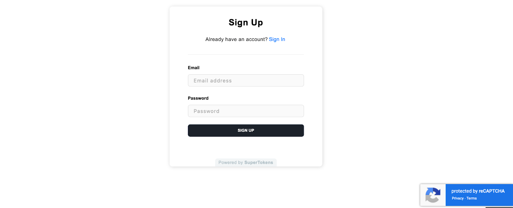

Bot traffic targeting authentication endpoints represents a persistent security challenge. Automated account creation, credential stuffing attacks, and fake registrations consume resources, pollute user databases, and expose applications to fraud. CAPTCHA (Completely
Automated Public Turing test to tell Computers and Humans Apart) provides a standard defense mechanism by requiring human interaction
before processing authentication requests.

Traditional CAPTCHA integration requires coordinating frontend widget libraries, backend token validation, error handling, and provider-specific API calls across signup, login, and password reset flows. This scattered implementation increases maintenance burden and creates coupling between authentication logic and bot prevention mechanisms.

[SuperTokens](https://supertokens.com/) addresses this complexity through a plugin architecture that isolates CAPTCHA logic from core authentication. The plugin model enables developers to add CAPTCHA protection to specific endpoints and signup forms, login pages,
password reset flows with minimal wiring. Configuration changes control which APIs enforce CAPTCHA, which provider handles verification, and under what conditions challenges appear, all without modifying authentication business logic.

This article demonstrates practical CAPTCHA integration patterns, explains server-side verification requirements, and shows how SuperTokens\' plugin system simplifies deployment across multiple authentication flows.

## **I Want to Protect My Signup Form From Bots. How Do I Integrate CAPTCHA?**

Bot-driven fake account creation inflates user counts, triggers verification emails that land in spam folders, and creates opportunities
for downstream abuse. Signup forms represent the highest-value target for CAPTCHA protection.

### **Frontend Integration**

CAPTCHA integration begins with embedding the provider\'s widget on the signup form. The widget renders a challenge (image selection, checkbox interaction, or invisible background verification) and generates a token upon successful completion.

**Basic Frontend Flow:**
1.  User completes signup form fields (email, password)
2.  CAPTCHA widget loads and displays challenge
3.  User solves challenge; widget generates verification token
4.  Frontend sends signup request with CAPTCHA token included
5.  Backend validates token before creating account

The CAPTCHA widget should appear only where required. Showing challenges on every page degrades user experience without benefiting security. Selective placement&mdash;signup form only, not login page&mdash;reduces friction while protecting the highest-risk endpoint.

**SuperTokens Frontend Integration:**

SuperTokens\' frontend SDK accepts CAPTCHA plugins that inject widgets automatically at specified forms. First, install the plugin:
```js
npm install supertokens-auth-react @supertokens-plugins/captcha-react
```
Then configure the plugin in your SuperTokens initialization:
```js
// frontend/src/supertokensConfig.js
import SuperTokens from "supertokens-auth-react";
import EmailPassword from "supertokens-auth-react/recipe/emailpassword";
import Session from "supertokens-auth-react/recipe/session";
import CaptchaPlugin from "@supertokens-plugins/captcha-react";
SuperTokens.init({
  appInfo: {
    appName: "SuperTokens Demo",
    apiDomain: "http://localhost:3001",
    websiteDomain: "http://localhost:3000",
    apiBasePath: "/auth",
    websiteBasePath: "/auth",
  },
  useShadowDom: false,
  recipeList: [
    EmailPassword.init(),
    Session.init(),
  ],
  experimental: {
    plugins: [
      CaptchaPlugin.init({
        type: "reCAPTCHAv3",
        captcha: {
          sitekey: "YOUR_RECAPTCHA_SITE_KEY",
        },
      }),
    ],
  },
});
```
Important: Set `useShadowDom: false` when using CAPTCHA plugins to ensure proper widget rendering.

Initialize your React application with SuperTokens:
```js
// frontend/src/index.js
import React from "react";
import { createRoot } from "react-dom/client";
import { BrowserRouter, Routes } from "react-router-dom";
import SuperTokens, { SuperTokensWrapper } from "supertokens-auth-react";
import { getSuperTokensRoutesForReactRouterDom } from "supertokens-auth-react/ui";
import { EmailPasswordPreBuiltUI } from "supertokens-auth-react/recipe/emailpassword/prebuiltui";
import * as reactRouterDom from "react-router-dom";
import "./supertokensConfig";
function App() {
  return (
    <SuperTokensWrapper>
      <BrowserRouter>
        <Routes>
          {getSuperTokensRoutesForReactRouterDom(reactRouterDom, [
            EmailPasswordPreBuiltUI,
          ])}
          {/* your app routes */}
        </Routes>
      </BrowserRouter>
    </SuperTokensWrapper>
  );
}
const root = createRoot(document.getElementById("root"));
root.render(<App />);
```
This configuration automatically handles CAPTCHA widget rendering, token capture, and inclusion in API requests. No manual DOM manipulation or event handler wiring required.

### **Backend Token Validation**

Frontend CAPTCHA widgets generate tokens that must be verified server-side before processing requests. Relying on client-side validation alone provides no security&mdash;attackers can trivially bypass frontend checks or submit requests directly to the API.

**Backend Validation Requirements:**
-   Extract CAPTCHA token from request payload
-   Submit token to provider\'s verification API with secret key
-   Verify response indicates successful human verification
-   Reject request if verification fails or token is invalid

**SuperTokens Backend Integration:**

Install the backend plugin:

```js
npm install supertokens-node @supertokens-plugins/captcha-nodejs
```

Configure your Express server with SuperTokens and CAPTCHA validation:
```js
// backend/server/index.js
import express from "express";
import cors from "cors";

// Core SuperTokens imports
import SuperTokens from "supertokens-node";
import { middleware,errorHandler } from "supertokens-node/framework/express";

// SuperTokens recipes
import Session from "supertokens-node/recipe/session";
import EmailPassword from "supertokens-node/recipe/emailpassword";

// CAPTCHA plugin (Node.js)
import CaptchaPlugin from "@supertokens-plugins/captcha-nodejs";

// -------------------------------------------------------------------
// Express app setup
// -------------------------------------------------------------------

const app=express();

// Parse incoming JSON requests
app.use(express.json());

// -------------------------------------------------------------------
// Application configuration
// -------------------------------------------------------------------

const API_DOMAIN="http://localhost:3001";
const WEBSITE_DOMAIN="http://localhost:3000";

// -------------------------------------------------------------------
// SuperTokens initialization
// -------------------------------------------------------------------

SuperTokens.init({
  framework:"express",

  // Connection to SuperTokens Core
  supertokens:{
    connectionURI:"https://try.supertokens.io"
  },

  // App metadata shared between frontend and backend
  appInfo:{
    appName:"SuperTokens Demo",
    apiDomain:API_DOMAIN,
    websiteDomain:WEBSITE_DOMAIN,
    apiBasePath:"/auth",
    websiteBasePath:"/auth"
  },

  // Authentication recipes
  recipeList:[
    EmailPassword.init(), // Email + password authentication
    Session.init(),       // Session management
  ],

  // Experimental features (plugins)
  experimental:{
    plugins:[
      CaptchaPlugin.init({

        // CAPTCHA provider type
        type:"reCAPTCHAv3",

        // Provider configuration
        captcha:{
          secretKey:process.env.RECAPTCHA_SECRET_KEY
        },

        // Decide when CAPTCHA should be enforced
        shouldValidate:(api)=>{          
          // Enforce CAPTCHA only for signup requests
          return api === "signUpPOST";
        },
      }),
    ],
  },
});

// -------------------------------------------------------------------
// CORS configuration
// IMPORTANT: Must be registered BEFORE SuperTokens middleware
// -------------------------------------------------------------------

app.use(
  cors({
    origin:WEBSITE_DOMAIN,
    credentials:true,
    allowedHeaders:[
      "content-type",
      ...SuperTokens.getAllCORSHeaders()
    ],
  })
);

// -------------------------------------------------------------------
// SuperTokens middleware
// Handles authentication APIs and session verification
// -------------------------------------------------------------------

app.use(middleware());

// -------------------------------------------------------------------
// Application routes
// -------------------------------------------------------------------

app.get("/ping", (req, res) => {
  res.json({ ok: true });
});

// -------------------------------------------------------------------
// SuperTokens error handler
// IMPORTANT: Must come AFTER all routes
// -------------------------------------------------------------------

app.use(errorHandler());

// -------------------------------------------------------------------
// Custom application error handler
// -------------------------------------------------------------------
app.use((err, req, res, next) => {
  console.error(err);
  res.status(500).json({ message: "Internal server error" });
});

// -------------------------------------------------------------------
// Start the server
// -------------------------------------------------------------------
app.listen(3001, () => {
  console.log("🚀 Backend running on http://localhost:3001");
});
```
The `shouldValidate` function controls which endpoints require CAPTCHA verification. Returning `true` for `signUpPOST` enables protection on account creation while leaving login endpoints unaffected.



## **How Do I Verify CAPTCHA Tokens Server-Side in My Authentication Backend?**

Client-side CAPTCHA widgets prevent casual automated submissions but offer no protection against deliberate attacks. Adversaries can extract API endpoints, bypass frontend code entirely, and submit requests with fabricated or missing CAPTCHA tokens. Server-side verification provides the actual security boundary.

### **Why Client-Side Validation Is Insufficient**

Frontend code executes in an untrusted environment controlled by the user. Browser developer tools enable attackers to:
-   Disable JavaScript that enforces CAPTCHA display
-   Modify the DOM to remove widget requirements
-   Intercept and replay valid tokens from legitimate sessions
-   Submit API requests directly using curl or automated scripts

Server-side verification closes these attack vectors by requiring cryptographic proof that each token came from the CAPTCHA provider and
represents a successful human challenge.

### **Provider Token Verification Flow**

All major CAPTCHA providers follow a similar server-side verification pattern:
1.  Frontend widget generates a token after the user completes the challenge
2.  Client sends token to application backend in signup/login request
3.  Backend extracts the token and forwards it to the provider verification API
4.  Provider validates token authenticity, checks expiration, and returns success/failure
5.  Backend proceeds with the authentication request only if verification succeeds

**Generic Verification Example:**

```js
async function verifyCaptchaToken(token, secretKey) {
    const verificationURL = "https://www.google.com/recaptcha/api/siteverify";
   
    const response = await fetch(verificationURL, {
        method: "POST",
        headers: { "Content-Type": "application/x-www-form-urlencoded" },
        body: `secret=${secretKey}&response=${token}`
    });
   
    const result = await response.json();
   
    if (!result.success) {
        throw new Error("CAPTCHA verification failed");
    }
   
    return result;
}
```
This verification request authenticates with the secret key (never exposed to clients) and confirms the token\'s validity. The provider
response includes additional metadata such as timestamp, hostname, and risk scores.

### **SuperTokens Verification Logic**

SuperTokens abstracts provider-specific verification APIs behind a unified plugin interface. The `shouldValidate` function receives API
context and request input, enabling conditional enforcement:

```js
EmailPassword.init({
    captcha: {
        secretKey: process.env.RECAPTCHA_SECRET_KEY,
        shouldValidate: async (api, input) => {
            // Always require CAPTCHA on signup
            if (api === "signUpPOST") {
                return true;
            }
           
            // Require CAPTCHA on signin after failed attempts
            if (api === "signInPOST") {
                const failedAttempts = await getFailedLoginCount(input.email);
                return failedAttempts >= 3;
            }
           
            // Require CAPTCHA on password reset
            if (api === "generatePasswordResetTokenPOST") {
                return true;
            }
           
            return false;
        }
    }
});
```
This logic applies different policies per endpoint: mandatory CAPTCHA for signup and password reset, conditional CAPTCHA for login based on failure history, and no CAPTCHA for other operations. The verification request happens automatically when `shouldValidate` returns `true`.

## **Can I Show CAPTCHA Only on Suspicious Login Attempts?**

Always-on CAPTCHA enforcement protects against bots but frustrates legitimate users. Image selection challenges interrupt workflow, invisible CAPTCHAs introduce loading delays, and checkbox interactions add friction to every authentication. Applying CAPTCHA universally
reduces user experience without proportional security benefit&mdash;most login attempts are legitimate.

### **Risk-Based CAPTCHA Enforcement**

Conditional CAPTCHA strategies apply bot prevention selectively based on risk signals:

**Trigger Conditions:**
-   Multiple failed login attempts from same email address
-   Requests originating from suspicious user agents
-   Velocity anomalies (many login requests in short timeframe)
-   Missing or malformed request headers indicating automated tools
-   Geographic mismatches between registration and login location

Risk-based enforcement maintains security while preserving user experience. Legitimate users with clean history encounter no CAPTCHA
challenges. Only when the system detects suspicious patterns does the additional verification step appear.

### **Backend Conditional Validation**

The `shouldValidate` function examines request characteristics and escalates protection conditionally. This function receives both the API
identifier and input context:

```js
import SuperTokens from 'supertokens-node';
import CaptchaPlugin, { ShouldValidate } from '@supertokens-plugins/captcha-nodejs';


// Track failed attempts in memory (use Redis in production)
const failedLoginCache = new Map();


function getFailedLoginCount(email) {
  return failedLoginCache.get(email) || 0;
}


function incrementFailedLogin(email) {
  const current = failedLoginCache.get(email) || 0;
  failedLoginCache.set(email, current + 1);
 
  // Expire after 1 hour
  setTimeout(() => failedLoginCache.delete(email), 3600000);
}


const shouldValidate: ShouldValidate = (api, input) => {
  // Only require CAPTCHA for sign up
  if (api === 'signUpPOST') {
    return true;
  }


  // Check request headers for suspicious activity
  if (api === 'signInPOST') {
    const userAgent = input.options.req.getHeaderValue('user-agent');
    if (!userAgent || userAgent.includes('bot')) {
      return true;
    }


    // Optional: Check failed login history
    const emailField = input.formFields?.find(f => f.id === 'email');
    if (emailField) {
      const failedCount = getFailedLoginCount(emailField.value);
      if (failedCount >= 3) {
        return true;
      }
    }


    return false;
  }


  return false;
};


SuperTokens.init({
  supertokens: {
    connectionURI: '...',
  },
  appInfo: {
    // your app info
  },
  recipeList: [
    // your recipes
  ],
  experimental: {
    plugins: [
      CaptchaPlugin.init({
        type: 'reCAPTCHAv3', // or "reCAPTCHAv2" or "turnstile"
        captcha: {
          secretKey: process.env.RECAPTCHA_SECRET_KEY,
        },
        shouldValidate,
      }),
    ],
  }
});
```
This logic applies layered risk assessment:

- **Always protect signup** - Unconditional CAPTCHA for `signUpPOST`
- **User agent inspection** - Trigger CAPTCHA for missing or bot-like user agents
- **Failed attempt history** - Escalate to CAPTCHA after 3 failed login attempts
- **API-specific policies** - Different rules for different authentication endpoints

The validation logic remains isolated in the plugin configuration rather than scattered across authentication code. The `input` parameter provides access to request headers, form fields, and other context needed for risk assessment.

**Production Note:** Replace the in-memory `Map` with Redis or another persistent cache to maintain state across server restarts and multiple instances.

### **Frontend Conditional Rendering**

The frontend must coordinate with backend enforcement to display CAPTCHA widgets only when required. SuperTokens enables conditional rendering through custom input containers.

For reCAPTCHA v2 with visible widgets or when you want precise control over which forms display CAPTCHA:
```js
import { forwardRef, useEffect } from 'react';
import SuperTokens from 'supertokens-auth-react';
import CaptchaPlugin, {
  CaptchInputContainerProps,
  useCaptcha,
} from '@supertokens-plugins/captcha-react';


const CaptchaInputContainer = forwardRef
  HTMLDivElement,
  CaptchInputContainerProps
>((props, ref) => {
  const { form, ...rest } = props;
  const { loadAndRender, containerId } = useCaptcha();


  useEffect(() => {
    // CAPTCHA applies/renders only for the EmailPasswordSignUpForm
    // and the EmailPasswordResetPasswordEmail
    if (
      form === 'EmailPasswordSignUpForm' ||
      form === 'EmailPasswordResetPasswordEmail'
    ) {
      loadAndRender();
    }
  }, [form]);


  return (
    <div ref={ref} id={containerId} className="CAPTCHA-container" {...rest} />
  );
});


SuperTokens.init({
  appInfo: {
    // your app info
  },
  recipeList: [
    // your recipes
  ],
  experimental: {
    plugins: [
      CaptchaPlugin.init({
        type: 'reCAPTCHAv3', // or "reCAPTCHAv2" or "turnstile"
        captcha: {
          sitekey: 'your-site-key',
        },
        InputContainer: CaptchaInputContainer,
      }),
    ],
  }
});
```
This configuration renders CAPTCHA widgets only on the signup form and password reset email form, matching common backend enforcement policies. The form prop identifies which form is currently being rendered, allowing precise control over CAPTCHA placement.

**Note:** For reCAPTCHA v3 or Turnstile (both invisible), conditional rendering via `InputContainer` is optional since the widgets handle
verification transparently in the background.

## **Which CAPTCHA Provider Should I Use: reCAPTCHA, hCaptcha, or Turnstile?**

CAPTCHA provider selection involves balancing security effectiveness, user experience friction, privacy implications, and ecosystem
compatibility. Three major providers dominate the market, each with distinct characteristics.

### **reCAPTCHA (Google)**

**Strengths:**
- The largest deployment base provides extensive training data for bot detection
- Invisible reCAPTCHA v3 scores requests without user interaction
- Deep integration with Google\'s security infrastructure
- Comprehensive documentation and community support

**Considerations:**
-   Data collection raises privacy concerns in some jurisdictions
-   Google dependency may conflict with privacy policies or vendor diversification goals
-   V2 checkbox challenges can frustrate users with accessibility needs

**Use Cases:** 
Applications prioritizing maximum bot detection accuracy and compatibility with existing Google infrastructure. Best suited for high-traffic services where Google\'s data advantages deliver measurable value.

### **hCaptcha**

**Strengths:**
- Privacy-focused alternative to reCAPTCHA with a GDPR compliance focus
- Pays website operators for solved CAPTCHA (machine learning data labeling business model)
- Accessible design with screen reader support
- No Google dependency for privacy-conscious deployments

**Considerations:**
-   A smaller training dataset compared to reCAPTCHA may affect detection accuracy.
-   Less widespread adoption results in fewer integration examples
-   Challenge difficulty can vary based on training data requirements

**Use Cases:** 
Applications with strict privacy requirements, European deployments requiring GDPR compliance, or organizations seeking vendor diversification away from Google services.

### **Turnstile (Cloudflare)**

**Strengths:**
- Minimal user friction with invisible background verification
- Privacy-first design with no personal data collection
- Free tier with generous limits
- Integration with Cloudflare\'s broader security ecosystem

**Considerations:**
- Newer product with a smaller deployment history
- Effectiveness against sophisticated bots is still being validated at scale
- Requires a Cloudflare account even if not using other Cloudflare services

**Use Cases:** 
Modern applications prioritize user experience and privacy. Ideal for Cloudflare customers who can leverage integrated security features. Best for deployments accepting newer technology in exchange for reduced friction.

### **Provider Comparison**

| Feature       | reCAPTCHA              | hCaptcha        | Turnstile         |
|--------------|------------------------|-----------------|-------------------|
| User Friction| Low (v3) / Medium (v2) | Medium          | Very Low          |
| Privacy      | Lower                  | Higher          | Highest           |
| Accuracy     | Highest                | High            | Developing        |
| Adoption     | Highest                | Growing         | Early             |
| Cost         | Free (limits)          | Free (limits)   | Free (generous)   |

### **SuperTokens Provider Flexibility**

SuperTokens maintains provider-agnostic CAPTCHA integration. The plugin interface abstracts provider-specific details, enabling swaps without refactoring authentication logic:

```js
// Switch from reCAPTCHA to Turnstile
import { Turnstile } from "supertokens-auth-react/recipe/emailpassword/captcha";


EmailPassword.init({
    captcha: Turnstile({
        siteKey: "YOUR_TURNSTILE_SITE_KEY"
    })
});
```
Backend configuration similarly accepts different providers through a consistent interface:

```js
EmailPassword.init({
    captcha: {
        provider: "turnstile",
        secretKey: process.env.TURNSTILE_SECRET_KEY,
        shouldValidate: async (api) => api === "signUpPOST"
    }
});
```
This abstraction protects authentication flows from provider churn. Switching CAPTCHA vendors requires updating the configuration, not
rewriting the integration code.

## **Can I Integrate CAPTCHA With SuperTokens Passwordless or Reset Flows?**

Bot protection extends beyond traditional username/password authentication. Passwordless flows, password reset mechanisms, and magic
link generation all present abuse vectors that benefit from CAPTCHA enforcement.

### **Passwordless Code Generation**

Passwordless authentication sends one-time codes via email or SMS. Without protection, attackers can:

- Flood email/SMS services with code generation requests
- Exhaust rate limits and trigger service degradation
- Execute denial-of-service attacks targeting specific email addresses
- Generate costs through SMS provider billing

CAPTCHA on code generation endpoints prevents automated abuse while maintaining passwordless convenience.

### **Password Reset Protection**

Password reset flows enable account takeover if insufficiently protected:

- Attackers enumerate valid email addresses by triggering reset emails
- Mass password reset requests overload email services
- Targeted reset requests harass specific users with spam

Requiring CAPTCHA before sending reset emails mitigates these vectors without weakening account recovery for legitimate users.

### **SuperTokens Passwordless CAPTCHA**

SuperTokens applies CAPTCHA to passwordless flows through the same plugin mechanism:

```js
import Passwordless from "supertokens-node/recipe/passwordless";


Passwordless.init({
    contactMethod: "EMAIL",
    captcha: {
        secretKey: process.env.RECAPTCHA_SECRET_KEY,
        shouldValidate: async (api) => {
            // Protect code creation
            if (api === "createCodePOST") {
                return true;
            }
            // Optionally protect code consumption
            if (api === "consumeCodePOST") {
                const failedAttempts = await getCodeFailureCount();
                return failedAttempts >= 3;
            }
            return false;
        }
    }
});
```
This configuration protects code generation unconditionally while applying conditional protection to code consumption based on failure
history.

### **Password Reset CAPTCHA**

Standard EmailPassword recipe supports CAPTCHA on reset flows:

```js
EmailPassword.init({
    captcha: {
        secretKey: process.env.RECAPTCHA_SECRET_KEY,
        shouldValidate: async (api) => {
            // Protect password reset token generation
            if (api === "generatePasswordResetTokenPOST") {
                return true;
            }
            // Optionally protect reset submission
            if (api === "passwordResetPOST") {
                return true;
            }
            return false;
        }
    }
});
```
Protecting both token generation and reset submission provides defense in depth: CAPTCHA prevents automated token requests and validates human interaction when users submit new passwords.

## **How Do I Configure Site Keys and Secret Keys for CAPTCHA?**

CAPTCHA providers issue two credentials that serve distinct roles in the verification flow:

**Site Key (Public)** 

The site key identifies your application to the CAPTCHA provider and enables frontend widget loading. This key appears in client-side code, browser network traffic, and page source. Site keys are not sensitive; they merely identify which provider account handles verification requests.

**Secret Key (Private)** 

The secret key authenticates backend verification requests to the provider\'s API. This credential proves your backend\'s authority to
validate tokens. Secret keys must remain confidential; exposure enables attackers to bypass CAPTCHA by validating their own tokens.

### **Obtaining Provider Keys**

**reCAPTCHA:**
Register at [https://www.google.com/recaptcha/admin](https://www.google.com/recaptcha/admin), create a site registration, and receive both the site key and the secret key.

**hCaptcha:**
Create an account at [https://dashboard.hcaptcha.com](https://dashboard.hcaptcha.com), add a new site, and obtain the sitekey and secret from settings.

**Turnstile:**
Access Cloudflare dashboard at [https://dash.cloudflare.com](https://dash.cloudflare.com), navigate to Turnstile, create a site, and retrieve keys.

### **Secure Storage Best Practices**

Secret keys require protection equivalent to database passwords or API tokens:

**Environment Variables:**
Store secret keys in environment variables, never hardcode in source files:

```dotenv
# .env file (never committed to version control)
RECAPTCHA_SECRET_KEY=YOUR_KEY
TURNSTILE_SECRET_KEY=YOUR_KEY
```

Load environment variables in your backend:

```js
import dotenv from "dotenv";
dotenv.config();
const secretKey = process.env.RECAPTCHA_SECRET_KEY;
```
For production, set environment variables through your hosting platform (Vercel, Netlify, Heroku, etc.).

### **SuperTokens Configuration**

SuperTokens separates frontend and backend key configuration:

**Frontend (Site Key):**
```js
import CaptchaPlugin from "@supertokens-plugins/captcha-react";


SuperTokens.init({
  experimental: {
    plugins: [
      CaptchaPlugin.init({
        type: "reCAPTCHAv3",
        captcha: {
          sitekey: "YOUR_SITE_KEY", // Public site key
        },
      }),
    ],
  }
});
```
**Backend (Secret Key):**
```js
import CaptchaPlugin from "@supertokens-plugins/captcha-nodejs";


SuperTokens.init({
  experimental: {
    plugins: [
      CaptchaPlugin.init({
        type: "reCAPTCHAv3",
        captcha: {
          secretKey: process.env.RECAPTCHA_SECRET_KEY, // From environment
        },
      }),
    ],
  }
});
```
This separation ensures secret keys remain server-side while frontend code receives only public credentials required for widget initialization.

## **Conclusion**

Effective CAPTCHA use requires balancing security and user experience. Blanket enforcement blocks bots but often frustrates legitimate users, while risk-based enforcement maintains security with minimal friction.

Server-side verification is mandatory. Client-side checks provide no real security, whereas backend validation with the provider's secret key ensures the challenge was legitimately solved.

SuperTokens' plugin architecture keeps CAPTCHA logic separate from authentication, enabling selective enforcement, conditional triggers,
and easy provider swaps through configuration rather than code changes. Teams should track false positives, false negatives, and user completion rates to continuously tune policies, minimize user impact, and avoid vendor lock-in.
