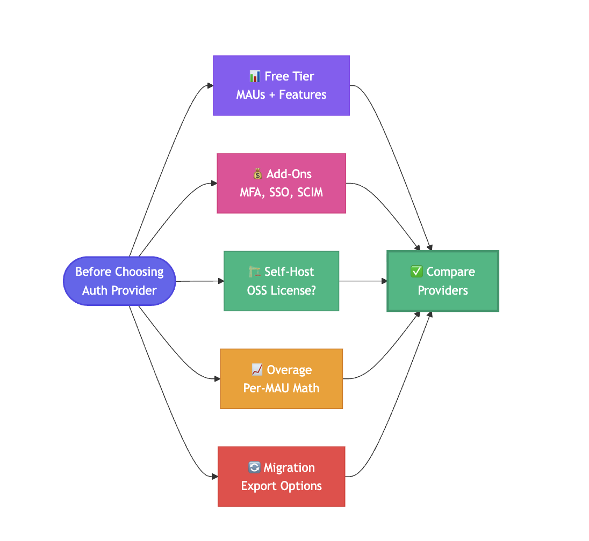
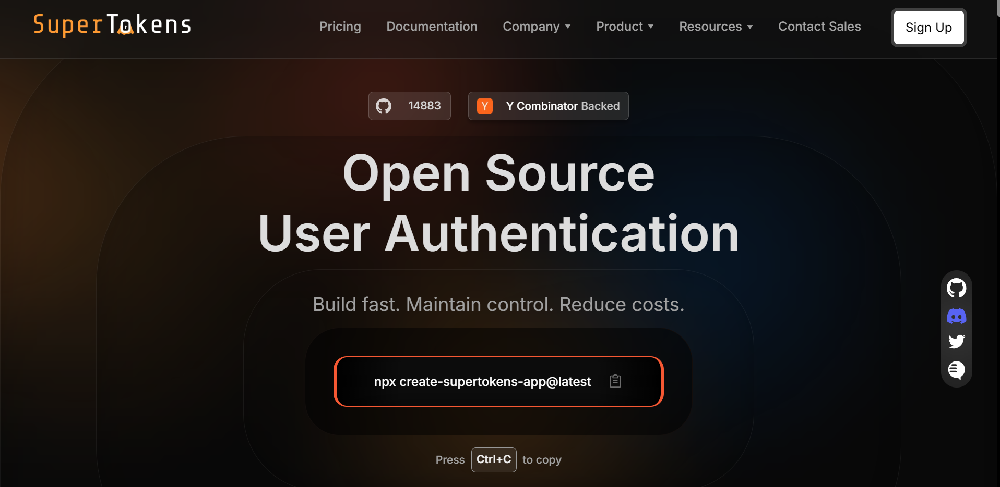
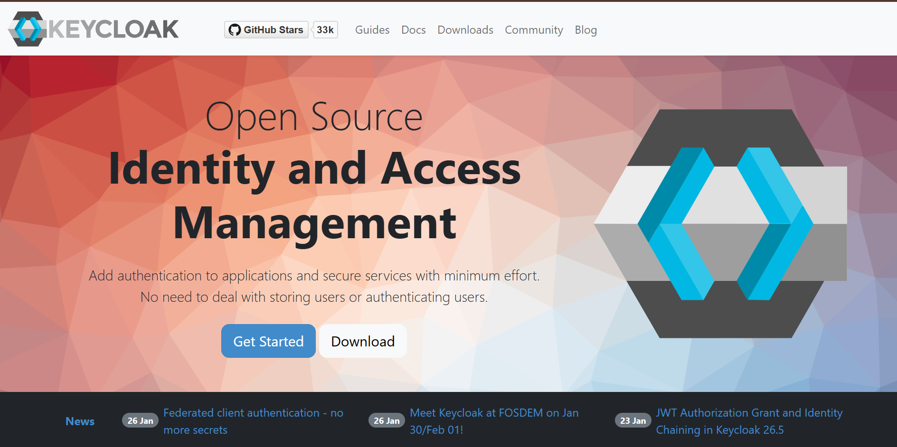
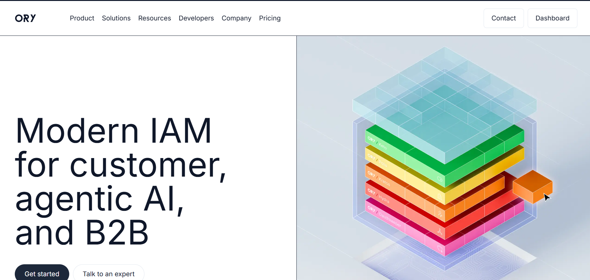
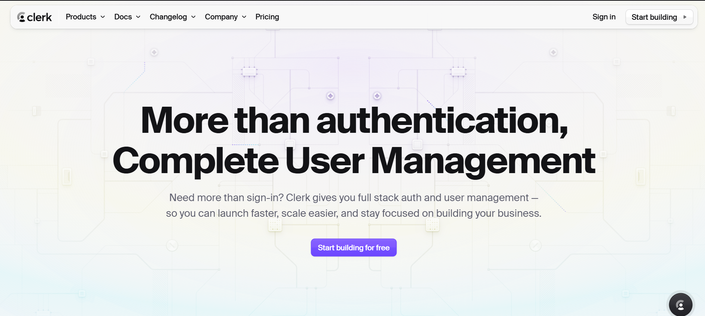
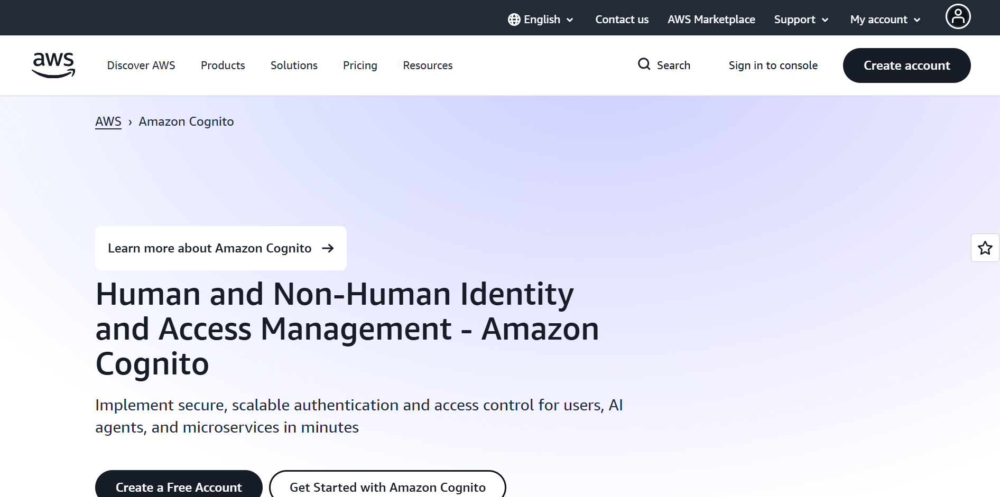
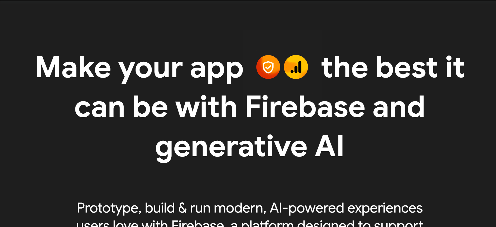
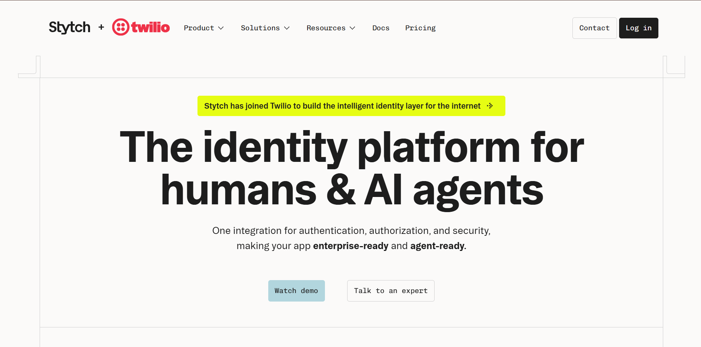
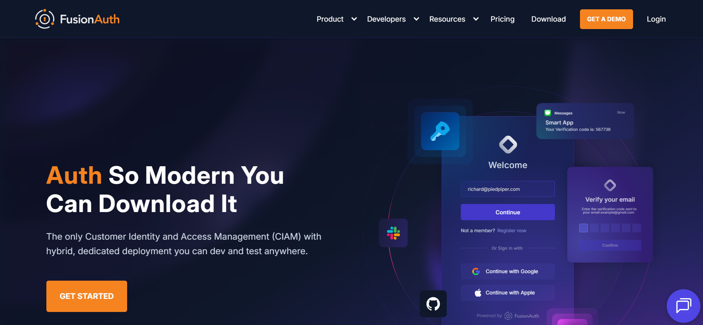
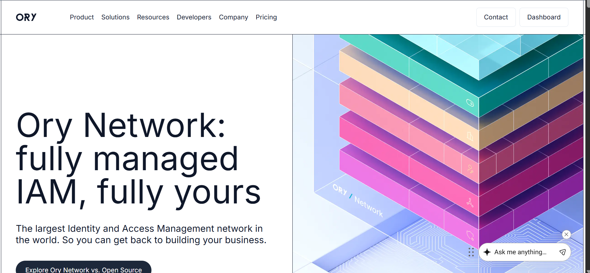

Authentication costs can spiral quickly as applications scale. Auth0\'s pricing, while competitive for enterprise customers, leaves many teams searching for more affordable options, especially startups, bootstrapped projects, and mid-sized companies watching their runways. Understanding what \"cheap\" actually means in authentication requires looking beyond headline pricing to examine free tiers, add-on costs, self-hosting options, and hidden fees that appear during scaling.

This guide breaks down the most cost-effective Auth0 alternatives across three categories: open-source self-hosted solutions, generous free tiers, and predictable low-cost managed services. Each option includes pricing structures, gotchas to watch for, and scenarios where specific solutions excel.

## **What Counts as \"Cheapest\" in 2026?**

Three primary paths reduce authentication costs compared to Auth0\'s standard pricing. Understanding which path aligns with your team\'s
capabilities and growth trajectory determines the optimal choice.

### **Cost Reduction Strategies**

- **Open-Source Self-Hosting**: Pay zero licensing fees, only infrastructure costs. Requires DevOps capacity to deploy, maintain, and secure authentication infrastructure. Total cost of ownership includes server hosting, database management, SSL certificates, monitoring, and engineering time for updates and security patches.
- **Generous Free Tiers**: Managed services offering substantial free monthly active users (MAUs) before billing begins. Ideal for early-stage products validating product-market fit or applications with predictable small user bases. Risk involves hitting tier limits during growth spurts.
- **Transparent Per-MAU Pricing**: Predictable linear scaling without surprise add-on fees. Avoid providers charging separately for basic features like multi-factor authentication, organizations, or SSO costs that compound unexpectedly during scaling.

### **Auth0 Baseline Comparison**

Auth0\'s Free plan currently supports up to 25,000 MAUs (updated September 2024), providing a competitive baseline. However, advanced features, such as enterprise SSO, custom domains, fine-grained authorization, and multi-factor authentication, require paid tiers. Organizations frequently discover that essential production features push them into higher pricing brackets quickly.

The \"cheapest\" alternative depends on your specific requirements: OSS self-hosting minimizes recurring costs but maximizes engineering
investment; generous free tiers suit small, stable user bases; transparent per-MAU pricing benefits predictable growth patterns.

## **Cost Levers Checklist (Use This Before Choosing)**

Before evaluating specific providers, identify which cost factors matter most for your situation. Different vendors optimize different levers; matching your priorities to vendor strengths prevents costly misalignment.

### **Free Tier Dimensions**

- **MAU Allowances**: Monthly active user limits before billing begins. Some providers count all users; others exclude inactive accounts. Verification methods (email vs. phone) may count differently.
- **Organization/Tenant Limits**: Multi-tenant SaaS applications need multiple isolated organizations. Providers often cap free-tier organizations aggressively, forcing early upgrades.
- **Feature Restrictions**: Free tiers may exclude MFA, social providers beyond Google/GitHub, custom email templates, or webhook customization. List must-have features before comparing tiers.

### **Add-On Pricing Structure**

- **MFA Costs**: Multi-factor authentication appears free on some platforms, costs per authentication on others, or requires plan upgrades. Calculate MFA-enabled user percentage to estimate true cost.
- **SSO/SAML**: Enterprise single sign-on frequently carries separate fees per connection, per user, or plan-gated. B2B applications selling to enterprises hit these costs immediately.
- **SCIM Provisioning**: Automated user provisioning for enterprise customers often requires top-tier plans. Missing SCIM blocks enterprise sales regardless of core authentication cost.

### **Self-Hosting Economics**

- **OSS Licensing**: Open-source options eliminate per-user licensing but transfer costs to infrastructure and operations. Engineering time for deployment, maintenance, security updates, and monitoring becomes the primary expense.
- **Infrastructure Costs**: Database hosting, application servers, load balancers, CDN for assets, backup storage, and monitoring tools. Calculate the total monthly infrastructure at your expected scale.
- **Support Costs**: Self-hosted solutions lack vendor support by default. Budget for internal expertise or paid support contracts when critical issues arise.

### **Scaling Economics**

- **Per-MAU Increments**: Some vendors charge flat rates per MAU; others use tiered brackets with price jumps. Chart your expected growth against pricing tiers to identify inflection points.
- **Connection Fees**: Social providers, enterprise IdPs, or custom databases may incur per-connection charges. Inventory required integrations before selecting providers.
- **Overage Handling**: Understand what happens when exceeding plan limits. Hard caps block new signups; automatic overages charge premium rates; soft limits trigger sales conversations.

### **Migration and Lock-In**

- **Data Export**: Can you export user data, password hashes, and authentication history? Proprietary formats or restricted exports create switching costs.
- **Token Standards**: JWT-based authentication with standard claims simplifies migration. Proprietary token formats or server-side session systems increase lock-in.
- **Integration Decoupling**: Providers tightly coupling authentication with authorization, user management, or analytics create broader migration projects when switching.

## **Bucket A &mdash; Open-Source and Self-Host (License-Free)**

Self-hosting open-source authentication eliminates recurring licensing fees entirely. Total cost becomes infrastructure plus engineering time. This approach suits teams with DevOps expertise, security knowledge, and capacity to maintain critical infrastructure.

### **SuperTokens (Self-Host)**

[SuperTokens](https://supertokens.com/) provides a modern OSS authentication framework with no licensing fees. The core supports
email/password, passwordless, social login, and session management. SDKs for React, Node.js, Python, and Go simplify integration.

**Cost Structure:**

- **License:** \$0 (Apache 2.0)
- **Infrastructure:** Database (PostgreSQL/MySQL) + application server hosting
- **Typical monthly cost:** \$20-50 for small deployments on cloud providers

**When It Works:**

- Teams are comfortable running Docker containers and managing databases
- Applications requiring full control over authentication data and flows
- Projects wanting modern DX without vendor lock-in
- Companies with compliance requirements mandating data residency

**Scaling Considerations:** Database becomes the primary scaling bottleneck. Plan for read replicas and connection pooling as user bases
grow. Load balancer and multi-region deployment add infrastructure complexity and cost at larger scales.

### **Keycloak**

Keycloak is a mature, feature-rich open-source identity and access management solution from Red Hat. Supports OAuth 2.0, OpenID Connect,
SAML 2.0, and extensive enterprise features.

**Cost Structure:**

- **License:** \$0 (Apache 2.0)
- **Infrastructure:** Java application server + database + caching layer
- **Typical monthly cost:** \$50-100 for production-ready setup

**When It Works:**

- Enterprise environments requiring SAML and legacy protocol support
- Teams with Java/JBoss expertise
- Organizations needing fine-grained authorization out of the box
- Projects already standardized on the Red Hat ecosystem

**Scaling Considerations:** Keycloak\'s Java foundation requires more resources than lightweight alternatives. Memory consumption and startup times impact container orchestration. Clustering for high availability adds operational complexity.

### **ORY (Components)**

ORY provides modular OSS components: Kratos (authentication), Hydra (OAuth2/OIDC server), Oathkeeper (access proxy), and Keto (permissions). Assemble required components based on needs.

**Cost Structure:**

- **License:** \$0 (Apache 2.0)
- **Infrastructure:** Multiple services + databases + reverse proxy
- **Typical monthly cost:** \$40-80, depending on components deployed

**When It Works:**

- Teams wanting to compose custom authentication architectures
- Microservices environments where modular design fits naturally
- Projects needing specific OAuth2/OIDC server capabilities
- Organizations with container orchestration expertise

**Scaling Considerations:** Managing multiple interconnected services increases operational burden. A service mesh or API gateway helps
coordinate components. Each component scales independently, requiring careful capacity planning.

## **Bucket B &mdash; Generous Free Tiers (Managed)**

Managed authentication services with substantial free tiers eliminate infrastructure concerns while minimizing costs for small to medium user bases. These options suit teams prioritizing development speed over infrastructure control.

### **Clerk**

Clerk provides modern authentication with excellent developer experience and a generous free tier.

**Pricing Structure:**

- **Free:** 10,000 MAUs + 100 organizations
- **Pro:** \$25/month + \$0.02 per MAU above 10,000
- **Advanced features:** Organizations and SSO are included in the free tier

**When It Works:**

- Product-led SaaS applications with freemium models
- Startups validating product-market fit
- Applications needing multi-organization support early
- Teams prioritizing integration speed and pre-built UI components

**Gotchas:** Beyond 10,000 MAUs, per-user costs compound quickly at scale. Advanced customization may hit plan limits. Migrating away
requires exporting user data and rebuilding authentication flows.

### **AWS Cognito**

AWS Cognito integrates natively with the AWS ecosystem, offering generous free tiers depending on plan selection.

**Pricing Structure:**

- **Free Tier** Varies by plan (Lite/Essentials); historical 50,000 MAU limits for certain configurations
- **Paid:** Usage-based pricing for MAUs, with different rates for user pool operations
- **Advanced features:** Federation and SAML included; MFA adds costs

**When It Works:**

- Applications already deployed on AWS
- Teams wanting authentication and billing consolidated with AWS infrastructure
- Projects using Lambda, API Gateway, or other AWS services extensively
- Organizations with AWS Enterprise Support agreements

**Gotchas:** Free tier details vary by region and account type; verify specific entitlements. AWS pricing complexity makes cost prediction
challenging. User experience customizationis more limited than specialized authentication providers.

### **Firebase Auth**

Firebase Authentication provides simple integration with Google\'s Firebase platform, offering generous free usage.

**Pricing Structure:**

- **Spark Plan:** Free with usage limits
- **Blaze Plan:** Pay-as-you-go beyond free tier
- **No per-MAU charges:** Costs appear in related Firebase services (Firestore, Functions, Storage)

**When It Works:**

- Mobile-first applications using Firebase SDK
- Prototypes and MVPs with minimal infrastructure requirements
- Projects already using Firestore or Firebase Cloud Functions
- Teams wanting Google OAuth integration

**Gotchas:** Authentication itself is cheap, but broader Firebase/GCP costs accumulate across services. Limited customization compared to
dedicated authentication platforms. Migrating away from the Firebase ecosystem requires substantial refactoring.

### **Stytch**

Stytch focuses on passwordless authentication with transparent pricing and modern APIs.

**Pricing Structure:**

- **Free:** 5,000 MAUs included
- **Pay-as-you-go:** \$50/month + \$0.05 per MAU
- **Add-ons:** Custom branding \$99/month; fraud prevention pay-per-use

**When It Works:**

- Applications prioritizing passwordless experiences
- Teams wanting email/SMS magic links or biometric authentication
- B2C products where password friction reduces conversion
- Projects needing fraud detection integrated with authentication

**Gotchas:** Higher per-MAU costs than competitors after free tier. Branding customization requires a paid add-on. Risk-based authentication and bot detection add variable costs.

## **Bucket C &mdash; Low, Predictable Paid Plans**

These managed services offer clear, predictable pricing structures that scale linearly without surprise fees. Suitable for teams wanting managed infrastructure with budget certainty.

### **SuperTokens Cloud**

SuperTokens managed service combines OSS flexibility with managed convenience.

**Pricing Structure:**

- **Free:** Up to 5,000 MAUs
- **Paid:** \$0.02 per MAU beyond 5,000
- **Add-ons:** MFA, account linking, and multi-tenancy are available separately

**When It Works:**

- Teams wanting OSS benefits without the self-hosting operational burden
- Applications with predictable growth patterns
- Projects requiring migration flexibility (can switch to self-hosted)
- Startups optimizing for the lowest cost at small-to-mid scale

**Advantages:** Linear per-MAU pricing without tier jumps. Optional add-ons prevent paying for unused features. Self-hosting fallback option eliminates vendor lock-in concerns. Modern SDKs and pre-built UI components accelerate integration.

**Gotchas:** Add-on costs accumulate if requiring multiple advanced features. A smaller vendor means a less extensive third-party integration ecosystem than Auth0.

### **FusionAuth**

FusionAuth offers a free Community edition for self-hosting and paid tiers for managed services or support.

**Pricing Structure:**

- **Community:** \$0 self-hosted with all features
- **Starter:** \$75/month managed hosting
- **Essentials/Enterprise:** Custom pricing with enhanced support and SLAs

**When It Works:**

- Organizations needing enterprise features without enterprise pricing
- Teams are comfortable with self-hosting, but wanting support option
- Applications requiring advanced user management and theming
- Projects with specific compliance or audit requirements

**Advantages:** Full feature access in the free tier (unlike most competitors). Flat-rate pricing for smaller paid tiers. Extensive documentation and an active community.

**Gotchas:** Community edition requires self-hosting operational expertise. Managed pricing becomes competitive with Auth0 at larger scales. Migration complexity due to the comprehensive feature set.

### **ORY Network**

ORY\'s managed service hosts their modular OSS components with production SLAs.

**Pricing Structure:**

- **Production:** \$70/month base + active daily users (aDAU) based pricing
- Additional costs for higher SLA tiers and advanced features
- Usage-based pricing for requests and bandwidth

**When It Works:**

- Teams wanting ORY\'s modular architecture without self-hosting
- Applications with spiky traffic patterns (aDAU pricing benefits intermittent usage)
- Projects requiring OAuth2/OIDC server capabilities
- Organizations are already standardized on ORY components

**Advantages:** Managed version of proven OSS components. aDAU pricing can be cheaper than MAU for applications with low daily engagement but many registered users.

**Gotchas:** \$70/month base makes it expensive for very small applications. Multiple components increase complexity. Less integrated
developer experience than monolithic alternatives.

## **Shortlist by Scenario (Fast Picks)**

Different use cases optimize for different cost factors. These recommendations match common scenarios with appropriate solutions based
on typical constraints and priorities.

| **Use Case** | **Primary Recommendation** | **Key Benefits** | **Alternative Option** |
|---|---|---|---|
| **Small Team, Tight Budget, Want Managed** | **SuperTokens Cloud** | • Free up to 5,000 MAUs   • Clear $0.02 per MAU scaling   • No hidden add-on fees   • Modern SDKs reduce integration time | **Clerk**    10,000 MAU free tier with built-in organization support |
| **Need $0 License and Full Control** | **SuperTokens Self-Host** or **Keycloak** | • Apache 2.0 licensing   • No usage restrictions   • Complete data ownership | Choice depends on priorities:    • SuperTokens: Modern DX, simpler deployment   • Keycloak: Enterprise features, extensive protocols |
| **Already on AWS/GCP, Want Native Billing** | **AWS Cognito** or **Firebase Auth** | • Consolidated billing   • Native cloud integration   • Seamless IAM integration | Choice depends on the cloud:    • Cognito: AWS-centric architectures   • Firebase: Mobile-first apps or prototypes |
| **Prefer Modular Managed OSS Vendor** | **ORY Network** | • Managed OSS components   • Production support included   • $70/month entry point   • Specific OAuth2/OIDC capabilities | **FusionAuth**    Comprehensive integrated features over modularity |
| **Enterprise Features, Self-Host Path** | **FusionAuth Community** | • Full enterprise features in free edition   • Upgrade only when needing managed hosting   • Strict compliance support   • Data residency control | **Keycloak**    For Red Hat ecosystem alignment |

## **Pricing Gotchas to Check (Before You Migrate)**

Authentication pricing complexity hides costs in add-ons, usage calculations, and support tiers. Scrutinize these areas before committing to avoid budget surprises during scaling.

### **Add-On Feature Gating**

MFA, SSO, organizations, and SCIM provisioning frequently appear as paid add-ons rather than included features. These capabilities often become requirements during growth, not optional enhancements.

**Validation Checklist:**

- Is MFA included or priced separately?
- Does SSO/SAML cost extra per connection or per user?
- Are organizations/multi-tenancy gated behind higher tiers?
- Is SCIM provisioning available at your planned tier?

Calculate total cost assuming you\'ll eventually need these features: promotional \"cheap\" pricing that excludes essentials becomes expensive quickly.

### **MAU vs. aDAU Calculation Methods**

Monthly Active Users (MAU) count unique users authenticating within a calendar month. Active Daily Users (aDAU) average daily unique
authentications, often resulting in lower billable counts for apps with infrequent user engagement.

**Impact Example:**

- Application with 30,000 registered users
- 10,000 authenticate monthly (MAU billing)
- 500 authenticate daily on average (aDAU billing)

MAU-based pricing charges for 10,000 users; aDAU-based pricing charges for 500. Your traffic pattern determines which benefits you.

### **Per-Connection and Branding Fees**

Social login providers, enterprise identity providers, and custom authentication sources may incur separate per-connection fees. Custom
branding often requires paid add-ons.

**Common Hidden Costs:**

- \$99/month for removing \"Powered by X\" branding
- \$500/month per enterprise SAML connection
- Per-social-provider fees beyond the included set
- Custom domain SSL certificate charges

Inventory required integrations and customization needs before comparing headline pricing.

### **Support and SLA Tiers**

Free and low-cost tiers typically include community support only. Production applications often need guaranteed response times during
outages.

**Support Tier Impacts:**

- **Community support:** Forum-based, best effort
- **Standard support:** Email support, 24-48 hour response
- **Premium support:** Dedicated Slack, \<1 hour critical issue response
- **Enterprise support:** Named technical account manager, custom SLAs

Calculate the cost of authentication downtime for your business. Premium support may cost less than a single extended outage.

## **Why SuperTokens Often Win on Cost**

SuperTokens optimizes for cost efficiency across multiple deployment models while maintaining migration flexibility. This combination reduces both immediate expenses and future switching costs.

### **OSS Route Economics**

Self-hosting SuperTokens eliminates licensing fees entirely. Modern architecture requires fewer resources than legacy alternatives:

- Lightweight containers reduce compute costs
- Standard PostgreSQL/MySQL avoids specialized databases
- Stateless design simplifies horizontal scaling
- JWT tokens eliminate server-side session storage costs

Teams comfortable with container orchestration achieve authentication infrastructure costs under \$50/month for thousands of users.

### **Cloud Route Simplicity**

SuperTokens Cloud provides transparent per-MAU pricing without hidden tiers or feature gates:

- Free up to 5,000 MAUs (suitable for many early-stage applications)
- \$0.02 per MAU beyond free tier (linear scaling without tier jumps)
- Pay only for add-ons you actually use (MFA, account linking, multi-tenancy)
- No per-connection fees for social providers or enterprise SSO

This structure makes budgeting straightforward; multiply expected MAUs by \$0.02 and add specific add-on costs.

### **Migration Safety Net**

Unlike proprietary platforms, SuperTokens maintains compatibility between self-hosted and cloud deployments. Authentication tokens,
database schemas, and API interfaces remain consistent.

**Migration Flexibility:**

- Start with self-hosted, migrate to cloud when convenient
- Start with cloud, fall back to self-hosted if requirements change
- Export user data and password hashes without restrictions
- Standard JWT verification enables gradual migration to alternatives

This flexibility prevents vendor lock-in costs; switching becomes an engineering project, not a business negotiation.

## **Conclusion**

If \"cheapest\" drives your authentication decision, start by determining your deployment preference: self-host open-source (SuperTokens OSS, Keycloak), leverage generous free tiers (SuperTokens Cloud, Clerk, Cognito, Firebase), or optimize for predictable low-cost managed services (SuperTokens Cloud, FusionAuth, ORY Network).

The optimal choice depends on your team\'s operational capabilities and growth trajectory. Self-hosting minimizes recurring costs but demands DevOps expertise. Generous free tiers suit stable small user bases. Predictable per-MAU pricing benefits steady growth patterns.

**Critical Validation Steps:**

1. List required features (MFA, SSO, organizations, SCIM)
2. Calculate add-on costs at target scale, not just base pricing
3. Map your MAU/aDAU ratio to pricing models
4. Estimate infrastructure costs for self-hosted options
5. Verify migration/export capabilities before committing

For most startups and cost-conscious teams, SuperTokens delivers the lowest total cost of ownership. The OSS option provides free licensing with a modern developer experience. The cloud option offers 5,000 free MAUs with transparent scaling. Both maintain migration flexibility that prevents future lock-in costs.

Authentication costs shouldn\'t constrain product development. Choose solutions that scale economically with your growth while preserving the flexibility to evolve as requirements change.
