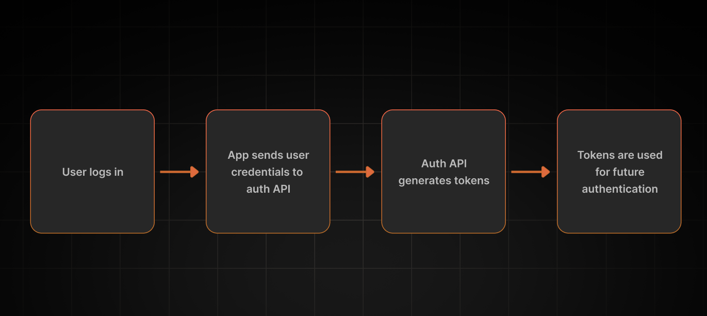

In this article you will learn how authentication providers and APIs can secure your organization or application. 🛡️

If you are new to authentication providers and APIs, don’t worry. We will go over a few concepts before you can make the best choice for your organization. 

If you want to skip right to the section on choosing an authentication provider, we have this nifty table of contents for you. 📜

```toc
tight: true
toHeading: 3
```
## Understanding Authentication Providers and their APIs: Why They Matter
First let’s go over a couple of definitions: 

1. **Authentication Providers** are services that manage authentication for your organization, handling all the complex and boring details so you can focus on your product or services, the things you like. 🧑‍💻 **Long story short, we handle all the login and security details so you don’t have to worry about it.** Some examples are Okta, AWS Cognito, Keycloak, and of course, SuperTokens. 

2. **Authentication APIs** are endpoints that enable developers to integrate authentication functionality into their applications without headaches. They manage all aspects of user identity. 

The benefits of using authentication providers: 
* Frees up your development time so you can focus on cooler stuff, like your app. 🦄
* You get to store less user information. 🎉
* You don’t need to become a security expert to keep your app and users safe. 🔐

By using reliable authentication providers and APIs, you can build seamless and safe user experiences that users will trust. This not only enhances their experience with using your app, but also benefits your business, as users place a high value on security and are more likely to engage with platforms they feel protect their data. Security is only going to grow in importance, and apps that prioritize it will reap the rewards. 


## Key Features of Authentication Providers
Let’s move on to some key features of Authentication Providers, to give you an idea of what they can do for you. Below we will explore the different ways Authentication Providers allow you to authenticate your users, so you can choose which one works best for you. 

### 🪄Magic Links
**Magic links** replace traditional username/password authentication by sending an email, containing a one-time use URL link,  to the user for authentication. Once the link is clicked, an access token is sent to the application to authenticate the user. 

### 🚫 Passwordless Authentication 
[**Passwordless**](https://supertokens.com/blog/what-is-passwordless-authentication) authentication verifies users without the need for traditional passwords. It streamlines the authentication experience and increases security. This could be through sending a one-time password (OTP) or a magic link through an email or phone number. No passwords = no passwords to steal! 😎

### 🔐 Single Sign-On (SSO) 
**Single Sign-On (SSO)** allows users to access multiple related apps with one set of credentials, like using a Gmail login to access Google Drive and Calendar. It reduces password fatigue and is commonly used in enterprises, simplifying credential management for employees who need access to many apps.

### 🔒 Multi-Factor Authentication (MFA)
**Multi-Factor Authentication (MFA)** combines two or more authentication types:
* **Knowledge**: Something the user knows (e.g., password).
* **Possession**: Something the user has (e.g., phone).
* **Inherence**: Something the user is (e.g., biometrics).

For example, a user enters a password, then verifies with an SMS code or facial recognition. This extra layer boosts security against hackers.

### 🌐 Social Logins (OAuth, OpenID Connect)
**Social logins** let users sign in using trusted accounts (e.g., Google, Facebook, GitHub). This reduces signup friction for users and simplifies authentication for developers, as sensitive passwords are handled by trusted providers. Protocols like **OAuth 2.0** and **OpenID Connect** secure the communication between apps. 

### 👤 User Role and Permission Management
Authentication providers have features that enable you to set users up with different roles and permissions.

**User roles** define what tasks a group of users can perform, helping organizations manage access and responsibilities. ⏰ Common examples:
* 👑 **Admin**: Full control, can add users, modify settings, and edit all content.
* 🙋‍♂️ **User**: Limited access, can create or edit their own content but not others’.

**Permissions** specify what users are allowed to do within the app, often tied to their role. Examples:
* 📝 **Create**: Add new posts, events, or videos.
* 👀 **Read**: View content without editing (e.g., Netflix shows).
* ✏️ **Update**: Edit bios or descriptions (e.g., Instagram or GitHub).
* 🗑️ **Delete**: Remove items like comments or playlists.

Clear roles and permissions enhance security, meet compliance needs, and provide a tailored user experience. What’s not to like? 😎

## How Authentication APIs Works
**Authentication APIs** in authentication providers work by handling the process of verifying user identities. They: 
* Grant secure access to applications. 🔑
* Simplify auth implementation for developers while adhering to the best security practices. 💪
* Provide endpoints for user authentication actions like login, signup, logout, and API access. 💻
* Provide helpful error codes when something goes wrong so you can identify the problem more efficiently. 
* Provide rate limiting so your APIs are not overused, or raise flags if they are used beyond the normal rate which can help detect unusual login behavior. 

Let's look at how APIs fit into an Authentication Provider's ecosystem.

### API-Driven Authentication Flow
When a user logs in, the application sends their credentials to the authentication API. If the credentials are valid, the API generates tokens (such as access and refresh tokens) that the application uses to authenticate future requests.

<!--  -->

 

### Secure Session Management 

**Session management** safeguards user identities and data while enabling seamless navigation across a web application. It ensures that authenticated users remain recognized throughout their session while protecting against unauthorized access.

When a user makes an initial request, the server generates a token (a random string identifying the user) which is then destroyed when the session ends. 

> Tokens include **short-lived access tokens** for resource access and **long-lived refresh tokens** for obtaining new access tokens without re-authentication.

### What is the Role of OAuth 2.0 in API Authentication?

**OAuth 2.0** is a protocol that enables third-party applications to act on a user's behalf, such as logging in or accessing data, without exposing the user’s actual credentials. Keeping credentials private is crucial for security!

You've likely encountered OAuth 2.0 when an application prompts you to log in using your Google or GitHub account. This method enhances security by preventing applications from directly accessing your password while still granting necessary permissions.

For a deeper dive into OAuth 2.0 and how it differs from traditional authentication methods, check out these resources:
* [How The Heck Does OAuth Work?](https://supertokens.com/blog/how-does-oauth-work)

* [What is OAuth and It's Importance in a Secure Web](https://supertokens.com/blog/oauth)

## Security in Authentication APIs


## Benefits of Using Authentication Providers

### Endpoints to make integration fast and easy
URLs on the authentication provider's server that your application can interact with to initiate the user login process, verify credentials, and receive authentication tokens. They essentially act as the gateway to authenticate users against the provider's system. 

### Improved Security
Authentication providers make it their mission to provide safety for users. They keep up with security compliance, constantly build new safety features, and overall make it their goal to build a secure login process. They provide built in protections against common cyber attacks, like brute force attacks or credential stuffing.

### Powerful Authentication Features 
You have the choice between different authentication methods like multi-factor authentication (including 2FA), passwordless authentication, social logins like logging in with Google or GitHub, and much  more including the ability to support multi-tenancy. You don't have to do it all yourself. 

### Fraud and Identity Theft Prevention 
Authentication providers, like SuperTokens, have robust features that prevent fraud and identity theft prevention, so you don't have to stress about it.

## How SuperTokens Simplifies Authentication Integration

Learn how SuperTokens simplifies authentication integration and gives you exactly what you want!

The functionalities that SuperTokens provides are bundled up together and called **Recipes**. 🍝

Here is an overview of SuperTokens’ authentication recipes: 

> **Note**: You can use them out of the box, with our pre-built UI, or even implement your own interface. How cool! 💻

### Email and Password

The [**email/password**](https://supertokens.com/docs/authentication/email-password/introduction) recipe provides a way to authenticate with the basic credentials we all know. 

You can also use a username with an optional email field for this recipe. ⭐

You can adjust the functionality of the recipe to fit your exact use case: 
* Add custom logic after login/sign up
* Adapt the look/feel of your forms
* Change the behavior of the functions that are used by the SDKs
* Get control over how the frontend SDKs communicate with the backend

### Passwordless

The [**passwordless**](https://supertokens.com/docs/authentication/passwordless/introduction) recipe provides a way to authenticate users through generated credentials like magic links or one-time passwords (OTPs). 📲

You can adjust the functionality of the passwordless recipe to fit your exact use case: 
* Add custom logic after login/sign up
* Change how magic links are constructed 
* Change the format of the generated OTPs
* Customize how emails/SMS messages are sent to your users
* Change the behavior of the functions that are used by the SDKs
* Get control over how the frontend SDKs communicates with the backend

### Social Logins

The third-party recipe (for social logins) provides a way to authenticate users through a third party provider like Google, Github, or Apple. 

Our list of built-in providers:
* Google (Including Google Workspaces)
* Apple
* Discord
* Facebook
* Github
* Gitlab
* Twitter
* LinkedIn
* Okta
* SAML

> Note: If SuperTokens doesn’t support a provider out of the box, you can add your own [**custom provider**](https://supertokens.com/docs/authentication/social/custom-providers). ⚙️

In addition to authentication recipes **SuperTokens** also provides: 

* Support for multi-tenancy and dynamic tenant creation.
* Robust attack protection and bot detection mechanism in our [**Attack Protection Suite**](https://supertokens.com/docs/additional-verification/attack-protection-suite/introduction).

## Conclusion

By leveraging a powerful authentication provider, you can enhance security, improve user trust, and reduce the complexity of managing authentication yourself. Prioritizing security now will set your application up for long-term success! Leave security and login to authentication providers so you can focus on building the next great thing! 🚀


