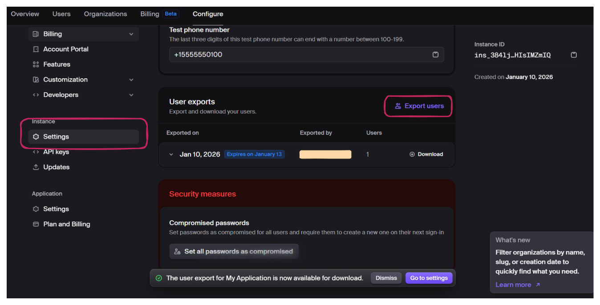

Migrating authentication systems represents a critical infrastructure decision that affects every user interaction with your application.
Clerk provides a robust authentication platform, but developers increasingly seek alternatives offering greater control, cost predictability, or self-hosting capabilities. SuperTokens delivers these advantages while maintaining enterprise-grade security and a
comprehensive feature set.

This guide provides a detailed roadmap for migrating from Clerk to SuperTokens, covering migration strategies, user data export and import procedures, session handling, multi-factor authentication (MFA) preservation, and rollout best practices.

## **Migration Strategies: Choosing Your Approach**

The selection of a migration strategy depends on the size of the user base, the acceptable downtime, and operational constraints. [SuperTokens](https://supertokens.com/) supports multiple migration patterns, each with distinct trade-offs.

### **What Migration Options Exist?**

- **Lazy Migration (Trickle Migration)** 
Users migrate individually upon their next login attempt. The system checks the Clerk first, validates credentials, imports the user into SuperTokens, and issues a new session. This approach requires maintaining both systems temporarily, but it distributes the migration load over time and targets active users first.

- **Bulk Import** 
Export all users from Clerk and import them into SuperTokens in batches using the `/bulk-import/users` API. This method migrates users upfront, enabling faster Clerk deprecation.

- **Full Export/Import via Scripts** 
Automated scripts extract users from Clerk, transform data into SuperTokens format, and execute imports. This approach offers maximum control for complex migration requirements.

- **Hybrid Approach** 
Combine bulk import for the majority of users with lazy migration for edge cases or recently registered accounts.

### **1. Trickle Migration (Lazy Migration)**

Trickle migration enables seamless, incremental user transitions without bulk data operations. This approach mirrors Clerk\'s own migration recommendations for minimal disruption.

**How It Works:**

1. User attempts to log in with email and password
2. Check if the user exists in SuperTokens
3. If not found, authenticate against Clerk
4. Upon successful Clerk authentication, import the user into SuperTokens
5. Issue SuperTokens session token
6. Subsequent logins authenticate directly against SuperTokens

**Advantages:**

- No downtime required
- Active users migrate first
- Minimal risk&mdash;each user migration is isolated
- Gradual load distribution

**Considerations:**

- Requires maintaining both systems during transition
- The complete migration timeline depends on the user login frequency
- Inactive users may never migrate without eventual bulk import

### **2. Bulk Import**

Bulk import migrates all users upfront through SuperTokens\' `/bulk-import/users` endpoint, enabling rapid Clerk deprecation.

**Key Steps:**

1. Export the complete user dataset from the Clerk dashboard
2. Transform data into SuperTokens bulk import format
3. Submit batches (up to 10,000 users per request)
4. Monitor import job status
5. Handle failures and retry as needed

**Advantages:**

- Fastest path to removing Clerk dependencies
- All users are available immediately
- Simpler post-migration architecture
- Predictable timeline

**Considerations:**

- May require a maintenance window
- Higher initial load on infrastructure
- Failed imports require careful remediation

### **3. Full Migration via Scripts**

Scripted migration provides maximum flexibility for complex requirements, inspired by Better Auth\'s migration guides.

**When to Use:**

- Large user bases require careful batch management
- Custom authentication flows or metadata schemas
- Need for detailed logging and audit trails
- Integration with existing DevOps pipelines

**Script Responsibilities:**

- Export users from Clerk
- Transform data schemas (Clerk → SuperTokens format)
- Handle password hash compatibility
- Execute batch imports with retry logic
- Monitor progress and log failures
- Verify data integrity post-migration

## **Exporting and Importing Clerk Users**

Successful migration depends on accurately exporting Clerk user data and transforming it into SuperTokens-compatible format.

### **Export Users from Clerk Dashboard**

**Steps:**

1. Navigate to [Clerk Dashboard](https://clerk.com/user-authentication?utm_source=google&utm_medium=cpc&utm_campaign=%7Bcampaignname%7D&utm_adgroup=%7Badgroupname%7D&utm_term=clerk&gad_source=1&gad_campaignid=23228885670&gbraid=0AAAAAqJUiX7m311FiPI1I20vdkUmBaDeO&gclid=CjwKCAiAjojLBhAlEiwAcjhrDiP0PVXaecZ5o0nJRwjXDHnoC2VckT_z_i92YJMiQ4_PdGmy_7R0EBoCZZAQAvD_BwE) → Configure section → settings
2. Click \"Export Users\"
3. Download export file



**Export Data Structure:**

```js
{
  "id": "user_2abc123",
  "email_addresses": [
    {
      "email_address": "user@example.com",
      "verification": { "status": "verified" }
    }
  ],
  "password_hash": "$2a$10$abcdefghijklmnopqrstuv",
  "password_hasher": "bcrypt",
  "totp_secrets": [
    {
      "secret": "JBSWY3DPEHPK3PXP",
      "verified": true
    }
  ],
  "first_name": "John",
  "last_name": "Doe"
}
```

### **Using Clerk Migration Scripts**

SuperTokens community provides migration scripts that handle Clerk-specific data formats and common edge cases.

**Supported Password Hash Algorithms:**

- bcrypt (most common)
- argon2id
- scrypt
- PBKDF2
- MD5 (legacy)

**Script Features:**

- Automatic rate limit handling with exponential backoff
- Foreign key mapping preservation (Clerk user ID → SuperTokens external user ID)
- Batch processing for large datasets
- Progress tracking and resumable imports
- Validation and error reporting

### **Formatting for SuperTokens Bulk Import**

SuperTokens bulk import API requires specific JSON structure with these required fields:

**Required Fields:**

- `externalUserId`: Unique identifier (use Clerk\'s user ID)
- `loginMethods`: Array of authentication methods
- `totpDevices`: Array of MFA TOTP devices (optional)
- `userMetadata`: Custom user data (optional)

**Import Format:**

```js
{
  "users": [
    {
      "externalUserId": "clerk_user_2abc123",
      "loginMethods": [
        {
          "email": "user@example.com",
          "passwordHash": "$2a$10$abcdefghijklmnopqrstuv",
          "hashingAlgorithm": "bcrypt",
          "verified": true
        }
      ],
      "totpDevices": [
        {
          "secretKey": "JBSWY3DPEHPK3PXP",
          "deviceName": "Authenticator App"
        }
      ],
      "userMetadata": {
        "firstName": "John",
        "lastName": "Doe"
      }
    }
  ]
}
```
**Field Mapping Reference:**

| Clerk Field                        | SuperTokens Field                     |
|------------------------------------|---------------------------------------|
| id                                 | externalUserId                        |
| email_addresses[0].email_address   | loginMethods[0].email                 |
| password_hash                      | loginMethods[0].passwordHash          |
| password_hasher                    | loginMethods[0].hashingAlgorithm      |
| totp_secrets[0].secret             | totpDevices[0].secretKey              |
| first_name, last_name               | userMetadata.firstName, userMetadata.lastName |

## **Implementing SuperTokens After Clerk**

Successful migration requires proper SuperTokens setup and integration with existing application code.

### **Core Setup**

**Install SuperTokens Core:**

For self-hosted deployments:
```js
docker run -d -p 3567:3567 registry.supertokens.io/supertokens/supertokens-postgresql
```

For managed hosting, use SuperTokens Cloud and obtain connection URI from the dashboard.

**Install SDKs:**

```js
# Backend
npm install supertokens-node

# Frontend (React)
npm install supertokens-auth-react
```

**Backend Configuration:**

```js
import SuperTokens from "supertokens-node";
import EmailPassword from "supertokens-node/recipe/emailpassword";
import Session from "supertokens-node/recipe/session";


SuperTokens.init({
  framework: "express",
  supertokens: {
    connectionURI: "http://localhost:3567",
  },
  appInfo: {
    appName: "Your App",
    apiDomain: "http://localhost:3001",
    websiteDomain: "http://localhost:3000",
    apiBasePath: "/auth",
    websiteBasePath: "/auth",
  },
  recipeList: [
    EmailPassword.init(),
    Session.init(),
  ],
});
```

**Frontend Configuration:**

```js
import SuperTokens from "supertokens-auth-react";
import EmailPassword from "supertokens-auth-react/recipe/emailpassword";
import Session from "supertokens-auth-react/recipe/session";


SuperTokens.init({
  appInfo: {
    appName: "Your App",
    apiDomain: "http://localhost:3001",
    websiteDomain: "http://localhost:3000",
    apiBasePath: "/auth",
    websiteBasePath: "/auth",
  },
  recipeList: [
    EmailPassword.init(),
    Session.init(),
  ],
});
```
### **Lazy/Trickle Migration Integration**

Integrate lazy migration logic into your authentication flow:

```js
app.post("/auth/signin", async (req, res) => {
  const { email, password } = req.body;
 
  // Check SuperTokens first
  let user = await EmailPassword.getUserByEmail(email);
 
  if (!user) {
    // User not migrated - check Clerk
    const clerkUser = await clerk.users.getUser({ emailAddress: [email] });
   
    if (clerkUser && await clerk.verifyPassword(clerkUser.id, password)) {
      // Import to SuperTokens
      await fetch("http://localhost:3567/bulk-import/users", {
        method: "POST",
        body: JSON.stringify({
          users: [{
            externalUserId: clerkUser.id,
            loginMethods: [{
              email: clerkUser.emailAddresses[0].emailAddress,
              passwordHash: clerkUser.passwordDigest,
              hashingAlgorithm: "bcrypt",
            }],
          }],
        }),
      });
     
      user = await EmailPassword.getUserByEmail(email);
    }
  }
 
  // Create SuperTokens session
  if (user) {
    await Session.createNewSession(req, res, user.id);
    res.json({ status: "OK" });
  } else {
    res.status(401).json({ error: "Invalid credentials" });
  }
});
```

### **Bulk Import Use Case**

Execute bulk imports for complete user base migration:

```js
import fs from "fs";


async function bulkImportUsers() {
  const clerkUsers = JSON.parse(fs.readFileSync("clerk_export.json"));
 
  // Transform to SuperTokens format
  const superTokensUsers = clerkUsers.map(u => ({
    externalUserId: u.id,
    loginMethods: [{
      email: u.email_addresses[0].email_address,
      passwordHash: u.password_hash,
      hashingAlgorithm: "bcrypt",
    }],
    totpDevices: u.totp_secrets?.map(s => ({
      secretKey: s.secret,
      deviceName: "Migrated Device",
    })) || [],
  }));
 
  // Import in batches of 10,000
  const batchSize = 10000;
  for (let i = 0; i < superTokensUsers.length; i += batchSize) {
    const batch = superTokensUsers.slice(i, i + batchSize);
   
    await fetch("http://localhost:3567/bulk-import/users", {
      method: "POST",
      headers: { "Content-Type": "application/json" },
      body: JSON.stringify({ users: batch }),
    });
  }
}
```

**Monitor Import Progress:**

```js
// Check status
const response = await fetch("http://localhost:3567/bulk-import/users/status");
const status = await response.json();


console.log(`Total: ${status.stats.total}, Success: ${status.stats.success}, Failed: ${status.stats.failed}`);
```

## **Handling Sessions, MFA, and Other Edge Cases**

### **Migrating Session State**

Active Clerk sessions do not transfer to SuperTokens. Users with valid Clerk sessions continue working until expiration; next login triggers migration and SuperTokens session creation.

**Session Fallback Logic:**

During transition, implement verification fallback:

```js
async function verifySessionWithFallback(req, res, next) {
  try {
    await verifySession()(req, res, next);
  } catch (error) {
    // Try Clerk session as fallback
    const clerkSession = await clerk.sessions.verifySession(req.cookies.__session);
    if (clerkSession) {
      req.clerkUserId = clerkSession.userId;
      next();
    } else {
      res.status(401).json({ error: "Unauthorized" });
    }
  }
}
```

### **MFA/TOTP Data**

Multi-factor authentication secrets must be preserved to avoid forcing users to re-enroll.

**Export from Clerk:**

Clerk exports include TOTP secrets in user data:

```js
{
  "totp_secrets": [
    {
      "secret": "JBSWY3DPEHPK3PXP",
      "verified": true
    }
  ]
}
```

**Import to SuperTokens:**

Include TOTP devices in the bulk import:

```js
{
  "totpDevices": [
    {
      "secretKey": "JBSWY3DPEHPK3PXP",
      "deviceName": "Authenticator App",
      "verified": true
    }
  ]
}
```

### **Ensuring userId Continuity**

Maintain user ID consistency to preserve foreign key relationships in your application database.

**Strategy:**

Use the Clerk\'s user ID as SuperTokens\' externalUserId:

```js
{
  "externalUserId": "clerk_user_2abc123"
}
```

**Access External User ID:**

```js
const users = await SuperTokens.getUsersOldestFirst({
  externalUserId: clerkUserId,
});
const user = users.users[0];
```

## **Recommended Rollout Steps**

### **1. Prep Environment**

**Set Up Staging:**

- Deploy SuperTokens instance (self-hosted or managed)
- Configure staging with both Clerk and SuperTokens
- Export sample users from Clerk production
- Import sample users into SuperTokens staging

**Test Authentication Flows:**

- User registration
- Login
- Password reset
- MFA enrollment and verification
- Session management

### **2. Enable Lazy Migration First**

**Timeline:**

- Week 1-2: Deploy lazy migration to staging and test
- Week 3: Deploy to production with feature flag
- Week 4+: Monitor migration metrics

**Key Metrics:**

- Total users migrated
- Daily migration rate
- Migration failures
- Average migration time

### **3. Bulk-Import the Rest**

After lazy migration stabilizes (typically 2-4 weeks):

1. Export complete user list from Clerk
2. Filter out already-migrated users
3. Execute bulk import in batches
4. Monitor import job status
5. Verify data integrity
6. Handle failed imports

### **4. Developer and UX Testing**

**Test Checklist:**

- Registration creates SuperTokens account
- Login authenticates against SuperTokens
- Password reset works end-to-end
- MFA functions correctly
- Role-based access control enforced
- Session refresh works
- Profile updates persist
- Email verification completes

### **5. Final Cutover**

**Remove Clerk Dependencies:**

```js
npm uninstall @clerk/nextjs @clerk/clerk-react @clerk/backend
```

**Update Authentication Code:**

```js
// Before (Clerk)
import { SignIn } from "@clerk/nextjs";

// After (SuperTokens)
import { EmailPasswordAuth } from "supertokens-auth-react/recipe/emailpassword";
```

**Communication:**

- Notify users of the authentication system upgrade
- Update documentation
- Inform the support team
- Prepare rollback plan

## **Benefits of Migrating to SuperTokens**

### **Full Control and Open Source**

SuperTokens provides complete source code visibility. No black-boxauthentication logic&mdash;developers can audit every line, modify flows, and contribute improvements. Self-hosted deployments eliminate vendor lock-in and provide complete control over data residency, upgrades, and infrastructure.

### **Customizable Authentication Flows**

SuperTokens enables complete customization of authentication logic:

- Custom signup validation and business rules
- Modified password requirements
- Tailored password reset flows
- Custom MFA enrollment logic
- Session duration policies
- Custom claims in access tokens

### **Cost-Effective and Scalable**

**Pricing Comparison:**

| Users    | Clerk | SuperTokens (Self-Hosted) | SuperTokens (Managed) |
|----------|-------|---------------------------|----------------------|
| 10k MAU  | Free  | Free                      | $200/month           |

**Key Advantage:** Flat-rate pricing without per-user charges that scale exponentially.

### **Built-In Migration Support**

SuperTokens provides official migration tooling:

- Bulk import API with batch processing
- Password hash compatibility for major algorithms
- MFA/TOTP secret import
- User metadata preservation
- External ID mapping for foreign key continuity

## **FAQ and Troubleshooting**

### **Can existing sessions persist across platforms?**

No, active sessions cannot transfer between Clerk and SuperTokens due to different token formats. However, lazy migration ensures minimal
disruption&mdash;users continue with Clerk sessions until expiration, then migrate on next login.

### **How to import MFA secrets securely?**

Include TOTP secrets under `totpDevices` in bulk import requests. SuperTokens stores MFA secrets encrypted at rest.

**Security Best Practices:**

- Export over HTTPS only
- Store export files encrypted
- Delete exports immediately after import
- Audit MFA import events
- Verify TOTP functionality for sample users

### **What about rate limits?**

**Clerk:** May impose rate limits on exports; migration scripts handle this with exponential backoff.

**SuperTokens:** Processes up to 10,000 users per batch. For larger datasets, submit multiple batches sequentially.

### **How to debug import failures?**

Check failed imports via status endpoint:

```js
const response = await fetch("http://localhost:3567/bulk-import/users/status?status=FAILED");
const failedImports = await response.json();

failedImports.users.forEach(failed => {
  console.error(`User ${failed.externalUserId}: ${failed.error}`);
});
```

**Common Issues:**

| Error                     | Solution                                  |
|---------------------------|-------------------------------------------|
| "Invalid password hash"   | Convert hashes or require password reset  |
| "Duplicate email"         | Skip or update existing user              |
| "Missing required field"  | Fix data transformation logic             |
| "Invalid TOTP secret"     | Verify secret encoding                     |


## **Conclusion and Next Steps**

Migrating from Clerk to SuperTokens involves strategic planning, careful data handling, and systematic rollout. Key approaches include:

- **Lazy/Trickle Migration**: Incremental migration upon login, targeting active users first
- **Bulk Import**: Upfront migration via API for faster Clerk deprecation
- **Hybrid Approach**: Combining both methods for optimal results

**Critical Considerations:**

- Preserve MFA secrets to avoid forcing re-enrollment
- Implement session fallback during transition
- Use Clerk user IDs as SuperTokens external IDs for continuity
- SuperTokens supports bcrypt, argon2, scrypt, and other hash algorithms

**SuperTokens Advantages:**

- Open source with full code visibility
- Self-hosting eliminates vendor lock-in
- Flat-rate pricing vs per-user charges
- Deep customization of all authentication flows
- Built-in migration support

**Next Steps:**

1.  Review official SuperTokens migration docs at [https://supertokens.com/docs/emailpassword/migration/about](https://supertokens.com/docs/emailpassword/migration/about)
2. Set up staging environment with both systems
3. Export sample users and test migration scripts
4. Start with lazy migration for low-risk rollout
5. Schedule bulk import after validation
6. Join SuperTokens Discord for migration support

With proper planning and the strategies outlined in this guide, you can transition smoothly from Clerk to SuperTokens while maintaining
security, preserving user data, and minimizing disruption.
