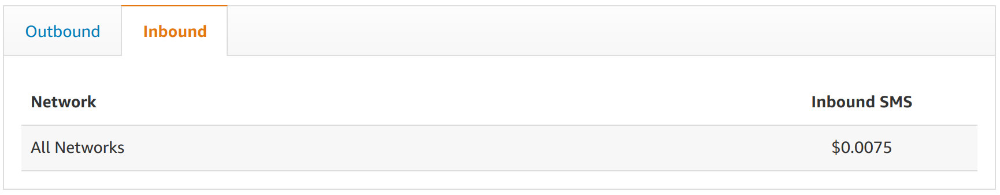

## Table of Contents
- [What is AWS Cognito?](#what-is-aws-cognito)
- [AWS Cognito Pricing](#aws-cognito-pricing)
- [AWS Cognito Alternative: SuperTokens](#aws-cognito-alternative-supertokens)

## What is AWS Cognito?

Cognito is a service that provides authentication, authorization, and user management for web and mobile apps. It is part of the AWS suite of products and can be used easily with any of their other offerings such as Lambda.

## AWS Cognito Pricing

Cognito’s free tier offers up to **50,000 MAUs** for free. Included are the Identity pool features which cover access control and RBAC.

#### Free:
- User pools free for up to **50000 MAUs**
- **50 MAUs** for SAML / OIDC
- identity pools (Access control, RBAC, etc)

#### Paid Features:
Cognito offers pricing tiers for additional MAUs and users with SAML/OIDC connections. They also offer advanced security features like compromised credential protection, risk-based adaptive authentication, and monitoring.
- Pricing tiers for additional MAUs:

- Additional SAML/OIDC users:
  - **$0.015** per MAU after the first **50** in the free tier
- Pricing tiers for advanced security features : 

- SMS charges for multi-factor: 
  - Inbound charges:
  
  - Outbound charges:
  

## AWS Cognito Alternative: SuperTokens

### What is SuperTokens?
SuperTokens is an open-source authentication solution that provides a managed service for hassle-free auth and an on-prem solution so developers can manage their data.

## SuperTokens Pricing:
At the time of writing this article, the SuperTokens feature set is completely free. If you decide to use the self-hosted version you can download the core and use it for free for an unlimited number of users.

- **Self-Hosted:**
  - Free forever for unlimited users.
- **Managed Service:**
  - Free for the first 5000 MAUs.
  - 2 cents / MAU post the first 5000 MAUs.

### Should you use SuperTokens?
SuperToken’s feature set and pricing make it an excellent choice for startups and mid-level businesses, but it may not be the best fit for large organizations that require enterprise features.
