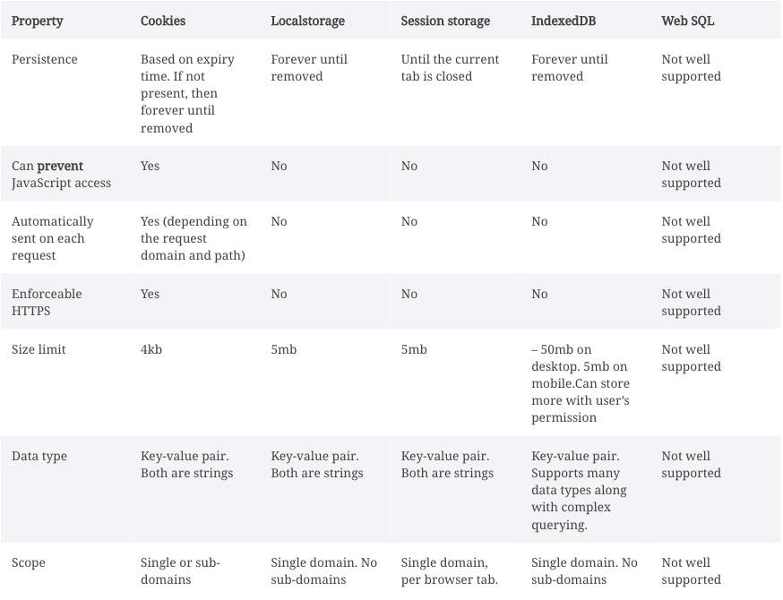

For logged-in users, session tokens act as a proxy to their identity. These tokens (JWT or non-JWT) are issued by the backend and sent to the frontend where they are stored. If they are misused or stolen, the attacker can gain unauthorized access to the victim’s account. As such, we must make sure to **minimize the risk of all the possible ways a session attack can be carried out.**

One of the session attack vectors is the frontend client – the web browser. The session tokens are stored here for as long as the user is logged in. This means we must be careful about where and how we store them. This is where we start to consider the debate of browser storage (localstorage, sessionstorage etc..) vs cookie storage.

Before we get into the pros and cons of the two storage types, let’s examine their properties briefly.

_A clarification point: Both JWT and non-JWT (opaque) session tokens can be stored in cookie storage or in browser storage. The only difference between the two types is the amount of space they take up, which we will consider in this article. But apart from this difference, when we refer to “session token”, we mean either of the two types._

## Storage properties

The table below compares the different storage mechanisms across all the various relevant properties. Note that ‘browser storage’ can actually be either local or session storage, IndexedDB or Web SQL.

Session storage **X** - Most apps require the user to be logged in even if they open multiple browser tabs or restart the browser and hence we can eliminate this method of storage (don’t be deceived by its name).

IndexedDB **X** – Session tokens are key-value pairs. As such, they do not need complex querying capabilities. Using IndexedDB can technically be an option, however, it would be more complex than using localstorage for the purposes of storing and retrieving session tokens.

Web SQL **X** - Looking at the table, it is clear that WebSQL was never an option.

We are left with choosing between localstorage and Cookie storage.

## Cookies vs Localstorage

We will compare these storage types from a usability and security point of view. For usability, we will consider ease of writing, reading and deleting session tokens, and any limitations placed by each of the storage types for specific use cases.

From a security point of view, we will consider the different methods that can be used for token misuse or theft for each of the storage types.

## Usability analysis

1. <u>Size constraints</u>: Cookies have a size limitation of 4kb per domain, whereas localstorage size is an order of magnitude larger. For most cases, 4kb is more than enough for storing session tokens, even when using JWTs[_[1]_](/blog/cookies-vs-localstorage-for-sessions-everything-you-need-to-know#footer-note-1).

   **Cookie: 1; Localstorage: 1**

2. <u>Automatic management</u>: Cookies are automatically saved, sent and removed by the browser. The frontend developer does not have to worry about implementing this part, nor is there any scope of a mistake from the frontend side. This is not true for localstorage.

   **Cookie: 2; Localstorage: 1**

3. <u>Server side rendered apps</u>: When doing browser level navigation (user types in a URL into their browser / opens a link on a new tab), only cookies are sent. This means, for those API calls to the server, they will only get the session tokens if they are using cookies – localstorage will not work.

   **Cookie 3; Localstorage 1**

4. <u>Sharing the same session across subdomains</u>: The objective here is that the user should use the same session when navigating to different subdomains of a site. This can be easily done via cookies by setting the cookie domain as “.yoursite.com”.   This is not easily possible to do via localstorage since the store is not shared across domains / subdomains. One can use iframes to hack around this, however it’s non trivial.

   **Cookie: 4; Localstorage: 1**

## Security Analysis

1. <u>Token misuse via XSS attack</u>: An XSS attack happens when “malicious” JavaScript is injected into a website. Some ways in which this code injection can happen are incorrect input / output validation, a rogue third party script being loaded into the site’s frontend code or social engineering.

   If using localstorage, the malicious JS code can easily read the session tokens and transmit them to the attacker. The attacker would then put these tokens into their browser and have significant, if not complete access to that user’s account.

   Cookies have this special flag called httpOnly. If set, it prevents any JS on the frontend from reading that cookie’s value. This means that the malicious JS code cannot send the access token to the attacker. However, that code can still do malicious API calls while the user is using the site. Depending on the product and the reason for the attack, that may not be enough to fulfill the attacker’s intention.

   **Cookie: 5; Localstorage: 1**

2. <u>Token misuse via CSRF attack</u>: This is an attack that forces an end user to execute unwanted actions on a web application in which they’re currently authenticated. This unwanted action is performed when a user visits a third party malicious site. This attack is only possible if using cookies to store access tokens. However, it can also be easily mitigated using anti-csrf tokens or the sameSite flag in cookies. Regardless, when using localstorage, one does not need to think about this attack vector.

   **Cookie: 5; Localstorage: 2**

3. <u>Token theft via a malware</u>: This is a growing concern. In fact, many large Youtube subscribers’ accounts were hijacked because their session tokens were stolen via a malware on their computer. They were infected with this malware due to a social engineering attack. Neither localstorage, nor cookie storage will make a difference to mitigate this attack (hence no points awarded to either). The only measure one can take here is to have [token theft detection](https://datatracker.ietf.org/doc/html/rfc6819#section-5.2.2.3) in place.

   **Cookie: 5; Localstorage: 2**

## Misconceptions

1. <u>Cookies can be cleared by the user</u>: This is true, however, the same holds for localstorage as well. When clearing browsing history and cookies, localstorage is also cleared.

2. <u>No need for cookie consent when using localstorage</u>: A site only needs to ask for cookie consent for cookies that are not “strictly necessary cookies” (learn more about it [here](https://gdpr.eu/cookies/)). Session cookies count as strictly necessary and hence a user cannot deny their usage. That being said, the user still needs to be told about their existence.

3. <u>Mobile apps cannot use cookies</u>: This is simply not true. All mobile development frameworks (iOS, Android, React Native, Flutter, Cordova, etc..) have native support for cookies.

## Conclusion

Based on the final scores (Cookie: 5; Localstorage: 2), it’s quite clear that httpOnly, secure cookies is the right way to go for storing session tokens. This is also a recommendation from the OWASP community[_[2]_](/blog/cookies-vs-localstorage-for-sessions-everything-you-need-to-know#footer-note-2).

This article is written by the team at [SuperTokens](/blog) – we are building a session management solution that optimizes for security, developer, and end-user experience. If you liked this article, you may also be interested in:

- [Are you using JWTs for user sessions in the correct way?](/blog/are-you-using-jwts-for-user-sessions-in-the-correct-way)
- [The best way to securely manage user sessions](/blog/the-best-way-to-securely-manage-user-sessions)

## Footnotes

[1]: A typical JWT contains the following information:
   - iss (issuer): site name (20 bytes is a good upper limit)
   - sub (subject): 36 bytes UUID
   - aud (audience): site name (20 bytes is a good upper limit)
   - exp (expiry): timestamp: 13 bytes
   - nbf (not before time): timestamp: 13 bytes
   - iat (issued at time): timestamp: 13 bytes
   - custom roles and information: 200 bytes more

This is a total of 315 bytes. The JWT header is normally between 36 and 50 bytes and finally the signature is between 43 and 64 bytes. So this gives us a maximum of 429 bytes which would take about 10% of cookie space.

[2]: *“Do not store session identifiers in localstorage as the data is always accessible by JavaScript. Cookies can mitigate this risk using the httpOnly flag.”* [Source](https://cheatsheetseries.owasp.org/cheatsheets/HTML5_Security_Cheat_Sheet.html)
