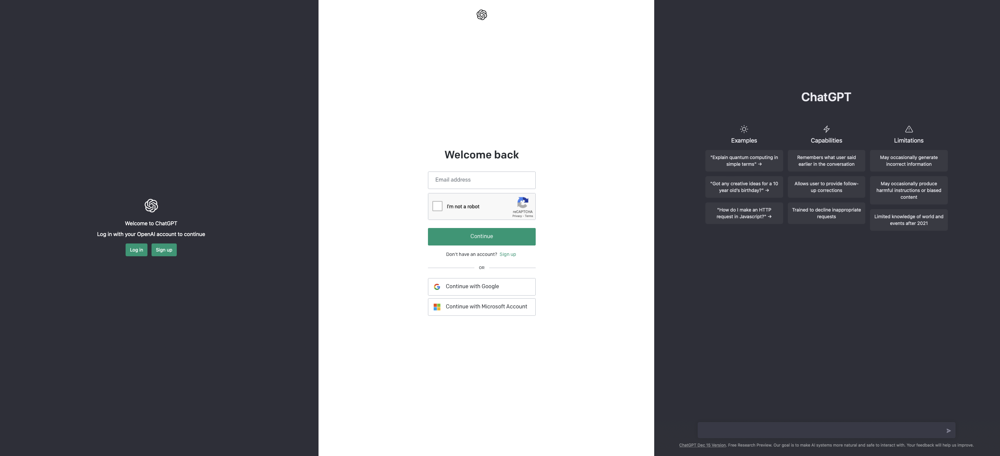
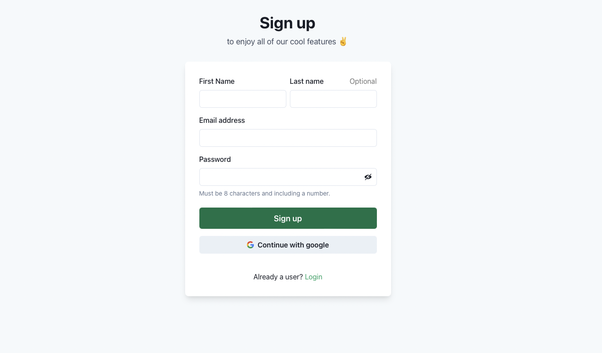
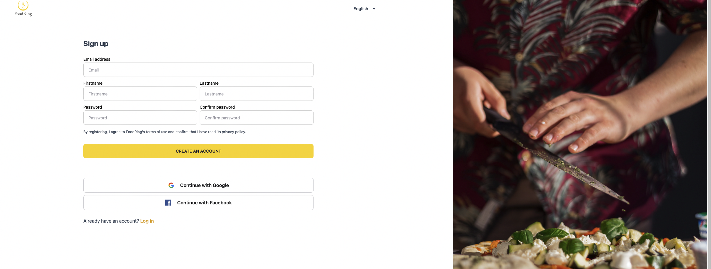
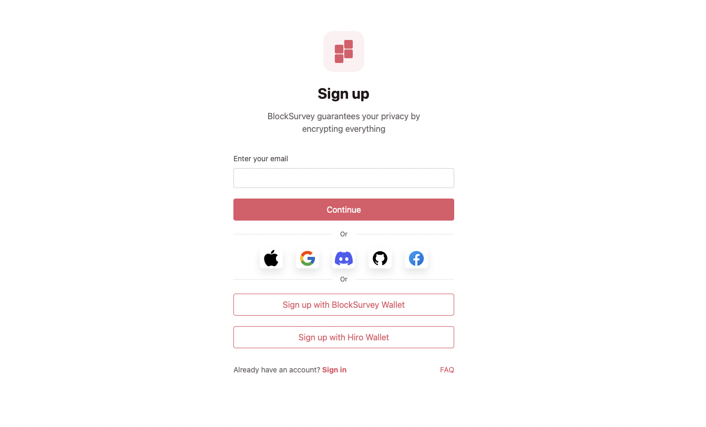

## Table of Contents
- [Introduction](#introduction)
- [Custom UI, authentication that feels native](#custom-ui-authentication-that-feels-native)
- [Native experiences, happy users](#native-experiences-happy-users)
- [Building the next generation of authentication](#building-the-next-generation-of-authentication)

## Introduction 
We’re excited to announce the ability to easily build your own customized user authentication experience with SuperTokens. 

While SuperTokens comes with a pre-built UI, we’ve launched the [supertokens-web-js SDK](https://github.com/supertokens/supertokens-web-js) for users to have complete control over their signup page and all other auth UIs.

Custom UI condenses all the benefits of SuperTokens authentications at a function level. Call a single function like `signUp` or `doesEmailExist`, and our [supertokens-web-js SDK](https://github.com/supertokens/supertokens-web-js) handles the rest.

The best part? The authentication is native to your website, on your very own domain, with no redirects!

## Custom UI, authentication that feels native

Onboarding and user experience play an important role in every application’s user journey. However, with existing third-party authentication providers, authentication screens felt jarring, rigid, and out of place.

Let’s take OpenAI as an example. The company famous for creating the popular ChatGPT has a login screen that looks drastically different compared to the rest of their application. Besides a small logo at the top of the screen, it’s hard to tell that we’re currently really on their authentication screen and not someone else’s.  

We started SuperTokens because we thought that there had to be a better solution for authentication. We designed our authentication to be flexible, by allowing you to call features from a function level through the SuperTokens SDK.

About two years ago [0], we launched a [supertokens-auth-react SDK](https://github.com/supertokens/supertokens-auth-react), specifically designed for react applications. The auth-react SDK provided pre-built react components and routing to get started quickly. 

With the [supertokens-web-js SDK](https://github.com/supertokens/supertokens-web-js), we’ve now added support for non-React frontend frameworks like Vue and Angular. More importantly, the web-js SDK -

1. Handles session management (auto token refreshing)
2. Prevents CSRF attacks, especially for social login.
3. Saves passwordless login states (when to show OTP screen vs enter email screen)
4. Provides user-friendly functions - can be used instead of direct API calls, saving time on reading and understanding the backend API specs.

When we looked at existing options to implement custom UI, we found that most authentication providers would force non-native authentication. What’s worse, functionality like custom domains are often paid features, forcing a tradeoff between user experience and authentication costs. 

All SuperTokens users, free or paid, can fully enjoy the benefits of the SuperTokens custom UI. Our philosophy has always been to ensure fair pricing and monetize features specific to enterprise personas. 

Further, our frontend SDK exposes functions that simply the process of building native authentication. Other authentication providers like [Auth0](https://auth0.com/docs/libraries/auth0js#ready-to-go-example) require users to manually call their backend APIs and handle various responses, a fundamentally worse experience. 

### Native experiences, happy users

Custom UI enables companies to build lasting brands. Here are some examples for real SuperTokens users. 

Lupax builds user experience research software that help companies discover new insights about their customers. With SuperTokens, they’ve designed an authentication screen personalized to their brand with first/last name fields.

FoodRing helps home chefs manage the backend operations and do what they love, cooking. Their motto is, “spend more time cooking, less time managing.” With SuperTokens, they’ve added an image on the right of the signup screen to showcase the benefits of their service. 

BlockSurvey offers end-to-end encrypted forms & surveys. With SuperTokens, they’ve implement passwordless SSO as well as multiple integration with services such as Apple, Google, Discord, and even the BlockSurvey Wallet. 

In all of these examples, we see consistency in design so there’s never a jarring moment when converting prospects to users. With Custom UI, they’ve gained complete control over every element of their onboarding flow. Some have added new fields such as tenant ID or name, while others have minimized the authentication experience to a single field. These tailored user experiences create magic for the user and build long-lasting trust. 

### Building the next generation of authentication

We’ve built SuperTokens Custom UI to make it easier than ever in creating a performant, pixel-perfect UI for login and signup. 

Along the way, we’ve also designed world-class documentation to help you implement SuperTokens authentication in less than an hour. See our guides for:

1. [Email Password Authentication](https://supertokens.com/docs/emailpassword/custom-ui/init/frontend)
2. [Passwordless / OTP Authentication](https://supertokens.com/docs/passwordless/introduction)
3. [Social / Third Party Authentication](https://supertokens.com/docs/thirdparty/custom-ui/init/frontend) 

We’re excited to see what you build with SuperTokens authentication!