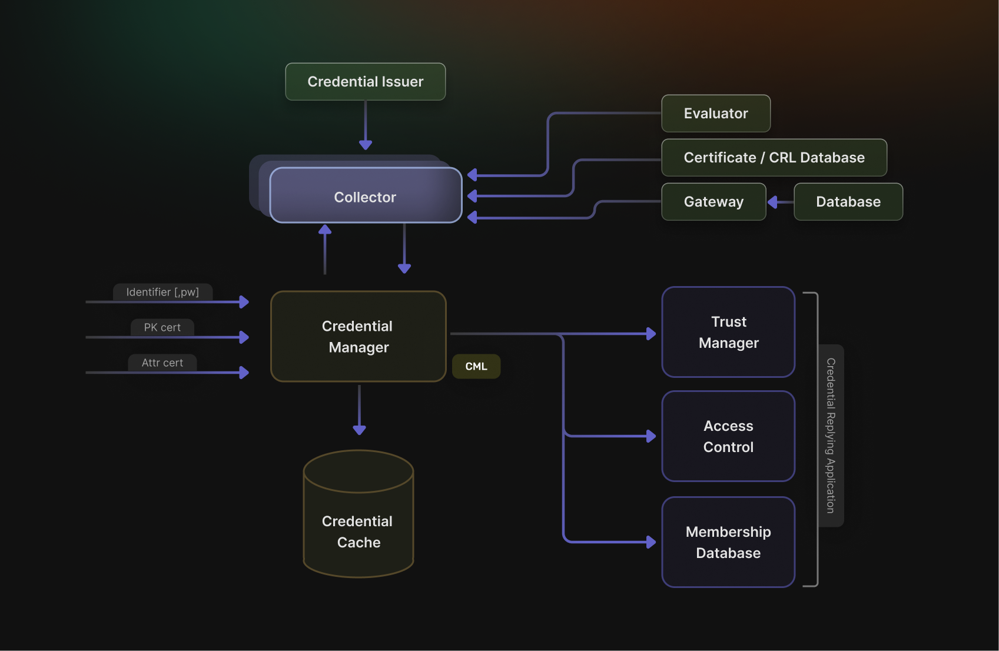
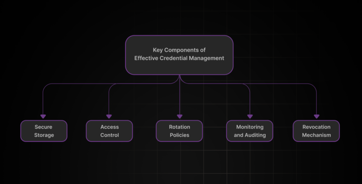

Credential management refers to the processes and tools used to securely store, retrieve, and manage user authentication credentials such as passwords, API keys, and tokens. In today's digital era, poorly managed credentials can lead to data breaches, financial losses, and irreparable damage to a brand's reputation. As cyberattacks become increasingly sophisticated, ensuring that your credentials are protected is no longer optional---it\'s essential for the security and compliance of modern applications.

According to the [Verizon Data Breach Investigations Report (DBIR)](https://www.verizon.com/business/resources/reports/2024-dbir-executive-summary.pdf), lost or stolen credentials are the most common way for cybercriminals to gain initial access to systems. In addition, Google Cloud reported in their [Threat Horizon Report](https://services.google.com/fh/files/misc/threat_horizons_report_h2_2024.pdf) that systems with weak or no credentials were the top initial access vector, accounting for **47%** of cloud environment attacks during the first half of last year. These statistics underscore the critical need for IT professionals and system administrators to understand and mitigate these attacks.

In this post, we'll explore why credential management is crucial, break down the key components of an effective strategy, identify common threats, and present seven best practices. We'll also explain how SuperTokens simplifies secure credential management with its modern features. Whether you're developing web applications or managing enterprise systems, understanding and implementing robust credential management practices is key to protecting your users and your business.

## **Why Credential Management Is Crucial for Modern Applications**



Credential management is at the heart of application security. With the increasing number of cyberattacks that target weak authentication methods, compromised credentials remain the most common cause of data breaches. Organizations today face several challenges:

-   **Increasing Sophistication of Cyberattacks:** Hackers use techniques such as phishing, credential stuffing, and social engineering to steal sensitive data.

-   **Data Breach Impacts:** A single breach can lead to significant financial losses, legal consequences, and a tarnished reputation.

-   **Regulatory Compliance:** Laws and regulations like GDPR, HIPAA, and PCI DSS mandate strict controls over how credentials are stored and accessed. Failure to comply can result in heavy fines.

-   **User Trust:** Secure credential management is essential for maintaining user confidence. When customers know that their login information and sensitive data are protected, they're more likely to engage with your service.

Thus, a robust credential management strategy is essential not only for protecting sensitive information but also for maintaining trust and ensuring compliance with global standards.

## **Key Components of Effective Credential Management**



To build an effective credential management system, you need to address several key components:

### **Secure Storage**

Storing credentials securely is the first line of defense. This involves:

-   **Encryption:** Use strong encryption methods to secure stored credentials. Passwords should be hashed using algorithms like Argon2, bcrypt, or PBKDF2.

-   **Vaults:** For API keys, tokens, and other sensitive data, employ secure vault solutions like AWS Secrets Manager or HashiCorp Vault to manage and store secrets.

### **Access Control**

Limiting access to credentials is crucial:

-   **Role-Based Access:** Ensure that only authorized users or services can access certain credentials.

-   **Least Privilege:** Adhere to the principle of least privilege, granting only the permissions necessary for an operation.

### **Rotation Policies**

Regular rotation of credentials minimizes risk:

-   **Periodic Changes:** Regularly update and change passwords, API keys, and tokens to limit the window of opportunity for attackers.

-   **Automated Rotation:** Use tools and scripts to automate credential rotation where possible, reducing human error and administrative overhead.

### **Monitoring and Auditing**

Active monitoring of credential usage helps detect anomalies:

-   **Logging:** Record all access attempts and changes to credential stores.

-   **Alerting:** Set up alerts for suspicious activity or unauthorized access attempts.

### **Revocation Mechanisms**

In the event of a compromise, credentials must be immediately invalidated:

-   **Instant Revocation:** Implement mechanisms that allow credentials to be revoked instantly, preventing further misuse.

-   **Fallback Procedures:** Ensure that there are procedures in place to issue new credentials securely after revocation.

## **Common Threats to Credential Management**

Understanding the threats can help you better secure your systems. Some of the most common threats include:

### **Credential Theft**

Attackers often obtain credentials through phishing, malware, or social engineering techniques. Once stolen, these credentials can be used to gain unauthorized access to systems.

### **Credential Stuffing**

In this attack, hackers use previously leaked credentials to automate login attempts across various services. Since many users reuse passwords, this can result in large-scale account takeovers.

### **Man-in-the-Middle (MITM) Attacks**

In MITM attacks, attackers intercept data transmitted between a user and an application, capturing credentials in transit. This is why secure transmission channels are critical.

### **Misconfigured Systems**

Improperly configured systems may inadvertently expose credentials through logs, URLs, or unsecured endpoints. Regular audits and configuration reviews are essential to avoid such pitfalls.

### **Token Theft**

Weak session management can lead to token theft, where attackers capture authentication tokens and impersonate legitimate users. This is particularly dangerous if tokens have a long lifespan or aren't rotated frequently.

## **Best Practices for Credential Management**


To mitigate these risks and ensure robust credential management, follow these seven best practices:

### **1. Use Secure Storage Mechanisms**

-   **Hash Passwords:** Always store passwords as hashes using strong algorithms like Argon2, bcrypt, or PBKDF2. These algorithms add a layer of security by making it computationally infeasible for attackers to reverse-engineer the original password.

-   **Vault Sensitive Data:** For API keys, tokens, and other secrets, utilize secure vaults such as AWS Secrets Manager or HashiCorp Vault. These tools offer robust access controls and auditing features to keep your credentials safe.

### **2. Implement Strict Access Control**

-   **Role-Based Access Control (RBAC):** Enforce RBAC to ensure that only users or services with the appropriate permissions can access specific credentials.

-   **Principle of Least Privilege:** Always grant the minimal level of access necessary for a user or service to perform its function. This minimizes the potential damage if credentials are compromised.

### **3. Establish Regular Rotation Policies**

-   **Automate Rotation:** Set up systems to automatically rotate credentials at regular intervals. Automated rotation reduces the window during which stolen credentials are useful to an attacker.

-   **Short-Lived Tokens:** Implement short-lived tokens for sessions. This limits the time an attacker can misuse a stolen token, even if they manage to capture it.

### **4. Monitor and Audit Credential Usage**

-   **Comprehensive Logging:** Log every access attempt and change made to credentials. This provides an audit trail that is crucial for detecting suspicious activity.

-   **Active Monitoring:** Use monitoring tools to flag unusual access patterns or repeated failed login attempts. Real-time alerts can help you respond quickly to potential threats.

### **5. Use Secure Communication Channels**

-   **Encrypted Transmissions:** Always transmit credentials over secure channels such as HTTPS. Encryption protects credentials in transit from interception by malicious actors.

-   **VPN and Secure Tunnels:** In environments where sensitive data is exchanged, use VPNs or other secure tunneling protocols to further safeguard the data.

### **6. Implement Robust Revocation Mechanisms**

-   **Immediate Invalidation:** Ensure that if a credential is compromised, it can be invalidated immediately. This helps prevent further unauthorized access.

-   **Fallback and Recovery:** Have processes in place to securely issue new credentials after a revocation. This minimizes downtime and maintains security continuity.

### **7. Enforce Multi-Factor Authentication (MFA)**

-   **Additional Security Layers:** MFA adds an extra layer of security by requiring more than one form of verification. Even if a password is compromised, the additional factor can prevent unauthorized access.

-   **Adaptive MFA:** Consider adaptive MFA solutions that adjust the level of authentication required based on risk factors like location or device type.

## **How SuperTokens Enhances Credential Management**


SuperTokens offers an advanced, open-source authentication solution that simplifies secure credential management. Here's how SuperTokens helps:

### **Short-Lived Access Tokens and Rotating Refresh Tokens**

SuperTokens employs short-lived access tokens along with rotating refresh tokens. This means that even if an access token is stolen, its utility is minimized as it will expire quickly. The automatic rotation of refresh tokens further ensures that stolen tokens cannot be reused for extended periods.

### **Token Theft Detection**

Built-in mechanisms in SuperTokens allow for early detection of token theft. If an anomaly is detected, the system can trigger a revocation process immediately, protecting your application from unauthorized access.

### **Customizable Authentication Flows**

SuperTokens is highly customizable. Developers can easily integrate it with their applications and tailor the authentication flow to meet their specific needs. This flexibility ensures that credential management is both robust and adaptable to your business requirements.

### **High Scalability with JWTs**

SuperTokens leverages JSON Web Tokens (JWTs) for efficient session management, ensuring that your system can handle large-scale applications without performance degradation. This scalability is crucial for applications with a growing user base.

### **Transparent Integration**

SuperTokens integrates seamlessly with existing applications, allowing you to enhance security without major overhauls. Its managed and self-hosting options provide a versatile solution that can evolve with your needs.

**Example:** When using SuperTokens, implementing rotating refresh tokens ensures that even if a token is stolen, it quickly becomes invalid as a new token is automatically generated. This drastically limits the window of opportunity for attackers.

## **Implementing Credential Management with SuperTokens**

Let\'s walk through a step-by-step guide to integrating SuperTokens into your application for secure credential management.

### **Step 1: Install the SuperTokens SDK**

Depending on your backend language (e.g., Node.js, Python, etc.), install the SuperTokens SDK. For Node.js, you can use npm:

```sh
npm install supertokens-node
```

For Python, follow the equivalent installation instructions in the documentation.

### **Step 2: Configure SuperTokens**

Create a configuration file (e.g., supertokensConfig.js) to set up token lifespans and refresh token rotation. Below is an example for a Node.js environment:

```js
const supertokens = require("supertokens-node");
const Session = require("supertokens-node/recipe/session");

supertokens.init({
  framework: "express",
  supertokens: {
    connectionURI: "https://try.supertokens.io",
  },
  appInfo: {
    appName: "YourAppName",
    apiDomain: "https://api.yourapp.com",
    websiteDomain: "https://www.yourapp.com",
  },
  recipeList: [
    Session.init({
      // Set access token lifespan to 15 minutes
      accessTokenValidity: 15 * 60,
      // Enable refresh token rotation with a lifespan of 1 week
      refreshTokenValidity: 7 * 24 * 60 * 60,
      cookieSecure: process.env.NODE_ENV === "production",
    }),
  ],
});
```

This configuration sets up SuperTokens with short-lived access tokens and rotating refresh tokens. Adjust the domains and token validity as per your requirements.

### **Step 3: Secure Storage and Transmission**

To securely store and transmit tokens:

-   **HTTP-Only Cookies:** Use HTTP-only cookies to store tokens, which prevents JavaScript access and reduces the risk of XSS attacks.

-   **Encrypted Channels:** Always use HTTPS for all communications to protect tokens during transit.

Example (using Express.js):

```js
app.use(Session.middleware());
```

This middleware ensures that all incoming requests are checked for a valid session, using the secure configuration specified.

### **Step 4: Implement Revocation Mechanisms**

SuperTokens provides APIs to revoke tokens if suspicious activity is detected. You can integrate this functionality into your application logic. For example, to revoke a session:

```js
const { revokeSession } = require("supertokens-node/recipe/session");

app.post("/revoke-session", async (req, res) => {
  try {
    await revokeSession(req.session.getHandle());
    res.send("Session revoked successfully.");
  } catch (error) {
    res.status(500).send("Error revoking session.");
  }
});
```
This endpoint can be called if monitoring systems detect potential token theft, ensuring compromised sessions are immediately invalidated.

## **The Future of Credential Management**

As cyber threats evolve, credential management is adapting to key trends:

-   **Passwordless & Biometric Authentication:** Enhances security and user experience by eliminating weak or stolen passwords.

-   **Zero Trust Architectures:** Ensures continuous validation with no inherent trust in any user or device.

-   **AI-Driven Threat Detection:** Enables real-time monitoring and rapid response to anomalies.

-   **Decentralized Identity Solutions:** Empowers users with more control, reducing centralized risks.

-   **Adaptive Compliance:** Keeps security practices in line with evolving regulatory standards.

## **Conclusion**

Effective credential management represents a cornerstone of modern application security. As attack methods grow more sophisticated and regulatory requirements become more stringent, organizations must implement comprehensive credential security practices.

By following the seven best practices outlined in this article---secure storage, multi-factor authentication, short-lived tokens, credential rotation, monitoring, secure transmission, and revocation mechanisms---organizations can significantly reduce their risk exposure.

Solutions like SuperTokens provide a streamlined path to implementing these practices, offering built-in features that address many common credential security challenges. Whether you\'re building a new application or enhancing an existing system, investing in robust credential management will yield substantial security benefits while helping maintain regulatory compliance.

***Remember that credential security isn\'t a one-time implementation but an ongoing process requiring regular review and updates as threats and best practices evolve.***