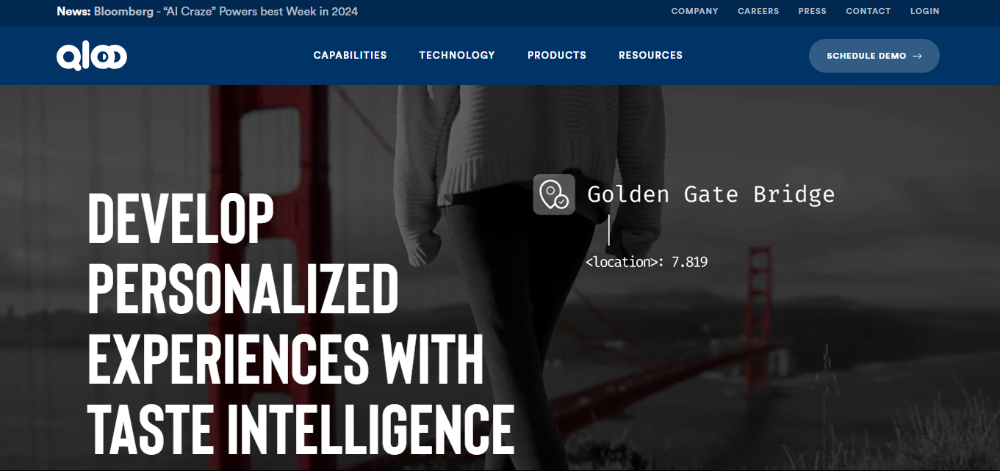
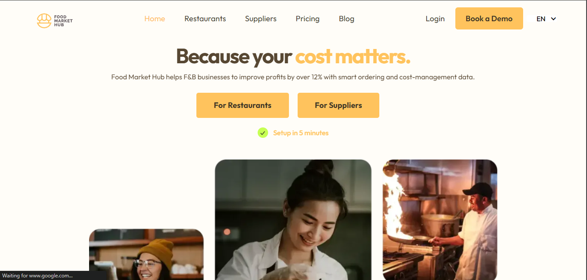
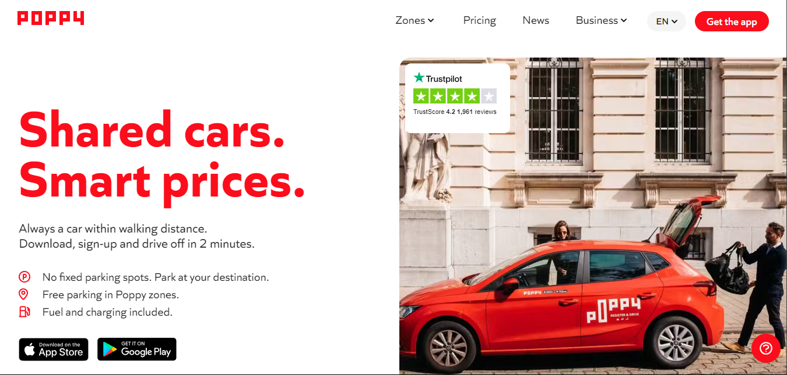
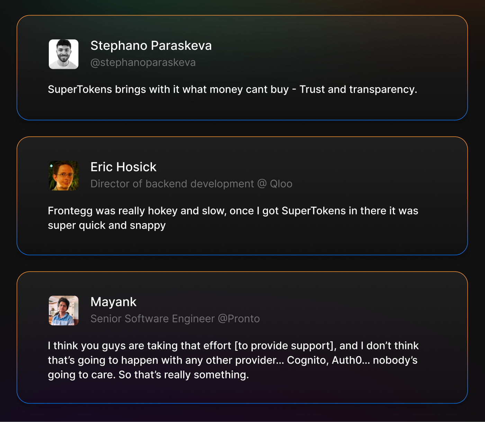

# Table of Contents

1. [Introduction](#introduction)
2. [Qloo](#1-qloo)
3. [FoodMarketHub](#2-foodmarkethub)
4. [Poppy](#3-poppy)
5. [Curology](#4-curology)
6. [Key Strengths That Led to Success](#key-strengths-that-led-to-success)
7. [Why Customers Chose SuperTokens](#why-customers-chose-supertokens)
8. [Conclusion](#conclusion)
 
Keeping up with the rapidly evolving world of authentication and user management is crucial to staying ahead of the curve. Looking back on the past year, we at SuperTokens have been lucky to work with a wide range of companies, each with their unique challenges and needs. This retrospective is all about highlighting some of our key case studies, showing how SuperTokens has tackled critical authentication needs across different industries.

## 1. Qloo

**Industry**: AI / Data Analytics  
**Challenge**: Qloo, an AI-based cultural platform used by major corporations like Netflix and Pepsico, was developing an internal product called "insights". Their initial authentication solution with Frontegg led to a poor user experience, with multiple redirects and screen flashing during login, resulting in a slow authentication process.

**Experience with Setting Up and Integrating SuperTokens**:
- **Seamless Integration**: They seamlessly added SuperTokens to their codebase in just a single week.
- **Smooth Transition**: They were able to gradually transition users over the course of a month with minimal disruption to their services.

**How SuperTokens Helped**:
- **Extensibility**: SuperTokens allowed them to tailor their authentication processes to fit their specific needs.
- **Better User Experience**: No more multiple redirects and screen flashing issues, making the login process faster and smoother.
- **Comprehensive Feature Set**: Supertokens provided all necessary authentication features without sacrificing flexibility.

## 2. FoodMarketHub

**Industry**: B2B / Restaurant Logistics  
**Challenge**: FoodMarketHub, a B2B marketplace for restaurants across Southeast Asia, struggled with its previous authentication provider (Auth0). They faced difficulties in configuring the authentication UI and managing user metadata, which involved time-consuming manual code uploads to the Auth0 dashboard.

**Experience with Setting Up and Integrating SuperTokens**:
- **Seamless Integration**: SuperTokens smoothly blended in with their existing codebase and Hasura API implementation.
- **Rapid Deployment**: It only took 2-3 days to move from evaluating SuperTokens to full production.
- **Database Synchronization**: They could sync up SuperTokens user tables with their own database at FoodMarketHub.

**How SuperTokens Helped**:
- **Customization Freedom**: They were able to tweak the authentication UI on FoodMarketHub without any limitations, saving them from the hassle of manual code uploads.
- **Mobile-Optimized**: SuperTokens set us up with a passwordless system, which was perfect for the mobile-driven Southeast Asian market.
- **Role Management**: It was a breeze to incorporate user metadata and role management directly within their codebase, thanks to SuperTokens.

## 3. Poppy

**Industry**: Transportation / Ride-sharing  
**Challenge**: Poppy, Belgium's largest ride-sharing provider with over 4000 vehicles, was facing significant financial losses due to SMS toll fraud in their authentication process, costing up to thousands of euros per day.

**Experience with Setting Up and Integrating SuperTokens**:
- **Rapid Implementation**: Their CTO set up most of the functionality in just one afternoon, thanks to SuperTokens' user-friendly setup.
- **Responsive Support**: The SuperTokens team, led by the founder, provided immediate assistance through Discord, making the transition seamless.

**How SuperTokens Helped**:
- **Precise SMS OTP Control**: SuperTokens gave the ability to finely tune their SMS OTP authentication, which allowed them to implement strict anti-fraud measures.
- **Fraud Elimination**: Switching to SuperTokens gave them complete control over their authentication process, practically eliminating fraud.
- **Cost Savings**: SuperTokens helped them steer clear of thousands of euros in daily losses by preventing SMS toll fraud.

---

## 4. Curology

**Industry**: Healthcare / E-commerce  
**Challenge**: Curology, a personalized skincare company, needed an authentication solution that could seamlessly integrate with its unique architecture. They conducted an extensive internal project to evaluate various auth providers.

**Experience with Setting Up and Integrating SuperTokens**:
- **Quick Setup**: Curology implemented SuperTokens in just a few days using the CLI.

**How SuperTokens Helped**:
- **Architectural Flexibility**: Offered the most adaptable solution to work within Curology's particular architecture.
- **Customization Options**: Provided a wide range of integration options and customization possibilities.
- **Comprehensive Comparison Support**: Assisted Curology in their evaluation process, standing out among multiple auth providers.

---

## Key Strengths That Led to Success

Across these diverse case studies, several key strengths of SuperTokens consistently emerged as crucial factors in successful implementations:

1. **Technical Performance**  
   SuperTokens aced it when it came to technical performance. It handled loads of authentication requests super smoothly, ensuring users had a great experience even during peak usage times.

2. **Flexibility and Customizability**  
   One great thing about SuperTokens is its flexibility. Clients like Qloo and FoodMarketHub used it to create custom authentication flows and UI that fit their exact needs.

3. **Easy Integration**  
   Clients consistently praised the ease of integrating SuperTokens into their existing infrastructure, even managing to do so within days or sometimes hours.

4. **Scalability**  
   As businesses grew, SuperTokens scaled up smoothly to meet their increasing needs, handling complex B2B marketplace authentication and large user bases with ease.

5. **Security**  
   Security was a big deal for everyone, and SuperTokens delivered. Poppy, especially, was able to crack down on fraud that was costing them a ton of money daily.

---

## Why Customers Chose SuperTokens

Analyzing feedback from our clients reveals five key factors that consistently influenced their decision to choose SuperTokens:

1. **Open Source Advantage**  
   SuperTokens' open-source nature allows for code auditing, community support, and customization when necessary, fostering transparency and flexibility.

2. **Unparalleled Extensibility**  
   SuperTokens' ability to adapt to specific needs was a crucial factor for many clients. This extensibility allowed them to implement custom authentication flows and integrate seamlessly with existing systems.

3. **Developer-Friendly Usability**  
   The ease of implementation and developer experience was a significant factor, with comprehensive documentation, intuitive APIs, and responsive support.

4. **Comprehensive Feature Set**  
   Clients appreciated that SuperTokens offered all the features they needed without compromising on flexibility or ease of use.

5. **Architectural Compatibility**  
   SuperTokens' ability to integrate smoothly with various architectural setups was a significant factor, offering compatibility even for companies with complex system architectures.

---

## Conclusion

As we reflect on these case studies and customer feedback, several key insights emerge that will shape our future strategy and development:

- **Flexibility is King**
- **Developer Experience Matters**
- **Open Source Builds Trust**
- **Security and Scalability are Non-Negotiable**
- **Support as a Differentiator**

The world of authentication is always changing, with new challenges and opportunities arising regularly. By staying true to our core principles of openness, flexibility, and putting the user first, we're confident that SuperTokens will remain the top choice for businesses worldwide.

As we move forward, we want to express our deepest gratitude to all our clients who have shared their experiences and contributed to shaping the future of SuperTokens. Your trust, feedback, and partnership are what drive our innovation and success.

Here's to another year of secure, seamless, and super-powered authentication!
