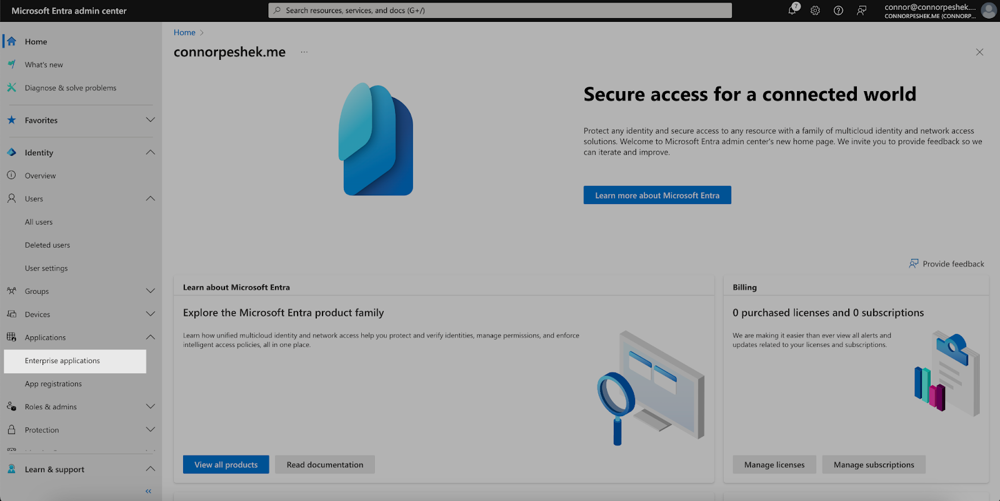
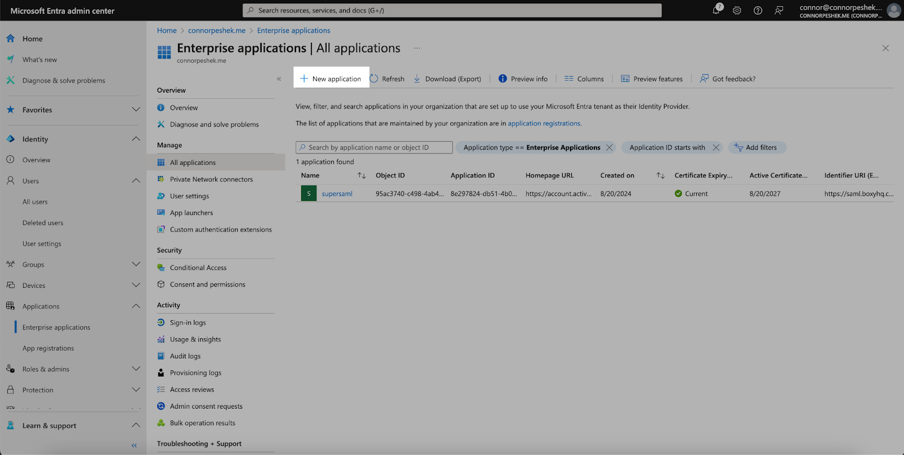
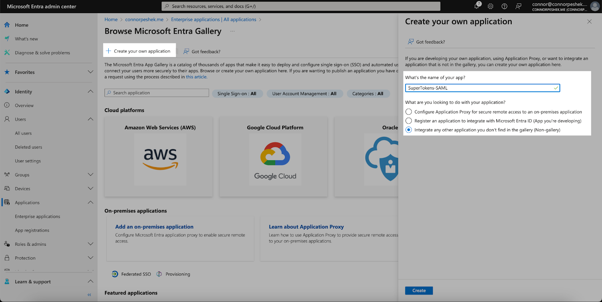
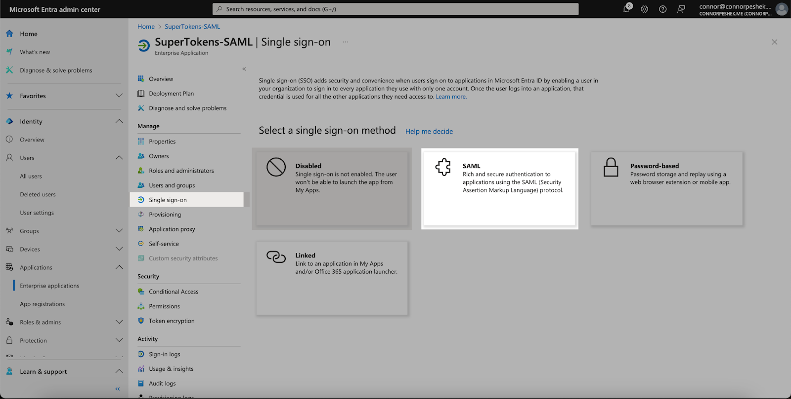
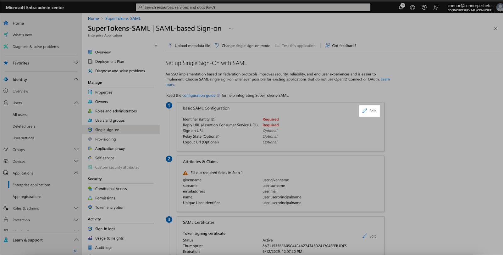
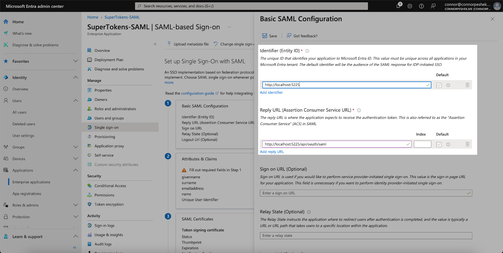
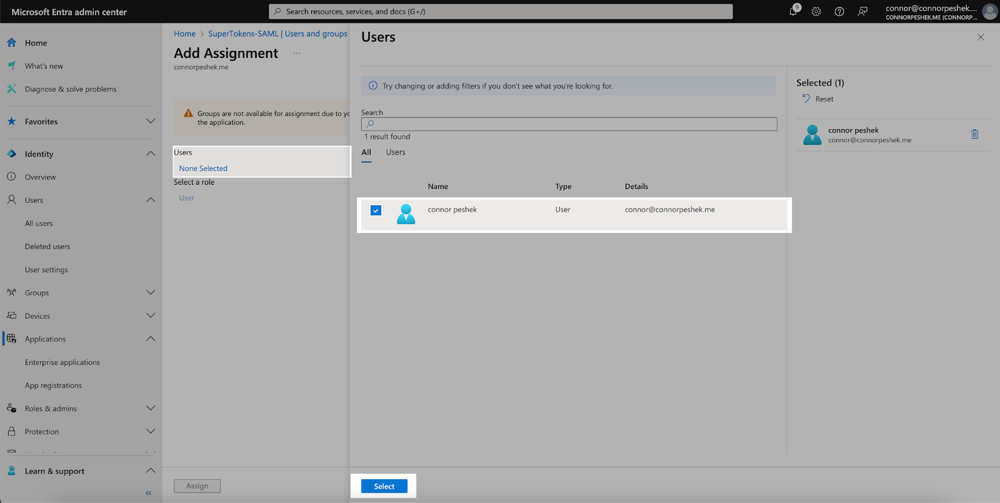

## Table of Contents

- [Introduction](#introduction)
- [What is Single Sign-On (SSO)?](#what-is-single-sign-on-sso)
- [How Does SAML Authentication Work?](#how-does-saml-authentication-work)
- [The Benefits Of SAML Authentication](#the-benefits-of-saml-authentication)
- [What Is The Difference Between SAML and SSO?](#what-is-the-difference-between-saml-and-sso)
- [When To Choose SAML For Your Security Protocol](#when-to-choose-saml-for-your-security-protocol)
- [Implementing SAML Authentication](#implementing-saml-authentication)
- [Wrapping up](#wrapping-up)

## Introduction

SAML, the Security Assertion Markup Language, is a protocol released in 2000 to give people a way to authenticate themselves across domains. The XML standard had just been released a couple of years before and was a popular way to send data across the internet, so the idea was to make a protocol to send a variation of XML that could authenticate a user called a SAML assertion. Now, if a user needed to verify themselves across domains, they could log into one location and be verified at any other location that has a trust with that service.

## What is Single Sign-On (SSO)?

Single Sign-on is a process where a user can authenticate themselves with an Identity Provider (IdP) and log into any other eligible Service Provider (SP) without re-entering their password. It's the main goal that SAML sets out to accomplish. But if that's unclear, let's give a real-world example.

Let's pretend you're a janitor in an office. You've got one of those massive key loops with hundreds of keys on them. Every time you go to open a door, you have to search through your massive key loop to find the right key for the right door. It's an absolute headache. But your boss (Identity Provider) wants to help out, so they implement keycard readers at every door. Now instead of managing a bunch of keys (passwords) for every door (Service Provider), you have a single keycard (SAML assertion) that you can scan at every door for access.

## How Does SAML Authentication Work?

SAML works by having a user log in at an Identity Provider who generates a SAML assertion for the user. Then the user's browser forwards the SAML assertion to the Service Provider to authenticate them. SAML SSO can be done with either an IdP initiated flow or an SP initiated flow. In an IdP initiated flow, the Identity Provider redirects you to the Service Provider after you've already been logged in, and you can access the Service Provider's application. With an SP flow, a user starts the login process at the Service Provider and is redirected to the Identity Provider to log in. After logging in, they are redirected back to the Service Provider to use the application.

Before either process happens for a user, the Identity Provider and Service Provider need to agree on a SAML configuration stating how the user data will be sent over. This is configured through the Identity Provider. The IdP must also give a copy of its public key to the Service Provider. Both the public key and configuration are bundled into an XML Metadata file that must be given to the Service Provider for SAML SSO to work. This process is called establishing a trust relationship.

## The Benefits Of SAML Authentication

SAML authentication allows people to not have to manage multiple passwords for multiple programs. It's useful inside large organizations that need to handle many employees as well. They can configure what applications people have access to through what's called an Identity Access Management (IAM) platform. This allows an organization to easily provision and remove employee access in one location. A common IAM integration for SAML is Microsoft Entra ID, a cloud-based alternative to Microsoft's Active Directory product.

For an example of how this works, let's say you started a new job at SuperWorkers. SuperWorkers will need to give you access to tools like Gsuite, Slack, and Salesforce. To make this process simple, SuperWorkers has put all of your information, such as your email address and what applications you are allowed to access, in Entra ID. Now they can configure Entra ID as an Identity Provider for the services you need to access, like Gsuite, Slack, and Salesforce, and you can log into Microsoft and access all of your services. If you ever need access to new platforms, they can change your permissions in Entra ID, and if you ever need to be offboarded, they can simply remove you from Entra ID instead of individually offboarding you from each platform.

## What Is The Difference Between SAML and SSO?

Single Sign-on is a way to authenticate at one location and be authenticated at multiple other services, as we discussed earlier. SAML is a way to implement that process. There are other ways to implement SSO, such as OpenID Connect. Although they are different technologies, you can think of SSO as an umbrella of technologies that SAML falls under.

## When To Choose SAML For Your Security Protocol

SAML is usually the main choice for large organizations who are using an IAM platform. If you're building a service that caters to large organizations (B2B), it's recommended to have an ability to allow Single Sign-on through SAML, as it's common in that space. Otherwise, it's much more common to use a service like OpenID Connect to handle SSO, especially in the B2C space.

## Implementing SAML Authentication

It's possible to implement SAML authentication in Supertokens, our authentication platform. SuperTokens has a front-end and back-end SDK that makes integration simple and a core for managing user state.

We're going to walk through implementing SAML authentication using Microsoft's Entra ID as the Identity provider. However, you can integrate with any SAML Identity Provider when using SuperTokens. We handle SAML integrations with Boxy HQ's SAML Jackson product, which converts a SAML SSO flow to plug into an OAuth/OpenID Connect platform.

Let's get started.

### Microsoft Entra ID

In order to integrate the SAML SSO flow, we first need to register an application with Entra ID. Head to the [Microsoft Entra ID dashboard](https://entra.microsoft.com/) and select **Enterprise Applications** on the left side.



Click on **New application** at the top of the page.



Then click on **Create your own application** at the top. Input your application name, select **Integrate any other application you don't find in the gallery (Non-gallery)** and click **Create**.



Now that our application is created, we need to set up Single Sign-On. Select **Single Sign-On** from the sidebar and choose the **SAML** option.



Click the **Edit** button in the Basic SAML Configuration.



And add the following values to your application:

- **Entity ID** - `https://saml.boxyhq.com`
- **Reply URL** - `http://localhost:5225/api/oauth/saml`

Then click **Save** at the top.



Scroll down to section 3 and download the Federation Metadata XML—we'll need this later to upload into SAML Jackson.

Click **Users and groups** on the sidebar and then **Add user/group** at the top of the page.

Select **None Selected** then click your username and click **Select**. Then click the **Assign** button to add yourself as a user for this app. If a user is not assigned to the app in Entra ID, then they won't be able to use SSO to log in.



### Prepare SuperTokens

In order to set up SuperTokens, we need to download our quickstart which contains the front-end and back-end SDK along with the SuperTokens core, which manages user and session state for SuperTokens. Since SAML is commonly used for corporate integrations, we'll make this project a multitenant project.

First, download the SuperTokens core and run it using Docker:

```bash
docker run -p 3567:3567 -d registry.supertokens.io/supertokens/supertokens-postgresql:9.1.2
```

### Connect SuperTokens to local core

To connect your project to your locally running core, head to the `backend/config.ts` and change the connectionURI to `http://localhost:3567`.

```ts
import supertokens from "supertokens-node";

supertokens.init({
    supertokens: {
        connectionURI: "http://localhost:3567",
        // only required for production
        apiKey: "<YOUR API KEY>",
    },
    appInfo: {
        apiDomain: "...",
        appName: "...",
        websiteDomain: "...",
    },
    recipeList: [],
});
```

Now that we've configured our project, we can start setting up SAML Jackson.

### Start the SAML Jackson service

Run the following command to download and run the SAML Jackson docker container:

```bash
docker run \
  -p 5225:5225 \
  -e JACKSON_API_KEYS="secret" \
  -e DB_ENGINE="mem" \
  -e NEXTAUTH_SECRET="super-secret" \
  -e NEXTAUTH_ADMIN_CREDENTIALS="admin@company.com:secretpassword" \
  -d boxyhq/jackson
```

This will start the SAML Jackson server on `http://localhost:5225`.

### Add your XML to Boxxy SAML

Run the following command to configure SAML Jackson with your downloaded xml, replacing the encodedRawData with a base64 encoded copy of your XML file.

```bash
curl --location --request POST 'http://localhost:5225/api/v1/saml/config' \
--header 'Authorization: Api-Key secret' \
--header 'Content-Type: application/x-www-form-urlencoded' \
--data-urlencode 'encodedRawMetadata=<BASE_64_XML>' \
--data-urlencode 'defaultRedirectUrl=http://localhost:3000/auth/callback/saml-jackson' \
--data-urlencode 'redirectUrl=["http://localhost:3000/*"]' \
--data-urlencode "tenant=tenant1" \
--data-urlencode 'product=supertokens' \
--data-urlencode 'name=supertokens-config' \
--data-urlencode 'description=SuperTokens + BOXYHQ SAML config'
```

It will output a client id and client secret; save those for the following steps.

### Add and configure SuperTokens tenants

Run the following command to add a tenant to SuperTokens that supports SSO:

```bash
curl --location --request PUT 'http://localhost:3567/recipe/multitenancy/tenant' \
--header 'Content-Type: application/json' \
--data-raw '{
    "tenantId": "tenant1",
    "emailPasswordEnabled": false,
    "thirdPartyEnabled": true,
    "passwordlessEnabled": false
}'
```

### Add boxy-saml login to tenant1

Now run the following command to connect your SSO integration with SAML Jackson. The API key is only required for production.

```bash
curl --location --request PUT 'http://localhost:3567/tenant1/recipe/multitenancy/config/thirdparty' \
--header 'api-key: <API_KEY>' \
--header 'Content-Type: application/json' \
--data-raw '{
  "config": {
    "thirdPartyId": "boxy-saml",
    "name": "SAML Login",
    "clients": [
      {
        "clientId": "<ClientID from curling to Boxxy HQ>",
        "clientSecret": "<ClientSecret from curling to Boxxy HQ>",
        "additionalConfig": {
          "boxyURL": "http://localhost:5225"
        }
      }
    ]
  }
}'
```

### Test the application

Run `npm run start` to start the application. Go to `http://localhost:3000` in your browser, select tenant 1, and log in with SAML. Once you log in, you'll be able to see the success screen with your user ID.

## Wrapping up

Although other alternatives for SSO exist, SAML is still a common SSO option for large companies tying into IAM platforms. It may be an older technology than alternatives like OpenID Connect, but that in no way makes it an invalid option. If you're building an application in the B2B space, try building your application with SuperTokens!