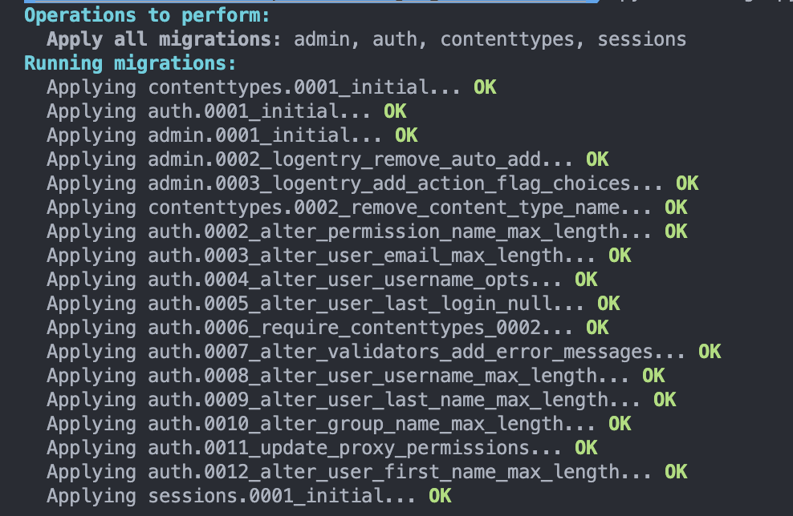

Authentication has become a common concept in almost every application today, with most web applications requiring users to log in to gain access to features and personalisation. Ensuring that user data is protected and stored securely has become even more important to make sure nobody can gain unauthorised access to your application. All of this makes it crucial to user or build a reliable user authentication system that ensures data security while providing you with the flexibility to build your application your way.

Django provides a built-in solution for user auth which provides features such as user accounts, permissions and cookie-based session management out of the box while still allowing you to extend and customise them to suit your needs. In this article we will visit how you can use Django's built-in auth mechanisms and compare it with a possible alternative.

## Setting up Django

### Setting up the project

For this article we assume that you already have Django installed on your system, you can refer to the [quick install guide](https://docs.djangoproject.com/en/5.1/intro/install/#quick-install-guide) if you don't.

Start by creating a project:

```bash
mkdir djangoauthtutorial
django-admin startproject mysite djangoauthtutorial
```

Make sure to replace the folder name `djangoauthtutorial` and project name `mysite` with any other names you prefer.

### Enabling user authentication

If you open the `settings.py` file you'll notice a few things. In the `INSTALLED_APPS` part of the settings you can see that `django.contrib.auth` and `django.contrib.contenttypes` have been installed.

```python
INSTALLED_APPS = [
    # ...
    'django.contrib.auth',
    'django.contrib.contenttypes',
    # ...
]
```

- `django.contrib.auth` is the core of authentication for Django and contains all the functionality of user auth.
- `django.contrib.contenttypes` is Django's [content type system](https://docs.djangoproject.com/en/5.1/ref/contrib/contenttypes/) which allows permissions to be associated with any models you create.

In the `MIDDLEWARE` setting you can see that the `SessionMiddleware` and the `AuthenticationMiddleware` have been added.

```py
MIDDLEWARE = [
    # ...
    'django.contrib.sessions.middleware.SessionMiddleware',
    'django.contrib.auth.middleware.AuthenticationMiddleware',
    # ...
]
```

- The `SessionMiddleware` manages sessions across requests made to your system
- The `AuthenticationMiddleware` associates users with requests using sessions

And that's all you need to enable authentication in Django, which means that when you create a new project auth is enabled by default. At this point running the following command to create the necessary database tables:

```bash
manage.py migrate
```

The output should look something like this:



## Understanding the authentication models

Before we begin using the Django authentication system we need to understand the basic building blocks:

### User Objects

User objects are the core in Django authentication, they represent people using your application and these objects can be used to allow or restrict access, associating generated data with creators etc. The primary properties of a user are:

- username
- password
- email
- first_name
- last_name

Refer to the [full documentation](https://docs.djangoproject.com/en/5.1/ref/contrib/auth/#django.contrib.auth.models.User) to read about all the properties of a User Object.

### Permissions and authorizations

Permissions are how you provide users access to specific features in your application, when you run `migrate` all existing models are assigned default permissions because we include `django.contrib.auth` in our `INSTALLED_APPS`.

Ir is very rare to use the Permission model directly in Django, but it is possible should your application require it. By default Django creates the following permissions for all models you have defined:

- add
- view
- change
- delete

### Groups

Groups are a way to categorise similar users together to make assigning permissions to them easier. Instead of having to assign each user a specific permission and then managing their permissions, you add them to a group and then assign that group a permission instead. This way you simply need to manage the permissions assigned to a group, and user permissions are handled based on what groups they have been added to.

## Implementing user authentication

This article will not cover the basics of creating APIs and the structure for your application, instead we will focus specifically on authentication mechanisms.

### Registering / Creating users

Most web applications require users to sign up to access specific features, Django provides a simple way to create new users:

```py
from django.contrib.auth.models import User

def create_user():
  user = User.objects.create_user("username", "email", "password")
```

Using `User.objects.create_user` creates a new user that is saved in the database, but if you require to add or modify properties after creating the user you can do something similar to this

```py
from django.contrib.auth.models import User

def create_user():
  user = User.objects.create_user("username", "email", "password")
  user.first_name = "first_name"
  user.last_name = "last_name"
  user.save()
  # Perform other actions with the user if needed
```

### Logging in users

Once a registered user visits your application you may want them to log in to your system:

```py
from django.contrib.auth import authenticate, login

def my_view(request):
    username = request.POST["username"]
    password = request.POST["password"]
    user = authenticate(request, username=username, password=password)
    if user is not None:
        login(request, user)
        # Redirect to a success page.
    else:
        # Return an 'invalid login' error message
```

The `authenticate` function verifies the credentials against the authentication backend and returns a user if they are valid. The `login` function saves the user's identifier to the current session, note that any data generated against the session before `login` is still persisted.

### Logging out users

```py
from django.contrib.auth import logout

def logout_view(request):
    logout(request)
```

The `logout` function clears the current session, this also wipes all session data to prevent another user logging in on the same browser session from having access to any data generated by the previous user. This means that you may need to manually add any session data again after logout should your application require it.

Calling `logout` without having any active session will not throw any errors but will clear session data.

### Changing passwords

Most applications provide a way for users to reset their password, while admins can change their password at any time this is one way to allows users to do so:

```py
from django.contrib.auth import authenticate

def change_password(request):
    username = request.POST["username"]
    current_password = request.POST["current_password"]
    user = authenticate(request, username=username, password=current_password)
    if user is not None:
        new_password = request.POST["new_password"]
        user.set_password(new_password)
        user.save()
    else:
        # Return invalid response
```

### Building the login UI

There are several steps involved in building the UI and connecting it to your backend, in an effort to keep this aeticle concise we have published these steps in our [Django Bootstrap Login](https://supertokens.com/blog/django-bootstrap-login-template) article. You can refer to that to learn all about building your own UI.

## Advanced features

### Custom user models

Django's built-in user model may not always fit your applications needs, to account for this Django auth allows you to create and use custom user models by using the `AbstractUser` model:


```py
from django.contrib.auth.models import AbstractUser

class MyUser(AbstractUser):
    phone_number = models.CharField(max_length=15, blank=True, null=True)
```

After creating the model you need to modify the `AUTH_USER_MODEL` in your settings

```py
AUTH_USER_MODEL = "mysite.MyUser"
```

In this example we are instructing Django to use the `MyUser` model from the `mysite` project, remember to add `mysite` to your `INSTALLED_APPS` setting.

Then register the model:

```py
from django.contrib import admin
from django.contrib.auth.admin import UserAdmin
from .models import User

admin.site.register(User, UserAdmin)
```

Remember to do this before running any migrations in your app's database.

### Authentication signals

Django internally uses [signals](https://docs.djangoproject.com/en/5.1/topics/signals/) to allow application logic to respond to changes occuring elsewhere. It also provides signals for authentication events:

- `user_logged_in` is sent when the user logs in succesfully
- `user_logged_out` is sent when the logout method is called
- `user_login_failed` is sent when the login attempt fails

You can find more details about each signal and their properties in the [official documentation](user_login_failed).

### Session management

Django uses cookie-based sessions to allow you to associate data with users using your application. All sessions start out as anonymous and then after a user logs in their user id is associated with the session and all generated data is associated with the logged in user. You can read a detailed description of sessions and how to manage them using Django in their [Session Documentation](https://docs.djangoproject.com/en/5.1/topics/http/sessions/#module-django.contrib.sessions)

One downside here is that you need to manage everything about your session manually which can be overwheling and takes away a lot of time and effort that could be dedicated to building application specific logic. This is where third parties like SuperTokens can become a powerful tool, we talk about this in this article [later](#introducing-supertokens).

## Advantages of using Django authentication

- Django user auth has been extensively tested by the numerous applications using it in production
- Since it is part of Django's ecosystem it has first party support from the maintainers
- It is flexibile because the system is built in a very generic way keeping in mind that a lot of users may need to extend its functionality
- It is simple and easy to understand

## Disadvantages of using Django authentication

- There is a learning curve involved, and this learning does not translate to other auth systems directly
- Since it is built in a generic way you are expected to customise it to fit your needs which can become cumbersome
- It is a simple authentication system and may not fit your application if you require something more complex

## Introducing SuperTokens

The biggest disadvantage is that it does not support advanced use cases out of the box and requires you to build and maintain a lot of custom logic. For example if you need to integrate social auth you need to handle redirection, token exchange etc yourself and Django will simply manage the sessions for you. This is where [SuperTokens](https://supertokens.com) steps in.

SuperTokens is an open-source user authentication system that can be used to build authentication for your applications using any Python based frameworks (they also support other backends such as Node). It comes with built-in APIs and functions that can be used out of the box to build and manage your entire authentication process.

SuperTokens offers the following advantages over using Django's built-in auth:

- Pre-built APIs and functions that you can use out of the box, enabling you to focus on building application specific logic
- Pre-built UI that you can use instead of having to build all the auth forms yourself, you can also choose to use a custom UI
- Login mechanisms such as social login, passwordless etc built and ready to use
- Advanced features such as multi-tenancy, role based access control and MFA
- A functioning user management dashboard

Here are some useful reading material to learn more about supertokens:
- A list of [all features](https://supertokens.com/product) SuperTokens offers
- A list of [all customers](https://supertokens.com/customers) using SuperTokens.
- Their [official documentation](https://supertokens.com/docs/guides) where you can learn about how to use all of their features and the various tech stacks they support

----------------------------

Django's authentication system provides a powerful and flexible framework for managing users, permissions, and sessions. From creating custom user models to implementing advanced features, it enables developers to build secure and scalable applications with ease. By following the steps outlined in this guide, you can customize and extend Django's authentication to meet your project's specific needs.