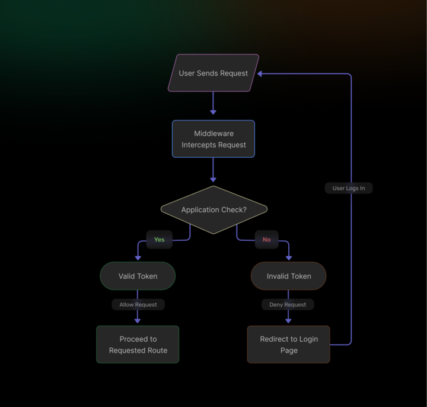
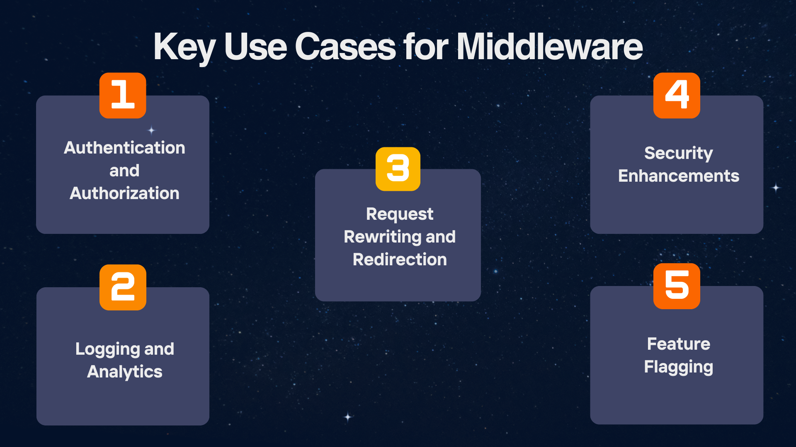

Next.js has quickly become a favorite framework for building modern web applications. One of its most powerful features is middleware&mdash;a mechanism that allows you to intercept and modify requests and responses before they reach your application. This post will explore what middleware is in Next.js, its key use cases, and how to implement it effectively. We’ll also look at how integrating [SuperTokens](https://supertokens.com/) can enhance your middleware functionality, to improve security and user experience. By the end of this guide, you’ll have a solid understanding of how middleware can help you build more robust, secure, and performant Next.js applications.

## **Understanding Middleware in Next.js**



Middleware functions in Next.js run on the server before a request is completed. By placing a `middleware.ts` or `middleware.js` file at the root of your project, you can define custom logic that executes during the request lifecycle. This logic allows you to intercept incoming requests, perform tasks such as authentication, logging, or even rewriting URLs, and then pass the modified request on to your application.

In Next.js, middleware is executed on every request&mdash;or on specific routes, if configured&mdash;allowing you to implement cross-cutting concerns in a centralized way. This capability means you can protect sensitive routes, optimize performance, and enforce business rules without having to duplicate code across pages or API routes.

For example, if you have a blog that needs to restrict access to premium content, middleware can check a user’s authentication status before the request reaches the protected pages. If the user isn’t authenticated, the middleware can redirect them to a login page.

## **Key Use Cases for Middleware**



Middleware in Next.js is incredibly versatile. Below are some of the most common scenarios where middleware can be applied.

### **Authentication and Authorization**

One of the primary use cases for middleware is to validate user identity and permissions before granting access to specific routes. By checking cookies or session tokens, middleware can determine if a user is authenticated. If not, it can redirect them to a login page, and ensure that only authorized users access protected resources.

### **Logging and Analytics**

Middleware is a great place to record request data for monitoring and analytics. You can log details such as the request URL, headers, or user-agent information. This data can be invaluable for debugging issues, tracking usage patterns, or even optimizing performance.

### **Request Rewriting and Redirection**

Sometimes, you need to modify request URLs or redirect users, based on certain conditions. Middleware can intercept a request and rewrite the URL before it reaches your page or API route. For example, if you’re migrating content, middleware can automatically redirect users from old URLs to new ones, without manual intervention.

### **Security Enhancements**

Security is paramount in any web application. Middleware can be used to implement measures such as bot detection, IP blocking, or rate limiting, to protect your resources from malicious actors. By placing these checks at the middleware level, you ensure that potentially harmful requests are filtered out early.

### **Feature Flagging**

With middleware, you can enable or disable features dynamically. This is particularly useful for testing new functionality or rolling out features gradually. For instance, you might only enable a new user interface for a subset of users, or you might disable a feature entirely if certain conditions aren’t met.

## **Implementing Middleware in Your Next.js Project**

Setting up middleware in your Next.js application is straightforward. Here’s a step-by-step guide to get you started:

### **1. Create the Middleware File**

In your Next.js project, create a file called `middleware.ts` (or `middleware.js` if you're using JavaScript) at the root level, next to your `pages` or `app` directory. This file will contain all the logic for intercepting and handling requests.

### **2. Define the Middleware Function**

Inside your middleware file, export a function that receives a `NextRequest` object and returns a `NextResponse` object. This function will be executed for every request (or for the routes you specify).

Here's a simple example:

```typescript
import { NextResponse, NextRequest } from 'next/server';

export function middleware(request: NextRequest) {
    
    // Log the URL of the incoming request
    console.log('Request URL:', request.url);

    // If the request is for a protected route, check for a valid token
    if (request.nextUrl.pathname.startsWith('/protected')) {
        
        const token = request.cookies.get('token');

        if (!token) {
            return NextResponse.redirect(new URL('/login', request.url));
        }
    }

    // Return the response unchanged
    return NextResponse.next();
}
```                                                          

In this example, the middleware logs each request’s URL. It then checks if the request is heading toward a protected route and verifies whether a valid token exists in the cookies. If the token is missing, it redirects the user to the login page. Otherwise, it allows the request to proceed.

### **3. Configure Path Matching (Optional)**

Sometimes, you only want your middleware to run on specific routes. You can do this by exporting a `config` object from your middleware file. This object allows you to specify which paths the middleware should apply to.

Example:

```typescript
export const config = {
    matcher: ['/protected/:path*', '/api/secure/:path*'],
};
```

With this configuration, the middleware only runs for requests matching the specified patterns. This helps avoid unnecessary processing for routes where the middleware logic isn’t needed.

## **Practical Examples of Middleware Usage**

To bring these concepts to life, let’s look at a few practical examples.

### **Example 1: Authentication Check**

A common scenario is ensuring that only authenticated users can access certain pages. Suppose you have an app built with Next.js, and which has a premium section that requires users to log in. You can use middleware to intercept requests to the premium pages, check for a valid session or token, and then redirect unauthenticated users to the login page.

```typescript
export function middleware(request: NextRequest) {
    
    if (request.nextUrl.pathname.startsWith('/premium')) {
        
        const token = request.cookies.get('sessionToken');

        if (!token) {
            return NextResponse.redirect(new URL('/login', request.url));
        }
    }

    return NextResponse.next();
}
```

This simple check helps ensure that only users with a valid session can access premium content, thus protecting your resources and enhancing security.

### **Example 2: GeoIP-Based Content Delivery**

Another practical use of middleware is delivering content based on the user’s geographic location. By using a third-party service or library to determine the user’s location from their IP address, you can modify the response to show region-specific content.

```typescript
import { NextResponse, NextRequest } from 'next/server';
import geoip from 'geoip-lite';

export function middleware(request: NextRequest) {
    
    const ip = request.ip ?? '8.8.8.8'; // Fallback IP for testing
    const geo = geoip.lookup(ip);

    if (geo && geo.country === 'IN') {
        // Redirect users from India to a localized version of the site
        const url = request.nextUrl.clone();
        url.pathname = '/in' + url.pathname;
        
        return NextResponse.redirect(url);
    }

    return NextResponse.next();
}
```


This middleware example checks the user’s IP, looks up the geographic location, and then redirects users from India to a localized version of your site. Such functionality can improve user experience by serving more relevant content.

## **How SuperTokens Enhances Middleware Functionality**


Integrating third-party tools with middleware can significantly extend its capabilities. One excellent example is [SuperTokens](https://supertokens.com/), an open-source authentication solution that integrates seamlessly with Next.js middleware. SuperTokens provides a robust foundation for managing user sessions and enhancing security in your application.

### **Session Management**

SuperTokens simplifies session management by handling token creation, rotation, and validation. By integrating SuperTokens with your middleware, you can easily verify session validity without having to write complex authentication logic from scratch.


```typescript
import { NextResponse, NextRequest } from 'next/server';
import geoip from 'geoip-lite';

export function middleware(request: NextRequest) {
    
    const ip = request.ip ?? '8.8.8.8'; // Fallback IP for testing
    const geo = geoip.lookup(ip);

    if (geo && geo.country === 'IN') {
        // Redirect users from India to a localized version of the site
        const url = request.nextUrl.clone();
        url.pathname = '/in' + url.pathname;
        
        return NextResponse.redirect(url);
    }

    return NextResponse.next();
}
```                                                     

In this snippet, the middleware uses SuperTokens' `verifySession` function to check if the user's session is valid. If the session is invalid, the user is redirected to the login page.

### **Token Theft Detection**

SuperTokens also implements security measures such as rotating refresh tokens and using short-lived access tokens. These features allow middleware to detect potential token theft scenarios. If a token is compromised, the system can invalidate it and force a new authentication process, significantly enhancing security.

### **Scalability**

For high-traffic applications, scalability is crucial. SuperTokens is designed to handle large volumes of requests efficiently. When incorporated into your Next.js middleware, it ensures that the authentication checks remain fast and do not become a performance bottleneck.

By leveraging SuperTokens in your middleware, you can build robust authentication mechanisms quickly, to reduce the risk of security breaches and ensure that only authorized users access your protected routes.

## **Best Practices for Using Middleware**

To get the most out of Next.js middleware, here are some best practices to consider:

### **Performance Considerations**

-   **Optimize Middleware Logic:** Since middleware runs on every request (or for matched routes), it’s critical to ensure that the logic is optimized for performance. Avoid heavy computations or blocking operations that could slow down the request lifecycle.

-   **Keep it Lightweight:** Aim to perform only essential checks in middleware and defer more complex operations to your API routes or client-side code.

### **Security Measures**

-   **Sanitize Inputs:** Always validate and sanitize inputs within your middleware, to prevent security vulnerabilities like injection attacks.

-   **Handle Exceptions Gracefully:** Ensure your middleware catches errors and responds appropriately, rather than letting exceptions propagate and potentially crash your server.

### **Modularization**

While Next.js supports a single middleware file, you can maintain cleaner code by organizing your logic into separate modules. Import functions from other files to keep your middleware file concise and maintainable. This modular approach makes it easier to manage and update your middleware logic as your application grows.

### **Configuration and Testing**

-   **Use Config Object:** Leverage the `config` object to specify to which paths your middleware should apply. This targeted approach helps reduce unnecessary processing.

-   **Test Thoroughly:** Ensure you test your middleware in various scenarios, including edge cases. Testing helps catch issues early and ensures that your middleware behaves as expected under different conditions.

## **Conclusion**

Middleware in Next.js is a powerful tool for intercepting and modifying requests, to enhance performance, security, and user experience. It allows you to implement functionalities like authentication, logging, and request rewriting, without scattering logic throughout your application. Using solutions like [SuperTokens](https://supertokens.com/) can strengthen your middleware, by adding robust session management and token theft detection.

To succeed with middleware, keep it lightweight and focused, optimize functions for essential tasks, and delegate complex operations elsewhere. This ensures high performance and a smooth user experience. By leveraging Next.js middleware and integrating tools like SuperTokens, you can create responsive, secure, and dynamic web applications. Understanding and using middleware effectively will be an invaluable part of your development toolkit.
