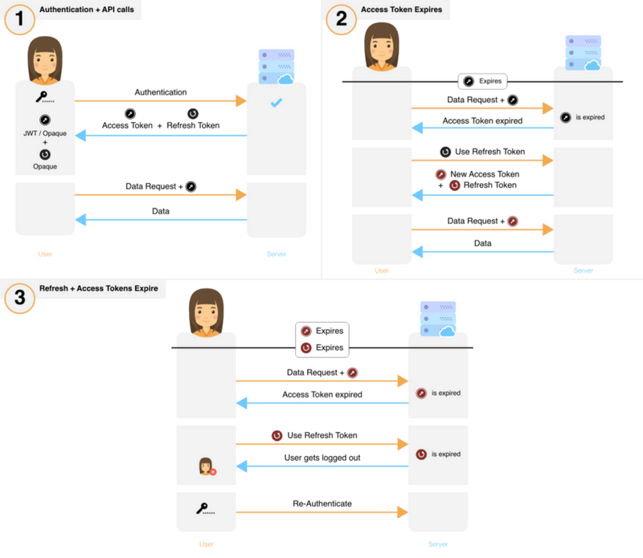
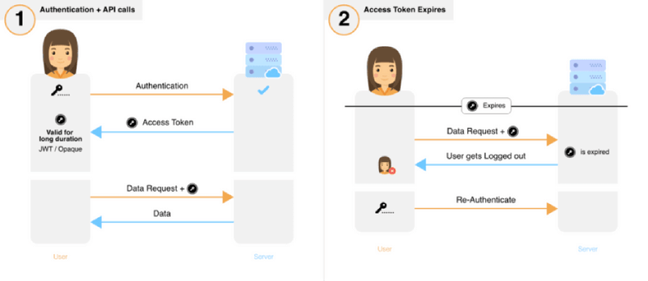

This article will be comparing SuperTokens to Node’s most popular session management library – [express-session](https://www.npmjs.com/package/express-session). The comparison will be done using a point system, where a point will be awarded to a library’s score if it performs well in a given metric. Here are the metrics we will be using:

- [**Security**](#security): This is especially relevant because we’re talking about user session management.
- [**Scalability**](#scalability): Time and space costs. This is relevant because most API calls require session authentication.
- [**Reliability and Correctness**](#reliability-and-correctness): It is imperative that the library takes care of technical issues like keeping its state consistent despite network or server failures and taking care of synchronising its logic in a clustered environment.
- [**App User experience**](#app-user-experience): We want to use a library that can provide the right experience for your app users – for example, does the library enable a user to be logged in for weeks or months whilst also providing good security?
- [**Time to production**](#time-to-production): We will look at factors such as time to integrate the library into an app, available support, and ease of understanding of the library code.
- [**Maintenance cost**](#maintenance-costs): We will assess costs for runtime (RAM and processing power) and internal and external monetary costs.

## Security

We explore how both libraries mitigate against different session attacks below. For a background on why session security is important, read our [other blog post](/blog/all-you-need-to-know-about-user-session-security?s=se/). The attack vectors for sessions are: the frontend, over the network and the backend.

## Token theft via XSS:

In an XSS attack, an attacker can maliciously inject JavaScript into a website on the victim’s browser. The injected code reads and transmits session tokens to the attacker.

Exclusively using HttpOnly cookies to store auth tokens disallows any JavaScript running on the browser from reading them, preventing token theft via XSS. Both SuperTokens and express-session protect against this attack.

**SuperTokens: 1, Express-sessions: 1**

## Brute force

This attack can be solved easily by using long length tokens that have a high amount of entropy. Both SuperTokens and express-session use long length tokens, mitigating this attack.

**SuperTokens: 2, Express-sessions: 2**

## Token theft via Man in the middle attack:

While this attack is mostly preventable using HTTPS, it can still be successfully executed – especially in corporate environments (Check out [this](https://mitmproxy.org/) tool) where access to the internet is controlled via an HTTPS proxy. As such, there is no full proof method to prevent this attack and we can only attempt to minimize the damage.

Express-session uses just one long lived session token. Hence, for each API request, the frontend needs to send this token to the backend for authentication purposes. If a MITM attack is being carried out, any request the app makes will expose this critical token to the attacker who can then use it to gain access to the victim’s account – potentially for months.

SuperTokens uses two auth tokens: one short lived access token, and one long lived refresh token. The recommended lifespan of the access token is <= 1 hour. For most API calls, only the access token is sent over the network. This means, a MITM attacker will likely only get hold of the access token, which would grant them access to the victim’s account for a limited amount of time. SuperTokens is also able to detect token theft in the event that the attacker gets hold of the refresh token.

It’s clear that SuperTokens minimises damage during this attack.

**SuperTokens: 3, Express-session: 2**

## Session fixation:

The attack consists of inducing a user to authenticate themselves with a known session ID, and then hijacking the user-validated session by the knowledge of the used session ID.

Session fixation can be prevented by changing the auth tokens upon successful user login.
While express-session provides the regenerate function, it’s the developer’s responsibility to call this and make sure any session data is carried forward. Since many developers use passport JS (which doesn’t call this function – see [here](https://github.com/jaredhanson/passport/issues/192)) for login purposes, this attack vector goes unresolved.

In the case of SuperTokens, the only way to associate a userId to a session is by creating a new session. This means that the auth tokens change too, mitigating this attack.

SuperTokens wins a point.

**SuperTokens: 4, Express-session: 2**

## Secret key compromise:

In the context of express-session, a secret key is used to sign the cookies. This signature helps the backend ensure that any incoming session was in fact generated by it  (though I’d argue that the same can be achieved by simply having a longer sessionID, even without a signature). These session IDs (SIDs) in the signed cookies are not guessable, so if the attacker is only able to steal the secret key, then there is not much they can do, but if the attacker also gets hold of SIDs from the storage layer (which is likely since they managed to get the secret somehow), then they can hijack the sessions associated with those SIDs quite easily.

SuperTokens also has a secret key. This is used to create a [JWT access token](/blog/are-you-using-jwts-for-user-sessions-in-the-correct-way) that is sent to the client. Here the secret key is necessary and used to ensure integrity of any incoming token. If the key is compromised, then the attacker would be able to change any JWT and impersonate any user in the system (as long as they know that user’s user ID).

The only way to minimise the impact of a stolen key, is to keep changing it:

- Express-session, allows developers to specify an array of secret keys. Tokens are always signed with the latest key, but are verified against all of the keys in the array until one of the keys work. Let’s say the array is *[A, B, C]*, and the attacker manages to get the key *C*. They can now maliciously use this key to sign tokens. Since the tokens are verified against all the keys, even if there were a new key in the system, say, *D* (the array now is *[A, B, C, D]*), the attacker can continue to use *C* and act maliciously. The only solution to this problem is to stop using *C*. However, since express-session uses long lived sessions (weeks or even months), during which the SID does not change, revoking *C* from the array would cause all users whose SIDs are signed with *C* to be logged out!

- Since SuperTokens uses two auth tokens out of which only one is a JWT, the library can go about revoking the stolen key and replacing it with a new one without causing any user logouts *[1](#footnote)*. In fact, the library does JWT signing key rotation for you automatically.

## Data theft from database:

Express-session stores all session IDs in plain text. This means that if an attacker was to get hold of this information (and assuming that they also got hold of the secret key – which is quite probable if they have access to the db), they could easily hijack the session of all currently logged in users.

SuperTokens stores only the hashed version of the session tokens. This means that if anyone (even application developers) gets a hold of them and its corresponding session data, they will not be able to use it to hijack any user’s session.

SuperTokens clearly wins this point

**SuperTokens: 6, Express-session: 3**

## CSRF (Cross-site Request Forgery):

Express-session does nothing to prevent this. On the other hand, SuperTokens has CSRF protection which is enabled by default for all non-GET APIs. By simply passing a boolean value to the function that does session verification, one can enable / disable CSRF protection for different APIs.

## Session hijacking:

There are two aspects to this attack:

- Preventing unauthorised access via token theft: In theory, it’s impossible to prevent this since the session tokens are being sent to an untrusted device (the app’s frontend). We can only minimise the probability of this event. The most prominent method to do so is to use frequently changing session tokens.

- Detecting token theft and taking appropriate action: Traditional methods of theft detection include methods like analysing IP address or device fingerprint changes. However, these methods lead to many false negatives and positives. The better way to do this is to use the concept of rotating refresh tokens as suggested by IETF in their [OAuth RFC](https://datatracker.ietf.org/doc/html/rfc6749#section-10.4). After detection, the session solution should allow for immediate or quick revocation of the affected session.

SuperTokens follows both these practices. It uses two tokens (access and refresh tokens), which keep changing frequently, and also has token theft detection using the [IETF recommended method.](https://datatracker.ietf.org/doc/html/rfc6819#section-5.2.2.3) Below is the session flow that shows the usage of the tokens:

Meanwhile, express-session uses one long lived token and has no means to detect token theft. Below is the session flow for express-session:

SuperTokens wins this point as well.

**SuperTokens: 8, Express-session: 3**

## Scalability

Session authentication is performed in most APIs. Hence, it’s necessary that the methodology for verifying a session is as efficient as possible in terms of time complexity. When talking about latency, it is important to realise that I/O based operations, like reading from a database, are the bottlenecks.

**Time complexity:** Express-session does a database call for each verification of a session, and also provides no caching functionality out of the box (unless using redis storage). Since SuperTokens uses a JWT as its access token, most calls to verify a session do not require any network operation. SuperTokens gain’s a point here.

**SuperTokens: 9, Express-session: 3**

## Reliability and Correctness

Correctness means that the code works as expected in normal and edge case situations. Based on our evaluation, we found that express-session is not thread safe. The specific failure case is that it is possible to bring back a revoked user session in certain scenarios:

1. A user session already exists for user1
2. Let’s say we have two requests (A and B) sent at the same time from user1.
3. Request A, reaches the server first and gets the session object in its API.
4. After that, request B reaches the server and revokes this session.
5. Request A then (using its already obtained session object in step 3), modifies some session    data and then saves that.
5. This results in the revoked session being alive again.

For SuperTokens, we’ve made sure that once a session is removed from the database, it never comes back. We do this by enforcing that all update operations never insert a row in case the primary field (session ID) doesn’t exist..

**SuperTokens: 10, Express-session: 3**

## App User experience

In the context of sessions, a good user experience means that we enable long lived sessions so that app users do not have to keep logging in repeatedly. Both Express-session and SuperTokens enable this, so it’s a tie.

**SuperTokens: 11, Express-session: 4**

## Time to production

**Completeness:** Session management is tightly tied to user management. This means, given a session, one should be able to retrieve the associated user information, and given a user ID, one should be able to retrieve all the associated sessions. While express-session allows you to get user information given a session ID, going the other way around would require customisations. On the other hand, SuperTokens have both way bindings.

**SuperTokens: 12, Express-session: 4**

**Complexity in initial setup:** SuperTokens is more complex to set up than Express-session is, albeit for good reason – it adds more security and it also has more features. This point goes to express-session.

**SuperTokens: 12, Express-session: 5**

**Community support:** Since Express-Session is an older library and is being used by a lot of developers, it has great support and a big presence on sites such as StackOverflow. SuperTokens does not yet have equally good community support. Express-Session wins a point here.

**SuperTokens: 12, Express-session: 6**

**Dedicated support:** For many industries like banking and healthcare, having dedicated support for third party tools being used for critical applications is compulsory. Unlike Express-session, SuperTokens provides dedicated support and hence gains a point.  

**SuperTokens: 13, Express-session: 6**

## Maintenance costs

**Runtime cost:** Higher costs are incurred by higher processor and RAM usage. Express-session, being a library for Node, doesn’t require extra resources to run in terms of processors or RAM. Meanwhile, SuperTokens is run as a separate process. Due to this, it requires slightly more RAM and processing than express-session does. Hence, express-session gets a point here.

**SuperTokens: 13, Express-session: 7**

**External costs:** Express-session is completely free to use. SuperTokens has a community (free) and a paid version. Some of the features discussed above are only available in the paid version, so it’s only fair to give a point to express-session for this metric.

**SuperTokens: 13, Express-session: 8**

**Internal Costs:** Express-session is a relatively simple library, which means that as apps scale, eventually, more and more work needs to be put into “scaling” / changing the session management system. Examples of changes are:

- Building infrastructure to be able to monitor / revoke sessions in real time from a dashboard.
- Quite often, the API layer is built using multiple frameworks (like NodeJS). Hence, a cost here is to build a library for another backend framework that is compatible with Express-sessions.
- Adding a caching layer to session to improve performance.
- Adding more functionality to the core session logic. For example adding a feature to revoke sessions based on changes in device fingerprints.
- Adapting to changes in the ecosystem, especially frontend technologies. For example, to integrate express-session with a react-native (RN) app would require deep knowledge of RN, Android and iOS (due to a [bug](https://build.affinity.co/persisting-sessions-with-react-native-4c46af3bfd83) in react native in the way it handles cookies). When SuperTokens supports RN, it will provide a fully functional and well maintained RN SDK.

I realise that not all the above points will be of concern, but even if one of them does end up being true, that can add significant costs to an organisation / project simply because of how expensive developers are – especially one experienced enough to work on session security.

It’s clear that if using express-session, it’s very likely that an organisation would run into this issue *eventually* because it’s a simple and an old library (so more unlikely to change). On the other hand, SuperTokens is a new solution that has in its roadmap many features so that eventually, as apps scale, its developers do not have to worry about changes to their session management system. So SuperTokens gain’s a point here.

**SuperTokens: 14, Express-session: 8**

## Conclusion:

We can see that SuperTokens clearly wins out on the metrics we have chosen. Not just that, it’s only going to get much better over time as we expand on the number of frameworks we support as well as add more amazing features! Overall, it is much more secure and complete. Of course, I am a little biased towards SuperTokens because I am one of the contributors to the library, but I think I have compared the two libraries fairly. If you find that there are some metrics I have missed where Express-session performs better, or if you have any general feedback, please drop a comment or send us an [email](mailto:team@supertokens.com).

To learn more about Sessions, please visit our other blogs and our website:

## Footnote:

[1]: SuperTokens uses two tokens: access tokens and refresh tokens. The access token is signed by the secret key. If the secret is changed, then any access token that was signed by the old key will fail validation. Upon failure, the backend will signal to the frontend to use its refresh token which will then yield a new access token signed with the new key – causing no user logouts.

[2]: Hashing is an algorithm that transforms inputs of arbitrary size to a fixed sized output. This means, given the input, one can always get the output (which is deterministic), but given the output, it’s practically impossible to get any corresponding input.

[3]: Technically, OAuth is different from session management (in the context of this article). But the underlying mechanism through which access is maintained, is similar.