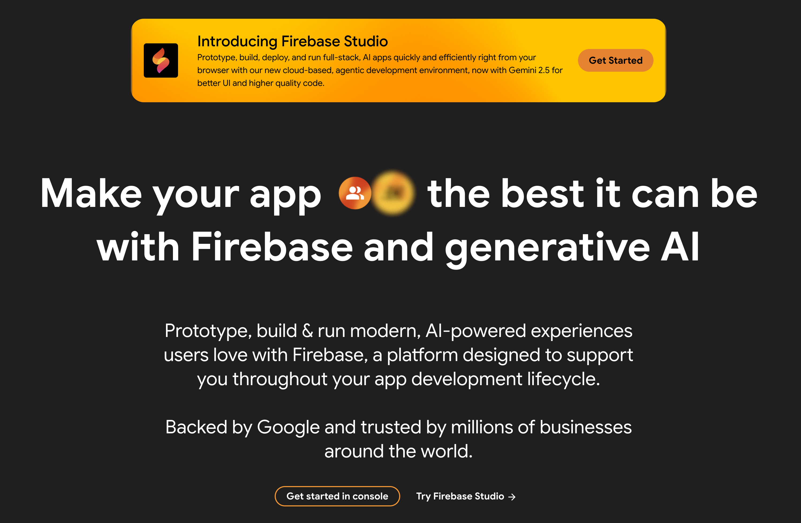

## TL;DR
* **Firebase limitations:** Vendor lock-in, unpredictable costs, limited backend control, compliance challenges
* **Top 4 alternatives:** Supabase, Appwrite, AWS Amplify, and Backendless
* **Key factors to consider:** Scalability, data flexibility, authentication, pricing, open-source vs. managed

*** 

🚀🌕 If you're aiming to take your app to the moon, you need to do some planning on how it will affect your users and bank account. Unlike the limitless stars we see when we look up at the night sky (if you are in a field, away from the busy city lights and when it's not cloudy 👀), our money sadly is not limitless. So it's vital to choose your backend platform well. 

If you're thinking about moving away from Firebase or exploring alternatives because you know it’s not the right fit, this guide can help you choose the best solution to fuel your app’s journey.

```toc
tight: true
toHeading: 3
```

## Why Consider Firebase Alternatives?

Firebase, Google's popular Backend-as-a-Service (BaaS) launched in 2011 and acquired by Google in 2014, provides developers with a comprehensive suite of tools including hosting, real-time NoSQL databases, authentication, and cloud functions, all with minimal setup.



### The Hidden Drawbacks of Firebase

However, Firebase is not without drawbacks. Its deep integration with Google's cloud creates **vendor lock-in**, making it difficult to switch providers without substantial rework. Their free tier covers small projects, but its usage-based pricing means costs can **escalate quickly** as apps grow. 


> "My firebase cost jumped from under $50 per month to $121,000 for [the] last 2 days." - Reddit user 

Because Firebase is proprietary and serverless, developers have **limited control over backend logic** and infrastructure, which can be a constraint for complex, custom applications. 

Finally, relying on Firebase for data storage raises **ownership, privacy, and compliance** questions. While Firebase is GDPR-compliant, meeting stricter regulations or maintaining fine-grained control over user data can be challenging. 

* **Vendor lock-in:** Firebase's cloud-native design tied you to Google's ecosystem. Migrating data and logic to another backend often requires significant re-engineering. 
* **Rising costs:** Firebase's free tier is generous for small apps, but its pay-as-you-go model charges per database read/write, storage, and bandwidth. In practice, high-traffic apps can face **surprising bills**.
* **Limited backend flexibility:** As a managed serverless service, Firebase abstracts away server control. This simplifies prototyping, but hinders advanced customization of backend processes or complex relational data handling. 
* **Data ownership and compliance:** Data lives on Google's servers. Satisfying industry regulations (GDPR, HIPAA, etc.) may require extra configuration, since Firebase's built-in tools don't always offer the granular control needed.

These challenges motivate many teams to explore **Firebase alternatives** that offer more flexibility, cost predictability, or open-source freedom. 


## Key Factors to Consider When Choosing a Firebase Alternative 
When evaluating backend platforms, focus on these critical factors:

### 1. Scalability and Performance
Can the platform grow with your user base? Look for solutions that offer:

* Horizontal and vertical scaling
* Proven performance under heavy loads
* Ability to handle traffic spikes without major redesign

### 2. Data flexibility (SQL vs NoSQL)
Firebase uses NoSQL document storage, which works well for simple data models but has limitations:

* Complex applications often need relational structures
* Look for platforms supporting PostgreSQL or other SQL engines
* Consider solutions offering both SQL and NoSQL options for maximum flexibility

### 3. Authentication and Security
Robust authentication is essential for any modern app:

* Check for built-in auth methods (email/password, OAuth, SSO, passwordless)
* Verify secure session management and account recovery flows
* Ensure protection against common attacks (encryption, CSRF/XSS prevention)
* Confirm compliance capabilities (GDPR, HIPAA) if handling sensitive data

### 4. Pricing transparency
Avoid unexpected costs with:

* Clear, predictable pricing models
* Generous free tiers for development and testing
* Ability to estimate and cap expenses
* Free or open-source options (factoring in hosting/maintenance costs)

### 5. Open-source vs managed service
Consider your team's preferences and capabilities:

* **Open-source:** Full control, transparency, and data ownership, but requires deployment and maintenance
* **Managed services:** Easier to start but may introduce vendor lock-in and customization limits

Keeping these factors in mind will help you choose a backend that aligns with your app’s technical and business needs.

## The Best Firebase Alternatives (Compared)

Below we compare four leading Firebase alternatives, highlighting their key features, pros/cons, and best-use scenarios. 

### [Supabase](https://supabase.com/): The Open-Source SQL Alternative

Supabase is an open-source backend platform that offers a Firebase-like developer experience—but with a PostgreSQL database at its core. It’s often called “the open-source Firebase” because it replicates many Firebase services like auth, real-time data, and file storage, while providing full control and relational data modeling.


#### Key Features
* PostgreSQL database with relational queries and ACID guarantees
* Auto-generated RESTful and GraphQL APIs
* Real-time subscriptions for data change monitoring
* Built-in authentication with user management and Row-Level Security
* OAuth provider support (Google, Apple, Facebook, etc.)
* Scalable file storage and Edge Functions

#### Pros
* Open-source transparency and control with self-hosting options
* Powerful SQL query capabilities that Firebase's NoSQL lacks
* Real-time capabilities comparable to Firebase
* Developer-friendly experience with easy data migration

#### Cons
* Still maturing compared to established platforms
    - That said, Supabase recently raised [$200 million Series D at $2 billion valuation](https://fortune.com/2025/04/22/exclusive-supabase-raises-200-million-series-d-at-2-billion-valuation/) 
* Smaller ecosystem and third-party tooling than Firebase
* Some advanced features may be in beta or missing
* Potential scaling challenges for very high-volume workloads

#### Best for
* Developers who want Firebase-like experience with SQL capabilities
* Teams avoiding vendor lock-in while needing relational data
* Projects where open-source values are important
*** 

### Appwrite: Developer-Centric

Appwrite is a self-hosted backend server packaged as a set of Docker containers. It offers a developer-centric approach, giving you complete control over data, infrastructure, and compliance. Appwrite provides essential backend services out of the box—databases, authentication, storage, functions, and real-time capabilities—without tying you to a specific cloud vendor.


#### Key Features

* Comprehensive suite: Authentication, NoSQL database, file storage
* Cloud Functions for serverless code execution
* Messaging and real-time capabilities
* Docker-based deployment on any infrastructure
* Intuitive console with 30+ login methods
* Multi-factor authentication and rate limiting

#### Pros

* Complete control and privacy through self-hosting
* Freedom to scale on your own terms without cloud provider constraints
* Modular design with SDKs for multiple languages
* Strong support for OAuth and enterprise logins

#### Cons

* Requires DevOps expertise for server management
* Operational overhead for updates, scaling, and backups
* Relatively new with a growing ecosystem
* Less mature enterprise features than established providers

#### Best For

* Teams prioritizing customization, compliance, and data ownership
* Projects requiring Docker deployment
* Organizations willing to manage their own infrastructure for greater control

*** 

### AWS Amplify: Enterprise-Grade Scalability

AWS Amplify is Amazon’s answer to full-stack app development. It combines powerful backend services from AWS (like Cognito, AppSync, S3, Lambda) into a more approachable framework for frontend and mobile developers. It shines in enterprise environments and apps expecting massive scale, offering unmatched integration with AWS’s global infrastructure.


#### Key Features
* Integration with the broader AWS ecosystem
* Robust authentication via Amazon Cognito
* GraphQL APIs (via AWS AppSync) and REST APIs
* Offline data synchronization support
* Managed hosting using S3 and CloudFront
* Analytics through AWS Pinpoint
* Machine learning integrations

#### Pros
* Exceptional scalability leveraging AWS's global infrastructure
* Enterprise-grade reliability and security
* Seamless integration with other AWS services
* Advanced features like Lambda functions and AWS security tools

#### Cons
* Significant complexity, especially for AWS newcomers
* Potentially high costs across multiple AWS services
* Steep learning curve compared to Firebase
* Can feel overwhelming for simple applications

#### Best For
* Teams already building on AWS or requiring enterprise capabilities
* Applications projected to scale to hundreds of thousands of users
* Projects needing tight integration with Amazon's cloud ecosystem

***

### Backendless: Low-Code Rapid Development

Backendless is a low-code platform that combines a visual UI builder, codeless logic tools, and a powerful [mBaaS (*mobile Backend as a Service*)](https://backendless.com/what-is-mobile-backend-as-a-service-mbaas/) backend. It’s uniquely positioned for non-technical teams or fast-moving startups that need to build and launch apps quickly without managing server infrastructure or writing complex backend code.


#### Key Features

* Drag-and-drop UI builder and codeless logic editor
* Visual development for non-technical users
* Hybrid database combining SQL and NoSQL features
* Real-time database synchronization
* Messaging with publish/subscribe capabilities
* Geolocation and geo-relations support
* Automated push notifications for mobile apps

#### Pros

* Exceptional for rapid prototyping and MVPs
* User-friendly for teams with limited coding resources
* Built-in push notification services
* Real-time data synchronization without complex setup

#### Cons

* Potentially expensive at scale compared to self-hosted options
* Limited free tier requiring task completion to unlock
* Less transparency as a managed service
* Customization constraints beyond the UI builder's capabilities

#### Best For

* Fast prototyping and quick MVPs
* Teams with limited coding resources
* Projects requiring rapid mobile app development
* Small applications needing push notifications and real-time updates

## How SuperTokens Improves Authentication in Firebase Alternatives 

Even with a great backend in place, robust authentication is crucial. In the world of Firebase alternatives, choosing the right auth system can make or break your app’s security and user experience. SuperTokens is an open-source authentication solution designed to complement any backend, and it addresses many of Firebase Auth’s limitations.

## Why Authentication Matters in a Firebase Alternative 

Firebase’s built-in Auth service is convenient – it supports email/password, phone, and popular social logins (Google, Facebook, etc.) – but it has notable drawbacks. It’s a proprietary, Google-hosted system, so using it locks you into Firebase’s infrastructure. ts customization is limited; for example, if you need custom identity providers or advanced workflows, you might struggle with what Firebase offers out of the box. 

Additionally, some organizations have strict compliance needs: while Firebase Auth helps with basic GDPR compliance, it may not suffice for highly regulated industries. For these reasons, many teams seek an auth platform that is secure, extensible, and can run independently of any single cloud vendor.

## SuperTokens: Flexible, Secure Authentication
SuperTokens offers several advantages:

### Key Features 

* **Full ownership:** Open-source with self-hosting or managed options
* **Comprehensive auth methods:** Email/password, passwordless, social logins
* **Enhanced security:** Built-in MFA and account protection
* **Superior session management:** Encrypted tokens with automatic refresh
* **Extensive customization:** Custom fields, password policies, verification flows
* **Developer-friendly:** Pre-built UI components and multiple SDKs
* **Universal integration:** Works with any backend platform

By pairing your chosen backend with SuperTokens, you gain:

* Improved security across your application
* Freedom from vendor lock-in for authentication
* Greater customization of user flows and experiences
* Better compliance capabilities for regulated industries

## Making Your Decision: Which Alternative Is Right for You?

| Platform      | Best For                        | Key Strength                                | Notable Limitation                     |
|---------------|----------------------------------|----------------------------------------------|----------------------------------------|
| Supabase      | SQL lovers seeking open-source   | PostgreSQL power with real-time features     | Relatively new ecosystem               |
| Appwrite      | Teams needing full control       | Self-hosted with Docker flexibility          | Requires DevOps expertise              |
| AWS Amplify   | Enterprise-scale projects         | Global infrastructure with AWS integration   | Complex pricing and learning curve     |
| Backendless   | Rapid prototyping                | Visual development with low code             | Can be costly at scale                 |


## Final Recommendations – Choosing the Right Firebase Alternative
1. **Choose Supabase** if you need relational data capabilities with an open-source approach
2. **Select Appwrite** when data ownership and customization are non-negotiable
3. **Go with AWS Amplify** for enterprise-scale applications, especially in the AWS ecosystem
4. **Pick Backendless** for quick MVPs or when developer resources are limited

Regardless of your backend choice, consider SuperTokens for authentication to improve security, avoid vendor lock-in, and gain customization freedom.

By carefully evaluating these Firebase alternatives against your specific requirements, you'll build a more scalable, cost-effective, and flexible foundation for your application's success.