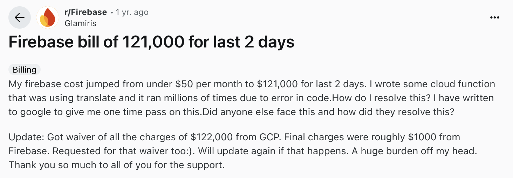
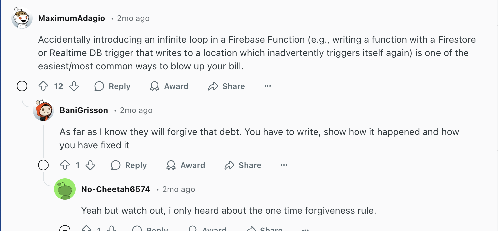

🚀🌕 If you're aiming to take your app to the moon, you need to do some planning on how it will affect your users and bank account. Unlike the limitless stars we see when we look up at the night sky (if you are in a field, away from the busy city lights and when it's not cloudy 👀), our money sadly is not limitless. So it's vital to choose your backend platform well. 

If you're thinking about moving away from Firebase or exploring alternatives because you know it’s not the right fit, this guide can help you choose the best solution to fuel your app’s journey.

## Why Consider Firebase Alternatives?

Firebase is Google's Flagship Backend-as-a-Service (BaaS), launched in 2011 (acquired by Google in 2014) to provide developers with a one-stop backend platform. if offers a suite of tools -- hosting, real-time NoSQL databases (Cloud Firestore/Realtime Database), user authentication, cloud functions, and more -- all with minimal setup. This makes Firebase a very attractive option for rapid prototyping and MVPs. 

However, Firebase is not without drawbacks. Its deep integration with Google's cloud creates **vendor lock-in**, making it difficult to switch providers without substantial rework. Their free tier covers small projects, but its usage-based pricing means costs can **escalate quickly** as apps grow. 

Because Firebase is proprietary and serverless, developers have **limited control over backend logic** and infrastructure -- which can be a constraint for complex, custom applications. 

Finally, relying on Firebase for data storage raises **ownership, privacy, and compliance** questions. While Firebase is GDPR-compliant, meeting stricter regulations or maintaining fine-grained control over user data can be challenging. 

* **Vendor lock-in:** Firebase's cloud-native design tied you to Google's ecosystem. Migrating data and logic to another backend often requires significant re-engineering. 
* **Rising costs:** Firebase's free tier is generous for small apps, but its pay-as-you-go model charges per database read/write, storage, and bandwidth. In practice, high-traffic apps can face **surprising bills**.
* **Limited backend flexibility:** As a managed serverless service, Firebase abstracts away server control. This simplifies prototyping, but hinders advanced customization of backend processes or complex relational data handling. 
* **Data ownership and compliance:** Data lives on Google's servers. Satisfying industry regulations (GDPR, HIPAA, etc.) may require extra configuration, since Firebase's built-in tools don't always offer the granular control needed.

These challenges motivate many teams to explore **Firebase alternatives** that offer more flexibility, cost predictability, or open-source freedom. 

## Key Factors to Look for in a Firebase Alternative 
When evaluating BaaS platforms to replace Firebase, consider several technical criteria and trade-offs.

### Scalability and Performance
Can the platform grow with your app? Look for horizontal and vertical scaling support and proven performance under load. The service should handle spikes in traffic and large datasets without major redesign. Reviewing benchmarks or case studies can help assess if it truly scales to enterprise levels.

### Data flexibility (SQL vs NoSQL)
Firebase uses NoSQL (document) storage, which is great for simple data models. But many apps require complex queries or relational structures. A good alternative might offer both SQL and NoSQL options (or at least a powerful relational DB). Platforms that support PostgreSQL or other SQL engines give you richer querying capabilities and schema control.

### Authentication and Security
Authentication is a core part of any backend. Check what auth methods are built in (email/password, OAuth/social logins, SSO, passwordless, etc.) and whether you can customize them. Ensure the platform provides secure session management, account recovery flows, and protections against common attacks (encryption, CSRF/XSS prevention). Also verify compliance features: if your app handles sensitive data, the BaaS should support GDPR, HIPAA, or similar requirements out of the box.

### Pricing transparency
Understand the cost model. Platforms with clear, predictable pricing and generous free tiers are preferable for budgeting. Avoid services with opaque pay-as-you-go schemes that can balloon unexpectedly. Ideally, the alternative should let you estimate and cap costs. Free or open-source offerings can lower expenses, as long as you factor in hosting/maintenance costs.

### Open-source vs managed service
Decide whether you want a self-hosted, open-source solution or a fully managed cloud service. Open-source platforms give you full control and transparency (you own the code and data), but require you to handle deployment and ops. Managed services are easier to start but may replicate some vendor lock-in and lack customization. Compare the ecosystem and community support: open-source projects often have active communities and extensibility, whereas closed platforms may be more polished but less flexible.

Keeping these factors in mind will help you choose a backend that aligns with your app’s technical and business needs.

## The Best Firebase Alternatives (Compared)

Below we compare four leading Firebase alternatives, highlighting their key features, pros/cons, and best-use scenarios. 

### Supabase

* **Key Features:** Supabase bills itself as “the open-source Firebase alternative”. it is built on a PostgreSQL database, giving your relational queries and ACID guarantees out of the box. Supabase auto-generates RESTful (and GraphQL) APIs for your database, and it includes real-time subscriptions so you can listen to data changes just like Firebase’s realtime DB. 

    Supabase also provides a built-in Authentication service (with user management and Row-Level Security) and support for third-party OAuth providers (Google, Apple, Facebook, etc.). Other features include scalable file Storage, and “Edge Functions” (serverless functions you can write in JavaScript/TypeScript). Overall, Supabase mirrors many Firebase capabilities but on an open platform.
* **Pros:**  Because it’s open-source, Supabase gives you transparency and control – you can self-host it if desired or run it on any cloud/Docker environment. Using PostgreSQL means you have powerful SQL query support and relational features that Firebase’s NoSQL lacks. Its real-time capabilities are on par with Firebase, and the overall developer experience is quite friendly. The Kinsta blog notes you can even “import data easily using a .sql file,” highlighting its database flexibility.
* **Cons:** Supabase is still maturing compared to older platforms. Its ecosystem and third-party tooling are smaller than Firebase’s. Some advanced features (like certain analytic or machine-learning integrations) may not yet exist or be in beta. If your app relies on very large-scale distributed data or very high-volume workloads, you may encounter scaling trade-offs until more of Supabase’s scalability features stabilize.
* **Best for:** Developers who want a Firebase-like experience with SQL underpinnings and who value open-source. Supabase is a great fit if you need relational data or want to avoid lock-in, and you’re comfortable being an early adopter of a growing platform.

*** 

### Appwrite

* **Key Features:** Appwrite is an open-source self-hosted backend server designed for web and mobile pps. It offers a comprehensive suite: Authentication, NoSQL database, file storage, cloud Functions (serverless code), messaging, and real-time capabilities. Appwrite is built to be deployed with Docker. In fact, its docs state that “you can install and run Appwrite on any OS that can run Docker CLI”. 

    This means you can host the entire backend on your own infrastructure (on-prem or any cloud) for full data ownership. It also provides an intuitive user-friendly console and supports 30+ login methods, multi-factor auth, rate limits, and more as standard.
* **Pros:** Because you self-host Appwrite, you get full control and privacy over your backend and data. You can scale it as you like (*by provisioning more servers*) and are not forced into any single cloud provider. 
    
    Appwrite’s modular design and SDKs for multiple languages make it easy to integrate. Its developer experience is a focus – for example, it integrates with many common frameworks and even has built-in support for OAuth and enterprise logins.
* **Cons:** The trade-off for control is operational overhead. Using Appwrite means DevOps responsibilities. You must manage the servers, updates, scaling, and backups yourself. Teams without dedicated infrastructure expertise may find this burdensome. Also, like Supabase, Appwrite is relatively new, so its ecosystem is still growing. Some advanced enterprise features may be less mature than large cloud providers’.
* **Best for:** Teams that prioritize customization, compliance, and data ownership. If you want a Firebase-like feature set but need to run everything on your own terms (or use Docker), Appwrite is a strong choice. It suits projects where having control over the environment is more important than a turnkey hosted solution.

*** 

### AWS Amplify 

* **Key Features:** AWS Amplify is Amazon’s cloud-native development platform. It provides managed backend services (often via other AWS services) with an emphasis on integration into the AWS ecosystem. Amplify Auth is backed by Amazon Cognito, giving you robust user authentication and authorization out of the box. 

    You can configure GraphQL APIs (via AWS AppSync) or REST APIs easily, with support for offline data synchronization. Amplify also includes managed hosting (using S3 and CloudFront), analytics (AWS Pinpoint), and even machine learning integrations. In practice, Amplify ties together many AWS services – for example, S3 for file storage, DynamoDB or RDS for data, and Pinpoint for analytics.
* **Pros:** Amplify’s biggest strength is scalability and robustness. It runs on AWS’s global cloud infrastructure, so it can handle massive scale and offers enterprise-grade reliability. If your app is already using AWS (or plans to), Amplify provides excellent integration with the rest of AWS’s services. 

    For example, it’s easy to add Cognito authentication, attach AWS Lambda functions, and use AWS’s security features. The SigNoz comparison notes that Amplify is very flexible and highly scalable, making it suitable for large applications
* **Cons:** Amplify can be complex. Its pricing model involves multiple AWS services, which can make costs hard to predict and potentially high at scale. There is a steep learning curve if you’re not already familiar with AWS. Some developers find that Firebase is simpler and more straightforward for small projects, whereas Amplify shines in large, AWS-centric deployments. 

    In short, Amplify can feel like overkill for simple apps, and AWS’s intricacies (IAM roles, permissions, etc.) can add complexity.
* **Best for:** Teams building on AWS or needing enterprise-scale capabilities. If your infrastructure is already on AWS, or you need to leverage AWS services (ML, enterprise security, etc.), Amplify is a natural fit. It’s ideal for apps that will grow into the tens or hundreds of thousands of users and need tight integration with Amazon’s cloud.

***

### Backendless 

* **Key Features:** Backendless is a low-code/no-code visual app platform. It provides a drag-and-drop UI builder and codeless logic editor so that developers (even non-technical users) can define backend workflows and UI visually. Under the hood, it offers an mBaaS (*mobile Backend as a Service*) with built-in user management, real-time database syncing, messaging (publish/subscribe), and file storage. 

    Notably, Backendless supports a dynamic database that combines SQL and NoSQL features – you get the flexibility of NoSQL with the ability to run SQL queries and relational logic. It also includes features like geolocation, geo-relations, and automated push notifications for mobile apps.
* **Pros:** Backendless excels at rapid prototyping and ease of use. Its visual tools allow teams to spin up full apps quickly without writing much code. Features like its built-in push notification service and real-time data sync are user-friendly for non-dev teams. The platform even advertises “unlimited data retrieval” and built-in security for your APIs. 

    In short, for simple projects, startups, or internal tools, it can significantly accelerate development by abstracting much of the backend plumbing.
* **Cons:** The low-code convenience has a price. Backendless’s hosted plans can become expensive at scale compared to rolling your own self-hosted backend. The free tier is very limited (you must complete tasks to unlock it), and paid plans start around $25/month. 

    There’s also less transparency since much of the platform is a managed service. Advanced customization (beyond what the UI builder offers) may require diving into code or APIs.
* **Best for:** Fast prototyping and teams with limited coding resources. Backendless is particularly well-suited to MVPs, proof-of-concepts, or businesses that want to involve non-technical stakeholders in development. It’s a strong choice for small apps that need mobile push notifications, real-time updates, and a quick setup, but it’s less ideal for very large-scale or highly customized backends.

## How SuperTokens Improves Authentication in Firebase Alternatives 

Even with a great backend in place, robust authentication is crucial. In the world of Firebase alternatives, choosing the right auth system can make or break your app’s security and user experience. SuperTokens is an open-source authentication solution designed to complement any backend, and it addresses many of Firebase Auth’s limitations.

### Why Authentication Matters in a Firebase Alternative 

Firebase’s built-in Auth service is convenient – it supports email/password, phone, and popular social logins (Google, Facebook, etc.) – but it has notable drawbacks. It’s a proprietary, Google-hosted system, so using it locks you into Firebase’s infrastructure. ts customization is limited; for example, if you need custom identity providers or advanced workflows, you might struggle with what Firebase offers out of the box. 

Additionally, some organizations have strict compliance needs: while Firebase Auth helps with basic GDPR compliance, it may not suffice for highly regulated industries. For these reasons, many teams seek an auth platform that is secure, extensible, and can run independently of any single cloud vendor.

### Key SuperTokens Features 

SuperTokens addresses these needs with a modern, developer-friendly approach. It is fully open-source and can be run either self-hosted or via a hosted service. This means you or your team maintain control of the auth server and user data. 

Out-of-the-box, SuperTokens supports a wide array of authentication methods: email/password login, passwordless flows (magic links or one-time codes), and social logins (Google, Facebook, GitHub, etc.). It also offers built-in multi-factor authentication (MFA) and account security features, which many Firebase alternatives lack natively.

A key advantage of SuperTokens is its session management. It provides secure, scalable session handling where tokens are encrypted and automatically refreshed, helping protect against common vulnerabilities (CSRF, XSS, token theft). 

Developers can customize authentication flows extensively – adding custom fields, password policies, email verification logic, etc. SuperTokens ships with pre-built UI components and SDKs, but you can also integrate it via REST APIs or code your own UI. Finally, it is designed to integrate seamlessly with any backend. 

Whether you choose Supabase, Appwrite, Amplify, or Backendless, you can use SuperTokens for auth. In short, SuperTokens brings flexible, secure authentication to any stack without vendor lock-in.

## Conclusion – Choosing the Right Firebase Alternative
Each of the platforms above has unique strengths and trade-offs: 
* **Supabase** is ideal if you want an open-source, PostgreSQL-backed backend; its real-time capabilities make it a drop-in Firebase replacement for many use cases, though it's relatively young and has a smaller ecosystem. 
* **Appwrite** gives you the highest level of control: you can self-host a full BaaS with Docker, perfect if compliance and data ownership are paramount, but be prepared for the DevOps work. 
* **AWS Amplify** is the most enterprise-ready. It taps into AWS’s power (Cognito auth, AppSync APIs, etc.) and can scale globally, though its complexity and pricing can overwhelm smaller teams. 
* **Backendless** shines for rapid, low-code development (with visual tools and real-time syncing), making it great for prototypes and mobile apps, but its managed nature and cost structure can become burdensome at scale.

Ultimately, your choice depends on project needs: use Supabase or Appwrite if you value open-source flexibility, Amplify if you’re deeply in the AWS ecosystem, or Backendless for quick MVPs. 

In every case, pairing your backend with a dedicated auth solution like SuperTokens can improve security and scalability. 

SuperTokens works as a drop-in auth layer (supporting passwordless login, social login, MFA, and strong session management) that you can integrate on top of Supabase, Appwrite, Amplify, Backendless, or any other backend. By decoupling authentication from your core backend, you avoid vendor lock-in and gain customization freedom. 

This setup, choosing the right backend BaaS and combining it with a robust auth framework like SuperTokens, gives you a truly scalable, secure, and flexible architecture for your app.