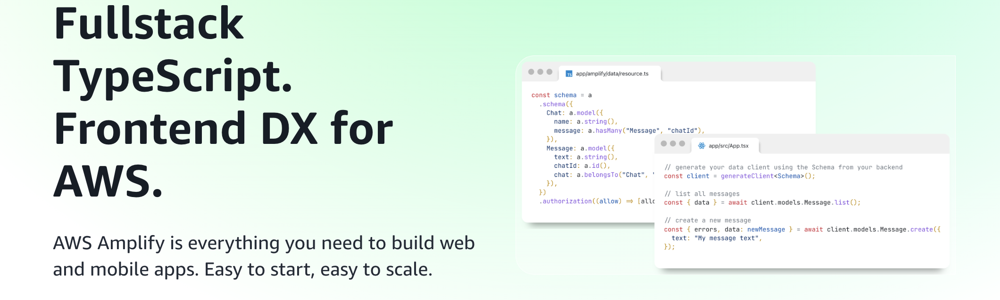
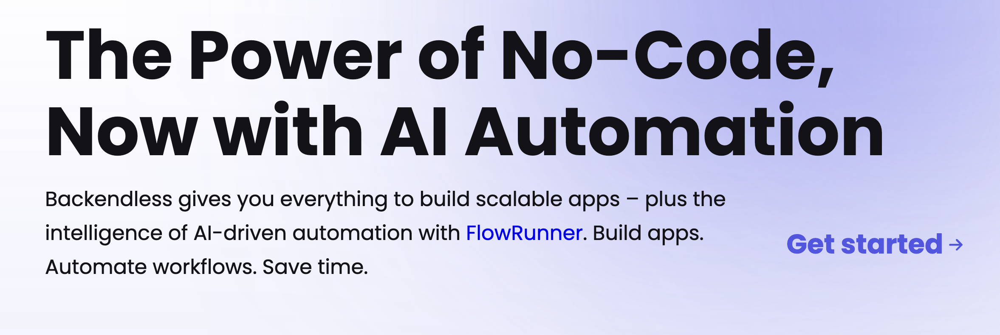

If you're aiming to take your app to the moon, 🚀🌕 you need to do some planning on how it will affect your users and bank account. Unlike the limitless stars we see when we look up at the night sky (if you are in a field, away from the busy city lights and when it's not cloudy 👀), our money sadly is not limitless. So it's vital to choose your backend platform well. 

This is a fairly comprehensive guide so feel free to jump around to the parts that help you the most. 

If you're thinking about moving away from Firebase or exploring alternatives because you know it’s not the right fit, this guide can help you choose the best solution to fuel your app’s journey.

## Why Consider Firebase Alternatives 
### Overview of Firebase and its role as a BaaS (Backend-as-a-Service).

**BaaS provides pre-built backend infrastructure and services to simplify your app development** -- like handling server-side tasks like data storage, user management, APIs, server maintenance, security, database management, and more -- **so you can focus on your core product and scalability.**

**Firebase is one of the giants leading the BaaS front.** However people have started considering other options for their applications because of common pain points with Firebase -- especially after it was acquired by Google -- and because other alternatives began emerging -- especially open source options. 

### Common Pain Points with Firebase -- Why Devs Are Leaving
#### Vendor lock-in – Google Cloud Dependency
**Vendor lock-in is when you are forced to become dependent on a product** by making it almost **impossible to switch** to a competitor's product. This happens due to budget limits, fewer staff, or the need to keep business running smoothly. As a result, you might end up with a costly, outdated, or less effective solution. 🤕

**A major downside of using Firebase is the risk of vendor lock-in**. Building your application on Firebase ties you closely to Google's ecosystem, making it difficult to move your data and code to another platform. If you decide to switch to a different backend service, you may encounter compatibility challenges and a complex migration process. This is one of the big reasons developers are leaving Firebase and looking for other options. 

For more insights on resolving vendor lock-in, check out our article: [**Solve The Problem of Vendor Lock-In**](https://supertokens.com/blog/solve-the-problem-of-vendor-lock-in)

> Additionally, because Firebase is not open source and is owned by Google, a lot of developers fear that Firebase -- [like many other Google projects](https://killedbygoogle.com/) -- has the potential to be killed. 💀🪦

#### Pricing concerns – Costs Scale Rapidly
If you like horror stories you can [read up](https://www.reddit.com/r/Firebase/comments/1hpza8q/what_can_cause_firebase_costs_to_skyrocket/) on how people's bills skyrocketed with Firebase in one day over a bug in their code, or sudden growth they were not expecting. While you can contest the bill if you get one, there seems to be a general rule that Firestore will forgive the bill but only once. 

A Hacker News user [shared](https://news.ycombinator.com/item?id=42732714) that they unexpectedly received a staggering **$70,000** bill in one day, a huge spike from their typical $50 charge. 

Another user [shared](https://www.reddit.com/r/Firebase/comments/17mv8r0/firebase_bill_of_121000_for_last_2_days/) on Reddit how their cost went up to **$121,000** overnight because of a code error as well. 

[Firebase has address the surprise bills and written how to avoid them](https://firebase.google.com/docs/projects/billing/avoid-surprise-bills) but a lot of the work still depends on you as the developer -- to set up usage notifications and test your code for bugs that can cause an insane bill. 
#### Limited backend flexibility – Harder to Customize.
While Firebase does offer many benefits, its backend flexibility can be limited.

#### Data ownership & privacy – Potential Compliance Concerns
Using Firebase means trusting Google to handle your app's data. This can raise concerns about privacy and data ownership. Google's policies might not match your specific needs, and you may have limited control over how your data is stored and managed. This can be especially worrying if your app handles sensitive user information. 

## Key Factors to Look for in a Firebase Alternative
When choosing a BaaS platform for your app, it's important to consider several key factors to ensure scalability, performance, and long-term success. Here's what to keep in mind:

### 🔥 Scalability and Performance 
Your chosen platform should handle growth without performance issues. As your app gains more users, you’ll need infrastructure that can manage increased data, requests, and concurrent connections. Look for platforms with features like automatic scaling, efficient data caching, and optimized database performance to keep your app fast and responsive.

### 📊 Data Flexibility
Different apps require different data structures. Some BaaS solutions offer only document-based databases, while others provide relational databases. Ensure the platform you choose allows flexible data models and easy data migration in case your requirements evolve.

### 🔐 Authentication and Security 
Authentication is critical for protecting user data. Many BaaS platforms provide built-in authentication, but they may lack advanced features like two-factor authentication (2FA), role-based access control (RBAC), or easy integration with custom security logic. Consider adding a dedicated auth solution like SuperTokens to enhance security and improve flexibility.

### 💰 Pricing Transparency 
Unexpected costs can derail a growing app. Ensure your chosen BaaS offers clear, predictable pricing. Watch out for usage-based pricing that may seem affordable at first but can spike as your user base grows.

### 🛠️ Open-source vs Managed Solutions 
Open-source platforms provide greater control, allowing you to customize features and host your data on your own servers. Managed solutions handle infrastructure and updates for you, making them easier to maintain but potentially limiting your flexibility. Decide which model fits your team's skills and your project's needs.

By evaluating these factors carefully, you can choose a BaaS platform that supports your app's growth, keeps data secure, and aligns with your development goals.
## The Best Firebase Alternatives (Compared)

### Supabase -- Open Source Option

Supabase is an open source alternative to Firebase. Instead of being built around a document based datastore -- like Firestore -- Supabase offers you a relational database management using PostreSQL.

#### ⚖️ How Supabase Stacks Up
Here’s how it compares based on our key factors:

**Scalability and Performance**  
Offers automatic scaling for growing traffic and data demands.

**Data Flexibility**  
Uses a relational database (PostgreSQL), ideal for structured data and complex queries.

**Authentication and Security**  
Includes built-in auth with social logins; SuperTokens can improve flexibility and security.

**Pricing Transparency** 
Transparent pricing model with usage-based costs; can become expensive at larger scales.

**Open-source vs Managed Solutions**  
Open-source with a managed hosting option for easier maintenance.

You can checkout the [Supabase Documentation](https://supabase.com/) to learn more how to get started.
*** 

### Appwrite -- Open Source Option

#### ⚖️ How Appwrite Stacks Up
Here’s how it compares based on our key factors:

**Scalability and Performance**  
Requires manual scaling setup but offers modular architecture for flexible management

**Data Flexibility**  
Uses a document-based database, better for flexible, dynamic data structures.

**Authentication and Security**  
Provides solid built-in auth features like OAuth and custom email/password login; SuperTokens can enhance this with 2FA, custom logic, and role management.

**Pricing Transparency** 
Open-source and self-hosted, giving full cost control but requiring hosting management.

**Open-source vs Managed Solutions**  
Fully open-source, requiring self-hosting unless using a third-party managed provider.

You can checkout the [Appwrite Documentation](https://appwrite.io/) to learn more how to get started.

*** 

### AWS Amplify

#### ⚖️ How AWS Amplify Stacks Up
Here’s how it compares based on our key factors:

**Scalability and Performance**  
Designed for enterprise-level scaling with powerful AWS infrastructure; ideal for handling large-scale traffic and complex apps.

**Data Flexibility**  
Provides flexible data models through Amazon DynamoDB (NoSQL) or Amazon RDS (relational), offering extensive flexibility.

**Authentication and Security**  
Comes with Amazon Cognito for authentication, supporting social logins, MFA, and advanced security features; SuperTokens can improve flexibility and customization.

**Pricing Transparency** 
Pay-as-you-go model with potentially high costs as traffic scales; best for apps with predictable usage.

**Open-source vs Managed Solutions**  
Fully managed solution with no self-hosting option; offers deep integration with AWS services.

You can checkout the [AWS Amplify Documentation](https://aws.amazon.com/amplify/) to learn more how to get started.

*** 

### Backendless -- No Code Option

#### ⚖️ How Backendless Stacks Up
Here’s how it compares based on our key factors:

**Scalability and Performance**  
Provides built-in scaling options, ideal for apps with dynamic workloads. Real-time database capabilities boost performance.

**Data Flexibility**  
Offers both relational and NoSQL database options, giving developers more data model flexibility.

**Authentication and Security**  
Includes a powerful user management system with social logins, password recovery, and role-based permissions; SuperTokens can enhance with more customization.

**Pricing Transparency** 
Offers flexible pricing with both free and paid tiers. Usage-based pricing for scaling ensures you pay for what you use.

**Open-source vs Managed Solutions**  
Closed-source with managed hosting, but also offers self-hosting options for greater control.

You can checkout the [Backendless Documentation](https://backendless.com/) to learn more how to get started.

### Comparison Table
A quick reference table to help you decide the best platform for your needs.

| Platform    | Best For                  | Open Source | Pricing Transparency | Scalability |
|--------------|-----------------------------|---------------|------------------------|--------------|
| **Supabase**     | Relational DBs & SQL     | ✅              | Moderate                   | ✅              |
| **Appwrite**      | Self-hosted Flexibility      | ✅              | High Control                | Requires setup |
| **AWS Amplify** | Enterprise Apps              | ❌              | Higher Costs                 | ✅              |
| **Backendless** | No-Code Development       | ❌              | Flexible                     | ✅              |

- **Supabase** is ideal for developers seeking a relational database with managed scaling.
- **Appwrite** is a great choice for developers who prefer self-hosting and modular flexibility.
- **AWS Amplify** is best for teams already using AWS services or those building highly scalable enterprise apps.
- **Backendless** excels with real-time data support and flexible data models.
## How SuperTokens Improves Authentication in Firebase Alternatives 🔒 🚀
**After selecting the best BaaS for your app, you can enhance its authentication capabilities by integrating SuperTokens into your tech stack.** This approach not only simplifies the process but also gives you greater flexibility and control over your authentication setup.

While most BaaS platforms offer built-in authentication services, they often come with limitations. This is where SuperTokens can fill the gaps, **providing a more customizable and robust authentication solution.**

By combining the strengths of both, you get the best of both worlds — a powerful BaaS to manage your users and SuperTokens to deliver tailored, secure authentication that meets your app's unique needs.

### Why Authentication Matters in a Firebase Alternative 
Firebase authentication is limited in its flexibility and customization. SuperTokens offers more control, security, and cost-efficiency. 

### Key SuperTokens Features
- **Open-source and self hosted option** -- No vendor lock-in
- **Fully customizable authentication flows** -- Passwordless, social logins, MFA
- **Session management with enhanced security** -- Prevents token theft and session hijacking
- **Easy integration with Supabase, Appwrite, AWS Amplify and more**

## Key Takeaways - Choosing the Right Firebase Alternatives 
- Backend as a Service (BaaS) is a cost effective way for developers to focus on their core business value, rather than spending more of their resources on developing key backend features -- like authentication, real-time database management, scalability, and analytics -- from scratch. 
- Firebase is a leader in the BaaS space but -- because of massive surprise bills -- developers are looking for alternatives.
- Alternatives like Supabase, Appwrite, AWS Amplify, and Backendless have gained quite a bit of traction, giving developers more options than ever when choosing a BaaS provider. 
- When choosing a Firebase alternative, it is crucial to consider your project's specific needs and the potential for future growth. 