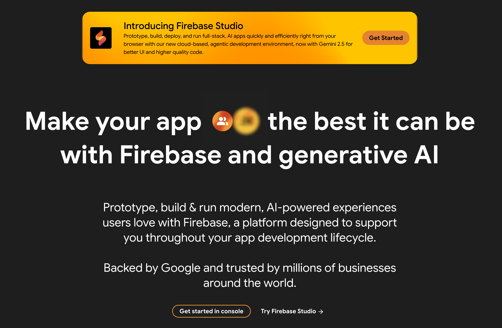
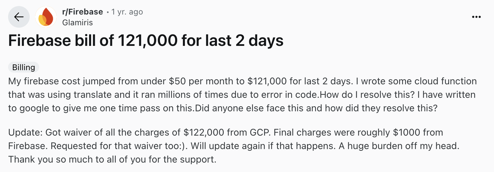
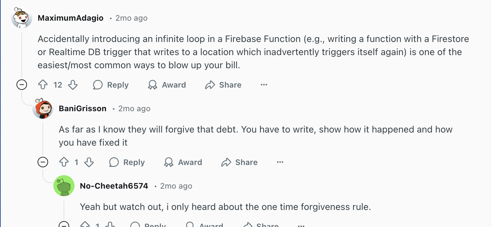
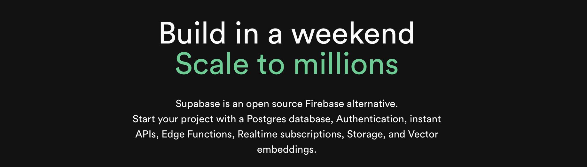
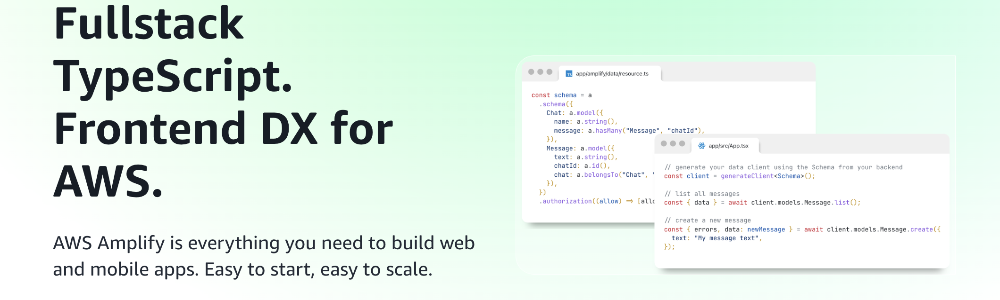
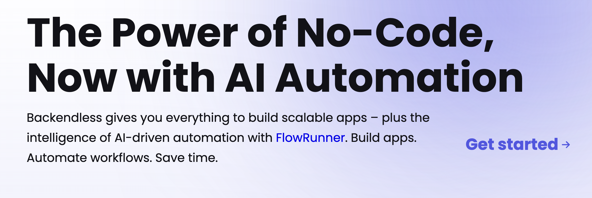

**The best Firebase alternatives in 2026 are Supabase, Appwrite, Convex, PocketBase, Nhost, AWS Amplify and Backendless.** Supabase is the most popular choice if you want a relational (Postgres) database with a Firebase-like developer experience. Appwrite is the most complete open source, self-hostable backend. Convex suits reactive TypeScript apps. PocketBase is the simplest single-binary option. AWS Amplify fits teams already on AWS, and Backendless fits low-code teams.

*Pricing and licences checked against each vendor's pricing page and GitHub repository on 24 September 2026. Prices change often, so confirm before you commit.*

## Firebase Alternatives at a Glance

| Platform | Database | Open source / self-host | Free tier | Paid plans from | Best for |
|---|---|---|---|---|---|
| **Supabase** | PostgreSQL | Yes (self-hostable) | 2 projects, 500 MB DB, 50,000 MAUs | Pro $25/month | Relational data with a Firebase-like DX |
| **Appwrite** | PostgreSQL or MySQL | Yes (BSD-3-Clause) | Free Cloud plan; self-host free | See appwrite.io/pricing | All-in-one open source backend you can self-host |
| **Convex** | Reactive document DB | Self-hostable | 1M function calls, 0.5 GB storage | Professional $25/developer/month | Real-time TypeScript apps |
| **PocketBase** | SQLite (embedded) | Yes (MIT), single binary | Free (you host it) | n/a | Small apps, prototypes, side projects |
| **Nhost** | PostgreSQL + Hasura GraphQL | Yes (open source components) | 1 project, 1 GB DB, 1 GB storage | Pro $25/month | GraphQL-first apps on Postgres |
| **AWS Amplify** | DynamoDB (via AppSync) and other AWS services | No | AWS Free Tier | Pay as you go | Teams already on AWS |
| **Backendless** | Hybrid SQL/NoSQL | No | Limited free tier | See backendless.com/pricing | Low-code and visual development |

```toc
tight: true
toHeading: 3
```

## Why Consider Firebase Alternatives?

[**Firebase**](https://firebase.google.com/), the popular Backend-as-a-Service (BaaS) launched in 2011 &mdash; acquired by Google in 2014 &mdash; provides developers with a comprehensive suite of tools including hosting, real-time NoSQL databases, authentication, and cloud functions &mdash; all with minimal setup.



### The Hidden Drawbacks of Firebase

However, Firebase is not without drawbacks. Its deep integration with Google's cloud creates **vendor lock-in**, making it difficult to switch providers without substantial rework. Their free tier covers small projects, but its usage-based pricing means costs can **escalate quickly** as apps grow. 



> "My [F]irebase cost jumped from under $50 per month to $121,000 for [the] last 2 days." &mdash; Reddit user 

Because Firebase is proprietary and serverless, developers have **limited control over backend logic** and infrastructure, which can be a constraint for complex, custom applications. 

Finally, relying on Firebase for data storage raises **ownership, privacy, and compliance** questions. While Firebase is GDPR-compliant, meeting stricter regulations or maintaining fine-grained control over user data can be challenging. 

* **Vendor lock-in:** Firebase's cloud-native design ties you to Google's ecosystem. Migrating data and logic to another backend often requires significant re-engineering. 
* **Rising costs:** Firebase's free Spark plan is generous for small apps (for example, up to 50,000 authentication MAUs and 50,000 Firestore reads per day), but the pay-as-you-go Blaze plan charges per database read/write, storage and bandwidth beyond the free quotas. In practice, high-traffic apps can face **surprising bills**. See our [Firebase pricing guide](/blog/firebase-pricing).
* **Limited backend flexibility:** As a managed serverless service, Firebase abstracts away server control. This simplifies prototyping, but hinders advanced customization of backend processes or complex relational data handling. 
* **Data ownership and compliance:** Data lives on Google's servers. Satisfying industry regulations (GDPR, HIPAA, etc.) may require extra configuration, since Firebase's built-in tools don't always offer the granular control needed.

These challenges motivate many teams to explore **Firebase alternatives** that offer more flexibility, cost predictability, or open-source freedom. 



Firebase alternatives are backend-as-a-service (BaaS) platforms that provide similar functionality to Firebase but with different features, pricing models, or technological approaches. The top alternatives include Supabase, Appwrite, Convex, PocketBase, Nhost, AWS Amplify and Backendless.

## Key Factors to Consider When Choosing a Firebase Alternative 
When evaluating backend platforms, focus on these critical factors:

### 1. Scalability and Performance
Can the platform grow with your user base? Look for solutions that offer:

* Horizontal and vertical scaling.
* Proven performance under heavy loads.
* Ability to handle traffic spikes without major redesign.

### 2. Data Flexibility (SQL vs NoSQL)
Firebase uses NoSQL document storage, which works well for simple data models but has limitations:

* Complex applications often need relational structures.
* Look for platforms supporting PostgreSQL or other SQL engines.
* Consider solutions offering both SQL and NoSQL options for maximum flexibility.

### 3. Authentication and Security
Robust authentication is essential for any modern app:

* Check for built-in auth methods (email/password, OAuth, SSO, passwordless).
* Verify secure session management and account recovery flows.
* Ensure protection against common attacks (encryption, CSRF/XSS prevention).
* Confirm compliance capabilities (GDPR, HIPAA) if handling sensitive data.

### 4. Pricing Transparency
Avoid unexpected costs with:

* Clear, predictable pricing models.
* Generous free tiers for development and testing.
* Ability to estimate and cap expenses.
* Free or open-source options (factoring in hosting/maintenance costs).

### 5. Open-source vs Managed Service
Consider your team's preferences and capabilities:

* **Open-source:** Full control, transparency, and data ownership, but requires deployment and maintenance.
* **Managed services:** Easier to start but may introduce vendor lock-in and customization limits.

Keeping these factors in mind will help you choose a backend that aligns with your app’s technical and business needs.

## The Best Firebase Alternatives (Compared)

Below we compare seven leading Firebase alternatives, highlighting their key features, pros and cons, and best-use scenarios. 

### Supabase: The Open-Source SQL Alternative

[**Supabase**](https://supabase.com/) is an open-source backend platform that offers a Firebase-like developer experience—but with a PostgreSQL database at its core. It’s often called “the open-source Firebase” because it replicates many Firebase services like auth, real-time data, and file storage, while providing full control and relational data modeling.



#### Key Features
* PostgreSQL database with relational queries and ACID guarantees.
* Auto-generated RESTful and GraphQL APIs.
* Real-time subscriptions for data change monitoring.
* Built-in authentication with user management and Row-Level Security.
* OAuth provider support (Google, Apple, Facebook, etc.).
* Scalable file storage and Edge Functions.

#### Pros
* Open-source transparency and control with self-hosting options.
* Powerful SQL query capabilities that Firebase's NoSQL lacks.
* Real-time capabilities comparable to Firebase.
* Developer-friendly experience with easy data migration.

#### Cons
* Per-project compute is billed separately: Pro includes $10/month of compute credits, which covers one Micro instance.
* Free projects pause after a period of inactivity, and the free plan is limited to 2 active projects.
* Offline sync for mobile apps is less built-in than Firestore's offline persistence.
* Self-hosting means running several services (Postgres, Auth, Storage, Realtime and more) yourself.

#### Best for
* Developers who want Firebase-like experience with SQL capabilities.
* Teams avoiding vendor lock-in while needing relational data.
* Projects where open-source values are important.
*** 

### Appwrite: Developer-Centric

[**Appwrite**](https://appwrite.io/) is an open source (BSD-3-Clause) backend platform that you can self-host with Docker or use as a managed service, Appwrite Cloud. It offers a developer-centric approach, giving you complete control over data, infrastructure, and compliance. Appwrite provides essential backend services out of the box—databases, authentication, storage, functions, and real-time capabilities—without tying you to a specific cloud vendor.


#### Key Features

* Comprehensive suite: authentication, databases (PostgreSQL or MySQL), file storage.
* Cloud Functions for serverless code execution.
* Messaging (email, SMS, push), real-time capabilities and Appwrite Sites for hosting.
* Docker-based deployment on any infrastructure.
* Intuitive console with 30+ login methods.
* Multi-factor authentication and rate limiting.

#### Pros

* Complete control and privacy through self-hosting.
* Freedom to scale on your own terms without cloud provider constraints.
* Modular design with SDKs for multiple languages.
* Strong support for OAuth and enterprise logins.

#### Cons

* Self-hosting requires DevOps expertise for server management.
* Self-hosting adds operational overhead for updates, scaling, and backups.
* Smaller third-party ecosystem than Firebase.
* Enterprise features and support are stronger on the paid Cloud plans than on the self-hosted edition.

#### Best For

* Teams prioritizing customization, compliance, and data ownership.
* Projects requiring Docker deployment.
* Organizations willing to manage their own infrastructure for greater control.

*** 

### AWS Amplify: Enterprise-Grade Scalability

[**AWS Amplify**](https://aws.amazon.com/amplify/) is Amazon’s answer to full-stack app development. It combines powerful backend services from AWS (like Cognito, AppSync, S3, Lambda) into a more approachable framework for frontend and mobile developers. It shines in enterprise environments and apps expecting massive scale, offering unmatched integration with AWS’s global infrastructure.



#### Key Features
* Integration with the broader AWS ecosystem.
* Robust authentication via Amazon Cognito.
* GraphQL APIs (via AWS AppSync) and REST APIs.
* Offline data synchronization support.
* Managed hosting using S3 and CloudFront.
* Analytics through AWS Pinpoint.
* Machine learning integrations.

#### Pros
* Exceptional scalability leveraging AWS's global infrastructure.
* Enterprise-grade reliability and security.
* Seamless integration with other AWS services.
* Advanced features like Lambda functions and AWS security tools.

#### Cons
* Significant complexity, especially for AWS newcomers.
* Potentially high costs across multiple AWS services.
* Steep learning curve compared to Firebase.
* Can feel overwhelming for simple applications.

#### Best For
* Teams already building on AWS or requiring enterprise capabilities.
* Applications projected to scale to hundreds of thousands of users.
* Projects needing tight integration with Amazon's cloud ecosystem.

***

### Convex: Reactive TypeScript Backend

[**Convex**](https://www.convex.dev/) is a backend where you write queries, mutations and server functions in TypeScript, and every query result stays live: when the data changes, subscribed clients update automatically. It is the closest match to Firebase's real-time feel, with strong typing end to end.

#### Key Features
* Reactive document database with automatic real-time updates to clients.
* Queries, mutations and actions written as TypeScript functions, with end-to-end types.
* Built-in file storage, scheduled functions and cron jobs.
* Managed cloud service, with a self-hosted version that includes most cloud features.

#### Pricing
* Free & Starter: $0/month with pay-as-you-go usage, including 1M function calls and 0.5 GB of database storage.
* Professional: $25 per developer per month.

#### Best For
* TypeScript and React teams building collaborative or real-time apps.
* Developers who want Firebase-style real-time without writing sync logic.

***

### PocketBase: Single-Binary Backend

[**PocketBase**](https://pocketbase.io/) is an MIT-licensed Go backend that ships as a single executable. It bundles an embedded SQLite database with real-time subscriptions, user and file management, an admin dashboard and a REST-style API.

#### Key Features
* One binary to download and run: no containers or separate database server.
* SQLite with real-time subscriptions.
* Built-in authentication (email/password and OAuth2 providers), file storage and an admin UI.
* Extensible with Go or JavaScript hooks.

#### Cons
* Designed to run on a single server, so it scales vertically rather than horizontally.
* Still pre-1.0: the project states that full backward compatibility is not guaranteed before v1.0.0.

#### Best For
* Prototypes, internal tools, side projects and small production apps.
* Developers who want the simplest possible self-hosted backend.

***

### Nhost: Postgres and GraphQL

[**Nhost**](https://nhost.io/) combines a dedicated PostgreSQL database with the Hasura GraphQL Engine, plus authentication, storage and serverless functions. It suits teams that want Firebase-style convenience with a relational, GraphQL-first data layer.

#### Key Features
* Dedicated Postgres instance with an instant GraphQL API (Hasura), real-time subscriptions and event triggers.
* Authentication with OAuth, magic links, WebAuthn and 2FA, with no per-user charges on paid plans.
* File storage with a global CDN, and serverless functions.

#### Pricing
* Starter (free): 1 project, 1 GB database, 1 GB storage, 5 GB egress. Projects pause after 1 week of inactivity.
* Pro: $25/month (includes $15 of compute credits), 10 GB database, 50 GB storage, 50 GB egress, backups and point-in-time recovery.

#### Best For
* Teams that prefer GraphQL and relational data.
* Apps that need unlimited users without per-MAU auth pricing.

***

### Backendless: Low-Code Rapid Development

[**Backendless**](https://backendless.com/) is a low-code platform that combines a visual UI builder, codeless logic tools, and a powerful [mBaaS (*mobile Backend as a Service*)](https://backendless.com/what-is-mobile-backend-as-a-service-mbaas/) backend. It’s uniquely positioned for non-technical teams or fast-moving startups that need to build and launch apps quickly without managing server infrastructure or writing complex backend code.




#### Key Features

* Drag-and-drop UI builder and codeless logic editor.
* Visual development for non-technical users.
* Hybrid database combining SQL and NoSQL features.
* Real-time database synchronization.
* Messaging with publish/subscribe capabilities.
* Geolocation and geo-relations support.
* Automated push notifications for mobile apps.

#### Pros

* Exceptional for rapid prototyping and MVPs.
* User-friendly for teams with limited coding resources.
* Built-in push notification services.
* Real-time data synchronization without complex setup.

#### Cons

* Potentially expensive at scale compared to self-hosted options.
* Limited free tier requiring task completion to unlock.
* Less transparency as a managed service.
* Customization constraints beyond the UI builder's capabilities.

#### Best For

* Fast prototyping and quick MVPs.
* Teams with limited coding resources.
* Projects requiring rapid mobile app development.
* Small applications needing push notifications and real-time updates.

## How SuperTokens Improves Authentication in Firebase Alternatives 

Even with a great backend in place, robust authentication is crucial. In the world of Firebase alternatives, choosing the right auth system can make or break your app’s security and user experience. SuperTokens is an open-source authentication solution designed to complement any backend, and it addresses many of Firebase Auth’s limitations.

## Why Authentication Matters in a Firebase Alternative 

Firebase’s built-in Auth service is convenient &mdash; it supports email/password, phone, and popular social logins (Google, Facebook, etc.) &mdash; but it has notable drawbacks. It's a proprietary, Google-hosted system, so using it locks you into Firebase’s infrastructure. Its customization is limited; for example, if you need custom identity providers or advanced workflows, you might struggle with what Firebase offers out of the box. 

Additionally, some organizations have strict compliance needs: while Firebase Auth helps with basic GDPR compliance, it may not suffice for highly regulated industries. For these reasons, many teams seek an auth platform that is secure, extensible, and can run independently of any single cloud vendor.

## SuperTokens: Flexible, Secure Authentication
SuperTokens offers several advantages:

### Key Features 

* **Full ownership:** Open-source with self-hosting or managed options.
* **Comprehensive auth methods:** Email/password, passwordless, social logins.
* **Enhanced security:** Built-in MFA and account protection.
* **Superior session management:** Encrypted tokens with automatic refresh.
* **Extensive customization:** Custom fields, password policies, verification flows.
* **Developer-friendly:** Pre-built UI components and multiple SDKs.
* **Universal integration:** Works with any backend platform.

### Benefits of SuperTokens

* Improved security across your application.
* Freedom from vendor lock-in for authentication.
* Greater customization of user flows and experiences.
* Better compliance capabilities for regulated industries.

## Making Your Decision: Which Alternative Is Right for You?

| Platform      | Best For                        | Key Strength                                | Notable Limitation                     |
|---------------|----------------------------------|----------------------------------------------|----------------------------------------|
| Supabase      | SQL lovers seeking open-source   | PostgreSQL power with real-time features     | Relatively new ecosystem               |
| Appwrite      | Teams needing full control       | Self-hosted with Docker flexibility          | Requires DevOps expertise              |
| AWS Amplify   | Enterprise-scale projects         | Global infrastructure with AWS integration   | Complex pricing and learning curve     |
| Convex        | Real-time TypeScript apps        | Reactive queries with end-to-end types       | Document model, not SQL                |
| PocketBase    | Prototypes and small apps        | Single binary, trivial to self-host          | Single-server; pre-1.0                  |
| Nhost         | GraphQL on Postgres              | Hasura GraphQL with unlimited auth users     | Smaller ecosystem                      |
| Backendless   | Rapid prototyping                | Visual development with low code             | Can be costly at scale                 |


## Final Recommendations – Choosing the Right Firebase Alternative
1. **Choose Supabase** if you need relational data capabilities with an open-source approach.
2. **Select Appwrite** when data ownership and customization are non-negotiable.
3. **Go with AWS Amplify** for enterprise-scale applications, especially in the AWS ecosystem.
4. **Pick Convex** for real-time, collaborative TypeScript apps.
5. **Use PocketBase** for prototypes and small apps you want to run as a single binary.
6. **Try Nhost** if you want GraphQL on Postgres without per-user auth fees.
7. **Pick Backendless** for quick MVPs or when developer resources are limited.

Regardless of your backend choice, consider SuperTokens for authentication to improve security, avoid vendor lock-in, and gain customization freedom. If cost is what's driving you away from Firebase, it's worth understanding [how Firebase Auth pricing works](https://supertokens.com/blog/firebase-pricing) before you migrate.

By carefully evaluating these Firebase alternatives against your specific requirements, you'll build a more scalable, cost-effective, and flexible foundation for your application's success.

## Frequently Asked Questions

### What is the best Firebase alternative?

For most teams, Supabase is the best Firebase alternative: it offers authentication, storage, real-time updates and edge functions on top of PostgreSQL, is open source, and has a free tier with up to 50,000 monthly active users. Choose Appwrite if you want an all-in-one open source backend to self-host, or Convex if you want Firebase-style real-time updates in TypeScript.

### Is there an open source alternative to Firebase?

Yes. Supabase, Appwrite (BSD-3-Clause), PocketBase (MIT) and Nhost are open source and can be self-hosted. Convex also offers a self-hosted version of its backend.

### Is Supabase better than Firebase?

Supabase is better if you need relational data, SQL queries, row-level security or the option to self-host. Firebase is better for mobile apps that depend on offline sync and for teams deeply invested in Google Cloud. Both have free tiers, and Supabase Pro starts at $25/month.

### What is the cheapest Firebase alternative?

PocketBase is the cheapest to run: it is free and open source, and runs as a single binary on a small server. Among managed services, Supabase, Nhost and Convex all have free tiers, with paid plans starting at $25/month (per developer for Convex).

### Can I replace only Firebase Authentication?

Yes. You can keep your database and move authentication to a dedicated provider such as SuperTokens, which works with any backend and can be self-hosted. See [Firebase Auth pricing](/blog/firebase-pricing) and [cheapest auth alternatives](/blog/cheapest-auth-alternatives).

## Related reading

- [Firebase Pricing: The Complete Guide](https://supertokens.com/blog/firebase-pricing)
- [Choosing the Right Authentication Provider](https://supertokens.com/blog/choosing-the-right-authentication-provider)