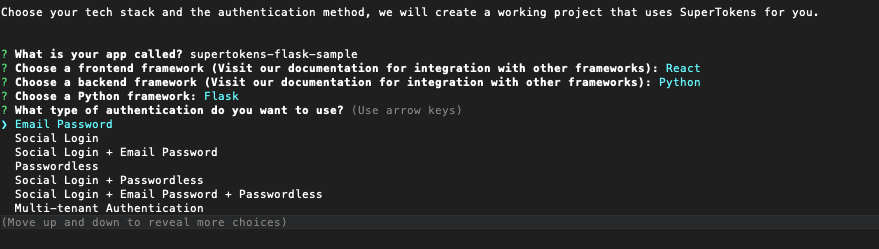
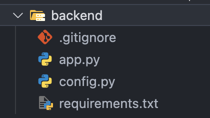

User authentication has become a fundamental part of almost every system in the world, with most websites and apps requiring users to login/logout or identify themselves in one way or another. In this article we will use SuperTokens to add user authentication to a Flask app.

SuperTokens is an open source authentication solution that lets you quickly add login mechanisms and session management to your frontend and backend systems. It supports most login mechanisms such as Email & Password, Passwordless, Social login etc. We have two options to quickly get started with SuperTokens:
- Using the SuperTokens CLI
- Manually setting up SuperTokens

## Quick start with SuperTokens CLI (Recommended)

An important thing to keep in mind is that SuperTokens requires a “core” to work correctly, the CLI uses a demo core that has been hosted to allow you to experiment with the SDKs quickly. This core should not be used in production.

### About the SuperTokens CLI

SuperTokens provides a command line tool that can be used to quickly get started. It generates a fresh project with SuperTokens already integrated and enabled. If you are starting a new project and plan to use SuperTokens, this is the best way to get authentication added to your system. As a bonus the CLI also generates a fully functioning web application using the frontend of your choice. This UI layer uses a pre-built UI provided by the frontend SDKs with auth forms and redirects for social logins already built and handled for you.

### Initialize the CLI

To get started open your Terminal/Command Prompt and run the following command:

```bash
npx create-supertokens-app@latest
```

You will be presented with the following options:



- **App name**: This is used as the folder name when generating the project.
- **Frontend Framework**: Choose a framework you intend to use for your project. Some of the options include React, Next etc
- **Backend Framework**: In this case we will select Python which allows us to present Flask when prompted.
- **Authentication Type**: This lets you choose what authentication mechanism to use in your system. This option tells the CLI what ‘recipes’ and APIs need to be added, you can change or modify this later in code. In this example we will use email password, visit the documentation to see the full list of mechanisms and learn how they work.

### Understanding the generated project

Once the CLI completes you can open the project in the IDE of your choice, for the sake of this example we will cover just the backend side of things.



The generated structure is fairly straightforward, if you need to set up a specific folder structure for your architecture it is better to do so now to avoid having to change imports later. Code snippets in this article will assume you have not changed the structure.

### Configuring SuperTokens

The `config.py` file is where you configure SuperTokens.

```py
supertokens_config = SupertokensConfig(
    connection_uri="https://try.supertokens.com")
```

The `connection_uri` property tells the SDK where the SuperTokens core is hosted, this can be a self hosted core or using the managed service SuperTokens provides. In this example we are using a demo core, this should be replaced with your own connection uri because the demo core is not suitable for production.

```py
app_info = InputAppInfo(
    app_name="Supertokens",
    api_domain="http://localhost:3001",
    website_domain="http://localhost:3000",
)
```

The `api_domain` should be the domain where your API layer will be hosted (or localhost during testing), this is used for session management. Similarly the website_domain should be where your frontend will be hosted, if you are not building a frontend right now you can leave this as is or use a dummy domain.

```py
recipe_list = [
    session.init(),
    emailpassword.init(),
    dashboard.init(),
]
```

The `recipe_list` tells the SuperTokens SDK what features and Authentication mechanisms you want to enable. In this example we are enabling session management which is the central feature for all authentication mechanisms and email password. We are also enabling the dashboard recipe, read the [documentation](https://supertokens.com/docs/emailpassword/pre-built-ui/setup/user-management-dashboard/users-listing-and-details) to understand what this is and how you can use it.

### Initialising SuperTokens

Inside the `app.py` file you will see the following code (For the sake of this article we are only covering important snippets of the full file):

```py
from supertokens_python import (
    get_all_cors_headers,
    init,
)
from flask_cors import CORS

from supertokens_python.framework.flask import Middleware
import config

init(
    supertokens_config=config.supertokens_config,
    app_info=config.app_info,
    framework=config.framework,
    recipe_list=config.recipe_list,
)

app = Flask(__name__)
Middleware(app)
CORS(
    app=app,
    supports_credentials=True,
    origins="http://localhost:3000",
    allow_headers=["Content-Type"] + get_all_cors_headers(),
)
```

The `init` function is what you use to initialize the SuperTokens SDK, here you provide the configuration options defined in the `config.py` file.

SuperTokens provides its own APIs and logic for handling authentication, the `Middleware` adds this to your system. This means that you do not need to implement your own APIs for handling authentication.

We also use the `get_all_cors_headers` function provided by SuperTokens to add all the relevant CORS headers to the `CORS` middleware. Notice that the origin must match the `website_domain` set in the `config.py` file. To learn more about CORS read [this article](https://supertokens.com/blog/what-is-cross-origin-resource-sharing).

### Run the project

You can run the project by running the following command:

```bash
cd supertokens-flask-sample
npm run start
```

Notice that we use npm here, this is because the CLI internally generates a Node project to run both the backend and the frontend. This allows you to use the frontend project to test your backend integration. If you only want to run the backend project and test it out using Postman you can run the following commands:

```bash
cd backend
pip install virtualenv
virtualenv venv
chmod +x venv/bin/activate
. venv/bin/activate
pip install -r requirements.txt
python app.py
```

And that's it, the project is set up and you can start building your actual project logic instead of spending time trying to build authentication from scratch. Here are some quick links for you:
- The [official documentation](https://supertokens.com/docs/guides) for a list of all features and authentication mechanisms
- Once you are ready to deploy your project be sure to use your own core by following the [documentation](https://supertokens.com/docs/emailpassword/pre-built-ui/setup/core/saas-setup)
- The generated project adds some custom APIs for demonstration purposes, refer to [this page](https://supertokens.com/docs/emailpassword/pre-built-ui/securing-routes) to learn how to protect your APIs 

## Manually setting up SuperTokens for your Flask backend

An important thing to keep in mind is that SuperTokens requires a “core” to work correctly, the CLI uses a demo core that has been hosted to allow you to experiment with the SDKs quickly. This core should not be used in production.

The full set of steps required to set up SuperTokens manually can be found in the [official documentation](https://supertokens.com/docs/emailpassword/pre-built-ui/setup/backend).

### Install the SuperTokens SDK

Run the following command:

```bash
pip install supertokens-python
```

### Initialise SuperTokens

To initialize the SDK, use the following code:

```py
from supertokens_python import init, InputAppInfo, SupertokensConfig
from supertokens_python.recipe import emailpassword, session

init(
    app_info=InputAppInfo(
        app_name="ST",
        api_domain="http://localhost:3001",
        website_domain="http://localhost:3000",
    ),
    supertokens_config=SupertokensConfig(
        connection_uri="https://try.supertokens.com",
    ),
    framework='flask',
    recipe_list=[
        session.init(),
        emailpassword.init()
    ]
)
```

The `init` function is what you use to initialize the SuperTokens SDK, here you provide the configuration options such as app name, api and website domains and the recipe list.

The `connection_uri` property tells the SDK where the SuperTokens core is hosted, this can be a self hosted core or using the managed service SuperTokens provides. In this example we are using a demo core, this should be replaced with your own connection uri because the demo core is not suitable for production.

The `api_domain` should be the domain where your API layer will be hosted (or `localhost` during testing), this is used for session management. Similarly the `website_domain` should be where your frontend will be hosted, if you are not building a frontend right now you can leave this as is or use a dummy domain.

The `recipe_list` tells the SuperTokens SDK what features and Authentication mechanisms you want to enable. In this example we are enabling session management which is the central feature for all authentication mechanisms and email password. We are also enabling the dashboard recipe, read the [documentation](https://supertokens.com/docs/emailpassword/pre-built-ui/setup/user-management-dashboard/users-listing-and-details) to understand what this is and how you can use it.

### Add the SuperTokens and CORS middleware

```py
from supertokens_python import get_all_cors_headers
from flask import Flask, abort
from flask_cors import CORS 
from supertokens_python.framework.flask import Middleware

app = Flask(__name__)
Middleware(app)

CORS(
    app=app,
    origins=[
        "http://localhost:3000"
    ],
    supports_credentials=True,
    allow_headers=["Content-Type"] + get_all_cors_headers(),
)

# TODO: Add your own APIs here

# This is required since if this is not there, then OPTIONS requests for
# the APIs exposed by the supertokens' Middleware will return a 404
@app.route('/', defaults={'u_path': ''})  
@app.route('/<path:u_path>')  
def catch_all(u_path: str):
    abort(404)
```

SuperTokens provides its own APIs and logic for handling authentication, the `Middleware` adds this to your system. This means that you do not need to implement your own APIs for handling authentication. You can see all the APIs that middleware adds [here](https://app.swaggerhub.com/apis/supertokens/FDI).

We also use the `get_all_cors_headers` function provided by SuperTokens to add all the relevant `CORS` headers to the CORS middleware. Notice that the origin must match the `website_domain`. To learn more about CORS read [this article](https://supertokens.com/blog/what-is-cross-origin-resource-sharing). Make sure to also install `flask_cors`.

### Testing the integration

You can now run your project to test that SuperTokens works correctly. For example you can try calling one of the APIs added by the SDK and see if they respond correctly.

Here are some quick links for you:
- The [official documentation](https://supertokens.com/docs/guides) for a list of all features and authentication mechanisms
- Once you are ready to deploy your project be sure to use your own core by following the [documentation](https://supertokens.com/docs/emailpassword/pre-built-ui/setup/core/saas-setup)
- The generated project adds some custom APIs for demonstration purposes, refer to [this page](https://supertokens.com/docs/emailpassword/pre-built-ui/securing-routes) to learn how to protect your APIs

--------------------------

SuperTokens allows you to set up and start using authentication in a very simple and quick way, allowing you to focus on building your application specific logic instead of having to spend time building auth from scratch. The SuperTokens SLI lets you get started even quicker, allowing you to create a fresh application with SuperTokens integrated in under 15 minutes and as a bonus also gives you a ready to use frontend!


