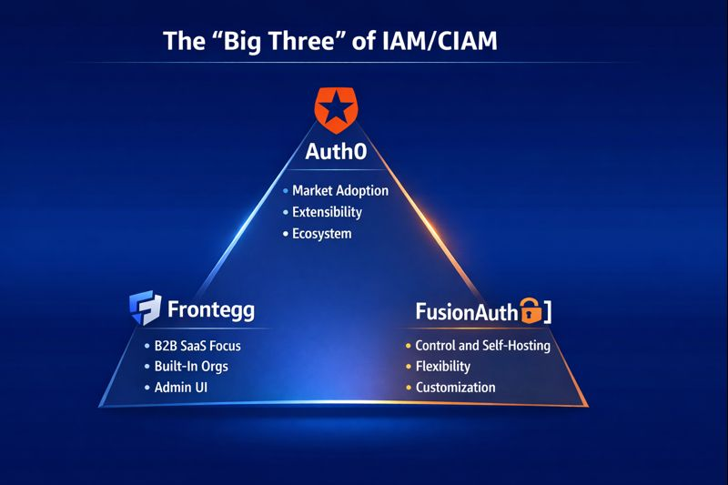
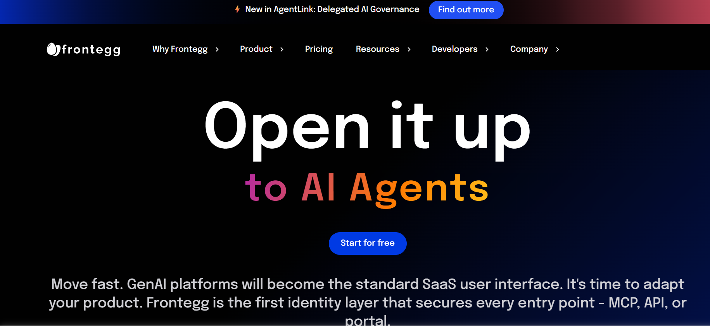
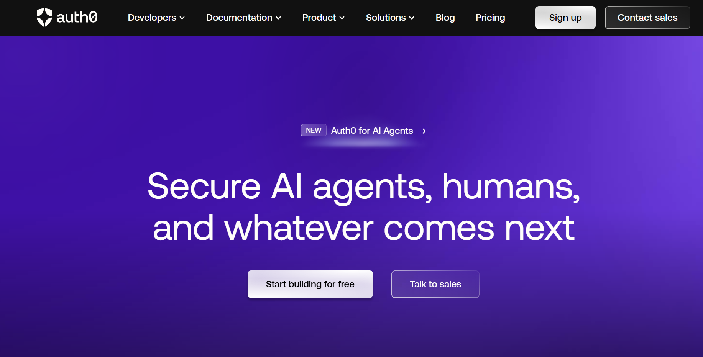
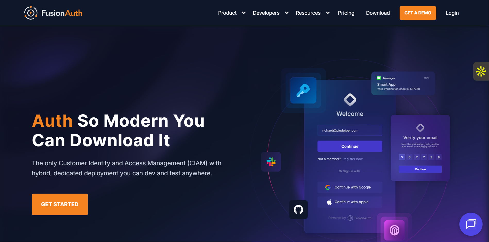

Choosing the right authentication platform can make or break your product\'s security, user experience, and development velocity. In 2025, the identity and access management landscape is crowded with solutions, but three names consistently rise to the top: Frontegg, Auth0, and FusionAuth. Each brings something different to the table, and understanding these differences is critical before you commit your authentication layer to any single vendor.

This guide breaks down what matters most when choosing between these platforms, helps you understand their strengths and limitations, and
shows you how to pick the one that actually fits your technical stack and business goals.

## **Why the \"Big Three\" Authentication Platforms Matter in 2025**

The identity and access management (IAM/CIAM) space has matured significantly in recent years. What was once a choice between building
authentication in-house or using a basic OAuth provider has evolved into a broad ecosystem offering features like social login, enterprise SSO, and multi-tenant organization management. This growth is reflected in market data: [the global IAM market has grown from around \$20.4 billion in 2024 to nearly \$23 billion in 2025](https://perimeter.blog/perimeter-weekly-report-identity-access-management-iam-market-analysis/), driven by digital transformation and security needs. Customer IAM has followed a similar trajectory, growing at an annual rate of around 13 percent, underscoring sustained demand for scalable identity solutions designed for external users.

Frontegg, Auth0, and FusionAuth lead the IAM and CIAM space because each dominates a specific use case. Auth0 holds a strong share of the SSO market, around 6.8 percent, driven by enterprise adoption and a mature ecosystem. Frontegg, with about a 1.6 percent share, is a common choice for B2B SaaS due to its built-in organization and admin features. FusionAuth appeals to teams that need full control and self-hosting. Together, they dominate by being the default options for different segments of the market.

Modern development teams commonly face these authentication challenges:

- **Vendor lock-in** is a major concern. Deep integrations make switching providers expensive and time-consuming, since APIs, SDKs, and data models vary widely and migrations can take months.
- **Customization limits** can block teams that need specific workflows or branding. Managed platforms often restrict how far authentication flows can be modified.
- **Cost creep** is another frequent issue. Pricing that seems reasonable at low scale can grow rapidly with higher MAUs, premium features, or multi-region usage.
- **Scalability and extensibility** also matter as products mature. A solution that works for an MVP may fall short when enterprise SSO, complex roles, or compliance requirements appear.

When evaluating authentication platforms, three factors matter most to modern teams:

- **Developer experience** is critical. Clear documentation, intuitive APIs, and compatible SDKs directly affect time-to-integration and delivery speed.
- **Self-hosting versus managed** represents a fundamental choice. Some teams want full control over their authentication infrastructure and data, while others prefer to offload operational overhead to a managed service.
- **Feature depth** separates basic authentication tools from full IAM platforms. Capabilities like MFA, passwordless login, admin dashboards, organization hierarchies, and audit logs are essential for B2B products, but not all providers deliver them equally well.

Understanding these trade-offs helps teams make informed decisions, rather than defaulting to the most visible or heavily marketed platform.

## **Platform 1: Frontegg**

Frontegg is a developer-centric identity platform built for B2B SaaS products. It follows a low-code, SaaS-first approach, enabling teams to quickly add authentication and user management features without building everything from scratch.

**Key strengths:**
- **Ready-made admin UI** and dashboards that reduce development and support effort. These built-in interfaces allow teams to manage users, organizations, roles, and permissions without creating custom admin panels, saving significant time and reducing ongoing support and maintenance work.
- **Built-in B2B capabilities**, including multi-tenant organizations, roles, and entitlements, are available out of the box. This makes Frontegg especially useful for SaaS products that need organization-based access control and complex user hierarchies from day one.

**Key trade-offs:**
Frontegg offers less flexibility over low-level authentication flows compared to fully open-source or self-hosted solutions. Its pricing and overall approach are more SaaS-oriented, which may feel limiting for teams seeking complete control and ownership.

**Use-case fit:**
Frontegg is well-suited for teams that want fast implementation, strong B2B user management, and minimal custom development, rather than
building and maintaining an entire identity system themselves.

## **Platform 2: Auth0**

Auth0 is a widely used, fully managed IAM/CIAM platform owned by Okta. It provides a plug-and-play authentication experience with a rich set of features, making it easy for teams to add secure login and identity management without heavy infrastructure work.

**Key strengths:**
- **Broad ecosystem** including social logins, SSO, rules/hooks, and a large number of integrations. This ecosystem allows teams to support many authentication methods out of the box and integrate easily with existing tools, third-party services, and enterprise systems without building everything from scratch.
- **Easy onboarding** with strong developer documentation and quick setup. Auth0 offers clear guides, SDKs, and examples that help teams implement authentication quickly, reducing development time and lowering the learning curve for new developers.

**Key trade-offs:**
Because Auth0 is a managed service, teams may face vendor lock-in and limited flexibility for deep customization. Costs can also increase
significantly as usage, scale, or advanced features grow.

**Use-case fit:**
Auth0 is ideal for teams that want a turn-key authentication solution, prefer minimal self-hosting, and are comfortable trading some control for speed, reliability, and ease of use.

## **Platform 3: FusionAuth**

FusionAuth is a developer-friendly identity platform that can be self-hosted or used via the cloud. It focuses on flexibility, strong customization, and transparent pricing, making it attractive to teams that want greater control over their authentication stack.

**Key strengths:**
- **Self-hosting option** gives full ownership of authentication infrastructure and user data. This allows teams to meet strict security, compliance, or data residency requirements while avoiding vendor lock-in and retaining full control over system upgrades, scaling, and security policies.
- **API-first design** with [transparent, predictable pricing](https://www.rippling.com/blog/auth0-alternatives?). FusionAuth is built with developers in mind, offering well-documented APIs that integrate cleanly with modern tech stacks. Its pricing model is clear and predictable, helping teams plan long-term costs without unexpected usage-based charges.

**Key trade-offs:**
Compared to SaaS-first platforms, [FusionAuth's admin UI](https://www.justaftermidnight247.com/insights/clerk-vs-auth0-vs-keycloak-vs-fusionauth/?) and out-of-the-box user management can feel less polished. Teams may also need to invest more engineering effort to build advanced flows and mature multi-tenant SaaS features.

**Use-case fit:**
FusionAuth fits teams building large-scale or long-term systems that prioritize control, data ownership, and self-hosting, and are willing to invest in infrastructure and engineering effort.

## **Direct Feature and Trade-Off Comparison**

The following comparison provides a clear, side-by-side view of how Frontegg, Auth0, and FusionAuth differ across key technical and business considerations. It is intended to help teams quickly understand where each platform excels and what trade-offs come with those strengths.

| Feature / Concern | Frontegg | Auth0 | FusionAuth |
|------------------|----------|-------|------------|
| **Setup speed** | Fast, low-code oriented | Very fast, fully managed | Moderate, more engineering overhead |
| **Maintenance / Ownership** | Managed with some control | Fully managed | Self-hosted; you own operations |
| **Customization / Flexibility** | High for B2B product flows | Good, but within managed constraints | Very high; full-stack customization |
| **Multi-tenant and B2B support** | Strong focus for SaaS organizations | Mature features, but cost and lock-in risk | Good support; may require additional build |
| **Cost predictability and scale** | Usage-based growth; SaaS-like | Risk of cost spikes at scale | Predictable infra cost, but operational overhead |
| **Control over data and logic** | Good, with some SaaS abstraction | Lower; vendor-managed | Excellent; full ownership |
| **Best for** | Product-led SaaS needing user management plus authentication | Rapid launch with standard authentication needs | Enterprise-grade self-hosting with custom flows |

## **How to Choose: Ask These 5 Questions**

Choosing between these platforms comes down to understanding your specific requirements and constraints. Ask yourself these five
questions:

**1. Will you self-host or prefer managed?**

If operational overhead is something you want to avoid entirely, managed solutions like Auth0 or Frontegg make sense. If you need data sovereignty, have strict compliance requirements, or want to avoid vendor dependencies, FusionAuth\'s self-hosting option becomes attractive.

**2. Do you need heavy customization of authentication logic and flows?**

Standard authentication patterns work fine with any of these platforms. But if you need to implement custom security policies, unique user verification flows, or integrate with proprietary systems, the level of customization available matters. FusionAuth offers the most flexibility here, followed by Frontegg for B2B-specific flows, with Auth0\'s customization working within their managed framework.

**3. Will your product require complex multi-tenant or B2B organization hierarchies?**

If you\'re building a B2B SaaS product where organizations have sub-organizations, complex role hierarchies, and delegation patterns, Frontegg\'s purpose-built features for this use case save substantial development time. Auth0 handles multi-tenancy but may require more custom implementation. FusionAuth provides the primitives but expects you to build more of the structure yourself.

**4. What is your team\'s capacity to maintain authentication infrastructure long-term?**

Small teams or early-stage startups often lack the DevOps resources to manage self-hosted infrastructure reliably. If that describes your situation, managed platforms reduce operational burden. Larger teams or those with existing infrastructure expertise can leverage self-hosting for better control and long-term cost management.

**5. What\'s your tolerance for pricing surprise versus operational effort?**

Per-MAU pricing can become expensive as you scale, but it\'s operationally simple. Self-hosting requires infrastructure investment and operational expertise, but provides cost predictability. Understand where your priorities lie between these two dimensions.

## **Where SuperTokens Fits In**

For teams evaluating these three platforms, there is another optionworth considering: [SuperTokens](https://supertokens.com). It provides an open-source core with an optional managed layer, placing it between the fully managed models of Auth0 and Frontegg and the self-hosted complexity of FusionAuth.

With SuperTokens, you get full control over authentication data and logic, strong extensibility, and predictable costs. Its open-source
nature avoids proprietary lock-in, and teams can choose between self-hosting or a managed service based on their needs.

SuperTokens is especially relevant if you find:

- **Frontegg's SaaS model limiting** and want more ownership over your authentication stack without losing developer experience.
- **Auth0's cost and lock-in risky**, particularly at scale. Self-hosting with SuperTokens can eliminate per-MAU pricing while retaining similar core features.
- **FusionAuth highly customizable**, but you want a faster developer experience with opinionated, ready-made flows. SuperTokens offers pre-built authentication recipes such as session management, email and password, social login, and [passwordless](https://supertokens.com/features/passwordless-login), all customizable.

The open-source model adds transparency into how authentication works, which is valuable for security-focused teams. You can audit the code, contribute improvements, and align it with your security requirements.

For teams concerned about long-term vendor dependency, SuperTokens offers a clear exit path. Because it is open-source, you can fork or run it independently without relying on a single vendor's pricing or future decisions.

To learn more, refer to the [SuperTokens self-hosting](https://supertokens.com/docs/deployment/self-host-supertokens) documentation. For deeper control over security, the [session management overview](https://supertokens.com/docs/post-authentication/session-management/introduction) explains how tokens, refresh flows, and best practices are handled.

## **Migration and Adoption Considerations**

Switching authentication platforms is not trivial, so it is important to understand migration effort before committing to a solution.

If you are switching from Auth0, plan for configuration migration, user data export and import, and re-implementation of custom rules or
actions. While Auth0 provides user export tools, mapping existing customizations to a new platform requires careful planning. Since Auth0
rules are written in JavaScript, translating this logic to another platform's extension system also takes development time.

If you are currently using Frontegg or FusionAuth and planning to scale, evaluate trade-offs between operational costs, upgrade paths, and
developer velocity. As systems grow, self-hosted solutions add operational complexity, while managed solutions tend to increase in cost. Modeling these factors over a 2--3 year growth window is critical.

Key migration checklist items include:

- **Import of credentials:** Password hashes must be migrated securely. Differences in hashing algorithms may require password resets or temporary custom verification logic.
- **SSO integration:** Enterprise SSO connections such as SAML and OIDC must be reconfigured and tested with customers.
- **Environment isolation:** Proper separation of development, testing, and production environments is essential. Always validate migrations outside production first.
- **Growth-trajectory pricing:** Estimate authentication costs at 10x, 50x, and 100x your current scale to avoid future surprises.

Teams considering a switch should also review [SuperTokens migration](https://supertokens.com/migration) guides, which outline data migration, session handling during transitions, and techniques for minimizing downtime.

## **Summary and Recommendation Matrix**

- **Fastest time-to-market with a mature, managed solution:** Auth0 makes it easy to get started quickly with strong built-in features, good documentation, and minimal maintenance. It allows teams to focus on product development instead of authentication logic, though costs can increase as the application scales and user numbers grow.
- **Maximum control with open-source and long-term ownership:** SuperTokens is a strong choice for teams that want flexibility and full control over their authentication system. Being open-source, it reduces vendor lock-in, allows deep customization, and supports long-term scalability, but it requires more engineering effort and responsibility from the team.

**Final recommendation:**
Take time to evaluate your team's development capacity, growth expectations, and compliance needs before making a decision. The right authentication platform is not just the one that works today, but the one that continues to support your product as it evolves and grows.
