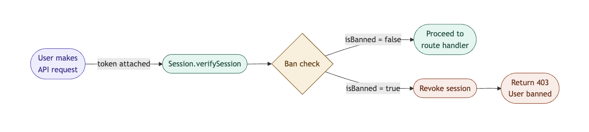
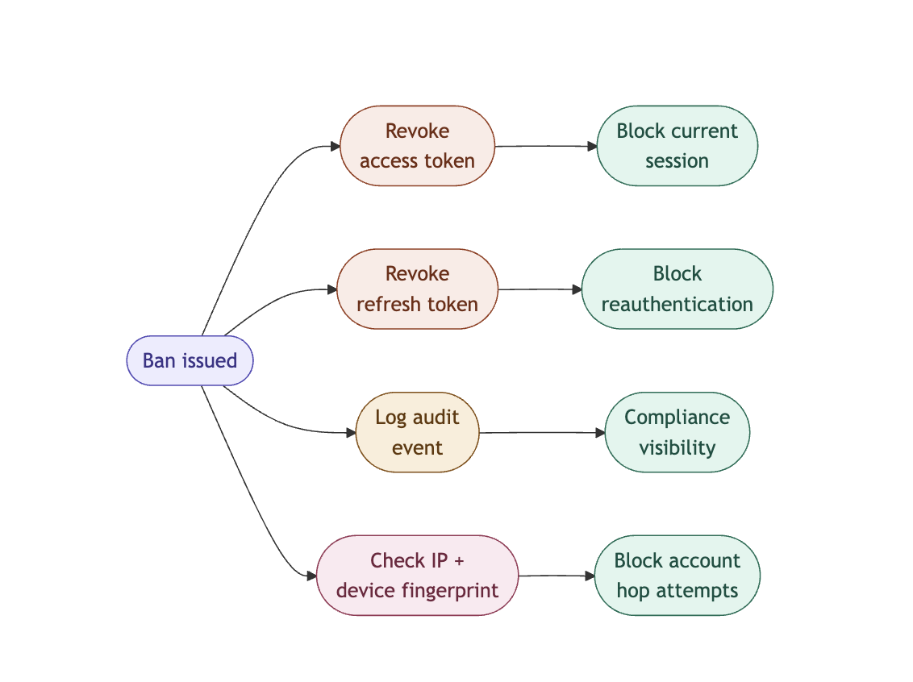

User banning is one of those features that looks simple until it breaks. A status flag in a database is not a ban; it is a note that gets ignored the moment a valid session token bypasses the check. A real banning system closes active sessions, blocks reauthentication, and enforces restrictions at the server boundary, not the UI layer.

This guide covers how to implement user banning correctly, where common approaches fall short, and how SuperTokens handles enforcement in real time across distributed environments.

## Why You Need a Real Banning System

If you are building a modern product, understanding how to ban users in web apps is not just a feature requirement; it is a core part of your security and trust model.

Banning a user is an act of policy enforcement. The scenarios that require it are varied abusive behavior in a community product, a compromised account that needs immediate lockout, a terms of service violation, or a compliance restriction tied to geography or regulation.

What all these scenarios share is urgency. When a ban is issued, it needs to take effect immediately, not at the next token refresh cycle or the next time the user logs in. The risk of weak banning logic is concrete: a user marked as banned in the database can continue making API calls, submitting forms, or running background jobs as long as a valid session token exists. The flag means nothing if the session verification layer never reads it.

A production-grade banning system must do three things: mark the user as banned, revoke all active sessions, and prevent future authentication until the ban is lifted.

## Common Approaches to User Banning (and Their Pitfalls)

User banning is often treated as a simple toggle, but in practice, it's a distributed systems problem involving sessions, tokens, and enforcement consistency. Without careful design, seemingly "banned" users can continue accessing systems through gaps in session handling and token lifecycle management.

### **Database Flag Only**

The simplest approach is adding a `banned` boolean to the user record and checking it on login. This works for blocking new logins but does nothing about sessions already in flight. A user banned at 2:00 PM with a session token valid until 4:00 PM can continue acting freely for two more hours. Background jobs or API clients using stored tokens face the same gap.

### **Manual Session Revocation**

A step up from the flag-only approach is explicitly deleting session tokens or calling logout endpoints when a ban is issued. The problem is coverage. A user signed in across three devices, a mobile app, and an API client, requiring five separate revocation calls. Miss one and the ban is partial. In microservice architectures where session state may be distributed, the surface area for incomplete revocation grows quickly.

### **Library-Based Solutions (BetterAuth, Passport.js)**

Libraries like Passport.js and BetterAuth provide authentication primitives but leave ban enforcement to the developer. Middleware must be written and applied consistently across every protected route. Edge cases, concurrent sessions, refresh token reuse, and token leakage require explicit handling that is easy to skip during initial implementation and easy to forget during later refactors.

## How SuperTokens Handles User Banning


[SuperTokens](https://supertokens.com/) provides built-in hooks that enforce ban checks during session verification, which happens on every authenticated request. Rather than relying on the application to remember to check a flag, the verification layer itself becomes the enforcement point. Sessions can be revoked in real time mid-request, mid-session, and the behavior applies uniformly whether requests arrive at a monolith, an API gateway, or an individual microservice.



Full implementation details are available in the [User Banning Docs.](https://supertokens.com/docs/post-authentication/user-management/user-banning)

### **Step-By-Step Implementation**

**1. Add a banned flag to the user model**

```sql
ALTER TABLE users ADD COLUMN is_banned BOOLEAN DEFAULT FALSE;
```

**2. Apply session verification middleware**

SuperTokens' `Session.verifySession()` runs on every request to a protected route. This is where the ban check is inserted, not in a login handler, not in a UI guard, but in the layer that every authenticated request passes through.

**3. Check ban status and revoke if flagged**

```javascript
app.use(async (req, res, next) => {
  let session = await Session.verifySession()(req, res);

  const user = await getUserById(session.getUserId());

  if (user.isBanned) {
    await session.revokeSession();
    return res.status(403).json({ message: "User banned." });
  }

  next();
});
```

When `isBanned` is true, the session is revoked server-side before the response is returned. The client receives a 403, and the token is invalidated. Any subsequent request with the same token fails at verification.

**4. (Optional) Hook into ban events for logging**

Emit a structured log event or trigger an admin notification when a ban is enforced. This creates an audit trail and surfaces unexpected ban activity, for example, a legitimate user being banned by a misconfigured automated rule.

```javascript
if (user.isBanned) {
  await session.revokeSession();

  await logBanEvent({ userId: user.id, timestamp: Date.now() });

  return res.status(403).json({ message: "User banned." });
}
```

## Advanced: Temporary Bans and Tiered Restrictions

Not every policy violation warrants a permanent ban. SuperTokens supports session claims, which allow dynamic enforcement rules to be embedded directly into the session payload.

A `bannedUntil` timestamp claim enables time-limited suspensions. The verification middleware reads the claim, compares it against the current time, and either allows the request or returns a 403, no database lookup required on every request.

```javascript
const bannedUntil =
  session.getSessionDataFromDatabase()?.bannedUntil;

if (bannedUntil && Date.now() < bannedUntil) {
  return res.status(403).json({ message: "Account suspended." });
}
```

Feature-level restrictions are another pattern worth considering for community, gaming, or B2B applications. Instead of revoking full access, a claim like `canPost: false` or `canComment: false` restricts specific capabilities while leaving the account active. This is appropriate for graduated enforcement, a warning state before a full suspension.

## Security Considerations

Several implementation details determine whether a banning system is genuinely enforceable or merely cosmetic.



Ban status must be checked server-side on every request. A client-side check hiding a button, disabling a form, is a UX convenience, not an access control. Any client-side restriction can be bypassed with a direct API call.

Refresh tokens require explicit revocation. Revoking the access token without revoking the refresh token allows a banned user to silently obtain a new access token. SuperTokens' `revokeSession()` handles both, but custom implementations must address this explicitly.

For abuse scenarios, banning by user ID alone is often insufficient. A determined bad actor creates a new account. Combining user ID banning with IP address or device fingerprint restrictions raises the cost of evasion. These layers belong in the ban enforcement logic, not a separate system.

Every ban action should produce an audit record: who was banned, when, by whom, and under what policy. This is a compliance requirement in regulated environments and a debugging tool everywhere else.

## Combining Banning with RBAC and Session Security

Banning integrates naturally with role-based access control. Assigning a `restricted` role to a banned user means existing RBAC middleware can enforce reduced permissions without requiring separate ban-specific checks on every route. A banned user's role change cascades through the permission layer automatically.

Pair banning with session rotation and token theft detection for a zero-trust access model. A session that rotates tokens on each request limits the window of exposure if a token is leaked. Token theft detection flags anomalous reuse patterns as a signal that a session may be compromised and a candidate for preemptive revocation.

Further reading: [Session Management Overview](https://supertokens.com/docs/post-authentication/session-management/introduction) and [User Roles and Permissions.](https://supertokens.com/docs/additional-verification/user-roles/role-management-actions)

## Common Mistakes to Avoid

The most frequent implementation errors are not obscure edge cases; they are straightforward omissions that appear under time pressure:

- **Not invalidating sessions after setting the ban flag.** The flag is inert until the session layer reads it. Revocation must happen at the time of the ban, not lazily on next login.
- **Relying on front-end checks.** Any restriction enforced only in the UI is not a security control.
- **Ignoring refresh tokens.** Revoking an access token without revoking the associated refresh token leaves a reauthentication path open.
- **No audit logging.** A ban with no record is unverifiable, undebuggable, and non-compliant in regulated contexts.

## Summary

User banning is access control combined with session lifecycle enforcement. The database flag is necessary but not sufficient; it must be paired with immediate session revocation and a server-side check on every subsequent request.

SuperTokens simplifies this by placing enforcement at the session verification layer, which every authenticated request already passes through. Temporary bans, tiered restrictions, and audit hooks are incremental additions to the same foundation.

For the complete implementation reference, see the official [How to Ban Users in SuperTokens](https://supertokens.com/docs/post-authentication/user-management/user-banning) guide. For patterns around token management and multi-device session handling, the [Migration Guide](https://supertokens.com/docs/migration/account-migration) covers the broader architecture.
