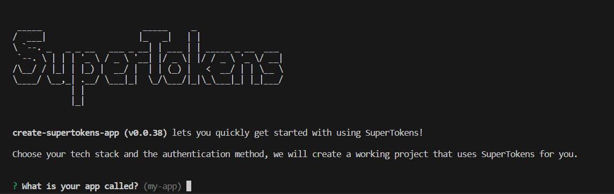
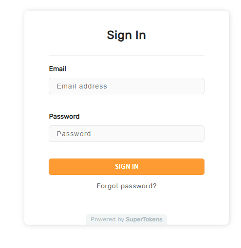

## Introduction
Whether aiming to boost referrals, drive exclusivity, or simply enhance user engagement, a well-crafted invite flow can make all the difference. In this blog post, we will delve into the steps of how you can secure your React app with Email-password authentication with SuperTokens, customized to have an invite-only flow.


## Setup
Our demo app will use a React frontend with a NodeJS backend, but the instructions should translate to other frameworks and languages. You can find the list of [SuperTokens-supported frameworks and languages here](https://supertokens.com/docs/community/sdks).

We can start a new project configured with SuperTokens using their CLI with the following command:

`npx create-supertokens-app@latest`

You should see the following output:




Follow the prompts on-screen and set up an app with a React frontend, and NodeJs backend configured with email-password based authentication.

We can now start customizing the authentication flows to enable invite-only authentication

## Step 1: Disable Sign Ups
If you were to run the example application now, you will be greeted with the authentication page. This page allows you to sign users up. We will need to disable the sign-up UI on the frontend and disable the sign up API on the backend.


### Disable the sign up UI in SuperTokens Frontend config

We can customize the frontend UI and use CSS to to hide the sign up button.

```tsx
import SuperTokens from "supertokens-auth-react";
import EmailPassword from "supertokens-auth-react/recipe/emailpassword";

SuperTokens.init({
    appInfo: {
        apiDomain: "...",
        appName: "...",
        websiteDomain: "..."
    },
    recipeList: [
        EmailPassword.init({
            signInAndUpFeature: {
                signInForm: {
                    style: `
                        [data-supertokens~=headerSubtitle] {
                            display: none;
                        }
                    `,
                }
            },
        }),
    ]
});
```

This should hide the button which allows you to switch to the sign up screen.



### Disable the sign up API in SuperTokens Backend config

We override the SuperTokens backend config to disable the public facing sign up API:

```ts
import SuperTokens from "supertokens-node";
import EmailPassword from "supertokens-node/recipe/emailpassword";

SuperTokens.init({
    appInfo: {
        apiDomain: "...",
        appName: "...",
        websiteDomain: "..."
    },
    supertokens: {
        connectionURI: "...",
    },
    recipeList: [
        EmailPassword.init({
            override: {
                apis: (originalImplementation) => {
                    return {
                        ...originalImplementation,
                        signUpPOST: undefined,
                    }
                }
            }
        })
    ]
});
```

## Step 2: Creating the invite-only flow

### Create a protected API that will create users and send invite links
To create users and send them an invite links we will need to create an API on the backend which will:

- Call the `signUp` function from the SuperTokens backend SDK using the user's email and a fake password. This fake password should be unguessable and should be shared across all invited users.
- Generate a password reset link and send that as an invite link to the user's email.
- Once the user clicks the link, they will be shown a page asking them to input their password after which, they can login.
- Finally we add an access control check to make sure that only users with the `admin` role can add additional users.

```ts

import express from "express";
import { verifySession } from "supertokens-node/recipe/session/framework/express";
import { SessionRequest } from "supertokens-node/framework/express";
import UserRoles from "supertokens-node/recipe/userroles";
import EmailPassword from "supertokens-node/recipe/emailpassword";

const FAKE_PASSWORD = "asokdA87fnf30efjoiOI**cwjkn";

let app = express();

app.post("/create-user", verifySession({
    overrideGlobalClaimValidators: async function (globalClaimValidators) {
        return [...globalClaimValidators,
        UserRoles.UserRoleClaim.validators.includes("admin")]
    }
}), async (req: SessionRequest, res) => {
    let email = req.body.email;

    let signUpResult = await EmailPassword.signUp("public", email, FAKE_PASSWORD);
    if (signUpResult.status === "EMAIL_ALREADY_EXISTS_ERROR") {
        res.status(400).send("User already exists");
        return;
    }

    // we successfully created the user. Now we should send them their invite link
    await EmailPassword.sendResetPasswordEmail("public", signUpResult.user.id);

    res.send("Success");
});
```

>Note:
> - The code above uses the default password reset path for the invite link (`/auth/reset-password`). You can create custom UI hosted on another path and use the password reset functions provided by the SuperTOkens frontend SDK to call the password reset token consumption API from the frontend.
> - Additionally the `sendResetPasswordEmail` function uses the default password reset email(or the one customized using the emailDelivery config). If you would like to create the reset password link and send it yourself, you can use the `createResetPasswordLink` function to generate the password reset string.

### Ensure that invited users have reset their passwords

To ensure that users who have reset their passwords, we need to make the following changes:

- Prevent users from signing in with the `FAKE_PASSWORD`.
- Prevent users from resetting their password by setting their new password as the `FAKE_PASSWORD`.
- Prevent users from updating their password and setting it to the `FAKE_PASSWORD`. 


```ts
import SuperTokens from "supertokens-node";
import EmailPassword from "supertokens-node/recipe/emailpassword";

const FAKE_PASSWORD = "asokdA87fnf30efjoiOI**cwjkn"

SuperTokens.init({
    appInfo: {
        apiDomain: "...",
        appName: "...",
        websiteDomain: "..."
    },
    supertokens: {
        connectionURI: "...",
    },
    recipeList: [
        EmailPassword.init({
            override: {
                apis: (originalImplementation) => {
                    // ... override from previous code snippets...
                    return originalImplementation
                },
                functions: (originalImplementation) => {
                    return {
                        ...originalImplementation,
                        updateEmailOrPassword: async function (input) {
                            // This can be called on the backend
                            // in your own APIs
                            if (input.password === FAKE_PASSWORD) {
                                throw new Error("Use a different password")
                            }

                            return originalImplementation.updateEmailOrPassword(input);
                        },
                        resetPasswordUsingToken: async function (input) {
                            // This is called during the password reset flow
                            // when the user enters their new password
                            if (input.newPassword === FAKE_PASSWORD) {
                                return {
                                    status: "RESET_PASSWORD_INVALID_TOKEN_ERROR"
                                }
                            }
                            return originalImplementation.resetPasswordUsingToken(input);
                        },
                        signIn: async function (input) {
                            // This is called in the email password sign in API
                            if (input.password === FAKE_PASSWORD) {
                                return {
                                    status: "WRONG_CREDENTIALS_ERROR"
                                }
                            }
                            return originalImplementation.signIn(input);
                        },
                    }
                }
            }
        })
    ]
});
```

And that's it! Your app now only allows invited users to log in. Once a user is invited they will be sent an email asking to reset their password post which they are able to sign in.

## Conclusion
Although there a few customizations that needed to be made, setting up an invite only flow with SuperTokens is pretty straight forward. You can find the related [documentation for the invite flow here](https://supertokens.com/docs/emailpassword/common-customizations/disable-sign-up/emailpassword-changes) if you need the code for other languages/frameworks.