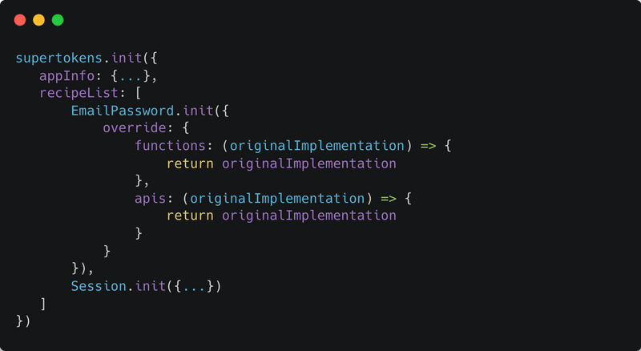
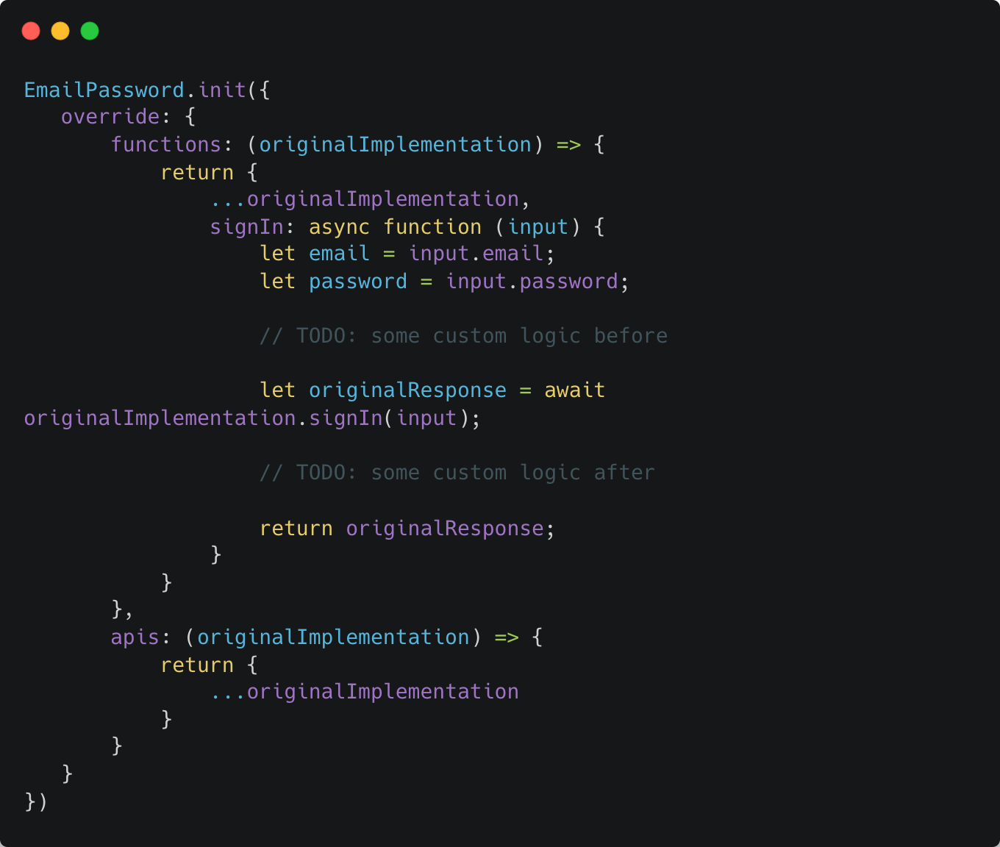

Auth requirements are quite varied. Therefore any auth solution must provide the ability to customise their APIs. Each solution uses its own terminology for this feature:

- Keycloak uses “Implementing a SPI”
- Auth0 calls these “Auth0 actions”
- Firebase calls these “Extend using cloud functions”
- AWS Cognito uses the term “Lambda triggers & Custom challenge”
- SuperTokens calls this feature “Overrides”

These features allow you to change the default behaviour of the auth APIs by:

- Creating an HTTP webhook in your API layer which is then called by the auth provider
- Uploading code to the auth provider (for example JS code for Auth0, or Java interface 
- implementation for Keycloak) which run at specific points in the API’s logic.
- Uploading code to the auth provider which can replace the existing API’s logic entirely (as opposed to just running at specific points in the API)

How powerful these solutions are, depends on:

- The auth provider providing the right “hook points” in their API, where your custom code can run.
- Your familiarity with the programming language you need to use to write the custom code.
- How easily your custom code can integrate with your existing infrastructure code (for example database connection setup), and how easily it can be maintained (for example, you may need to maintain the custom code snippets in your git repo as well as on the auth provider’s dashboard). 

In this article, we will be talking about how to customise the auth APIs provided by SuperTokens using its “Override” feature. In order to understand that, we must first understand how SuperTokens fits within an app.

## SuperTokens’ architecture

Here we can see the architecture diagram for the self-hosted version of SuperTokens. On the left, we have the client (browser, mobile app) which talks to your APIs. Your API layer has your application APIs (shown as /api1/, /api2/, ..) and also APIs automatically exposed by the SuperTokens backend SDKs via our middleware function (shown as /auth/signin, /auth/signout, ...). 

The SuperTokens APIs talk to the SuperTokens Core (HTTP microservice) to persist data in the database. Your application APIs can also talk to the core if needed.

Keeping this in mind, the concept of override is that you can change the behaviour of the SuperTokens APIs (exposed to the frontend) as per your requirements (all within your API layer, in the language you already use). Think of this being similar to overrides in object-oriented programming where you have an original implementation, and you can modify its behaviour by overriding the existing functions. You can even call the “super” class implementation of that function in your override function.

## Overriding feature in superTokens

<blockquote>
Whilst this article is focused on a NodeJS backend, the concepts here are very similar to all the other backend SDKs provided by SuperTokens.
</blockquote>

To override the default implementation, we must use the override config value when calling *supertokens.init.* Each recipe inside the *recipeList*, accepts an override config that can be used to change the behaviour of that recipe:

In the above, we have defined the skeleton code for how to override the behaviour of the EmailPassword recipe. A very similar skeleton is applicable for overriding the Session (or any other) recipe.

There are two types of override:

- APIs: These govern how the APIs exposed by that recipe behave. For EmailPassword, these are the sign in / sign up, reset password and email verification APIs. By overriding these, you can change how these APIs behave when they are called from the frontend.
- Functions: These are the functions that govern how the recipe itself behaves. They can be called by you manually in your APIs and they are also used in the APIs we expose to the frontend. By default, they query the SuperTokens core and return its response.
- The difference between the two are:
  - API functions have access to the request and response objects depending on the web framework being used
  - API functions can call several recipe functions or even call functions from multiple recipes. For example, the *signInPOST* API function in the EmailPassword recipe, calls the *signIn* recipe function from EmailPassword recipe and the *createNewSession* function from the Session recipe.

You always want to try and use the *override.functions* config since that will make the minimum change to the default behaviour. If the inputs to those functions don’t suffice for your use case, then you should override the APIs.

In both these types of overrides, they accept the *originalImplementation* variable as an input and the return is an object that has the same type as the *originalImplementaion*. 

For EmailPassword recipe, the *originalImplementation* object contains:

- For function override (see full type def [here](https://supertokens.com/docs/nodejs/modules/recipe_emailpassword.html#RecipeInterface)):
  - *signIn*
  - *signUp*
  - *updateEmailOrPassword*
  - *createResetPasswordToken*
  - *resetPasswordUsingToken*
  - *getUserByEmail*
  - *getUserById*

- For API override (see full type def [here](https://supertokens.com/docs/nodejs/modules/recipe_emailpassword.html#APIInterface))
  - *signInPOST*
  - *signUpPOST*
  - *emailExistsGET*
  - *generatePasswordResetTokenPOST*
  - *passwordResetPOST*

  For Session recipe, the *originalImplementation* object contains:

- For function override (See full type def here)
  - *createNewSession*
  - *getAccessTokenLifeTimeMS*
  - *getAllSessionHandlesForUser*
  - *getRefreshTokenLifeTimeMS*
  - *getSession*
  - *getSessionInformation*
  - *refreshSession*
  - *revokeAllSessionsForUser*
  - *revokeMultipleSessions*
  - *revokeSession*
  - *updateAccessTokenPayload*
  - *updateSessionData*

- For API override (see full type def [here](https://supertokens.com/docs/nodejs/modules/recipe_session.html#APIInterface))
  - *refreshPOST*
  - *signOutPOST*

In the code snippet above, we are not modifying the default behaviour of any of these functions since we are simply returning the *originalImplementation* object. If you want to modify the *signIn* function, then we can do so like this:

In the above code snippet, we have provided a custom signIn function that uses the original implementation’s signIn function. As marked above (in TODO comments), we can write custom logic before or after calling the original implementation.

If we wish, we can even avoid calling the original implementation entirely and define our own logic. For example, if we wanted to use a different password hashing algorithm that is not supported by SuperTokens.

