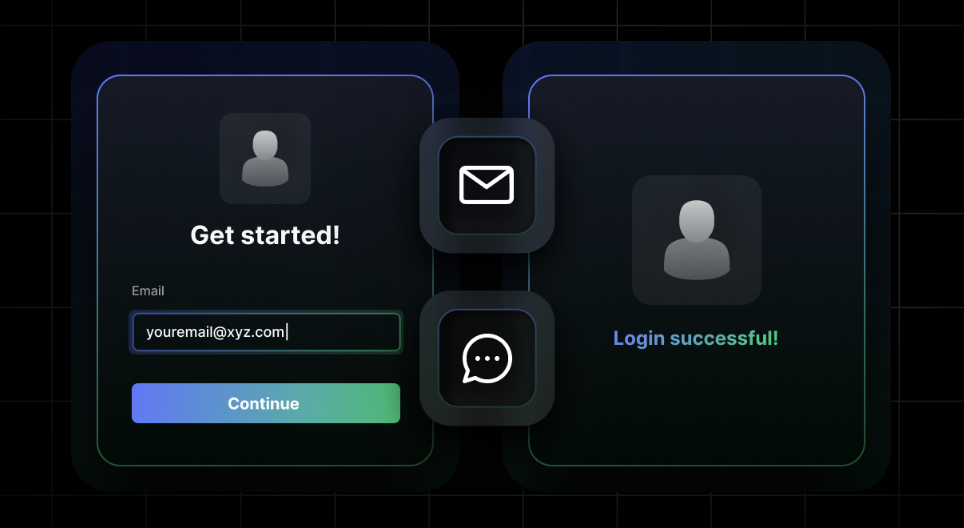
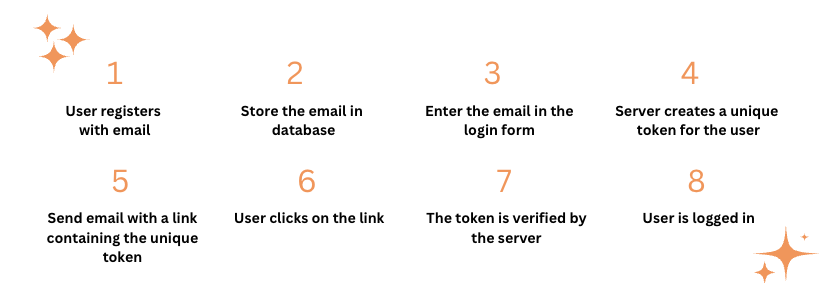
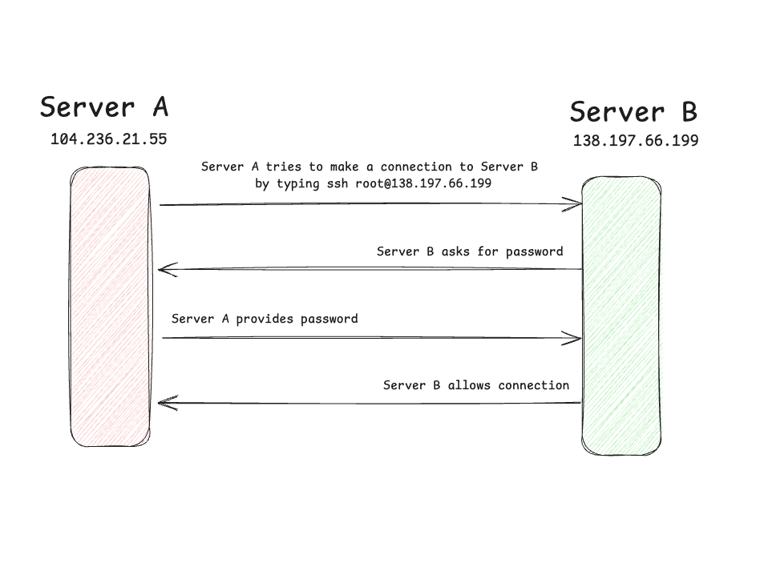
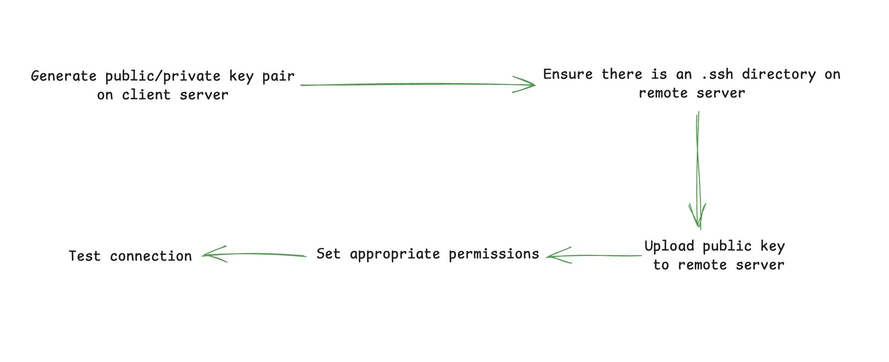
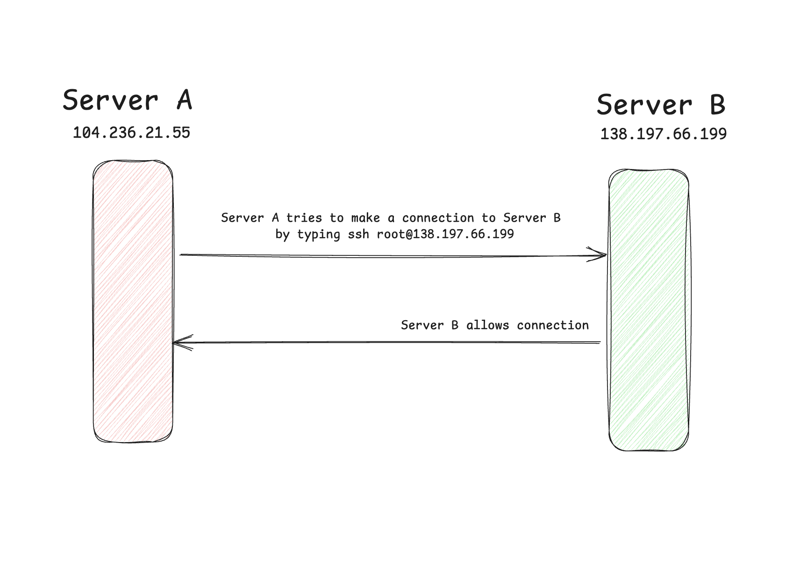

I am a firm believer that New Year's should not be the only time we set resolutions for the upcoming year. Every day we wake up is another opportunity to make improvements by setting up new goals. 🤗 🌅

If you are here because your new goal is to go passwordless, but are unsure how to get started, no worries &mdash; this guide has you covered. 

From **logging into accounts**, to **securing infrastructure with SSH**, to **simplifying access across devices** &mdash; we'll show you how to make passwords a thing of the past 🔐✨

Let's dive in! 🚀 



```toc
tight: true
toHeading: 3
```

## 🔐 Why Passwords Just Don't Cut It Anymore
Let's face it &mdash; most of us aren't great at creating strong passwords. We reuse them, forget them, and often go for easy-to-remember ones like *123456* or our pet's name 🐱. And while your beloved pet is the family favorite, their name is just not that secure &mdash; *unless their name is a combination of at least 12 random letters, numbers, and special characters* 🤓.

Even with tools like password managers, the struggle is real &mdash; both for users and developers dealing with constant resets, breaches, and support headaches.

The good news? There's a better way: **passwordless authentication**, which conveniently is the topic of our next section. 😉

## 🧠 Understanding Passwordless Authentication
This section explains what passwordless authentication is, along with its pros and cons, so you can make an informed choice.

### What *is* Passwordless Authentication 🤔
It's pretty simple really, nothing fancy. **Passwordless authentication** is any process that allows users to log in **without using a password** (e.g., biometrics, magic links, OTPs, hardware tokens, or PKIs). 

### Why Passwordless Login Is a Game-Changer (And How It Helps You)
Passwordless authentication

* **Improved security** &mdash; Passwordless authentication eliminates the risk of weak or reused passwords, making it much harder for attackers to gain unauthorized access. By relying on cryptographic keys or biometrics, it significantly reduces common vulnerabilities.
* **Reduced phishing risks** &mdash; Since there’s no password to steal, phishing attacks become far less effective. Even if an attacker tries to trick you into revealing login details, there’s simply nothing for them to capture.
* **Enhanced user convenience** &mdash; As a user, this is hands down my favorite perk. Every time I come across an exciting new app and realize I don’t have to set up yet another password, it feels like a little birthday present. 🎁
* **Reduced IT costs** &mdash; Passwords are expensive because users forget them and businesses need to store and maintain password databases. According to a [**survey conducted by NordPass**](https://nordpass.com/blog/how-many-passwords-does-average-person-have/), the average person has more than 160 passwords. Just for fun, I checked my own password manager to see how many I have &mdash; I have 442 passwords 🤯. I have no idea how that happened.
* **Scalability** &mdash;

### Drawbacks of Passwordless Login and How to Overcome Them
Life is all about balance &mdash; and passwordless login is no exception. While ditching passwords sounds like a dream, it’s not all sunshine and seamless logins. Before making the switch, it’s worth knowing the potential pitfalls so you can keep your authentication as secure as possible. 🔒✨

* **Implementation costs** &mdash; 
* **Training and expertise needed** &mdash; 
* **Single point of failure** &mdash; 

## 🛠️ Common Passwordless Authentication Methods 
Let's go more in-depth of some of the most common passworldess authentication methods you have available as your options.
Each example also contains use cases, as well as benefits and drawbacks to help you make an informed decision. 

### Biometric Authentication 🧬
Utilizing fingerprints, facial recognition, or retinal scans for user verification

**The typical flow of a face recognition authentication is as follows:**
1. A user registers for an app using an email address
2. The email address is stored in a database
3. To log in, the user opens the app and selects the option to use face recognition
4. The device prompts the user to scan their face using the system’s biometric API (e.g., Apple Face ID, Android BiometricPrompt)
5. The device verifies the face scan locally — the actual face data never leaves the device and is stored securely by the operating system
6. If the scan matches the stored biometric profile, the device unlocks a secure credential (like a private key or token stored in a secure enclave)
7. That credential is sent to your server, which verifies it (e.g., through a signed challenge, token, or session initiation)
8. User is logged in 🥳 and you can store their login in a cookie 🍪 or session

### One-Time Passcodes (OTP) 🔢
Codes sent via SMS or email for single-use authentication

**The typical flow of OTP authentication is as follows:**
1. A user registers for an app using an email address
2. The email address is stored in a database
3. To log in, a user enters the same email in the login form
4. The server sees the email, finds it in the database, and generates a one-time passcode (usually a random short numeric or alphanumeric code)
5. The server sends the user an email (or SMS) containing the OTP
6. The user receives the code and enters it into the app 
7. The server verifies the code by checking if it matches the one generated and if it's still valid (e.g., not expired or already used)
8. User is logged in 🥳 and you can now store their login in a cookie 🍪 or a session.  

### Magic Links: What They Are and How To Implement Them 🧙‍♀️
Magic links are unique one-time-use links sent to an email that grants users access when clicked. 

**The typical flow of a magic link authentication is as follows:**
1. A user registers for an app using an email address
2. The email address is stored in a database
3. To log in, a user enters the same email in the login form. 
4. Server sees the email, finds that email in the db, and create a unique token (e.g., JWT) for that user to identify them uniquely. Theoretically any token can be used as long as it links that user to the unique identifier. 
5. The server sends the user an email with a link and that link already contains the unique token created for that user. 
6. When they click on the link, it will inform the server about the token to make sure the token is still correct. 
7. The token is then verified by the server
8. User is logged in 🥳 and you can store their login in a cookie 🍪 or session. 

Essentially you can think of the token like a temporary password that verifies the user is who they say they are and that they have access to that email address. The reason why this is secure is because the user has to be able to login to their email client. Depending on how their email client is set up they may have to enter their password to open the email with the magic link or use any form of authentication their email client has set up for them. 

[TODO: HAVE NEVIL CREATE A SIMILAR GRAPHIC]


**`server.js` file:**
```javascript 
const dotenv = require("dotenv")
dotenv.config()

const express = require("express")
const jwt = require("jsonwebtoken")

const { sendMagicLinkEmail } = require("./mailer")

const app = express()
app.use(express.urlencoded({ extended: true }))

const USERS = [
    {
        id: 1,
        email: "johndoe@example.com"
    },
]

app.post("/login", async (req, res) => {
    const user - USERS.find(u => u.email === req.body.email)

    if (user != null) {
        try {
            const token = jwt.sign({ userid: user.id}, process.env.JWT_SECRET, {
                expiresIn: "1h",
            })
            await sendMagicLinkEmail({ email: user.email, token })
        } catch (e) {
            return res.send("Error logging in. Please try again.")
        }
    }
})

app.get("/verify", (req, res) => {
    const token = req.query.token
    if (token == null) return res.sendStatus(401)

    try {
        const decodedToken = jwt.verify(token, process.env.JWT_SECRET)
        const user = USERS.find(u => u.id === decodedToken.userId)
        res.send(`Authenticated as ${user.name}`)
    } catch (e) {
        res.sendStatus(401)
    }
})
```
**`login.html` file:**
```html
<!DOCTYPE html>
<html lang="en">
    <head>
        <meta charset="UTF-8" />
        <meta http-equiv="X-UA-Compatible" content="IE=edge" />
        <meta name="viewport" content="width=device-width, initial-scale=1.0" />
        <title>Magic Link Authentication 🪄</title>
    </head>
    <body>
        <form method="POST" action="http://localhost:3000/login">
            <label for="email">Email</label>
            <br />
            <input type="email" name="email" id="email" />
            <br />
            <button type"submit"> Login </button>
        </form>
    </body>
</html>
```

### Hardware Tokens 🔑
Physical devices generating time-based codes for authentication (like YubiKey or other FIDO2-compliant devices).

**The typical flow of a hardware token authentication is as follows:**
1. A user registers for an app using an email address
2. The email address is stored in a database
3. The user registers their hardware token (e.g., a YubiKey) during setup — the device generates a public/private key pair and sends the public key to your server, which stores it
4. To log in, the user enters their email and is prompted to use their hardware token
5. The server sends a challenge to the client (browser or app)
6. The user interacts with the hardware token (e.g., tapping the YubiKey), which signs the challenge using the private key securely stored on the device
7. The signed challenge is sent back to your server, which verifies it using the stored public key
8. User is logged in 🥳 and you can store their login in a cookie 🍪 or session

### Public Key Infrastructure (PKI) 🔐
Leveraging cryptographic key pairs for secure authentication 

**The typical flow of a PKI-based authentication is as follows:**
1. A user registers for an app using an email address
2. The email address is stored in a database
3. The user is issued a digital certificate (X.509) by a trusted Certificate Authority (CA), which includes their public key and identity info
4. To log in, the user presents their certificate to the server (e.g., via mutual TLS or a secure login form)
5. The server validates the certificate — checking that it's signed by a trusted CA, not expired or revoked, and that it matches the user's identity
6. The server sends a challenge (random message) for the user to sign with their private key
7. The user’s device signs the challenge using the private key stored securely (e.g., in a smart card, TPM, or software key store)
8. The server verifies the signature using the public key in the certificate — if it’s valid, the user is authenticated 🥳 and you can store their login in a cookie or session

## 🖥️ Implementing SSH Passwordless Login 

**SSH (Secure Shell)** is a network protocol that allows users to securely access a computer over an unsecured network.

Here is how connecting to a remote server works using a password: 


How are the public and private keys in SSH related? 

A step-by-step guide to setting up SSH passwordless login using public-private key pairs. 



1. **Generate SSH Key Pair:** Create a public and private key pair on the client machine. 
2. **Create SSH Directory on Server:** Ensure the `.ssh` directory exists on the remote server 
3. **Upload Public Key to Server:** Add the public key to the server's `~/.ssh/authorized_keys` file
4. **Set Appropriate Permissions:** Adjust file permissions to secure the `.ssh` directory and `authorized_keys` file.
5. **Test the Connection:** Verify that the SSH connection no longer requires a password. 

### Steps to Set Up SSH Passwordless Login
1. 🔑 **Generate an Ed25519 SSH key pair (if you don't already have one):**<br />
    On your local machine, run: 
    ```bash
    ssh-keygen -t ed25519 -C "your_email@example.com"
    ```
    Press **Enter** to accept the default file location (`~/.ssh/id_ed25519`) and leave the passphrase empty for passwordless login.
2. 📋 **Copy your public key to the remote server:**
    Use `ssh-copy-id` to install your public key on the remote server:
    ```bash
    ssh-copy-id user@remote-server
    ```
    You'll be prompted for your password one last time. After this, the key gets added to the server’s `~/.ssh/authorized_keys`.
3. 🔒 **Set correct permissions (if needed):**
    Make sure these permissions are set properly on the **remote server**:
    ```bash
    chmod 700 ~/.ssh
    chmod 600 ~/.shh.authorized_keys
    ```
4. 🧪 **Test passwordless login:**
    From your local machine, try: 
    ```bash
    ssh user@remote-server
    ```
    You should get in without being prompted for a password.
5. 🔧 **(Optional) Configure SSH config for convenience:**
    In `~/.ssh/config` on your local machine, you can add: 
    ```ini
    Host my-server
        HostName remote-server
        User your-username
        IdentityFile ~/.ssh/id_ed25519
    ```
    Now you can connect just by typing `ssh my-server` without needing to type the full host details.



## 🔐 Exploring SuperTokens for Passwordless Authentication
SuperTokens is an open-source authentication solution offering passwordless capabilities. 

### Integration Steps
Outlining how to implement SuperTokens' passwordless features in web applications. 

### Advantages
highlighing benefits such as customization, scalability, and enhanced security

## 🧑‍🔧 Best Practices for Adopting Passwordless Authentication 
1. **User Education** &mdash; Inform users about the new authentication method and its benefits. 
2. **Fallback mechanism** &mdash; Provide alternative authentication methods in case of issues. 
3. **Regular Audits** &mdash; Conduct periodic security assessments of the authentication system. 
4. **Compliance** &mdash; Ensure adherence to relevant regulations and standards. 

## 🛡️ Challenges and Considerations in Going Passwordless
Implementation Costs: Discuss potential expenses associated with transitioning to passwordless systems.​
User Adaptation: Address the learning curve and user acceptance challenges.​
Recovery Options: Explore strategies for account recovery without traditional passwords.​

## 🔮 Future Trends in Passwordless Authen
Emerging Technologies: Examine advancements like passkeys and their impact on authentication.​ AP News, 1Google for Developers
Industry Adoption: Discuss how major companies are implementing passwordless solutions.​

## 💡 Final Thoughts 
Congratulations on your interest in going passwordless and furthering your way to a more secure future. 

Happy building!
