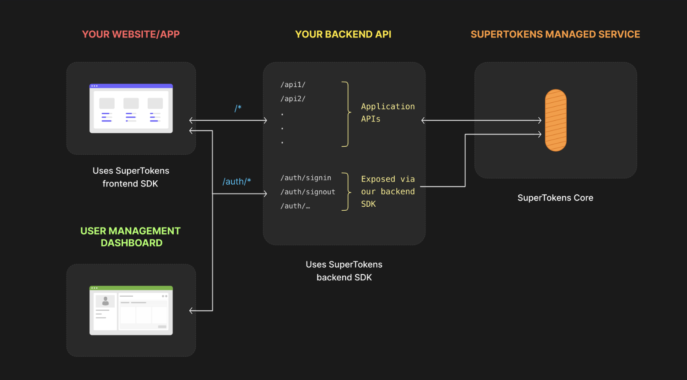

When it comes to improving authentication, you’ve got two main options:

1. **Add a second layer** to your password-based system (two-factor authentication).
2. Take the leap and **go full passwordless**. 

If you’re here for option #2 but have no idea where to start, grab a cup of coffee and sit down. I’ll walk you through it.

And you most likely know you can't just ditch password overnight.

To help with this, I decided to make this article from the perspective of a fictional company, named ByeByePass who are currently struggling with their passwords and the architecture and costs that come with it. 

They want to solve their issues and go full passwordless. 

But how could they do that? 

```toc
tight: true
toHeading: 3
```

## Passwords Just Don't Cut It Anymore


Let's face it, most of us struggle with creating strong passwords. We reuse them, forget them, and often default to simple options like *123456* or our pet's name. And while your dog might be a treasure to your family, their name simply isn't secure ... well, unless they happen to be named something like *xT5!9pL@3qR&*.

With the sheer number of apps we use today, it’s not uncommon for people to juggle [**hundreds of accounts**](https://nordpass.com/blog/how-many-passwords-does-average-person-have/). That leaves developers dealing with a constant cycle of password resets, security incidents, and support tickets.

Password managers are one way to ease the pain, and I’m a fan—they’ve definitely made my life easier. But from a developer’s perspective, they don’t solve everything. They’re still not widely adopted, which means many users will stick with weak passwords. And asking someone to create yet another password during sign-up adds friction, often enough to make them abandon the process entirely.

## Let's Understand Passwordless
Before fully committing to this approach, it's important to understand both its strengths and potential drawbacks to make an informed decision for your security needs.

### So What *is* Passwordless Authentication 
**Passwordless authentication** is exactly what it sounds like. It's any method that lets users securely access their accounts **without typing in a traditional password**. It's goal is to remove the need for passwords. And the benefits of passwordless are no password leaks, no password reuse, fewer phishing attacks, and an overall smoother user experience. 

Instead, a user might use their fingerprint, receive a one-time link via email, enter a temporary code from their phone, plug in a physical security key, or use cryptographic keys working quietly in the background.

If you're looking for a deeper dive into this topic, check out our article ["What Is Passwordless Authentication"](https://supertokens.com/blog/what-is-passwordless-authentication) for more comprehensive information.

### Why Passwordless Is a Game-Changer 
* **Enhanced security** &mdash; Eliminates weak password vulnerabilities by removing the weakest link in authentication, human error like forgetting passwords or setting weak ones. 
* **Phishing Resistance** &mdash; With no passwords to steal, phishing attacks become much less effective. That said, not all passwordless authentication methods are created equal &mdash; some are still susceptible to phishing attacks, but removing passwords generally makes phishing much harder.
* **User-Friendly** &mdash; This is hands down my favorite perk. Every time I discover a new app and don't have to set up yet another password, it feels like a little birthday present and I am much more likely to try out a new application. 🎁
* **Cost Efficiency** &mdash; Passwords are expensive because users forget them constantly. According to [**NordPass**](https://nordpass.com/blog/how-many-passwords-does-average-person-have/), the average person has more than 160 passwords. I checked my own password manager &mdash;I have 442 passwords 🤯. How did that happen?
* **Better Scalability** &mdash; Easily accommodates growth without the typical password-reset headaches when adding users or applications.

### Challenges and Considerations in Going Passwordless
Life is all about balance &mdash; and passwordless login is no exception. While ditching passwords sounds like a dream, it’s not all sunshine and seamless logins. Before making the switch, it's worth knowing the potential pitfalls so you can plan your authentication strategy accordingly. ⚖️

Transitioning to passwordless authentication brings several hurdles worth planning for: 
* **Implementation costs** can be significant, requiring investments in new infrastructure, integration work, and staff training. 
* **User adaptation** presents another challenge, as people are creatures of habit who may resist unfamiliar login methods despite their benefits. 
* Additionally, organizations must carefully **design account recovery processes** that maintain security without falling back on password-based vulnerabilities, ensuring users can regain access when they lose devices or biometric authentication fails.

## What are my passwordless options? 
Let's go more in-depth of some of the most common passworldess authentication methods you have available as your options.
Each example also contains use cases, as well as benefits and drawbacks to help you make an informed decision. 

### Passkeys 
Ah, yes. The new cool kid on the block. 


### Biometric Authentication 🧬
Utilizing fingerprints, facial recognition, or retinal scans for user verification

**The typical flow of a face recognition authentication is as follows:**
1. A user registers for an app using an email address
2. The email address is stored in a database
3. To log in, the user opens the app and selects the option to use face recognition
4. The device prompts the user to scan their face using the system’s biometric API (e.g., Apple Face ID, Android BiometricPrompt)
5. The device verifies the face scan locally — the actual face data never leaves the device and is stored securely by the operating system
6. If the scan matches the stored biometric profile, the device unlocks a secure credential (like a private key or token stored in a secure enclave)
7. That credential is sent to your server, which verifies it (e.g., through a signed challenge, token, or session initiation)
8. User is logged in 🥳 and you can store their login in a cookie 🍪 or session

### One-Time Passcodes (OTP) 🔢
Codes sent via SMS or email for single-use authentication

**The typical flow of OTP authentication is as follows:**
1. A user registers for an app using an email address
2. The email address is stored in a database
3. To log in, a user enters the same email in the login form
4. The server sees the email, finds it in the database, and generates a one-time passcode (usually a random short numeric or alphanumeric code)
5. The server sends the user an email (or SMS) containing the OTP
6. The user receives the code and enters it into the app 
7. The server verifies the code by checking if it matches the one generated and if it's still valid (e.g., not expired or already used)
8. User is logged in 🥳 and you can now store their login in a cookie 🍪 or a session.  

### Magic Links: What They Are and How To Implement Them 🧙‍♀️
Magic links are unique one-time-use links sent to an email that grants users access when clicked. 

**The typical flow of a magic link authentication is as follows:**
1. A user registers for an app using an email address
2. The email address is stored in a database
3. To log in, a user enters the same email in the login form. 
4. Server sees the email, finds that email in the db, and create a unique token (e.g., JWT) for that user to identify them uniquely. Theoretically any token can be used as long as it links that user to the unique identifier. 
5. The server sends the user an email with a link and that link already contains the unique token created for that user. 
6. When they click on the link, it will inform the server about the token to make sure the token is still correct. 
7. The token is then verified by the server
8. User is logged in 🥳 and you can store their login in a cookie 🍪 or session. 

Essentially you can think of the token like a temporary password that verifies the user is who they say they are and that they have access to that email address. The reason why this is secure is because the user has to be able to login to their email client. Depending on how their email client is set up they may have to enter their password to open the email with the magic link or use any form of authentication their email client has set up for them. 

[TODO: HAVE NEVIL CREATE A SIMILAR GRAPHIC]


**`server.js` file:**
```javascript 
const dotenv = require("dotenv")
dotenv.config()

const express = require("express")
const jwt = require("jsonwebtoken")

const { sendMagicLinkEmail } = require("./mailer")

const app = express()
app.use(express.urlencoded({ extended: true }))

const USERS = [
    {
        id: 1,
        email: "johndoe@example.com"
    },
]

app.post("/login", async (req, res) => {
    const user - USERS.find(u => u.email === req.body.email)

    if (user != null) {
        try {
            const token = jwt.sign({ userid: user.id}, process.env.JWT_SECRET, {
                expiresIn: "1h",
            })
            await sendMagicLinkEmail({ email: user.email, token })
        } catch (e) {
            return res.send("Error logging in. Please try again.")
        }
    }
})

app.get("/verify", (req, res) => {
    const token = req.query.token
    if (token == null) return res.sendStatus(401)

    try {
        const decodedToken = jwt.verify(token, process.env.JWT_SECRET)
        const user = USERS.find(u => u.id === decodedToken.userId)
        res.send(`Authenticated as ${user.name}`)
    } catch (e) {
        res.sendStatus(401)
    }
})
```
**`login.html` file:**
```html
<!DOCTYPE html>
<html lang="en">
    <head>
        <meta charset="UTF-8" />
        <meta http-equiv="X-UA-Compatible" content="IE=edge" />
        <meta name="viewport" content="width=device-width, initial-scale=1.0" />
        <title>Magic Link Authentication 🪄</title>
    </head>
    <body>
        <form method="POST" action="http://localhost:3000/login">
            <label for="email">Email</label>
            <br />
            <input type="email" name="email" id="email" />
            <br />
            <button type"submit"> Login </button>
        </form>
    </body>
</html>
```

### Hardware Tokens 🔑
Physical devices generating time-based codes for authentication (like YubiKey or other FIDO2-compliant devices).

**The typical flow of a hardware token authentication is as follows:**
1. A user registers for an app using an email address
2. The email address is stored in a database
3. The user registers their hardware token (e.g., a YubiKey) during setup — the device generates a public/private key pair and sends the public key to your server, which stores it
4. To log in, the user enters their email and is prompted to use their hardware token
5. The server sends a challenge to the client (browser or app)
6. The user interacts with the hardware token (e.g., tapping the YubiKey), which signs the challenge using the private key securely stored on the device
7. The signed challenge is sent back to your server, which verifies it using the stored public key
8. User is logged in 🥳 and you can store their login in a cookie 🍪 or session

### Public Key Infrastructure (PKI) 🔐
Leveraging cryptographic key pairs for secure authentication 

**The typical flow of a PKI-based authentication is as follows:**
1. A user registers for an app using an email address
2. The email address is stored in a database
3. The user is issued a digital certificate (X.509) by a trusted Certificate Authority (CA), which includes their public key and identity info
4. To log in, the user presents their certificate to the server (e.g., via mutual TLS or a secure login form)
5. The server validates the certificate — checking that it's signed by a trusted CA, not expired or revoked, and that it matches the user's identity
6. The server sends a challenge (random message) for the user to sign with their private key
7. The user’s device signs the challenge using the private key stored securely (e.g., in a smart card, TPM, or software key store)
8. The server verifies the signature using the public key in the certificate — if it’s valid, the user is authenticated 🥳 and you can store their login in a cookie or session

## 🔐 Exploring SuperTokens for Passwordless Authentication
SuperTokens is an open-source authentication solution offering passwordless capabilities. One word you will see quite a bit in the documentation is **recipe**. 🧑‍🍳

> **What is a recipe?** 🍲
>
> Each login method in SuperTokens is called a recipe. For example, use the **email-password recipe** for email logins, or the **passwordless recipe** for passwordless login. You can even combine recipes — most setups use a login recipe along with the session recipe.
>
> **Recipes keep things modular 🧩, so each one has its own config and types. That makes customizing your auth flow easier.**

### Integration Steps
Outlining how to implement SuperTokens' passwordless features in web applications. 

In this section we will guide you through the integration steps of setting up SuperTokens for your passwordless authentication needs, but you can also check out the full [**quickstart in the documentation**](https://supertokens.com/docs/quickstart/introduction).

A SuperTokens deployment consists of three components:
1. **Frontend SDK:** Responsible for rendering the login UI widgets and managing authentication sessions automatically.
2. **Backend SDK:** Provides authentication APIs for the frontend and communicates with the SuperTokens core These APIs appear on the same domain as your application's APIs.
3. **SuperTokens Core:** An HTTP service that handles the main authentication logic and talks to your database. The backend SDK sends it requests when it needs to read or write authentication data. You can also host it yourself in your own infrastructure.



> **Note:** Your app's frontend doesn't talk to the SuperTokens core directly. Instead, it talks to the authentication APIs exposed by the backend SDK in your API layer. The SDK then talks to the SuperTokens core.

<iframe
  width="560"
  height="315"
  src="https://www.youtube.com/embed/lUjAx75hF8I"
  title="How SuperTokens Works"
  frameBorder="0"
  allow="accelerometer; autoplay; clipboard-write; encrypted-media; gyroscope; picture-in-picture"
  allowFullScreen
></iframe>

#### Frontend Setup 
**Install ReactJS SDK** (There is also an SDK for Angular and for Vue)
```bash
  npm i -s supertokens-auth-react
```

**Initialize the SDK:**
```javascript
SuperTokens.init({
  appInfo: {
    // learn more about this on https://supertokens.com/docs/references/frontend-sdks/reference#sdk-configuration
    appName: "testing-app",
    apiDomain: "<YOUR_API_DOMAIN>",
    websiteDomain: "localhost:3000",
    apiBasePath: "/auth",
    websiteBasePath: "/auth",
  },
  recipeList: [EmailPassword.init(), Session.init()],
});
```

**Wrap your app in `<SuperTokensWrapper>` component:**
```javascript
/* Your App */
class App extends React.Component {
  render() {
    return (
      <SuperTokensWrapper>
        {/*Your app components*/}
      </SuperTokensWrapper>
    );
  }
}
```

So your full frontend setup should look something like this: 
```javascript 
import React from "react";

import SuperTokens, { SuperTokensWrapper } from "supertokens-auth-react";
import EmailPassword from "supertokens-auth-react/recipe/emailpassword";
import Session from "supertokens-auth-react/recipe/session";

SuperTokens.init({
  appInfo: {
    // learn more about this on https://supertokens.com/docs/references/frontend-sdks/reference#sdk-configuration
    appName: "testing-app",
    apiDomain: "<YOUR_API_DOMAIN>",
    websiteDomain: "localhost:3000",
    apiBasePath: "/auth",
    websiteBasePath: "/auth",
  },
  recipeList: [EmailPassword.init(), Session.init()],
});

/* Your App */
class App extends React.Component {
  render() {
    return (
      <SuperTokensWrapper>
        {/*Your app components*/}
      </SuperTokensWrapper>
    );
  }
}
```

#### Backend Setup 
**Install Node:**
```bash
npm i -s supertokens-node
```

**Initialize backend SDK:**
```javascript
import supertokens from "supertokens-node";
import Session from "supertokens-node/recipe/session";
import EmailPassword from "supertokens-node/recipe/emailpassword";

supertokens.init({
    framework: "express",
    supertokens: {
        // We use try.supertokens for demo purposes.
        connectionURI: "https://try.supertokens.io",
        // apiKey: <YOUR_API_KEY>
    },
    appInfo: {
        // learn more about this on https://supertokens.com/docs/session/appinfo
        appName: "testing-app",
        apiDomain: "<YOUR_API_DOMAIN>",
        websiteDomain: "localhost:3000",
        apiBasePath: "/auth",
        websiteBasePath: "/auth",
    },
    recipeList: [
        EmailPassword.init(), // initializes signin / sign up features
        Session.init() // initializes session features
    ]
});
```
**Add SuperTokens APIs and Configure CORS:**
Now you need to expose the endpoints that will be used by the frontend SDKs.

> Note: 
> * Add the middleware **BEFORE** all your routes.
> * Add the cors middleware **BEFORE** the SuperTokens middleware as shown below.

```javascript
import express from "express";
import cors from "cors";
import supertokens from "supertokens-node";
import { middleware } from "supertokens-node/framework/express";

let app = express();

app.use(
	cors({
		origin: "localhost:3000",
		allowedHeaders: ["content-type", ...supertokens.getAllCORSHeaders()],
		credentials: true,
	}),
);

app.use(middleware());

// ...your API routes
```

**Secure Application Routes:**
Now that your server can authenticate users, the final step that you need to take care of is to prevent unauthorized access to certain parts of the application.
```javascript

import express from "express";
import { verifySession } from "supertokens-node/recipe/session/framework/express";
import { SessionRequest } from "supertokens-node/framework/express";

let app = express();

app.post("/like-comment", verifySession(), (req: SessionRequest, res) => {
	let userId = req.session!.getUserId();
	//....
});
```
> **Note:** The middleware function returns a `401` to the frontend if a session doesn't exist, or if the access token has expired, in which case, our frontend SDK automatically refreshes the session.

**Test the Login Flow:** Now that you have configured both the frontend and the backend, you can return to the frontend login page. From here follow these steps to confirm that your setup is working properly.

1. Click on the Sign up button to create a new account.
2. After you have created the account go to Login page and fill in your credentials.
3. If you are greeted with the login screen you have completed the quickstart setup.

### Advantages
Highlighting benefits such as customization, scalability, and enhanced security

## 🧑‍🔧 Best Practices for Adopting Passwordless Authentication 
1. **User Education** &mdash; Inform users about the new authentication method and its benefits. 
2. **Fallback mechanism** &mdash; Provide alternative authentication methods in case of issues. 
3. **Regular Audits** &mdash; Conduct periodic security assessments of the authentication system. 
4. **Compliance** &mdash; Ensure adherence to relevant regulations and standards. 

## 🔮 Future Trends in Passwordless Authentication
Emerging Technologies: Examine advancements like passkeys and their impact on authentication.​ AP News, 1Google for Developers
Industry Adoption: Discuss how major companies are implementing passwordless solutions.​

## 💡 Final Thoughts 
Congratulations on your interest in going passwordless and furthering your way to a more secure future. 

Happy building!
